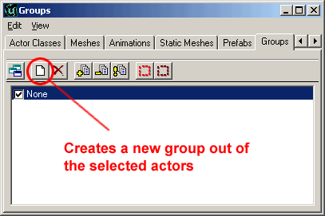
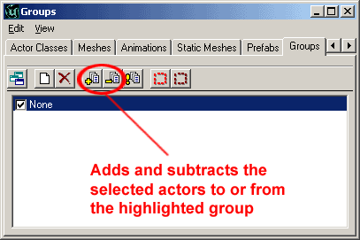
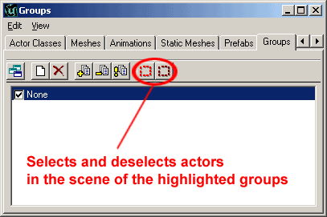

# Groups Browser

*Document Summary: A guide and reference to using the Groups Browser for managing levels.**Document Changelog: Last updated by Jason Lentz (DemiurgeStudios?), for creation purposes. Original author was Jason Lentz (DemiurgeStudios?).*

* [Groups Browser](GroupsBrowser.md#Groups Browser)
  + [Introduction](GroupsBrowser.md#Introduction)
  + [Creating New Groups](GroupsBrowser.md#Creating New Groups)
  + [Adding and Subtracting to and from Groups](GroupsBrowser.md#Adding and Subtracting to and from Groups)
  + [Organizing and Using Groups](GroupsBrowser.md#Organizing and Using Groups)

## Introduction

The groups browser is an often over looked yet very useful tool. This document will demonstrate how to take advantage of this feature and organize your level.

## Creating New Groups

Initially, everything you add to your level will be placed in the "None" group. To create a new group you must first select one or all of the Actors you want to include in the group. Next, click on the "New Group" button at the top of the Group Browser.

A window will pop up and you can then name your group. The Actors in this group now belong to two groups, the one you just created and their original group, "None."

## Adding and Subtracting to and from Groups

Adding Actors to groups is easy. Simply select the actors you wish to include in a group, then select the group in the Groups Browser and hit the "Add" button. You can also remove actors by following the same process and hitting the "Remove" button.

It is also possible to select multiple groups by control clicking and or shift clicking the groups. An actor can be in as many groups as you want it to. This might be useful if you have different sets of Actors that full under overlapping groups. For instance, you could organize your groups by assigning everything to a zone and have a group comprised of all the doors in your level.Note that when you duplicate an Actor, that new Actor will remain in the group that its parent actor was in. Because of this it is good to start placing your Actors into groups as soon as you create them to make setting up the Groups browser a little more manageable.

## Organizing and Using Groups

Groups have two powerful uses (hiding and selecting actors), but they are only as powerful as when well organize.You can use your groups to quickly un-clutter a scene leaving only the geometry and Actors that you are working with. For example you might be working on a building that has multiple levels but is comprised of many modular parts. By assigning each floor to a group you can hide each of the floors you aren't working on making the top view much more manageable.Another useful feature in using Groups is that you can use them to select Actors of a particular group. You might have a field of trees for which you only one tree StaticMesh, but eventually you will have three types of trees. In the mean time, you could use the one tree and propagate it throughout the level but assigning certain sets of trees into different groups. Later you can then go back and select that group by click on the group name and then clicking the "Select Actors" button (shown below), and then change the StaticMesh property of all of them at once.

When creating large levels, the more extensively you use groups, the easier your job will be. And remember, it's always easier to start using groups from the beginning rather than trying to incorporate them after you're already deep into the creation of your level.
