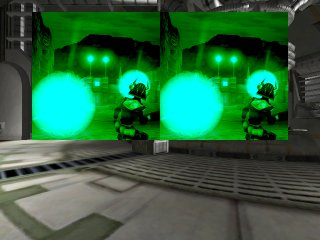
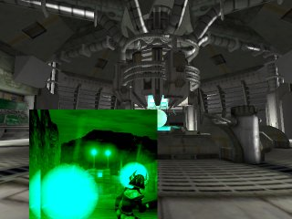
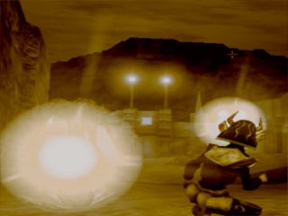

# Heads Up Display (HUD) Tutorial

*Last updated by Michiel Hendriks, some minor v3323 updates and formatting changes. Previous update by Richard 'vajuras' Osborne ([UdnStaff](https://udn.epicgames.com/Main/UdnStaff)). Original author was Richard 'vajuras' Osborne ([UdnStaff](https://udn.epicgames.com/Main/UdnStaff)).*

* [Heads Up Display (HUD) Tutorial](HeadsUpDisplayTutorial.md#Heads Up Display (HUD) Tutorial) 
  + [The Basics](HeadsUpDisplayTutorial.md#The Basics)
  + [Network Behavior](HeadsUpDisplayTutorial.md#Network Behavior)
  + [Gametype](HeadsUpDisplayTutorial.md#Gametype)
    - [GameReplicationInfo](HeadsUpDisplayTutorial.md#GameReplicationInfo)
  + [Canvas](HeadsUpDisplayTutorial.md#Canvas)
    - [DrawTile](HeadsUpDisplayTutorial.md#DrawTile)
    - [DrawIcon](HeadsUpDisplayTutorial.md#DrawIcon)
    - [DrawPortal](HeadsUpDisplayTutorial.md#DrawPortal)
  + [PostRender](HeadsUpDisplayTutorial.md#PostRender)
  + [Scoreboard](HeadsUpDisplayTutorial.md#Scoreboard)
  + [Putting it all together](HeadsUpDisplayTutorial.md#Putting it all together)

## The Basics

The Heads Up Display (HUD) is probably the most important part of a gametype (since it's normal function is to relay important information about the character's health, network status, scoring, etc). It's also one of the most misunderstood components of the game engine. Many begining coders have the misconception it exists on both client and server or that it can be used as part of the graphical user interface. In reality, the Heads Up Display serves a simple purpose- to relay information about the state of the game to the client. However, because the HUD exists on the client, it's limited by the client's perception of the game state (network connection). Any information about the game should be specifically replicated from the server to the client.

## Network Behavior

Because the HUD is a purely clientside object, it's accuracy is entirely dependant on the client's network connection to the server. Thus, if the client's connection is poor/lagged, the HUD's `bBadConnectionAlert` variable is set to true by the client's UNetConnection object during a *Tick()* (refer to `UnConn.cpp`). The HUD then calls *DisplayBadConnectionAlert()* so that the client can somehow be notified the network connection is poor.Even though the HUD does not have a server-side counterpart that replicates information about the game state, the HUD still has access to all data about the game via the owning PlayerController (Engine.PlayerController).For instance, the following HUD code iterates through the list of Controllers on the client.

```

local Controller C;
foreach AllActors(class'Controller', C)
{
  //Do something with the Controller information
}
```

Notice, we cannot iterate through all the Controllers using the Level's ControllerList since this data isn't replicated.Most of the important information (the HUD owning controller, pawn, PRI) are assigned to local variables in the HUD class (done by *LinkActors()*) at the beginning of *PostRender(...)*. So there's no need to iterate through all the Controllers to find the right controller, and performance wise it's best to not do it at all.A common source for accessing the game state is the PlayerController's GameReplicationInfo? (GRI) object. Since it exists on both the client and the server, it can be used to get a lot useful information about the current state of the game on the server.

## Gametype

The Heads Up Display is dynamically created on the server by the gametype's default HUDType during a *GameInfo.PostLogin()* event. However, the object is immediately replicated to the PlayerController that just logged into the game. The HUD object, from this point on, exists purely on the client machine.

### GameReplicationInfo

A GameReplicationInfo is used by HUD objects to derive information about the game state. These objects usually store data like the GameName, the goal score, and Time limit. Pretty much any info about the gametype will probably end up here.

## Canvas

The [Canvas](../Technical and Programming/User Interface/CanvasReference.md) is basically the two dimensional surface that the HUD draws on. Therefore, most functions in the HUD class will accept a Canvas as an argument. The Canvas class contains a lot of important functions and you'll find that drawing on the Canvas is a bit different than the two dimensional drawing in other languages. For instance, the Canvas should be repositioned before drawing different elements.The Canvas defines many important variables. Some of the most important are:

```

ClipX = Screen horizontal size
ClipY = Screen vertical size
CurX = the 'cursor' horizontal position
CurY = the 'cursor' vertical position
```

The following code example will cause the Canvas to lay two icons beside one another:

```

simulated event PostRender( canvas Canvas )
{
    Super.PostRender(Canvas);
    RenderIcons(Canvas);
}

//Render Two Icons side-by-side
function RenderIcons( Canvas Canvas )
{
   local float X,Y;

   X=Canvas.ClipX * 0.25;
   Y=Canvas.ClipY * 0.5;

   Canvas.SetPos(X,Y);
   Canvas.DrawIcon(T, 1);
   Canvas.DrawIcon(T, 1);
}
```



The engine automatically arranges the images to appear side-by-side when this code executes (`UnCanvas.cpp` increases the `Canvas.CurX` position by the texture width). Always keep in mind the Canvas will always store the last setting that was applied to it- even if it was set in another method, subclass, etc.Therefore, if you wish for the images to overlay one another, all you have to do is explicitly specify where the images should appear by doing a *Canvas.SetPos()* before each *Canvas.DrawIcon()* call.The following code will overlay the two images:

```

function OverlayIcons( Canvas Canvas )
{
   local float X,Y;

   X=Canvas.ClipX * 0.25;
   Y=Canvas.ClipY * 0.5;

   Canvas.SetPos(X,Y);
   Canvas.DrawIcon(T, 1);
   X += 25;
   Canvas.SetPos(X,Y);
   Canvas.DrawIcon(T, 1);
}
```



Notice that the HUD overlaps the images perfectly because of the explicit *Canvas.SetPos()* call we did to set the cursor. Also, note how the HUD draws the image with a green hue. This because this is the last known color the Canvas was set to. In order to get the image to show up in it's default hue, we would either need to reset the Canvas or set the Draw Color to the Canvas's default color.

### DrawTile

*DrawTile(...)* is probably one of the most confusing functions for begining Canvas scripters. Perhaps because the definition looks sort of intimidating. However, contrary to it's first impression, *Canvas.DrawTile(...)* is one of the easiest and powerful functions to use.`native(466) final function DrawTile( texture Tex, float XL, float YL, float U, float V, float UL, float VL );`

|  |  |
| --- | --- |
| Tex | Source Image |
| XL | Display Width |
| YL | Display Height |
| U | Starting X Position |
| V | Starting Y Position |
| UL | Horizontal Region |
| VL | Vertical Region |

*Canvas.DrawTile(...)* accepts a lot of arguments because it can be used to grab small sections from an image and use that region as a texture. The U,V,UL,VL arguments allows us to specify the rectangular region of the image we desire to use. The XL,YL arguments allows us to define the dimensions of the image. Thus, if XL = Canvas.ClipX and YL = Canvas.ClipY, then the image will be stretched to fit the entire screen.The following code grabs a 128x128 region from the sample texture and stretches it to fit the screen:

```

function RenderSection( Canvas C )
{
   local float XWidth, YHeight, XMod, YMod;

   XMod = C.ClipX;
   YMod = C.ClipY;

   //Reset the Canvas in case the rendering mode has been changed
   C.Reset();
   C.SetPos(0,0);
   C.DrawTile(T, XMod, YMod, 0, 0, 128, 128 );
}
```


The Canvas will render the 128x128 section to the screen.

### DrawIcon

*Canvas.DrawIcon(...)* is without a doubt the easiest function to call to get a texture to render on screen. However, this function is merely an UnrealScript wrapper for the native DrawTile function.

### DrawPortal

*Canvas.DrawPortal(...)* renders the enviroment from the viewpoint of the Actor argument into a rectangular section on the Canvas.

## PostRender

*PostRender(...)* is one of the most important functions that makes up the Heads Up Display. Images, Text, or even actors can be rendered via the Canvas argument. The HUD is active at all times, except during level loading (even though the last image rendered to the canvas will still be displayed). The following code can be used to display the Level's screenshot during level loading (if the GUI were to explicitly set the texture before the client travels to the new map). However, in newer builds (at least since the v2100+) of the engine a loading screen (Vignette) is spawned to draw the canvas during loading (see `UnGame.cpp` function *LoadMap(...)*). Thus drawing a loading screen from the HUD is deprecated, but the method to draw remains the same.

```

class TestHUD extends HUD;

#exec TEXTURE IMPORT NAME=pHUD FILE=Textures\traintag.pcx GROUP="HUD" MIPS=OFF FLAGS=2

var texture T;

simulated event PostRender( canvas Canvas )
{
    Super.PostRender(Canvas);
    if (Level.TimeSeconds < 25.5)
       RenderScreenshot(Canvas);
}

function RenderScreenshot( Canvas C )
{
   local float XWidth, YHeight, XMod, YMod;


   XMod = C.ClipX;
   YMod = C.ClipY;

   //Reset the Canvas in case the rendering mode has been changed
   C.Reset();
   C.SetPos(0,0);
   C.DrawTile(T, XMod, YMod, 0, 0, t.USize, t.VSize );

}

defaultproperties
{
   T=Texture'pHUD'
}
```



When you run the code, you'll notice the engine stretches the image to fit the screen.

## Scoreboard

The Scoreboard is instantiated by the HUD and is simply used to show the current scores in the game via it's *ShowScores(...)* function.

## Putting it all together

This tutorial covered all the basics with the HUD and Canvas classes. When you get ready to build your HUD, of course keep in mind that gamers are likely to use any resolution ranging from 640x400 to 1600x1200, etc. Therefore, you should stay away from using absolute sizes. Try to always scale all of your textures to receive the best results across the board.We also covered network issues such as iterating through all the controllers on the level using *AllActor(...)* searches and displaying bad connection symbols.Lastly, always remember to reset the HUD in order to keep consistent results.

* [TestHUD.zip](../assets/TestHUD.zip): Includes the example HUD code and test texture
