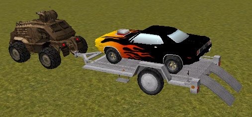
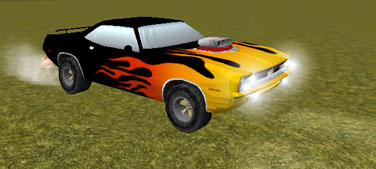
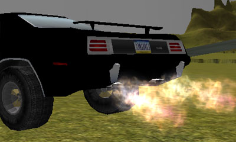
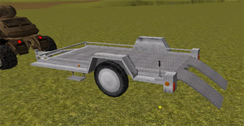
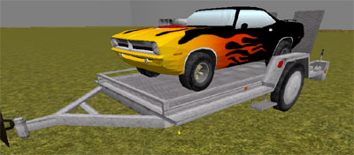
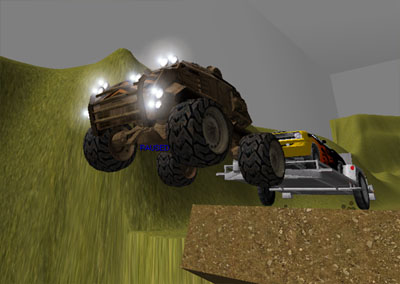

# Hotrod and Trailer Tutorial

*Last updated by Michiel Hendriks, fixed formatting. Perviously updated by Chris Linder (DemiurgeStudios?), for creation. Original author was Chris Linder (DemiurgeStudios?).*

* [Hotrod and Trailer Tutorial](HotRod.md#Hotrod and Trailer Tutorial)
  + [Disclaimer](HotRod.md#Disclaimer)
  + [Introduction](HotRod.md#Introduction)
  + [Cuda](HotRod.md#Cuda)
    - [Engine](HotRod.md#Engine)
    - [How to Fake Gears](HotRod.md#How to Fake Gears)
    - [Tail Pipe Flames](HotRod.md#Tail Pipe Flames)
    - [Better Tire Squealing](HotRod.md#Better Tire Squealing)
    - [Head/Tail Lights](HotRod.md#Head/Tail Lights)
    - [Different Front and Rear Suspension and Tire Physics](HotRod.md#Different Front and Rear Suspension and Tire Physics)
    - [How to Get That Muscle Car Feel](HotRod.md#How to Get That Muscle Car Feel)
    - [Camera Control](HotRod.md#Camera Control)
  + [Trailer](HotRod.md#Trailer)
    - [Tires and Suspension](HotRod.md#Tires and Suspension)
    - [Ramps](HotRod.md#Ramps)
    - [Hitching: Physics, Brakes, and Lights](HotRod.md#Hitching: Physics, Brakes, and Lights)
  + [Towing Vehicle](HotRod.md#Towing Vehicle)
  + [Installing and Using](HotRod.md#Installing and Using)
    - [Normal Install](HotRod.md#Normal Install)
  + [Known Issues](HotRod.md#Known Issues)
  + [Download](HotRod.md#Download)

## Disclaimer

This document is mostly done but is not finalized!

## Introduction



This tutorial is designed to show how to build a hotrod muscle car, a trailer on which to carry the car, and a vehicle to pull the trailer. This tutorial assumes you have read or at least glanced at the [KarmaCars](KarmaCars.md) tutorial. The code in this document requires the [code](KarmaCars.md#Download) from [KarmaCars](KarmaCars.md) to work.The hotrod, in this case a 1970 Plymouth Barracuda, has a large blower that protrudes from the hood and vibrates with the speed of the engine, has flames that shoot out of the tail pipes, and has the sound of gears shifting. The Cuda improves upon **GenericCar** in many ways such as better tire squealing, front and rear tires that have different physics properties, and adding brake lights and reverse lights that are independent of each other.The trailer, given that it only has two wheels and you can not drive it, is not a **KVehicle** at all; it extends **KActor**. The trailer can be attached to a **KCar** and towed. When the towing car brakes, the trailer will also brake, its brake lights lighting up in the process. The ramps on the back of the trailer can be raised and lowered by triggering a lever on the back left near the ramps. Once the ramps are down, a car can be driven on or off the trailer.The vehicle that pulls the trailer in this tutorial is just a very heavy version on the Bulldog with a lot of power and a low top speed. The link between the trailer and the towing vehicle is built in Unrealed; it is not created dynamically.

## Cuda



The Cuda (**Cuda.uc**) is based on **GenericCar** but is heavily modified. One of the most dramatic changes is that *Tick* was entirely rewritten and the Super is not called. This enabled the lights, the engine sounds, and the tire sounds to be handled in an improved manner. Another major change was adding different tire physics and suspension for the front and rear of the car. This allows for more control of how the car drives. The camera was also changed adding a chase cam and a 1st person driving cam which greatly improved usability and the driving experience.There is also **CudaEasyFun.uc** which is a subclass of **Cuda** but has it parameters tweaked to make it easier to turn, easier to stop, less likely to flip over, and it accelerates faster.

### Engine

The big engine blower that sticks out of the hood of the Cuda is an **Actor** that is rigidly attached to the car. It has no collision properties as these prevent it from being properly locked to the car. The actor, **CudaEngine**, is an animated mesh which has one animation *Vibrate* which is used to simulate engine vibration. The class is very simple and can be listed in its entirety below:

```

class CudaEngine extends Actor;

defaultproperties
{
   DrawType=DT_Mesh
   Mesh=SkeletalMesh'UDN_Engine_K.Engine1'
   bHidden=False
   DrawScale=1.0
   bHardAttach=True
   Physics=PHYS_None
   RemoteRole=ROLE_None
}
```

The engine is created in *PostNetBeginPlay* only if
Level.NetMode = NM\_DedicatedServer and is locked to the car in the following manner:

```

local vector RotX, RotY, RotZ;
...GetAxes(Rotation,RotX,RotY,RotZ);
...
EngineModel = spawn(class'CudaEngine', self,,
                    Location + -38.0 * RotX + 0.0 * RotY + 18.0 * RotZ);
EngineModel.SetBase(self);
EngineModel.SetRelativeRotation(rot(0, 32768, 0));
EngineModel.LoopAnim('Vibrate');
```

The vibrate animation is played at different rates depending on the pitch of the engine noise (engine pitch covered in section [below](HotRod.md#How_to_Fake_Gears)). This is done by calling *LoopAnim* every tick with a different rate. This causes the animation to be played at different rates and thankfully does not start the animation from the beginning each call. If there is no driver in the car, the engine vibrate is played very very slowly to make it look stopped.The engine is destroyed in *Destroyed*.

### How to Fake Gears

There is no simulation of a transition, clutch or gears in this car. If you were to simulate these things I would highly suggest doing it in C++, not u-script. Yet, we still want make the driver feel like he or she is driving a big muscle car and that means making it seem like the car is shifting gears. I do this by using an array of floats (**GearChanges**) that say when the gear should change based on the speed of the wheels. The speed of the wheels is meant to be a good approximation of the speed of the engine. When the car shifts up into a new gear, the sound volume of the engine drops for a bit to simulate the clutch being pressed and the pitch scale is reset to sound lower. Downshifting is the same but the pitch of the engine rises. Once in gear the pitch is scaled based on the current wheel speed, the last gear change speed, and the next gear change speed. First gear is special cased to sound lower because that includes idling. The final volume and pitch of the engine are calculated as follows:*(**rearLeft** and **rearRight** are both tires and the **SpinSpeed** is their rotation velocity. **GearChanges** is the array of floats mentioned above. **SoundPitch** and **SoundVolume** are both actor properties that effect the ambient sound of that actor. In this case the ambient sound of the Cuda is the engine idle sound. Ambient sound pitches run from 0 which is � speed to 127 which is 2x speed. Ambient sound volumes run from 0 which is silent to 255 which is normal volume.)*

```

WheelSpinSpeed = (rearLeft.SpinSpeed + rearRight.SpinSpeed)/2;
EngineSpeed = WheelSpinSpeed;

for(i = 1; i < GearChanges.length; i++)
{
   if(EngineSpeed < GearChanges[i] || i == GearChanges.length - 1)
      break;
}
if(i == 1)
   EnginePitch = 100 * (EngineSpeed - GearChanges[i-1]) /
                       (GearChanges[i] - GearChanges[i-1]) + 30;
else
   EnginePitch = 70 * (EngineSpeed - GearChanges[i-1]) /
                      (GearChanges[i] - GearChanges[i-1]) + 60;

if(EngineSpeed < GearChanges[i-1] + 5000 && i != 1)
   SoundVolume = 64;
else
   SoundVolume = 255;

SoundPitch = FClamp(EnginePitch, 30, 130);
```

Reverse is special cased in the Cuda, unlike **GenericCar** which treats reverse exactly like going forward except in the opposite direction. In the Cuda, the torque of reverse is limited so you can not peel-out nor can you ever "shift" in reverse. This is done in *ProcessCarInput* as follows:*(**Gear** is 1 if you are pressing forward and going forward, -1 if you are pressing backwards and going backwards, and 0 otherwise which is considered coasting. **rearLeft** and **rearRight** are both tires and the **SpinSpeed** is their rotation velocity. **GearChanges[1]** is the max spin speed of first gear. **OutputTorque** is the output torque that will be applied to the drive wheels. It has been set by the old system before this block of code.)*

```

// Limit Reverse
if(Gear == -1)
{
   if( (rearLeft.SpinSpeed + rearRight.SpinSpeed)/2 > (GearChanges[1] - 15000) )
      OutputTorque = 0;
   else
      OutputTorque = FClamp(OutputTorque, 0, 100);
}
```

### Tail Pipe Flames



The tail pipe flames are fairly easy. Two particle systems of class **TailPipeFireClass** are spawned with offsets defined in **TailPipeFireOffset[]** and with rotational offsets defined in **TailPipeFireRotOffset[]**. I placed them to look as though they were coming out of the two rear muffler exhausts. These particle systems are then turned on or off depending if how and when the gas is pressed. The longer the gas is not pressed the longer the flames will burn when the gas is finally pressed. The rate at which flames recharge is set with **FireRebuildRate** and the max burn time is set with **MaxFireTime**. There are no flames in reverse. When the fire is on, the **TailPipeFireSound** is played. All this is done with the following code in *Tick*:*(**StopThreshold** is the speed under which the car is considered to be stopped. **PotentialFireTime** is used to store how long pipe flames can burn. EnablePipeFire?(bool FireOn) turns the pipe flames on or off. **Throttle** is 0 if the player is not pressing the gas and > 0 otherwise. **rearRight** is the right rear tire and its **AmbientSound** is set because actors can only have one ambient sound and we have already used the ambient sound for the Cuda.)*

```

// Fire Stuff
If(VSize(Velocity) < StopThreshold)
{
   EnablePipeFire(false);
   PotentialFireTime = MaxFireTime;
}
else if(PotentialFireTime < MaxFireTime && Throttle == 0)
{
   EnablePipeFire(false);
   PotentialFireTime = FMin(PotentialFireTime + FireRebuildRate * Delta, MaxFireTime);
}
else if(PotentialFireTime > 0 && Throttle > 0 && Gear == 1)
{
   EnablePipeFire(true);
   PotentialFireTime = FMax(PotentialFireTime - Delta, 0);
}
else
{
   EnablePipeFire(false);
}
if(bPipeFlameOn)
{
   rearRight.AmbientSound = TailPipeFireSound;
   rearRight.SoundVolume = 255;
}
else
   rearRight.AmbientSound = NONE;
```

### Better Tire Squealing

The tire squeal sounds in **GenericCar** just aren't that exciting. The tire squeal sounds in the Cuda however, change volume and pitch depending on much skidding is happening. The volume also ramps up and down at **SlipVolChangeRate** for smooth transitions and no harsh pops. Only the rear tires are used to calculate slip mainly because the front tires slip so much while turning that the squeal sounds would be playing too often. The squeal sound and volume is handled in *Tick* as follows:*(**rearLeft** and **rearRight** are both tires and their **GroundSlipVel** is speed at which they are slipping on the ground. **AmbientSound** is set on **rearLeft** because actors can only have one ambient sound and we have already used the ambient sound for the Cuda. Ambient sound pitches run from 0 which is � speed to 127 which is 2x speed. Ambient sound volumes run from 0 which is silent to 255 which is normal volume.)*

```

// Tire Slip
TotalSlip = (rearLeft.GroundSlipVel + rearRight.GroundSlipVel);
rearLeft.AmbientSound = SquealSound;
if(TotalSlip > SquealVelThresh)
{
   rearLeft.SoundPitch = FClamp( 40 + ((TotalSlip/SquealVelThresh - 1) * 5) , 0, 80);
   DesiredSlipVol = FClamp( 0 + ((TotalSlip/SquealVelThresh - 1) * (255)) , 0, 254);
}
else
   DesiredSlipVol = 0;

if(rearLeft.SoundVolume != DesiredSlipVol)
{
   SlipVolDiff = int(Delta * SlipVolChangeRate);
   if(rearLeft.SoundVolume > DesiredSlipVol)
   {
      if(SlipVolDiff > rearLeft.SoundVolume - DesiredSlipVol)
         rearLeft.SoundVolume = DesiredSlipVol;
      else
         rearLeft.SoundVolume -= SlipVolDiff;
   }
   else
   {
      if(SlipVolDiff >  DesiredSlipVol - rearLeft.SoundVolume)
         rearLeft.SoundVolume = DesiredSlipVol;
      else
         rearLeft.SoundVolume += SlipVolDiff;
   }
}
```

### Head/Tail Lights

The headlights are done almost exactly like the Bulldog headlights as described [here](KarmaCars.md#Headlights). The tail lights are similar to those in **GenericCar** but in this case there are independent reverse and brake lights. The brake lights are set to be on when the player is braking. The reverse light is set to be on when the last thing the player did is reverse but has not gone forward yet (otherwise the revere light would only be on when you were holding reverse). The lights are handled as follows in *Tick*:*(**OutputBrake** is true when the player is braking. **Skins[0]** is the material on the static mesh that has the brake light texture. **Skins[1]** is the reverse light material. **Gear** is 1 if you are pressing forward and going forward, -1 if you are pressing backwards and going backwards, and 0 otherwise which is considered coasting.)*

```

// Brake Light
if(OutputBrake == true)
   Skins[0] = BrakeMaterialOn;
else
   Skins[0] = BrakeMaterialOff;

// Reverse Light
if(Gear != 0)
   LastGear = Gear;
if(LastGear == -1)
   Skins[1] = ReverseMaterialOn;
else
   Skins[1] = ReverseMaterialOff;
```

### Different Front and Rear Suspension and Tire Physics

Setting up different front and rear suspensions and tire physics adds a lot of control over how the car drives. In the end most of the front and rear values were the same because that is what felt right for the Cuda but testing different values greatly helped the refining process. Creating separate front and rear variables was not hard so much as tedious. *KVehicleUpdateParams* and *defaultproperties* required the largest changes.

### How to Get That Muscle Car Feel

Before I could figure out the muscle car feel it first had to be decided what sort of driving experience I was looking for. Simulation is nice for driving and GT enthusiasts but leaves many people doing donuts. Arcade-like easy driving is fun for most people but if the driving is not a challenge at all, people will get bored with the system or not feel empowered because there is nothing to master. Also, if we were going for very simple driving why are we bothering to simulate independent physics on all four wheels? Though it would be possible to get very Arcade-like easy driving out of the Cuda, it would be a waste of the Karma system and also of CPU power. In the end it seemed best to make two cars the captured both sides of the driving spectrum but did not stray too far from the center. Thus **Cuda** and **CudaEasyFun** both exist.The first important aspect of the muscle car experience is that acceleration is powerful and that the wheels peel-out when you start. This of course is easy to achieve but if the car is too powerful, the wheels would spin so fast that they would never grip the road well nor would the peeling-out stop until about 60 mph. I found the best compromise was give the wheel lots of power to start with then quickly reducing the power. This works well because the car should not accelerate as quickly from 60 mph to 80 mph as it does from 0 mph to 20 mph. These acceleration properties are achieved by setting the torque curve like so:

```

TorqueCurve=(Points=(
       (InVal=200000.000000,OutVal=800.000000),
       (InVal=200000.000000,OutVal=800.000000),
       (InVal=300000.000000,OutVal=100.000000),
       (InVal=600000.000000,OutVal=100.000000),
       (InVal=1100000.000000,OutVal=50.000000),
       (InVal=2100000.000000,OutVal=0.000000)
       ))
```

Another important aspect of a muscle car is that it does not have super tight suspension. Unlike a tweaked out turbo Honda with a dropped ride height, the Cuda should roll in the turns and have a lot more vertical play for the tires. The only problem is that if the suspension is too squishy the car will flip easily. I tried to reach a reasonable compromise between these two.Other than getting the tire and suspension properties adjusted about right, the sound of the car is probably the most important thing to make it feel like a big muscle car. Unfortunately I did not spend much time on the sounds mainly because making good sounds does not fall in the scope of this tutorial. Consequently, the sounds are not perfect but they are not bad.

### Camera Control

For a real car demo, we need something better than a manually controlled camera such as the type that **GenericCar** has. I added a 1st person camera and a chase cam and the ability to switch between these camera systems as well as the manual camera from before.All the camera control starts in *SpecialCalcView* which is called instead of the **PlayerController** 's *PlayerCalcView* because **bSpecialCalcView** is true for the Cuda. From *SpecialCalcView* either *CalcOutsideView*, *CalcInsideView*, or *Super.SpecialCalcView* are called based on the current **CameraStyle**. *SwitchCameraMode* cycles between camera styles.*CalcOutsideView* is the chase cam. This uses a static roll and the static pitch for the camera. The yaw of the camera exponentially approaches the yaw of the Cuda at a rate determined by **CameraSwingRatio**. If **CameraSwingRatio** is 1.0 the camera will not track the Cuda at all because it is 100% free to swing so it just points at its default orientation. If **CameraSwingRatio** is 0, the camera will track the car exactly because it is 0% free to swing. The camera starts at a point in front of the car and above the hood and is slid back till it is behind the car. By starting in front of the car, the camera will swing to the left and the right of the car on turns and show the direction you wish to drive in. The sliding is done so that if you back into a wall the camera will not be behind the wall. Rear view is handled by adding 180 degrees to the desired yaw and the camera swing system makes this transition smooth. This is *CalcOutsideView*:

```

simulated function bool CalcOutsideView(out actor ViewActor,
                                        out vector CameraLocation,
                                        out rotator CameraRotation,
                                        bool bRearView )
{
   local vector CamLookAt, HitLocation, HitNormal;
   local float LerpAmount;
   local float CurTime;

   ViewActor = self;

   CurTime = Level.TimeSeconds;
   LerpAmount = 1.0 - ( CameraSwingRatio ** (CurTime - LastCamTime) );
   LastCamTime = CurTime;

   if(bRearView)
   {
      CamLookAt = Location + (vect(-200, 0, 200) >> Rotation);
      CameraRotation.Yaw = LastCamRot.Yaw +
                           GetRotDiff(Rotation.Yaw, LastCamRot.Yaw) * LerpAmount;
      CameraRotation.Roll = 0;
      CameraRotation.Pitch = -1000;
   }
   else
   {
      CamLookAt = Location + (vect(-300, 0, 200) >> Rotation);
      CameraRotation.Roll = 0;
      CameraRotation.Yaw = LastCamRot.Yaw +
                           GetRotDiff(Rotation.Yaw + 32768, LastCamRot.Yaw) * LerpAmount;
      CameraRotation.Pitch = -1000;
   }

   CameraLocation = CamLookAt + (vect(-900, 0, 0) >> CameraRotation);
   if( Trace( HitLocation, HitNormal, CameraLocation, CamLookAt, false, vect(10, 10, 10) )
       != None )
   {
      CameraLocation = HitLocation;
   }

   LastCamRot = CameraRotation;

   return true;
}
```

The first person camera was very easy. It simply locks the camera to the chassis of the car. The yaw, pitch, and roll of the camera are all set by the rotation of the car. An offset is used to put the camera in the drivers seat or looking behind the car if rear view is true.

```

simulated function bool CalcInsideView(out actor ViewActor,
                                       out vector CameraLocation,
                                       out rotator CameraRotation,
                                       bool bRearView )
{
   ViewActor = self;

   CameraRotation = Rotation;

   if(bRearView)
   {
      CameraLocation = Location + (vect(-200, 0, 200) >> Rotation);
      CameraRotation.Pitch += -2000;
   }
   else
   {
      CameraLocation = Location + (vect(-50, 30, 120) >> Rotation);
      CameraRotation.Yaw += 32768;
      CameraRotation.Pitch = -CameraRotation.Pitch;
      CameraRotation.Roll = -CameraRotation.Roll;
   }

   return true;
}
```

## Trailer



The Trailer (**Trailer.uc**) is based on KActor. Given that you never drive the trailer it did not need to be a KVehicle.One of major issues with the trailer revolves around a bug in Karma in 2110 based builds. The contract between Karma Spheres and Karma Convex objects does not work. This bug has been corrected and new libraries are available for download on the udnftp site in UnEdit/Misc/Karma, starting t-stevet-030110\_. They should just be able to replace the ones in 2110. I chose not to force everyone to get these new libs so I made the parts of the trailer you drive on Karma Boxes which work fine.Another major issue with the trailer is that is does not work in net play.

### Tires and Suspension

The tires are created in almost exactly the same way as the rear tires on **KCar**. The tires and tire joints are spawned and set up in *PostNetBeingPlay*. The tire properties and the suspension properties are then set up in *KVehicleUpdateParams* which is called from *PostNetBeingPlay*. The values for the tire and suspension properties are set in defaultproperties of **Trailer.uc** or from Unrealed under the **Trailer** heading in the properties of the trailer actor. These parameters are the same as those used for **KCar** and a reference for their meanings can be found in the KarmaCarCreation doc [here](KarmaCarCreation.md#KCar).

### Ramps

The ramps are two static meshes with Karma collision defined that are attached to body of the trailer with hinges. The hinges are of class **RampHinge**, which extends **KHinge** but does not add any functionality; it only sets bNoDelete=false so the hinges can be spawned dynamically, and bKDisableCollision=false because this is a const property that can not be set anywhere but defaultproperties.The hinges and the ramps are created, linked together, and attached to the trailer in *PostNetBeginPlay*. The ramps' location relative to the trailer are defined by **RampAlong**, **RampAcross**, and **RampVert**. The ramps' rotation are defined by **RampRotOffset**. The right ramp has its draw scale flipped on the Y axis so the ramps are symmetric. This following code shows how the right ramp is created.

```

lPos.X = RampAlong;
lPos.Y = RampAcross;
...
lPos.Y = -RampAcross;
RightRamp = spawn(class'RampPart', self,,
                  Location + lPos.X*RotX + lPos.Y*RotY + lPos.Z *RotZ,
                  Rotation + RampRotOffset);
RightRamp.SetDrawScale3D(vect(1, -1, 1));
RightRamp.RampJoint = spawn(class'RampHinge', self);
RightRamp.RampJoint.KConstraintActor1 = self;
RightRamp.RampJoint.KConstraintActor2 = RightRamp;
RightRamp.RampJoint.KPos1 = lPos/50;
RightRamp.RampJoint.KPriAxis1 = vect(0, 1, 0);
RightRamp.RampJoint.KSecAxis1 = vect(-1, 0, 0);
RightRamp.RampJoint.KPos2 = vect(0,0,0);
RightRamp.RampJoint.KPriAxis2 = vect(0, -1, 0);
RightRamp.RampJoint.KSecAxis2 = vect(1, 0, 0);
RightRamp.RampJoint.KHingeType = HT_Controlled;
RightRamp.RampJoint.KMaxTorque = 520;
RightRamp.RampJoint.KProportionalGap = 600;
RightRamp.RampJoint.KDesiredAngVel = 3000;
RightRamp.RampJoint.SetPhysics(PHYS_Karma);
```

The **KHingeType** of the hinges is set to HT\_Controlled which means that the hinge will try to approach the **KDesiredAngle** with a max angular velocity of **KDesiredAngVel** (3000 in this case) and a torque of **KMaxTorque** (520 in this case). The **KDesiredAngle** of both hinges is set in *SetRampUp(bool bRampUpIn)* based on the value of **bRampUpIn**. The up desired angle is defined by **RampUpPos** and the down angle by **RampDownPos** both of which are set in the defaultproperties of the trailer.Raising and lowering the ramps is done by a using a trigger attached to the trailer much like the enter and flip triggers on **GenericCar**. The trigger is created in *PostNetBeginPlay* only when Level.NetMode = NM\_Client. The trigger affects the ramps by calling *SetRampUp* in its *UsedBy* function.

```

function UsedBy( Pawn user )
{
   Trailer(Owner).SetRampUp( !Trailer(Owner).bRampUp );
}
```

### Hitching: Physics, Brakes, and Lights

Right now the trailer is hitched to vehicles only in the editor. In Unrealed you place the trailer and the desired towing vehicle next to each other and then add a KBSJoint between them. In the KBSJoint properties go to KarmaContraint and click on **KConstraintActor1** then click the **Find** button that appears. Now in the 3D viewport click on the towing vehicle. Next click on **KConstraintActor2**, click **Find**, and click on the trailer. Now they will be attached and the towing vehicle can pull the trailer around.When the game starts the trailer searches for any **KConstraint** s that include itself. It then checks if the other **Actor** bound by that constraint is a KCar. If so, the trailer sets **LinkerCar** to be this **KCar** because this is the vehicle towing the trailer. In *Tick* the trailer's brakes are set based on the brakes of the towing vehicle like so:

```

// Braking
if(LinkedCar != NONE)
   OutputBrake = LinkedCar.OutputBrake;
else
   OutputBrake = false;
```

Based on **OutputBrake** the brakes are either turned on or off. The brake lights are also set using the **Skins** array by swapping materials for the brake material. This is done like so:

```

if(OutputBrake)
{
   LeftTire.WheelJoint.KBraking = MaxBrakeTorque;
   RightTire.WheelJoint.KBraking = MaxBrakeTorque;
   Skins[0] = BrakeMaterialOn;

}
else
{
   LeftTire.WheelJoint.KBraking = MinBrakeTorque;
   RightTire.WheelJoint.KBraking = MinBrakeTorque;
   Skins[0] = BrakeMaterialOff;
}
```

The brakes use a **MinBrakeTorque** that might be greater than 0 (5 in this case) because it seemed to make the trailer behave more and not swing around so much.

## Towing Vehicle



As mentioned before this a modified Bulldog that is much heavier and more powerful than a normal Bulldog. It is not much faster though. The suspension is also stronger to take into account not only the increased mass of the Bulldog but also the weight of the trailer and the car. Other than that everything is very straight forward.

## Installing and Using

### Normal Install

First download the zip from [KarmaCars](KarmaCars.md) and install it as described in the document.Next download the zip from this document. Unzip it into your build where you setup the [KarmaCars](KarmaCars.md). Next, add the *HotRod* packages to your edit packages in `UT2004.ini`. Then do a **ucc make** and you should be ready to go. You can start dropping **Cuda** s, **CudaEasyFun** s, **Trailer** s, and **TrailerPullBulldog** s in your map or download the example map [here](HotRod.md#Download).Once you run the game but before you start driving the Cuda, I would suggest binding a key to *Use* and a key to *SwitchCameraMode*. I used `E' and `R' by typing

```

set input e Use
set input r SwitchCameraMode
```

at the console. The *Use* key lets you get in vehicles and operate the ramps on the trailer. The *SwitchCameraMode* key lets you switch between the 3 camera modes (chase, 1st person, and independent) for the Cuda.Besides the normal driving controls, the Cuda uses alt-fire for the emergency brake. The e-brake locks the back tires thus making them slide more easily which allows you to turn more sharply. It can also spin you out of control if you are not careful.The Cuda uses primary fire for rear view in the chase and 1st person views.Now you are ready to roll; Have Fun!

## Known Issues

* The trailer does not work in net play.

* The car is a little jerky in net play.

* The max karma speed (**ME\_MAX\_KARMA\_SPEED**) is set to 2500 by default. I changed this to 5000 so cars could be more exciting and drive fast. If you do not also change this value (or use the Engine.dll in InstantFun.zip) your cars will be boring and slow.

* The gravity is wrong. I forgot that maybe my vehicle scale and the gravity were not on the same scale. I think -2000 would be a better gravity value than -1500. This is based on how far cars jump, how much tires skid, and how engines transfer power. The problem is that I tweaked all the car values for the default gravity and I would have to go back and fix them all which I don't have time to do.

* Sometimes you exit the car with -1 health and can't walk around but can get back in the car and drive.

* Very very rarely Karma crashes the engine because of some collision problem:

**General protection fault!History: McdBatchIntersectBucket <- KBatchTest <- KBatchIntersectEach <- KHandleCollisions <- KUpdateContacts <- KTickLevelKarma <- TickAllActors <- ULevel::Tick <- (NetMode=0) <- TickLevel <- UGameEngine::Tick <- UpdateWorld <- MainLoop**

* Towing the car on the trailer over very bumpy ground can cause the car to take damage and thus explode in some cases.

## Download
