# Impersonator Head Rigging

*Last updated by Michiel Hendriks, formatting tweaks. Previous update by Doug Perkowski(ImpersonatorTeam?) to post on UDN. Original author was Ryan Cullins(ImpersonatorTeam?).*

* [Impersonator Head Rigging](ImpersonatorHeadRigging.md#Impersonator Head Rigging)
  + [Introduction](ImpersonatorHeadRigging.md#Introduction)
  + [UTRef](ImpersonatorHeadRigging.md#UTRef)
    - [UTRef 10 Bone "minimum" rig (11 including head)](ImpersonatorHeadRigging.md#UTRef 10 Bone "minimum" rig (11 including head))
    - [UTRef 20 Bone "recommended" rig (21 including head)](ImpersonatorHeadRigging.md#UTRef 20 Bone "recommended" rig (21 including head))
    - [Diagram of 20 Bone Rig](ImpersonatorHeadRigging.md#Diagram of 20 Bone Rig)
  + [Seting up your rig](ImpersonatorHeadRigging.md#Seting up your rig)
  + [The Bone Poses](ImpersonatorHeadRigging.md#The Bone Poses)
    - [Neutral Pose - "Silent" Frame 0](ImpersonatorHeadRigging.md#Neutral Pose - "Silent" Frame 0)
    - [Pose (EE) - "Eat" Frame 10](ImpersonatorHeadRigging.md#Pose (EE) - "Eat" Frame 10)
    - [Pose (Er) - "Earth" Frame 20](ImpersonatorHeadRigging.md#Pose (Er) - "Earth" Frame 20)
    - [Pose (Ih) - "If" Frame 30](ImpersonatorHeadRigging.md#Pose (Ih) - "If" Frame 30)
    - [Pose (Oh) - "Ox" Frame 40](ImpersonatorHeadRigging.md#Pose  (Oh) - "Ox" Frame 40)
    - [Pose (Oh) - "Oat" Frame 50](ImpersonatorHeadRigging.md#Pose (Oh) - "Oat" Frame 50)
    - [Pose (W/OO) - "Wet" Frame 60](ImpersonatorHeadRigging.md#Pose  (W/OO) - "Wet" Frame 60)
    - [Pose (S/Z) - "Size" Frame 70](ImpersonatorHeadRigging.md#Pose  (S/Z) - "Size" Frame 70)
    - [Pose (Ch/J) - "Church" Frame 80](ImpersonatorHeadRigging.md#Pose (Ch/J) - "Church" Frame 80)
    - [Pose (F/V) - "Fave" Frame 90](ImpersonatorHeadRigging.md#Pose (F/V) - "Fave" Frame 90)
    - [Pose (Th) - "Though" Frame 100](ImpersonatorHeadRigging.md#Pose (Th) - "Though" Frame 100)
    - [Pose (T/L/D) - "Told" Frame 110](ImpersonatorHeadRigging.md#Pose  (T/L/D) - "Told" Frame 110)
    - [Pose (B/M/P) - "Bump" Frame 120](ImpersonatorHeadRigging.md#Pose (B/M/P) - "Bump" Frame 120)
    - [Pose (N/NG) - "New" Frame 130](ImpersonatorHeadRigging.md#Pose (N/NG) - "New" Frame 130)
    - [Pose (R) - "Roar" Frame 140](ImpersonatorHeadRigging.md#Pose  (R) - "Roar" Frame 140)
    - [Pose (K/G) - "Cage" Frame 150](ImpersonatorHeadRigging.md#Pose (K/G) - "Cage" Frame 150)
    - [Targets (Eyebrow Up Left) - "EB\_Up\_L" Frame 160 and (Eyebrow Up Right) - "EB\_Up\_R" Frame 170](ImpersonatorHeadRigging.md#Targets  (Eyebrow Up Left) - "EB_Up_L" Frame 160 and (Eyebrow Up Right) - "EB_Up_R" Frame 170)
    - [Targets (Blink Left) - "Blink\_L" Frame 180 and (Blink Right) - "Blink\_R" Frame 190](ImpersonatorHeadRigging.md#Targets  (Blink Left) - "Blink_L" Frame 180 and (Blink Right) - "Blink_R" Frame 190)
  + [Downloads](ImpersonatorHeadRigging.md#Downloads)

## Introduction

This tutorial will go over the basic implementation of facial bones in your character for ImpersonatorTM for Unreal. We chose UTRef, a character from Unreal Tournament to demonstrate our method of adding facial bones to a character. To obtain a copy of UTRef, please contact [info@oc3ent.com](mailto:info@oc3ent.com). Please make sure you have thoroughly read all the information on UDN relating to the use of Character Studio and character rigging before continuing with this tutorial. *The following information assumes that you have a general understanding on how to incorporate characters into Unreal.*

## UTRef

Open UtRef.max in 3D Studio Max R4We have slightly modified this character in a number of ways to support lip-synchronization. The steps that were taken are as follows:

* Increased the polygon count in the face to allow enough facial movement for the Blinks, Eyebrows, and Mouth.
* Added Teeth, Tongue (optional, but a tongue greatly increases the realism of lip synching) and a mouth cavity
* Embedded facial bones on top of the Biped Head bone.
* Weighted the bones in the face and body accordingly
* Created the bone poses and exported them to a bone pose (\*.lbp) file, which is provided as an example.

We'll start by creating the bones while using UTRef.max as our reference. Take a look at the placement of the bones in the face. Below is the facial bone hierarchy. Bones marked in Bold are the ones that were exported to the LBP file and must have a (P, R, S) keyframe at every 10th frame 0-190. LBP files are "LIPSinc Bone Pose" files that are exported by the Max and Maya tools and imported into the LIPSinc Tab in UnrealEd. Note that only bone "nubs" will be weighted to the mesh.

### UTRef 10 Bone "minimum" rig (11 including head)

* Bip01 Neck1
  + **Bip01 Head**
    - **BN-Brow**
      * BN-Brow-nub
    - **BN-Blink**
      * BN-Blink-nub
    - **BN-Jaw**
      * BN-Jaw-nub
    - **BN-LowerLipLT**
      * BN-LowerLipLT-nub
    - **BN-LowerLipRT**
      * BN-LowerLipRT-nub
    - **BN-LipCornerLT**
      * BN-LipCornerLT-nub
    - **BN-LipCornerRT**
      * BN-LipCornerRT-nub
    - **BN-Tongue**
      * BN-Tongue-nub
    - **BN-UpperLipLT**
      * BN-UpperLipLT-nub
    - **BN-UpperLipRT**
      * BN-UpperLipRT-nub

### UTRef 20 Bone "recommended" rig (21 including head)

* Bip01 Neck1
  + **Bip01 Head**
    - **BN-BrowLT**
      * BN-BrowLT-nub
    - **BN-BrowRT**
      * BN-BrowRT-nub
    - **BN-CheekLT**
      * BN-CheekLT-nub
    - **BN-CheekRT**
      * BN-CheekRT-nub
    - **BN-Jaw**
    - **BN-LowerLipLT**
      * BN-LowerLipLT-nub
    - **BN-LowerLipMI**
      * BN-LowerLipMI-nub
    - **BN-LowerLipRT**
      * BN-LowerLipRT-nub
    - **BN-LipCornerLT**
      * BN-LipCornerLT-nub
    - **BN-LipCornerRT**
      * BN-LipCornerRT-nub
    - **BN-LowerEyeLT**
      * BN-LowerEyeLT-nub
    - **BN-LowerEyeRT**
      * BN-LowerEyeRT-nub
    - **BN-Mic**
      * BN-Mic-nub
    - **BN-TongueBack**
    - **BN-TongueFront**
      * BN-TongueFront-nub
    - **BN-UpperEyeLT**
      * BN-UpperEyeLT-nub
    - **BN-UpperEyeRT**
      * BN-UpperEyeRT-nub
    - **BN-UpperLipLT**
      * BN-UpperLipLT-nub
    - **BN-UpperLipMI**
      * BN-UpperLipMI-nub
    - **BN-UpperLipRT**
      * BN-UpperLipRT-nub

### Diagram of 20 Bone Rig

The diagram below shows the 21-bone rig we used for the UT-male character. The majority of the bones have been labeled and color-coded for your convenience. You may use this as a reference while rigging your character. "Display links" has been turned on to help visualize the hierarchy. If you have any questions relating to the reasoning behind this bone setup please refer to UDN for more detailed information regarding "Additional bones" setup.

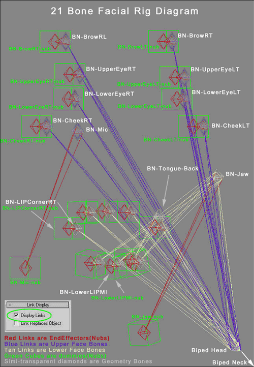

## Seting up your rig

Once the bone setup is complete, run the Maxscript, "Reset Xform" on all the bones. This sets all of the bones' orientations to be the same. If your bones are moving as you reset the transformations, undo. Otherwise you are ready to start weighting the face. It's always a good idea to run through a few test cases before starting to weight the mesh accurately. To do this, weight one vertex to each link "nub" and animate the bone in any direction on frame 30. Move the bones to create the most commonly used viseme, "If." Export the poses and test it in UnreadlEd. We find it easier to remove all pre-calculated Physique weighting on the head, this way you know exactly what it will and will not do when you start moving the bones around. Before starting, go ahead and insert a keyframe for the position, rotation and scale (P, R, S) of every "Bone." Do not do this for the "nub" bones.

1. Reset the transformation of all bones before applying skin. Make sure your Position, Rotation, and Scale values of each bone are 100%. Values other than 100% will produce unwanted results in lip synchronization.
2. Apply Physique to your character mesh, then click the initialize button and link it to the biped pelvis
3. Use "Rigid Vertices" and "3 links" in the initial dialogue box
4. Now that your character is Physiqued, you are ready to start weighting the face .Switch to the vertex level of Physique
5. Choose "Select", check the "Vertex type" filter and make sure it's set to Deformable, Rigid and Root, then select all the vertices in the head only
6. Click "Remove from link" and marquee select all the links in the body. We remove the weighting because Physique doesn't do an accurate job of assigning the correct vertices to the associated links in the face. The result of this action will turn the selected vertices blue (root), meaning there are no current link assignments to the vertices.
7. You can begin by assigning the root vertices in the head to the Biped head. Do so by clicking "assign to link" while the root vertices are selected. Set vertex type to rigid (Green) then click the biped head bone link. This should cause the entire selected set of vertices to turn bright green.
8. At this point, try moving the biped head. This should move the head mesh with proper weighting.

**Now we will start weighting the face links.**

1. Select the vertices in the jaw that you wish to move 100% with the jaw bone movement. Include the lower teeth. This step excludes the Lower lip from being selected due to the current hierarchy setup.
2. Assign these vertices to the "BN-Jaw-nub" and not "BN-Jaw". Remember that all additional bones must be weighted to the end-effector "nubs," not the Bone itself.
3. Select the vertices around the lip corner and weight them to the BN-LIPCorner (LT/RT)-nub (don't forget you can assign up to 3 links per vertex) if you ever need a falloff between bones (i.e. the Jaw bone and Head bone)
4. Continue this process for the rest of the lips and tongue using the UTRef.max as reference
5. Once you have finished weighting around the mouth, start on the eyelids, eyebrows and cheeks.
6. Now that the head is completely weighted and you have tested the bones' range of movement, go ahead and do a test export before continuing with the poses.
   1. Make a selection set of the Geometry bones under the head bone in the scene hierarchy (bones listed in bold)
   2. Now Insert a (P, R, S) keyframe at every 10th frame 0-190 on every bone in the selection set.
   3. Animate the Bones into a distinguishable pose at frame 30 "If"
   4. Now all the bones should remain still until it reaches frame 20-40, then it should blend in and out from your test pose. (While creating your bones poses you may get some artifacts between your poses, if so just ignore them or fix the curve if it bothers you.)
   5. If all looks good, go ahead and export your poses to \*.lbp by running the provided script
   6. Click Export and use your selection set to select the bones that are keyed, click ok (Figure on last page)
   7. In the next list, choose your head bone "Biped Head" (Figure on last page)
   8. Keep the number of poses 20 and click ok
   9. Export your \*.psk with ActorX
   10. Go into UnrealEd and make sure all your weighting looks correct.

## The Bone Poses

**Now you are ready to create your bone poses. You can refer to the UTRef.max file for visual reference or use the descriptions and images provided below.**Impersonator for Unreal works with any rig. The default mapping is our standard nineteen bone poses; fifteen for lip-synching and four for the eyes and eyebrows. This standard rig is illustrated below.**Please pay very close attention to the teeth in all illustrations where applicable.****Targets in the following illustrations have been purposefully over-exaggerated for a more defined quality, however it's up to you to decide upon the look of your viseme set.**

### Neutral Pose - "Silent" Frame 0

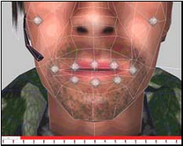

"Silent" is the relaxed and neutral position of the face, and the reference for all morph targets/poses. Since there is no way of knowing what the manner of speech will be, we recommend making the neutral target expressionless. At most, a slight upturning of the lips can be used to give the character a pleasant or alert expression. The purpose of a neutral pose is so that when the character stops talking, the blending of the targets will look natural.

### Pose (EE) - "Eat" Frame 10

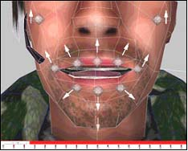

Example words: *Eat*

* Open the mouth just far enough that the teeth are slightly separated.

* Pull the mouth corners up and out.

### Pose (Er) - "Earth" Frame 20

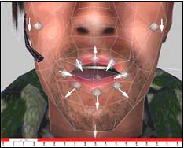

Example words: *EARth, bIRd, buttER*

* "Earth" is very close to "Church", but the lower lip completely covers the lower teeth.

* The Jaw closes slightly.

* The Tongue is close to the roof of the mouth

### Pose (Ih) - "If" Frame 30

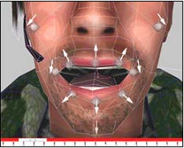

Example words: *If, bIt, bEt, bAIt, bAt, bOUt, bIte, bUt*

* "If" is used frequently in our phoneme mapping set.

* Imagine a combination of the jaw open along with a subtle "Eat" target; that is what "If" should look like.

* The lower teeth are just barely visible.

### Pose (Oh) - "Ox" Frame 40

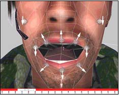

Example words: *OAt, bOY, boat*

* "Ox" should practically be done.

* It will look close to what your 100% jaw open meta-target.

* The tongue is pulled down and resting at the base of the mouth.

### Pose (Oh) - "Oat" Frame 50

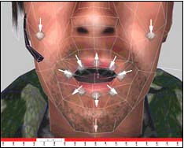

Example words: *OAt, bOY, boat*

* "Oat" is important. Think of how a cartoon character would make the "O" shape of its mouth.

* The mouth will form a near perfect "O" with a subtle lip extrusion.

### Pose (W/OO) - "Wet" Frame 60

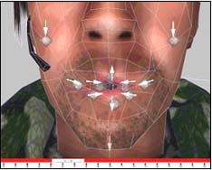

Example words: *Wet, Way, Yacht, bOOk, bOOt, toot*

* "Wet" is the smallest of the targets. Imagine your character whistling and the position of the mouth.

* Mouth corners are turned down, only a small opening is visible, and the teeth completely behind the lips.

### Pose (S/Z) - "Size" Frame 70

Example words: *SiZe, Sea, Zone*

* Size is almost like "Eat" only with the mouth corners relaxed more and the jaw closed a bit.

* The mouth is open just far enough so the teeth are barely separated.

* The upper and lower teeth should show between the lips equally

### Pose (Ch/J) - "Church" Frame 80

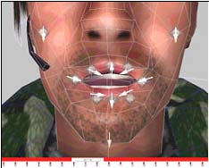

Example words: *Church, She, Azure, Joke, Choke*In this case only a small amount of jaw open is necessary.

* Open the mouth and make the lips pull inward and purse.

* Be sure that the teeth are showing if they are not you can always tweak the lips

### Pose (F/V) - "Fave" Frame 90

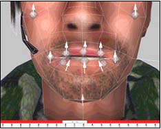

Example words: *faVorite, Fin, Van*Fave is different from any of the other targets, but is very important.

* The Jaw opens a bit and the lower lip curls under the upper teeth.

* Expose the upper teeth by moving the upper lip just high enough to show the tips of the teeth.

### Pose (Th) - "Though" Frame 100

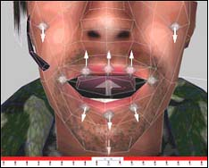

Example words: *THough, THin, Then*

* In "Though" the Jaw is open about the same amount as "If". The tongue position is important here.

* Position the tongue so that the tip conceals most of the upper teeth.

### Pose (T/L/D) - "Told" Frame 110

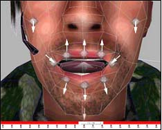

Example words: *ToLD, Lay, boTTLe, Day, muDDy, baT*

* The mouth corners are turned down and in but not to the point of frowning.

* The Jaw should be open a little wider than the "If" target.

* The tongue curls underneath the upper teeth, pressing forward.

### Pose (B/M/P) - "Bump" Frame 120

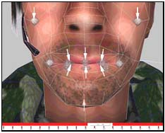

Example words: *BuMP, MoM, bottoM, Bee, Pea*

* The lips are pressed tightly together.

### Pose (N/NG) - "New" Frame 130

Example words: *NooN, siNG, buttoN, washINGton, winner*

* "New" is a simple modification of the mouth corners and the tongue position of "If."

* Take the Tongue and place it on the roof of the mouth, exposing its underside.

* Pull the mouth corners inward just a bit.

### Pose (R) - "Roar" Frame 140

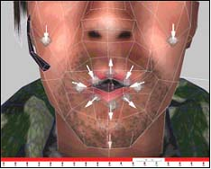

Example words: *Roar, Ray*

* The "Roar": position is slightly smaller than "Oat" but with the lips extruded out.

* Remember you can refer to the method's chart at the top of this section to find the quickest way to complete this target.

### Pose (K/G) - "Cage" Frame 150

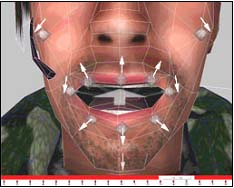

Example words: *Cage, Get, Key*

* Then pull the mouth corners back slightly and inward.

* Position the tongue so that the tip is under the lower teeth and the back is near the roof of the mouth.

### Targets (Eyebrow Up Left) - "EB\_Up\_L" Frame 160 and (Eyebrow Up Right) - "EB\_Up\_R" Frame 170

The "EB\_Up\_L" will move the Left eyebrow up to its maximum position. Nothing else should move. Same rules apply for "Blink\_R"

### Targets (Blink Left) - "Blink\_L" Frame 180 and (Blink Right) - "Blink\_R" Frame 190

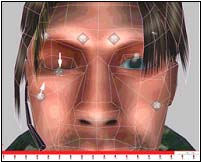

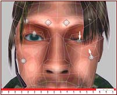The "Blink\_L" will move the Left eyelid down over the eyeball. Nothing else should move. If you like you can pull the Left Cheek up a bit in towards the eye to exaggerate the blink. Same rules apply for "Blink\_R"

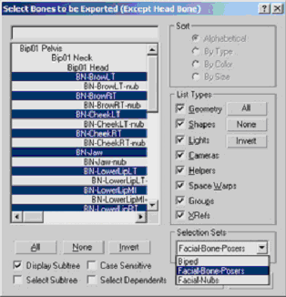

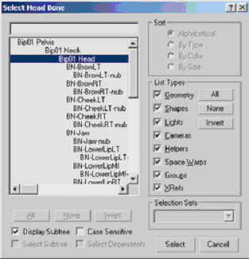**That's it! Export you Characters poses to an LBP file and save the Max scene.**

## Downloads

Check out the [LipSyncDownload](LipSyncDownload.md) page for the Impersonator Studio and more.
