# Impersonator User Guide

*Document Summary: A reference document that details the controls and properties of Impersonator. Good for intermediate and advanced users.**Document Changelog: Last updated by Michiel Hendriks, v3323 update. Last updated by Tom Lin (DemiurgeStudios?), for document summary. Original author was John Briggs(ImpersonatorTeam?).*

* [Impersonator User Guide](ImpersonatorUserGuide.md#Impersonator User Guide)
  + [The Impersonator Tab](ImpersonatorUserGuide.md#The Impersonator Tab)
    - [Animation Pane](ImpersonatorUserGuide.md#Animation Pane)
      * [Mesh Selection Controls](ImpersonatorUserGuide.md#Mesh Selection Controls)
      * [Base Animation Selection Controls](ImpersonatorUserGuide.md#Base Animation Selection Controls)
      * [Animation List and Playback Controls](ImpersonatorUserGuide.md#Animation List and Playback Controls)
      * [Animation List Context Menu](ImpersonatorUserGuide.md#Animation List Context Menu)
    - [Properties Pane](ImpersonatorUserGuide.md#Properties Pane)
      * [Animation Properties Tab](ImpersonatorUserGuide.md#Animation Properties Tab)
    - [Menus and Toolbar](ImpersonatorUserGuide.md#Menus and Toolbar)
      * [File Menu](ImpersonatorUserGuide.md#File Menu)
      * [View Menu](ImpersonatorUserGuide.md#View Menu)
      * [Tools Menu](ImpersonatorUserGuide.md#Tools Menu)
      * [Toolbar](ImpersonatorUserGuide.md#Toolbar)
    - [Importing Bone Poses](ImpersonatorUserGuide.md#Importing Bone Poses)
    - [Generating Animations](ImpersonatorUserGuide.md#Generating Animations)
      * [Generate LIPSinc Animation Option Dialog](ImpersonatorUserGuide.md#Generate LIPSinc Animation Option Dialog)

## The Impersonator Tab

(Pre v3323 the tab was called "LIPSinc")The impersonator tab is where all of the functionality implemented by Impersonator with the Unreal engine is exposed. Attaching a Impersonator controller to a mesh, generating animations, and managing Impersonatorc controllers and animations and their associated properties are all done within the Impersonator tab.
For the purposes of this guide, we divide the user interface into four areas: the toolbar, at the top of the tab, the render window, in the center, the animation pane, to the left of the render window, and the properties pane, to the right of the render window.

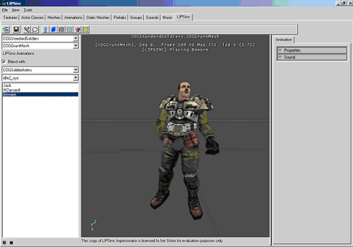

### Animation Pane

The animation pane is where the tools for selecting meshes and playing animations are located.

#### Mesh Selection Controls

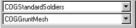

The top combo box is used to select the UKX package, and the bottom combo box selects the mesh within the selected package. Changing the selected mesh will update the Impersonator animation list with all of the animations contained in the Impersonator controller for the selected mesh. If the Impersonator animation list is empty, chances are that the mesh does not have a Impersonator controller attached. To attach a controller to the mesh, you need a bone pose file ( .lbp ) exported from Max or Maya with the Impersonator LBP Exporter.

#### Base Animation Selection Controls

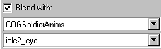

To allow you to preview how your animation will look when applied in game, you can blend it over any animation available in the Animation Browser. Selecting an animation package and an animation and checking the "Blend with" check will cause the animation to be looped on the mesh displayed in the render window.

#### Animation List and Playback Controls

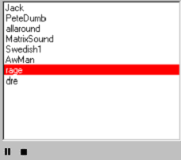

The Impersonator Animation List contains the names of all of the animations in the controller attached to the currently selected mesh. Selecting a mesh and clicking the Play button (not shown) will play the Impersonator animation in the render window. The animation can be Paused or Stopped at any time. Right clicking inside of the Impersonator Animation List accesses the context menu.

#### Animation List Context Menu

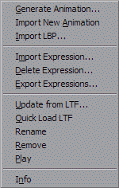

Generate Animation creates Impersonator animation, with Import Animdation you can import an LTF file created with the Impersonator Studio and Import LBP attaches a Impersonator controller to the current mesh. These functions will be covered in more detail later.Import Expression imports an LBP file for expressions. This LBP file can contain a single pose for non-lip-synch targets, or a set of poses to change the way the character talks when the expression is active. These LBP files should only contain the bones that are active in the expression. Hold Shift or Control to select multiple files. Delete Expression deletes an expression that was imported. Export Expressions creates an IEX file for use with Impersonator Studio. The IEX file format is a list of expression names.Update from LTF imports an LTF onto an existing animation. Quick Load LTF imports the LTF most recently used for this animation. To quickly see changes made with Impersonator Studio. Remove deletes the currently selected Impersonator animation from the controller, Rename allows you to rename the animation and Play plays the currently selected Impersonator animation.Info displays a dialog containing information about the current animation, current controller, and the version of Impersonator.Generate Animation and Import LBP can also be accessed through the Tools menu, and Info from the View menu.

### Properties Pane

#### Animation Properties Tab

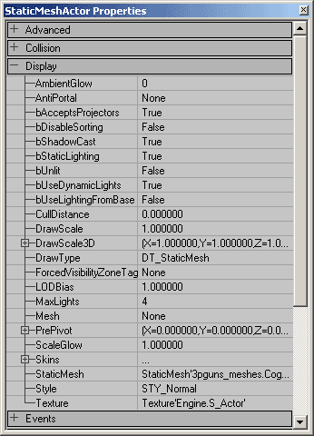

The properties pane contains the editable properties for the currently selected LIPSinc animation. Currently, there are four: bInterruptable, BlendInTime, BlendOutTime and Sound.
If you want to designate whether or not a Impersonator animation can be interrupted by another Impersonator animation within the game, you can use `bInterruptable` Boolean variable. Note that even if you set `bInterruptable` to false, you may still interrupt the animation within the editor.
`BlendInTime` time needed to blend into this animation.
`BlendOutTime` time needed to blend out of this animation.
The `Sound` property allows you to link an animation to a different sound. This is how we did the Dr. Dre demo animation. By analyzing a sound file with no background music, the analysis engine was able to generate very accurate lip-synching, and we linked the resulting animation with the version of the sound with the background music.

### Menus and Toolbar

#### File Menu

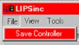

* Save Controller serializes the Impersonator controller attached to the current mesh to disk. Impersonator generates the filename automatically, so no Save As dialog is displayed.

#### View Menu

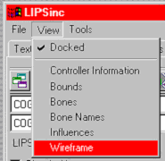

* Docked toggles whether or not the LIPSinc tab is docked in the UnrealEd browser window.
* Controller Information displays the information dialog for the LIPSinc controller attached to the currently selected mesh.
* Bounds toggles whether or not to draw the bounding volumes around the mesh
* Bones toggles how the render window draws the underlying bone structure for the mesh.
* Bone Names toggles whether or not bone name labels are drawn. Bones in the bone poses for lip-synching are labeled in yellow.
* Influences toggles drawing influence normals on the mesh.
* Wireframe toggles drawing the mesh in wireframe or solid mode.

#### Tools Menu

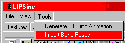

* Generate LIPSinc Animation creates a LIPSinc animation from a sound file and adds it to the currently selected mesh's LIPSinc controller.
* Import Bone Poses creates a LIPSinc controller with the poses in the LBP file and attaches it to the currently selected mesh.

#### Toolbar

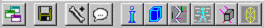

The toolbar duplicates the functionality found in the menus in an easier-to-access location. From left to right, the buttons are: Dock, Save Controller, Import Bone Poses, Generate Animation, Info, Bounds, Bones, Bone Names, Influences and Wireframe.

### Importing Bone Poses

To import bone poses and attach a LIPSinc controller to a mesh, your first step should be to rig a character for lip-synching and export the poses from Max or Maya. For detailed information on how to rig your character for lip-synching, see [ImpersonatorHeadRigging](ImpersonatorHeadRigging.md). Once you have a bone pose file, select the mesh you wish to attach the controller to, and import the poses. This creates a controller and attaches it to the mesh if and only if each bone referenced in the bone pose file is found in the mesh. Once you have successfully created a LIPSinc controller, you can begin generating LIPSinc animations.

### Generating Animations

To generate an animation, select a sound file to analyze. Once you select a sound file, the following option dialog will be shown.

#### Generate LIPSinc Animation Option Dialog

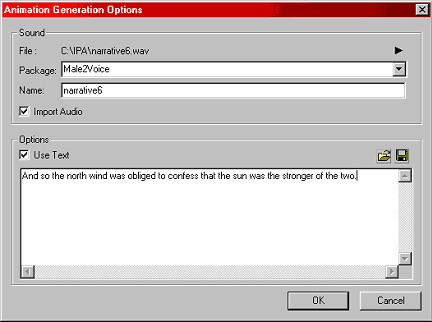

Impersonator can automatically import the sound into an Unreal sound package for you. To do this, check Import Audio and select a package to import into. The name field will be what the sound is imported as, and also the name of the animation in the LIPSinc controller. Optionally, you can process the sound with the corresponding text. This aids the analysis engine in determining the correct lip-synching, but only if the text corresponds exactly to what was said. Take care in transcribing the text to prevent bad lip-synching. You also can load the text from any file. Once the text corresponds exactly to what was said, you might want to save the resulting text to a file for later with the save button.
