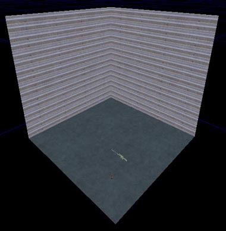
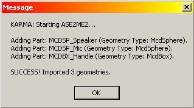
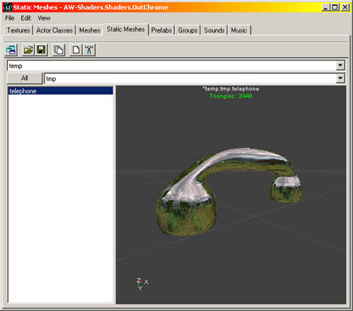
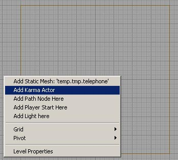
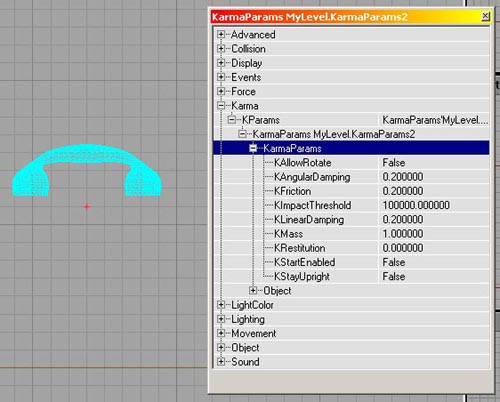
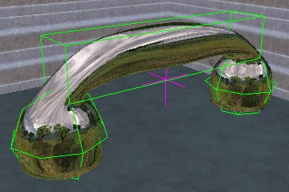

# Importing Karma Actors

*Document Summary: An introductory guide to importing Karma Assets into Unreal Ed.**Document Changelog: Last updated by Michiel Hendriks. Previously updated by Jason Lentz (DemiurgeStudios?), to update for the 2226 build and for re-organizational purposes. Original author was James Golding. ( [jamesg@epicgames.com](mailto:jamesg@epicgames.com) )*

* [Importing Karma Actors](ImportingKarmaActors.md#importing-karma-actors)
  + [Overview](ImportingKarmaActors.md#overview)
  + [Getting Started](ImportingKarmaActors.md#getting-started)
  + [Creating Graphics With Collision](ImportingKarmaActors.md#creating-graphics-with-collision)
  + [Adding To Level](ImportingKarmaActors.md#adding-to-level)
  + [Setting Parameters](ImportingKarmaActors.md#setting-parameters)
  + [Playing The Level](ImportingKarmaActors.md#playing-the-level)
  + [In Closing](ImportingKarmaActors.md#in-closing)

## Overview

This tutorial introduces the basics of adding Actors to a scene driven by Karma physics.

## Getting Started

Load UnrealEd, and create a nice simple square room (say 1024x1024x1024) with unlit walls, add a start position, a weapon (sniper rifle works well) and rebuild it. You should get something like:

## Creating Graphics With Collision

Now we need to create our object. If our object is going to simulated with Karma, we need to give it a simplified collision geometry as well as the high-poly graphic mesh. For this example, we are making a telephone receiver. So we model it inside 3DS Max as usual, then add two spheres and a box that approximate the shape.

Each collision part's name must start with a keyword to say what type of shape it is. These keywords are:

|  |  |
| --- | --- |
| *MCDBX* | Box Primitive |
| *MCDSP* | Sphere Primitive |
| *MCDCY* | Cylinder Primitive |
| *MCDCX* | Convex Mesh Primitive |

So in this case, our handle is called MCDBX\_Handle and the two ends are called MCDSP\_Speaker and MCDSP\_Mic. Then we export the whole lot as one .ASE file.If you want them, the example .MAX and .ASE files are attached at the bottom of this page.Inside UnrealEd, import the .ASE file in the usual way. After importing the graphics you should see a dialog saying 'Karma Collision Data Found. Do you want to add to StaticMesh?'. Answer YES, and UnrealEd will conver the collision geometry parts to the simple shapes they represent, as well as calculating a default contre-of-mass position and inertia tensor for this static mesh. You should see this message to indicate this:

In this case, the material has been set to a nice environment map.

## Adding To Level

Once you have a static mesh with Karma properties, you can add it to a level in a similar manner to adding a normal static mesh. Make sure the static mesh you want is currently selected, right click on one of the viewports and choose 'Add Karma Actor' from the menu.

You should see our telephone appear. Move it to about the middle of the room.

## Setting Parameters

There are several properties that can be set for an Actor using Karma. Bring up the properties for the phone we just added, look under Karma, KParams, then into KarmaParams and you should see something like this:

The default KFriction setting of our phone is 0, which is completely slippery. Change it to 0.2 as in the screenshot above, but we'll leave everything else at its defaults for now. Note that 'KStartEnabled' is set to False (we'll come to that in a sec).See the [KarmaReference](../Content Creation/Physics/KarmaReference.md) document for more information on KarmaParams settings.

## Playing The Level

Save everything and launch the level. You should see your graphic floating in space. Before going any further, we'll turn on debugging information. Hit '~' to bring down the console, and enter 'kdraw com' and 'kdraw collision'. This will toggle on drawing the Karma collision geometry, and the Actor's centre of mass. You should see something like:

But why is it hanging in the air? Karma automatically disables simulation of Actors when they come to rest. They are enabled again when shot, or hit by another Karma Actor. By default Actors are disabled when the level loads, although you can change this by setting the 'KStartEnabled' parameter we saw earlier to True.If you shoot the phone it should start simulating, and fall to the ground. Shoot it around a bit.

## In Closing

That's the basics of adding single objects to a scene and using Karma to simulate them. If you experience odd behaviour or crashes, make sure you check the UW.log file to see if there are any helpful warnings. Also, make sure you check the [KarmaReference](../Content Creation/Physics/KarmaReference.md) page and the Karma User Guide.Try also:

* Adding another object at a different scale. Collision geometry, inertia tensor and centre-of-mass position are scaled automatically. See how they behave differently.
* Set friction to zero and see them skate around.
* Add a physics volume, set gravity to (0, 0, 0) and see them float in space.
