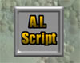
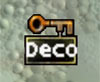

# Keypoint Reference

*Document Summary: Here you will find definitions for all of the actors found under the Keypoint section within the Actors Browser.**Document Changelog: Last updated by Michiel Hendriks, minor update. Previously updated by Jason Lentz (DemiurgeStudios?) for creation purposes. Original author: Jason Lentz (DemiurgeStudios?).*

* [Keypoint Reference](KeypointReference.md#keypoint-reference)
  + [Introduction](KeypointReference.md#introduction)
  + [AIScript](KeypointReference.md#aiscript)
  + [AmbientSound](KeypointReference.md#ambientsound)
  + [DecorationList](KeypointReference.md#decorationlist)
  + [Matinee Keypoints](KeypointReference.md#matinee-keypoints)
  + [Editor Reference Keypoints](KeypointReference.md#editor-reference-keypoints)
  + [Obsolete/Unused Keypoints](KeypointReference.md#obsoleteunused-keypoints)

## Introduction

They Keypoints within the Actors Browser are used for a couple different things, but most basically, they are special points in the map that can be used as some sort of reference by other Actors or scripts. Some Keypoint Actors are no longer used, but this document will go through and sort out which ones are useful and explain what they can be used for.

## AIScript

These Keypoint Actors can be used in conjunction with `ScriptedSequences` to create AI for pawns in your level. For more about how to use `AIScripts` , see the [ScriptedSequenceTutorial](../Content%20Creation/Scripted%20Sequences/ScriptedSequenceTutorial.md) document.

## AmbientSound

This is a simple sound actor that can be placed in a level to loop a sound. For more about `AbientSound` Keypoints, see the [ExampleMapsSounds](ExampleMapsSounds.md) document.

## DecorationList

`DecorationLists` are actors that can define a list of StaticMeshes that will appear within a volume. To see more about `DecorationLists` , see the [Volumes Tutorial](../Content%20Creation/Primitives/VolumesTutorial.md#decolist) document.

## Matinee Keypoints

The following Keypoints are used in Matinee scenes:

* InterpolationPoint
* LookTarget

An `InterpolatioPoint` is a convenience actor that you can point a matinee camera at. Note that they aren't `bStatic` so they can be attached these to movers and such.A `LookTarget` is a convenience actor that you can point a matinee camera at. Note that they aren't `bStatic` so they can be attached these to movers and such.For more about how to use these Keypoints, see the  [MatineeTutorial](../Content%20Creation/Matinee/MatineeTutorial.md#tools) document.

## Editor Reference Keypoints

The following Keypoints **should NOT be used** as they are only used by the Editor itself during specific interface operations.

* ClipMarker
* PolyMarker

`ClipMarkers` are markers for the brush clip mode. You place 2 or 3 of these in the level and that defines your clipping plane. These should NOT be manually added to the level. The editor adds and deletes them on its own.`PolyMarkers` are markers for the polygon drawing mode. These should NOT be manually added to the level. The editor adds and deletes them on its own.

## Obsolete/Unused Keypoints

The following Keypoints are obsolete and should not be used:

* BlockAll
* BlockMonsters
* BlockPlayer
* SpectatorCam
