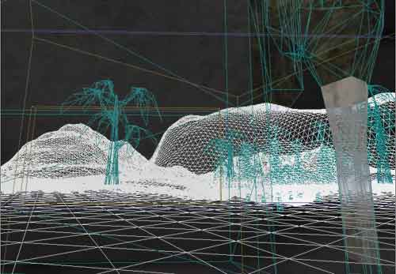
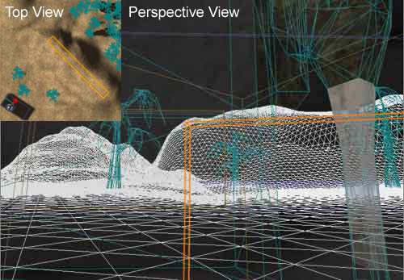
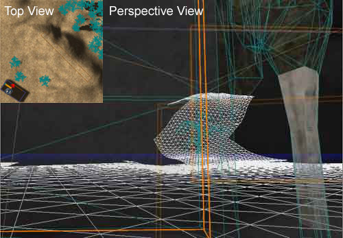
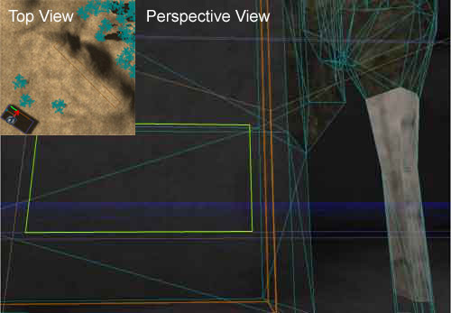

# Level Optimization - Antiportals

*Document Summary: A detailed description on how use Antiportals to optimize your level.**Document Changelog: Last updated by Jason Lentz (DemiurgeStudios?), to break up in to smaller docs. Original authors were Tomasz Jachimczak ([UdnStaff](https://udn.epicgames.com/Main/UdnStaff)) and Jason Lentz (DemiurgeStudios?).*

* [Level Optimization - Antiportals](LevelOptimizationAntiportals.md#level-optimization---antiportals)
  + [Introduction](LevelOptimizationAntiportals.md#introduction)
  + [Limitations](LevelOptimizationAntiportals.md#limitations)
  + [Examples](LevelOptimizationAntiportals.md#examples)
  + [Guidelines for Antiportals Outdoors](LevelOptimizationAntiportals.md#guidelines-for-antiportals-outdoors)

## Introduction

Antiportals are invisible barriers used for blocking geometry from the renderer's view. They are very versatile tools for not only obscuring geometry in large wide open environments, but also for fine tuning within smaller zoned off areas. They can be used in conjunction with any visual barrier to the player, be it a BSP brush, static mesh, or within terrain. This doc describes how Antiportals can be used to improve the efficiency of your level.This document is part of a collection of documents on [LevelOptimization](../Content%20Creation/Techniques/LevelOptimization.md), but sure to read the others.

## Limitations

There are only a few constraints with Antiportal Volumes. First of all, they must be convex, or in other words, you should be able to draw a line from any point on the surface of the volume to another and not have it leave the boundary of the shape. Below is a diagram further what shapes are convex and which are not:

Secondly, the Antiportal Volume must be at least touching the subtracted world space. They will not occlude anything if they are completely within the solid additive world space. Another constraint is that you cannot resize them once you've added them to the level. You can rotate them and move them, but resizing is impossible. Lastly, you may notice that Antiportal Volumes may not occlude nearby geometry. Because the occlusion tools are built for speed and efficiency, the process of occlusion is not a perfect one. The goal is to run as fast as possible and that doesn't necessarily mean rendering as little as possible.

## Examples

Here is an example of how Antiportal Volumes can be used to occlude the various types of geometry. Below is an aerial view of a simple environment that can be greatly optimized with the placement of a few Antiportal Volumes.

In the screen shots below, we can see that the renderer can see many things from this vantage point while the player's view is mostly occluded. The camera is within a BSP room (seen in the lower right corner in the above image), looking out into a terrain that has several static meshes both in front of and behind the hill. From the player's perspective though, you can only see a wall mesh and the BSP wall.

The first Antiportal Volume we add is in the terrain inside the hill in the distance. Even though it is below the terrain, it is still within the subtracted world space and it occludes properly. It is best to make it make it as large as it can be without protruding from the terrain so that it occludes as much as possible. As seen in the wireframe view below, this Antiportal Volume occludes all the terrain behind it, and several static meshes.

Next an Antiportal Volume is used with the BSP wall to occlude much more of the outside environment. This Antiportal Volume cannot be placed entirely within the added BSP wall though, as it would not occlude anything. To prevent the Antiportal Volume from being ignored, make it just larger than the wall so that it juts out into the room as well as outside. This ensures that it is touching the subtracted world space. It will not hide the BSP wall, because it is not entirely hiding the BSP node which the wall is within.

As can be seen in the above image, even though the tree mesh is partially hidden by the Antiportal Volume, it is still being rendered in its entirety. As stated earlier in the static mesh section, a static mesh must be entirely hidden by a single antiportal in order for it to be occluded. Adding one more Antiportal Volume in the wall static mesh will totally occlude the tree static mesh in conjunction with the last Antiportal Volume added, but since neither one will completely obscure it on its own, the tree will still be rendered. This can be seen in the following wireframe screen shot that has Antiportal Volumes about the BSP wall and in the wall static mesh.

The addition of a zone portal in the doorway of the BSP wall will occlude everything that is outside the room, because the addition of the last Antiportal Volume totally obscures the doorway. While using Antiportal Volumes together may not work to occlude single meshes, using them with Zone Portals works very well to efficiently occlude entire zones as seen below.

Individual meshes can be turned into antiportals themselves by converting the mesh into a brush and using the "Add Special" button,

or the "Add Antiportal" button. If they are not convex though, they will either slow the engine to a halt or just cause it to crash. Simple Antiportal Volumes are more efficient occluders than meshes assigned as antiportals through the "Add Special" tool. Antiportal Volumes occlude with their entire silhouette, while the other antiportals calculate occlusion for each of the triangles in the mesh assigned as an antiportal.

## Guidelines for Antiportals Outdoors

When using Antiportals in outdoor spaces it is better to use larger Antiportal Volumes where you can fit them beneath terrain and in large walls. Placing smaller Antiportal Volumes in every possible place (such as within every tree StaticMesh and small rock StaticMesh) may cause the render to very rarely cull some extraneous geometry that need not be rendered, but the effort to do so would not justify the gain and the presence of so many Antiportals may even decrease over all performance. The best approach is to design the level so that you can place large antiportals within hills and cliff walls that will cull vast areas of your level.
