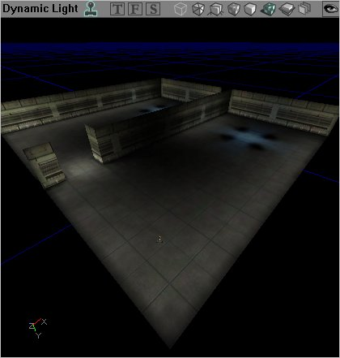
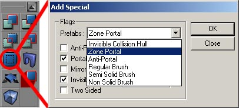
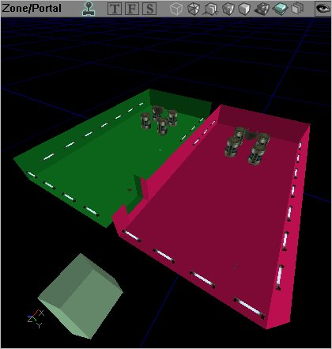

# Level Optimization - BSP

*Document Summary: A detailed description on how to optimize your level through use of BSP.**Document Changelog: Last updated by Michiel Hendriks, minor text changes. Previously updated by Jason Lentz (DemiurgeStudios?), to break up in to smaller docs. Original authors were Tomasz Jachimczak ([UdnStaff](https://udn.epicgames.com/Main/UdnStaff)) and Jason Lentz (DemiurgeStudios?).*

* [Level Optimization - BSP](LevelOptimizationBSP.md#Level Optimization - BSP)
  + [Introduction](LevelOptimizationBSP.md#Introduction)
  + [Creating the World Space](LevelOptimizationBSP.md#Creating the World Space)
  + [BSP Collision](LevelOptimizationBSP.md#BSP Collision)
    - [Zones and Portals](LevelOptimizationBSP.md#Zones and Portals)
  + [Downloads](LevelOptimizationBSP.md#Downloads)

## Introduction

BSP is the most primitive of the geometry types as well as the most fundamental. Without it, your level will not exist. While BSP is the slowest geometry type to render, it does have some advantages over the other geometry types. Here you will see what the best uses are for BSP geometry and how you can use it efficiently in your level.This document is part of a collection of documents on [LevelOptimization](../Content Creation/Techniques/LevelOptimization.md), but sure to read the others.

## Creating the World Space

It is necessary in creating the actual space of the world. You must start with BSP by subtracting a BSP brush from the world, so that you are working within subtracted world space. Using BSP brush is also the only way to set up zones (explained in detail in the [Zones and Portals](LevelOptimizationBSP.md#ZonesAndPortals) section). Another thing to note with BSP is that it is occluded in nodes, which means that when it is set up to be hidden from the renderer it will be hidden in chunks, not on a triangle by triangle basis.Here are some images of a space that has been created entirely with BSP geometry carved out from the solid world space.

And with textures it can look like this:

Another thing to note is the frequency of BSP cuts. It is of course ideal to keep the number of subtractions and additions down to a minimum, but having a few extra additions here and there across your level will not have a dramatic impact on performance. What is more important is to note the complexity of the resulting BSP brush. The more complex it is, the more likely it is to produce BSP holes and thus hinder performance.

## BSP Collision

BSP geometry always handles collision calculations more efficiently but because of its rendering limitations, it is not ideal for everywhere. Typically BSP surfaces are used for ground and floor surfaces, and often invisible blocking volumes are constructed from the BSP brush and used to conceal more complicated StaticMesh geometry that may be making up the walls or sides of the space.For more detail on optimizing for collision, see the [CollisionTutorial](../Content Creation/Physics/CollisionTutorial.md)

### Zones and Portals

Zones and Portals are the best tool for visibility culling that the level designer can work with. A Zone is an entire area of the level that can be sectioned off and considered separately for rendering. This allows the renderer to draw triangles or not draw triangles per Zone rather than going through and individually determining what meshes will and won't be drawn. This is a huge advantage since with zones, the render will only be limited to drawing just the geometry in the 2-5 zones that a player can see into.To create a Zone, section off areas of your level by totally enclosing them in BSP volumes. A skybox, which does just that (completely surrounds a world), is in effect a Zone. Everything outside of that Zone will not be rendered as long as there are no lines of sight from one Zone to another. This brings up the problem of having players travel from Zone to Zone. To allow a player to move from one Zone to another a Portal must be added. Portals are invisible sheets that are used to divide up Zones. If a player can see through a Portal into another zone, then the renderer will render that zone. Given this, it is best to place Portals in the smallest connection two parts of a zone, such as doorways, to ensure you get the maximum efficiency of your Zones and Portals.

Using the previous example of a BSP room we will split this from one Zone into two through the addition of a Portal. As shown by separate colors, in this level there are two Zones, the blue two room Zone with the barrel and the light static meshes, and the green zone to the left that is simply an unattached box. As explained before, if you are in one of the green box Zone, nothing in the blue Zone will be rendered at all, but the blue Zone can be broken down further by the addition of a Portal.To create a Zone Portal, create a sheet that takes up the entire space of the hallway between the two blue rooms. Next click on the "Add Special" button on the left toolbar, and then select the "Zone Portal" default from the pull down menu:

This will place a portal in the shape and location of the BSP sheet you just set up. The portal created divides the blue zone into two (now shown as red and green below) and still allows players to travel from one room to the other (you will have to rebuild geometry to see this effect take place).

When the portal is not within the frustum of the player's view, the other room and all of its contents will not be rendered.The more Zones a level is divided into (within reason), the better. A well zoned interior will allow for elaborate and intricate detail to be added within confined spaces. Outside environments can be a bit trickier as they are often large, wide open spaces that are not easily divisible into separate BSP Zones. It is possible to have small buildings that are their own separate zones within a landscape, but the landscape as a whole will be one large zone. Objects within large outdoor spaces can still be occluded, but different tools are required for this. These tools are described in [LevelOptimizationAntiportals](LevelOptimizationAntiportals.md) .For an additional document that touches on the topic of setting up Zones, see the [BreakAwayExample](BreakAwayExample.md) .

## Downloads

To view a downloadable version of the map described above, go to the bottom of [main Level Optimization](../Content Creation/Techniques/LevelOptimization.md#DownLoads) and download the appropriate version from there.
