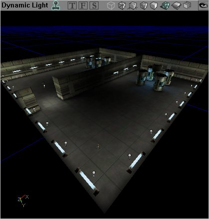
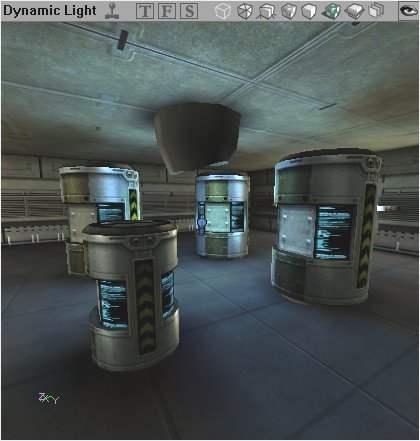
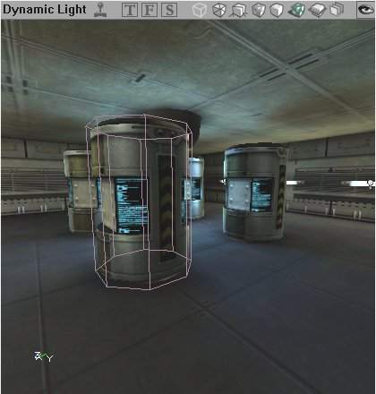

# Level Optimization - StaticMeshes

*Document Summary: A detailed description on how to optimize StaticMeshes in your level.**Document Changelog: Last updated by Michiel Hendriks, minor text changes. Previous update by Jason Lentz (DemiurgeStudios?), to break up in to smaller docs. Original authors was Jason Lentz (DemiurgeStudios?).*

* [Level Optimization - StaticMeshes](LevelOptimizationStaticMesh.md#level-optimization---_staticmeshes)
  + [Introduction](LevelOptimizationStaticMesh.md#introduction)
  + [Efficient StaticMesh Design](LevelOptimizationStaticMesh.md#efficient-_staticmesh-design)
  + [Using StaticMeshes Efficiently](LevelOptimizationStaticMesh.md#using-_staticmeshes-efficiently)
  + [Collision with StaticMeshes](LevelOptimizationStaticMesh.md#collision-with-_staticmeshes)

## Introduction

StaticMeshes are meshes that were created in a 3rd party modeling program and imported into Unreal Ed. Due to being drawn entirely through use of 3D acceleration on the client computer and the fact that they do not move (hence the name *Static* Meshes), they render faster than any other geometry type. This document goes into detail about how not only using StaticMeshes to optimize your level but also on how to create your StaticMeshes so that they themselves are optimized.This document is part of a collection of documents on [LevelOptimization](../Content Creation/Techniques/LevelOptimization.md), but sure to read the others.

## Efficient StaticMesh Design

Optimizing the StaticMeshes is a more of a way to fine tune your level, rather than making large sweeping optimizations, although it is still a good thing to keep in mind at the outset of creating the StaticMeshes for your level. For a more technical explanation on how your meshes can be built for the fastest rendering time as well as optimal memory size, see the [MeshOptimization](MeshOptimization.md) document.

## Using StaticMeshes Efficiently

In the downloadable example at the bottorm of the [LevelOptimization](../Content Creation/Techniques/LevelOptimization.md), there are a few StaticMeshes used to further demonstrate how they are culled by Antiportals and Zones. Taking a closer look at the barrel StaticMesh a few other advantages of StaticMeshes can be seen.

As stated above, StaticMeshes are the fastest type of geometry for rendering and because of this, not only can they be safely given more detail than BSP geometry, but they can also be replicated to flesh out a scene.

Above you can see the rooms with multiple instances of only a few different StaticMeshes (three to be exact: barrel, wall light, and ceiling light). The advantage of being able to reuse StaticMeshes in a level is that they will not take up as much space in memory allowing for ultimately more variety and/or complexity in the different meshes. Another way to increase the visual variety of your level is to alter the display sizes of StaticMeshes, as demonstrated below.

Using modular design principles, using the DrawScale values can greatly increase the functionality of your StaticMeshes. To see more about modular level design, see the [WorkflowAndModularity](WorkflowAndModularity.md) document.

## Collision with StaticMeshes

Collision for StaticMeshes with their default settings is not that efficient, but fortunately this can be optimized. What makes StaticMesh collision calculation so slow is that when UnrealEd is calculating collision for the mesh it calculates it on a per triangle basis for the entire mesh, not just the area that might be affected. So you can imagine that if you have a large mesh (both in size and poly count), for instance a complicated Tree model with lots of modeled foliage, the engine will be making unnecessary calculations for any player that may bump against the trunk of this tree.There are a variety of ways to improve the collision for StaticMeshes. One of these ways includes Blocking Volumes. Again in the downloadable example at the bottorm of the [LevelOptimization](../Content Creation/Techniques/LevelOptimization.md) you can see an example of a Blocking Volume that has been set up around one of the barrel StaticMeshes.

This screenshot shows the mesh from the barrel next to a standard eight-sided cylinder. For a player running through the level, the simpler 8-sided collision surface simulates the spatial volume of the barrel almost identically. The cylinder is exactly the same height, has the same circumference and will block the player from walking through the barrel. However, the eight-sided cylinder greatly simplifies the calculations needed by the engine to work out collisions against players.Another way to improve StaticMesh collision is to create simpler collision hulls around the StaticMeshes in the 3rd party modeling programs and then set up the properties of the StaticMesh to use the collision hull for collision calculations. For more detailed information on StaticMesh collision, see the [CollisionTutorial](../Content Creation/Physics/CollisionTutorial.md).
