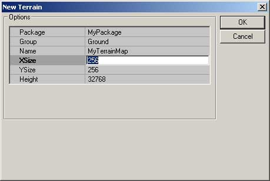
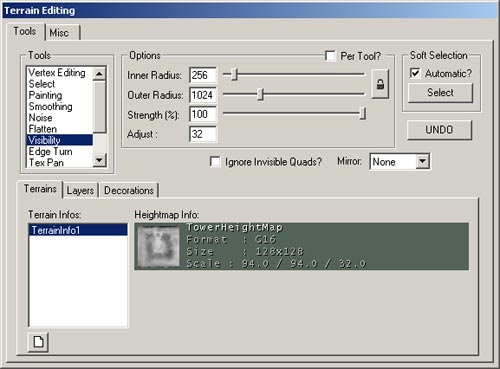
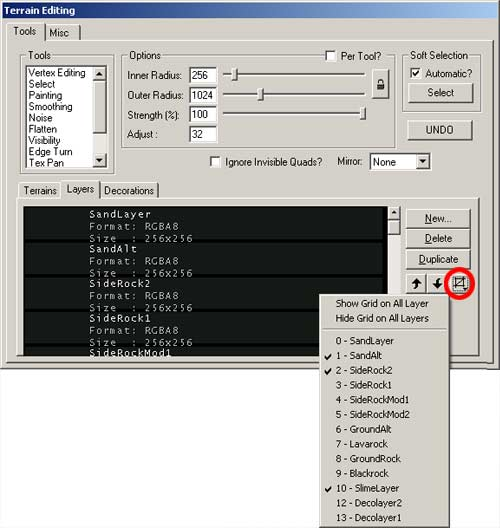
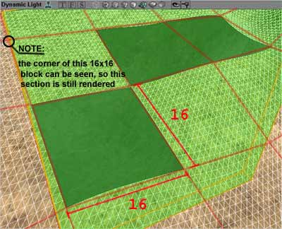

# Level Optimization - Terrain

*Document Summary: A detailed description on how to optimize Terrain in your level.**Document Changelog: Last updated by Michiel Hendriks, minor text changes. Previous update by Jason Lentz (DemiurgeStudios?), to break up in to smaller docs. Original authors were Tomasz Jachimczak ([UdnStaff](https://udn.epicgames.com/Main/UdnStaff)) and Jason Lentz (DemiurgeStudios?).*

* [Level Optimization - Terrain](LevelOptimizationTerrain.md#level-optimization---terrain)
  + [Introduction](LevelOptimizationTerrain.md#introduction)
  + [Setting an Initial Size](LevelOptimizationTerrain.md#setting-an-initial-size)
  + [Invisibility Tool](LevelOptimizationTerrain.md#invisibility-tool)
  + [Optimizing Layers](LevelOptimizationTerrain.md#optimizing-layers)
  + [Terrain SectorSize](LevelOptimizationTerrain.md#terrain-sectorsize)

## Introduction

Terrain geometry falls between Static Meshes and BSP as far as rendering and collision efficiency. There isn't a whole lot that can be done to optimize Terrain with respect to collision, but there are a few things to be aware of to optimize for rendering. This document shows what aspects of Terrain can be optimized and how best to optimize them.This document is part of a collection of documents on [LevelOptimization](../Content%20Creation/Techniques/LevelOptimization.md), but sure to read the others.

## Setting an Initial Size

The first step in optimizing your terrain is selecting the right resolution for it. By default, terrain is 256x256, but sometimes a lower resolution will suffice.

You may want to use terrain only in a small section of the world. For instance, if you are planning to use terrain to cover a smaller area, such as a small oblong cavern, a 128x64 sized terrain may be all you need. Unfortunately, since terrain sizes should be kept at powers of 2, you can't get too specific about the size of terrain you wish to use when creating it.If you do need to change the resolution of your Terrain either because of performance issues or because of file size issues you will need a G16 file editor. Fortunately Martin Bell has been kind enough to put together such a tool and has posted if on his website.You can download this tool from Martin Bell's site: <http://homepage.ntlworld.com/martingbell/ut2003/>

## Invisibility Tool

Another `fine tuning' tool for optimizing the terrain is the Visibility tool in the Terrain Editor.

By selecting this tool and highlighting the terrain map you want to hide sections of, you can turn patches of terrain triangles invisible by right clicking with the mouse. If you turn too much invisible, you can simply left click to turn those triangles back to visible. Note that the maximum radius can be altered to change the affected area so it is possible to hide large patches with a single click, or by setting the maximum radius to one, you can hide the triangles on a per triangle basis. Triangles that are turned invisible will never be considered for rendering.

## Optimizing Layers

Another way that Terrain can slow down the rendering of a scene is in the complexity of the texture layers for the Terrain. Having multiple layers of texture painted across an area of Terrain will cause that area to be rendered in multiple passes -how many passes depends on the graphics card you are dealing with on the end users machine. For example, if you've blended together 3 different Terrain Layer Textures on one Sector, that Sector could be rendered in as many as 3 passes.The Terrain Editor is somewhat smart in that it will not render other textures that are totally obscured by a Layer that is completely opaque, but it is better to just have Terrain Layers painted only where you really want them. One of the tools in the Terrain Editor that helps you see where you have and have not painted a Terrain Layer is the Show Grid button.

With this pull down menu, you can select individual layers and see where these layers are being used on your Terrain. By reducing the number of layers on a particular patch of Terrain will decrease the Depth Complexity of your scene and thus allow your scene to render faster and more efficiently.

## Terrain SectorSize

Terrain is almost as fast as BSP for collision and when being occluded from the renderer, it disappears in blocks (16x16 quad blocks by default), much like BSP disappearing by nodes. With Terrain though, you get to specify how large (or small) these nodes are by setting the **Terrain SectorSize.**By default, the Terrain SectorSize (located at the bottom of the Terrain Properties) is set to be at 16. This means that when Terrain is being culled it will be culled by 16x16 quad blocks or sectors. Below you can see where three 16x16 sectors are being occluded. By an Antiportal (shaded in green) that totally obscures those three sectors

To determine the best Terrain SectorSize for your level involves a little bit of trial and error. I recommend tinkering with the SectorSize settings as a final step and you have everything in your environment laid out. This won't change any of the functionality or appearance of your Terrain but you may find that increasing or decreasing the SectorSize will result in over all faster fps.
