# Lighting on Surfaces

*Document Summary: A guide showing how LightActors affect various types of geometry.**Document Changelog: Last updated by Jason Lentz (DemiurgeStudios?) to separate into more manageable docs. Original author - Lode Vandevenne ([UdnStaff](https://udn.epicgames.com/Main/UdnStaff))*

* [Lighting on Surfaces](LightingOnSurfaces.md#Lighting on Surfaces)
  + [Introduction](LightingOnSurfaces.md#Introduction)
  + [Lighting on BSP](LightingOnSurfaces.md#Lighting on BSP)
  + [Lighting on Static Meshes](LightingOnSurfaces.md#Lighting on Static Meshes)
  + [Lighting on Meshes](LightingOnSurfaces.md#Lighting on Meshes)
  + [Lighting on Terrain](LightingOnSurfaces.md#Lighting on Terrain)
  + [Lighting on Sprites](LightingOnSurfaces.md#Lighting on Sprites)
  + [Lighting on Particles](LightingOnSurfaces.md#Lighting on Particles)
  + [Lighting on Movers](LightingOnSurfaces.md#Lighting on Movers)
  + [Relevant Documents](LightingOnSurfaces.md#Relevant Documents)

## Introduction

Lights affect different types of geometries in different ways. This document outlines how each of these cases differ to help you avoid unwanted artifacts as well as take full advantage of other features available.

## Lighting on BSP

On BSP surfaces, the editor creates lightmaps during the Rebuild Lighting process. This creates very realistic shadows on the surfaces, especially if they have High Shadow Detail. The advantage of these lightmaps is that they look good. The disadvantage is that they can't be calculated in real time. The BSP Surfaces receive shadows from other BSP surfaces, and from Static Meshes, if in the Display Properties of this Static Mesh bShadowCast = True.

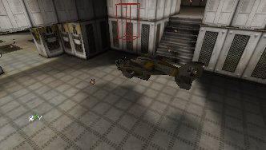

The light gets stopped by solids, semisolids and nonsolids. The light will shine through the invisible side of a one sided sheet brush, but not through the other side. Also, if you place a light inside of a nonsolid brush that is not a sheet, the light will shine through it.The light will shine through translucent surfaces, but not through modulated surfaces. When the light goes through a translucent surface, it just goes through it as if there were no surface at all. It doesn't get the colors of the translucent surface. The rays of the light go through the invisible parts of masked textures, so the shadows will have the shape of your masked texture:

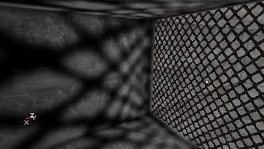

Sometimes the masked texture itself becomes black when you rebuild lighting. Set it to Unlit then and it should work again.The lighting also determines the translucency of a translucent surface: the more light it gets, the more opaque it becomes; the less light, the more invisible. If you have a translucent surface in your map and you want to make it more or less translucent, independent from the lighting around it, set it to Special Lit and add a bSpecialLit light next to it, then you can control the translucency of it with that light. For example, in the center of this room is actually a translucent surface, but it doesn't get any light at all. Where a non-translucent surface would become black, this one becomes invisible:

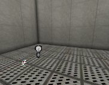

The higher you now set the LightBrightness of the light, the more visible the surface will become:

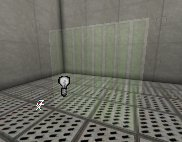

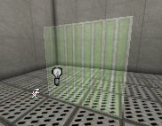

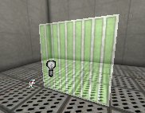

With colored lights you can get even more effects:

## Lighting on Static Meshes

Also for Static Meshes you need to Rebuild Lighting to get the best result. The lighting is calculated for every surface of the Static Mesh, so only the surfaces that are facing the light get lit, for example on this small Static Mesh cube:

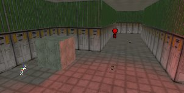

This means there are no lightmaps on the Static Mesh, so it doesn't receive nice shadows like BSP surfaces do. For example, on this screenshot the bottom-left brush is a Static Mesh and the upper brush is BSP (I mean the two brushes with the default engine texture on it). There's a bar placed in front of the light to create a shadow, but on the Static Mesh, this shadow isn't visible:

If the Static Mesh has the ability to move (so it's actor has bStatic = False in the Default Properties), the lighting is calculated in real time on the Static Mesh, so if for example it moves towards a light it'll become brighter.The Static Meshes themselves create shadows on BSP, but not on other Static Meshes or on their own.The lighting on Static Meshes is no longer dependent on the Pivot Point, but instead on a bounding box. So you can do what you want with the Pivot Point.If you convert a brush to a Static Mesh, the "Special Lit" settings will be lost, so you can't use Special Lit with Static Meshes. Unlit will still work, so all surfaces that were Unlit on the BSP brush will also be Unlit for the Static Mesh.If you want to get the corona of a light to shine through a Static Mesh (for example to place a corona inside a lamp) set the setting bBlockZeroExtentTraces of the Static Mesh to False. Only then you'll be able to see the corona. Of course, also set bShadowCast in Display to false, so the light can shine through the Static Mesh.

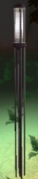

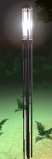

## Lighting on Meshes

The lighting on meshes is very similar to the lighting on Static Meshes. The lighting on meshes is real time.

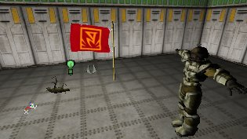

In the properties of the Mesh, expand Display. In there, you can use AmbientGlow to make the Mesh brighter, for example if you set AmbientGlow to 128, the mesh will be much brighter than when it's 0. When AmbientGlow is 255, the mesh is fullbright. On the screenshots, the AmbientGlow is respectively 0, 128 and 255.

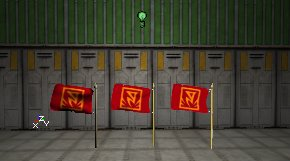

There's also a bUnlit property in Display. If you set this to true, the mesh will ignore all lighting, and its brightness is determined by AmbientGlow only. On the screenshot, again the AmbientGlow is respectively 0, 128 and 255:

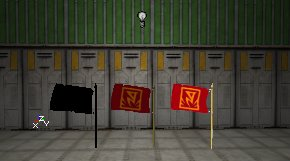

## Lighting on Terrain

The most important way to get light on a Terrain is Sunlight. Actually you have to use Sunlight on the terrain. Otherwise it'll look flat and boring. For example, the first screenshot has no SunLight but it has Ambient Lighting. The second screenshot has Sunlight and no Ambient Lighting:

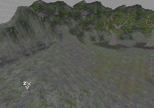

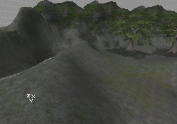The Ambient Lighting (ZoneLight) can be used to make the shadow parts of the terrain brighter. Normal lights brighten the terrain as well, but you'd need hundreds of light actors to completely light the terrain.

## Lighting on Sprites

Sprites completely ignore lighting, they're always fullbright. In the editor, Sprites get the same color as the LightColor settings, if it's LightType is not LT\_None at least. This works only in the editor and not in the game.You used to be able to change the brightness of the Sprites with the ScaleGlow setting in Display, but this is broken in 777.The lighting on Sprites isn't very important, because they're mainly used in the editor only, for example for the lightbulb symbol of light actors, and not in the game.

## Lighting on Particles

The particles ignore all lighting, but you can set the brightness and color of them to fit in the lighting of a certain room. I refer to the Emitters tutorial on UDN for this.

## Lighting on Movers

Movers are basicly Static Meshes with bStatic = False, so the lighting on a mover is the same as on a Static Mesh.The Movers automaticly become DynamicLightMover already. You don't have to set the bDynamicLightMover property for this. Also, the BrushRayTraceKey and WorldRayTraceKey properties don't do anything anymore, so you can ignore these settings.The shadow on the BSP of the mover will not move, so if you want the shadow to be completely away set bShadowCast to False in the Display properties of the mover.

## Relevant Documents

For more about LightActors and general lighting in Unreal Ed, also see the following documents:[LightingBasics](../Content Creation/Lighting and Textures/LightingBasics.md) - A detailed table of contents to all of the Lighting documents[UsingLights](UsingLights.md) - A general guide to not only using lights but also how to use features associated with lights.[TypesOfLights](TypesOfLights.md) - A guide to the various types of LightActors and light sources.[LightingReference](LightingReference.md) - A comprehensive reference for the LightColor and Lighting properties.[SpecialLightingFeatures](SpecialLightingFeatures.md) - A tutorial showing how to set up special lighting features.
