# Lighting Reference

*Document Summary: A comprehensive reference for the LightColor and Lighting properties.**Document Changelog: Last update by Michiel Hendriks, small update for v3323, added bDirectionalCorona. Last updated by Jason Lentz (DemiurgeStudios?) to separate into more manageable docs. Original author - Lode Vandevenne ([UdnStaff](https://udn.epicgames.com/Main/UdnStaff))*

* [Lighting Reference](LightingReference.md#lighting-reference)
  + [Introduction](LightingReference.md#introduction)
  + [LightColor](LightingReference.md#lightcolor)
    - [Light Brightness](LightingReference.md#light-brightness)
    - [Light Hue](LightingReference.md#light-hue)
    - [Light Saturation](LightingReference.md#light-saturation)
  + [Lighting](LightingReference.md#lighting)
    - [Special Lit](LightingReference.md#special-lit)
  + [LightCone](LightingReference.md#lightcone)
  + [LightEffect](LightingReference.md#lighteffect)
  + [LightPeriod](LightingReference.md#lightperiod)
  + [LightPhase](LightingReference.md#lightphase)
  + [LightRadius](LightingReference.md#lightradius)
  + [LightType](LightingReference.md#lighttype)
  + [Unlit](LightingReference.md#unlit)
  + [Relevant Documents](LightingReference.md#relevant-documents)

## Introduction

Here you'll find a complete list of all the Lighting properties, both for the LightColor section and Lighting Section. These properties can be used in not only LightActors, but in all Actors. Some of the properties have more in depth descriptions after the tables

## LightColor

With LightColor, you can change the brightness and color of the light. The color settings are in the properties of the light --> LightColor.

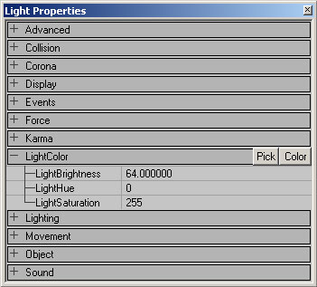

Below are descriptions of the three properties and the default setting for a LightActor.

| Property | Description | Default |
| --- | --- | --- |
| **LightBrightness** | This controls the amount of light cast. See [below](LightingReference.md#light-brightness) for detailed description. | 64.0 |
| **LightHue** | This controls the hue or color of the light cast. See [below](LightingReference.md#light-hue) for detailed description. | 0 |
| **LightSaturation** | This controls the saturation level or "pureness" of the light cast. See [below](LightingReference.md#light-saturation) for detailed description. | 255 |

### Light Brightness

Use LightBrightness to make the light brighter or less bright: It is possible to set the light value to over 255, but you may get strange results as the fall off may become unusually sharp. And of course if you set it to zero, there won't be any light at all. The screenshots show a LightBrightness of respectively 64, 128 and 255:

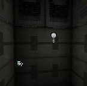

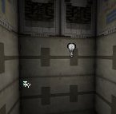

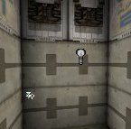

### Light Hue

Use LightHue to change the actual color of the light. For example a LightHue of 0 is red, 40 is yellow, 80 is green, 160 is blue, 200 is violet and 255 is red again. Of course you can only see the difference if LightSaturation is lower than 255. On the screenshots, LightSaturation = 128, and LightHue is respectively 0, 64, 128 and 192.

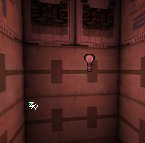

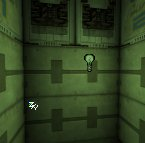

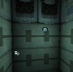

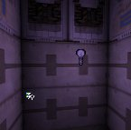

### Light Saturation

Use LightSaturation to change the intensity of the color. If it's at it's default value of 255, the light will be white. But if you lower it, it will have the color defined by LightHue. The lower, the more intense the color. The screenshots show a LightSaturation of respectively 255, 192, 128 and 0:

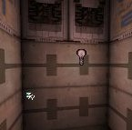

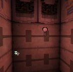

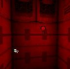If you don't have the light selected, you can see the lightbulb picture gets the same color as the light it emits. However if you select the light, the lightbulb picture always looks green, unless you deactivate the "Show Selection Highlight" option. To toggle this option in a view, press the S key after selecting the view.

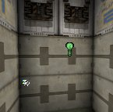

There are easier ways to choose the color of the light. If you press the "Color" button, the Windows Color Dialog Box will appear; you can choose your color there and press OK.

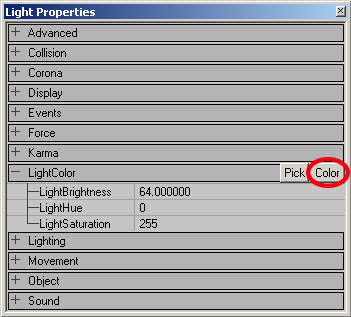

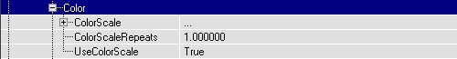If you press the Pick button, your mouse cursor changes into a dropper tool, so you can pick the color in any of the views.

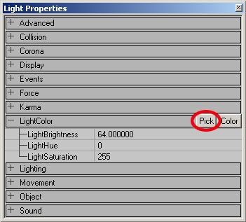

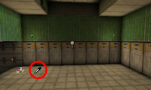If you think a light isn't bright enough, add multiple lights with full brightness at the same spot. The combination enough lights can almost make a black texture white.

## Lighting

In these properties there are a lot more variable to tinker with. Below is a table describing each of them along with the default settings for a LightActor. Some have more detailed descriptions below.

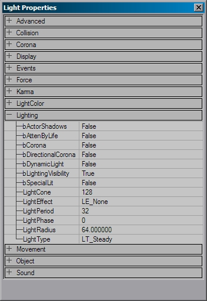

| Variable | Description | Default |
| --- | --- | --- |
| **bActorShadows** | When `True,' actor will cast shadows. | *False* |
| **bCorona** | The light will use *Skins* as a corona. See the [Special Lighting Features](SpecialLightingFeatures.md#coronas) doc for a full description. | *False* |
| **bDirectionalCorona** | The corona will only have an effect in the set direction instead of any direction. | *False* |
| **bDynamicLight** | This will allow the lighting from this light to move with the light if `True.' Note that DynamicLights are somewhat more processor intensive than regular lights. | *False* |
| **bLightingVisibility** | Calculates lighting visibility for this actor with line checks. | *True* |
| **bSpecialLit** | This setting allows you to some extent manually control what is affected by this light and what is not. See [below](LightingReference.md#special-lit) for detailed description. | *False* |
| **LightCone** | If you are using the Light Effect *LE SpotLight,* this will determine the angle of the spotlight cone. See [below](LightingReference.md#lightcone) for detailed description. | *128* |
| **LightEffect** | These are ready made effects that you can use in your light. See [below](LightingReference.md#lighteffect) for detailed description. | *LE None* |
| **LightPeriod** | This determines the rate of special [Light Types](LightingReference.md#lighttype) See [below](LightingReference.md#lightperiod) for detailed description. | *32* |
| **LightPhase** | This determines the fade out and fade of the [Light Types](LightingReference.md#lighttype) and [Light Effects](LightingReference.md#lighteffect). See [below](LightingReference.md#lightphase) for detailed description. | *0* |
| **LightRadius** | This is a multiplier of the actual radius of the light. See [below](LightingReference.md#lightradius) for detailed description. | *64.0* |
| **LightType** | These determine the "steadiness" of the light. See [below](LightingReference.md#lighttype) for detailed description. | *LT Steady* |

### Special Lit

In the Light Properties of a light, in Lighting, you can set bSpecialLit to True. You can also set Special Lit in the properties of a BSP surface:

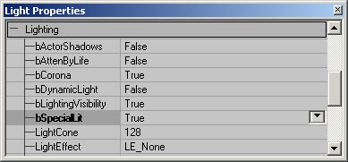

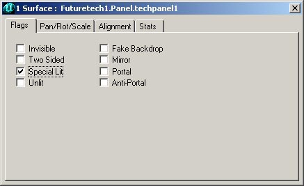Surfaces that have Special Lit only get light from lights that have bSpecialLit = True, and not from lights with bSpecialLit = False. Surfaces without Special Lit only get light from lights with bSpecialLit = False and not from lights with bSpecialLit = True.For example, this is a normal box room with a green and a red light in it, there are no walls or lights with Special Lit here:

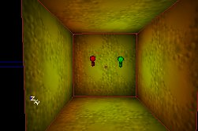

If you now set one of the walls to Special Lit, that wall will become black because there are no lights with bSpecialLit in this room:

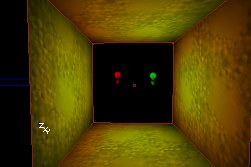

If you now set bSpecialLit to True for the red light (and still leave it to False for the green light), all the normal walls of the room become green, and the Special Lit wall becomes red:

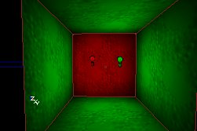

Ambient Lighting enlights the normal walls and the Special Lit walls, so if there is Ambient Lighting, Special Lit walls will not become black if there are no lights with bSpecialLit = True, but will get the color of the Ambient Lighting. On the screenshot, the Ambient Lighting is bluish:

NOTE: you can only see the effect after you rebuild lighting, and if you edit the light, it will light all surfaces again until the next rebuild.

## LightCone

With the LightCone setting, you can change the size of the cone made by the LightEffect LE\_SpotLight. The larger this value, the larger the beam. Of course, also the distance from the light to the surface determines the final size. Please note that LightCone is not the same as LightRadius. LightRadius would determine the length of the spotlight beam, while LightCone determines the angle of the cone.

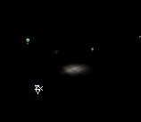

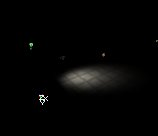

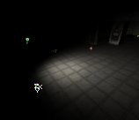

## LightEffect

The LightEffects are special visual effects, like a disco light, a cylindrical shape or sunlight. The LightEffects are in Lighting --> LightEffect.**NOTE: Currently, these do not function properly. Read the below caveats.**

* LightEffects do work on StaticMeshes, but only on a per vertex basis, which will result in inferior and contrasting results to that of the LightEffects on BSP geometry.
* The animated LightEffects currently do not animate. They may appear to animate after you select the LightEffect, but as soon as you rebuild or run the game, the effect will cease to animate.
* The following LightEffects are obsolete and will not be described:
  + CloudCast
  + TorchWaver
  + FireWaver
  + WateryShimery
* You can do **much** better lighting effects with **Projectors** (see here: [ProjectorsTableOfContents](ProjectorsTableOfContents.md)).

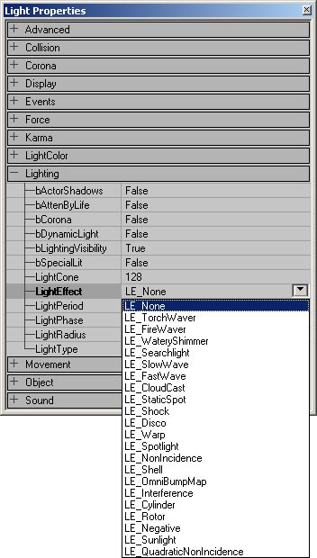

Here's a description of all of the non-obsolete LightEffects:**LE\_None**: this is the default LightEffect, and makes the light to be just steady. Do not confuse this with the LightType LT\_None: while LT\_None means the light is off, LE\_None makes the light to be on.

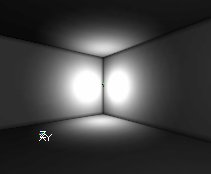

**LE\_SearchLight**: this makes a rotating beam of light. You can adjust the speed of the rotation with the LightPeriod slider.

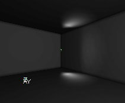

**LE\_SlowWave**: this creates an animated wave effect.

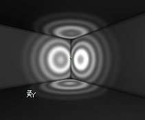

**LE\_FastWave**: this is another animated wave effect.

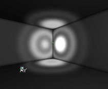

**LE\_StaticSpot** and **LE\_SpotLight**: these change the light into a spot, you can change the cone of it with LightCone, and the direction of it with it's rotation settings, more about this in [LightCone](LightingReference.md#lightcone) and [Spotlight Direction](TypesOfLights.md#spotlight).

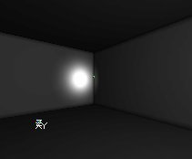

**LE\_Shock**: this is somewhat similar to LE\_FastWave, but with much wider waves.

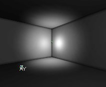

**LE\_Disco**: this is an animated discolight effect

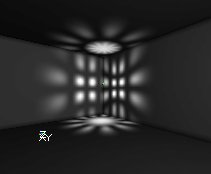

**LE\_Warp**: this looks the same as LE\_None**LE\_NonIncidence** and **LE\_QuadraticNonIncidence**: these are like LE\_None, but there is almost no fading away at the edges of the sphere, so the light is brighter towards the center and fades off more quickly as it reaches the LightRadius. The QuadraticNonIncidence is the more severe of the two.

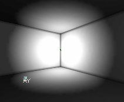

**LE\_Shell**: This makes only the shell of the light sphere to be bright. You can only see the effect if the walls are inside of that spherical shell. The LightRadius determines the radius of the sphere.

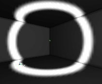

**LE\_OmniBumpMap**: the same as LE\_None**LE\_Interference**: another animated wave effect.

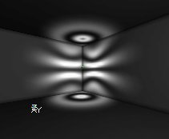

**LE\_Cylinder**: this makes the light rays to form a cylinder instead of a sphere. It's a standing cylinder, you can't rotate it, and you cannot change height and radius independently: both are determined by LightRadius. LE\_Cylinder creates the impression of largest radius of all, even larger than LE\_NonIncidence. Compare this first screenshot with the screenshot of LE\_NonIncidence. The second screenshot shows the cylindrical shape of the lighting.

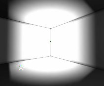

**LE\_Rotor**: this is an rotating bunch of lightbeams.

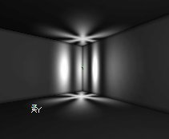

**LE\_Sunlight**: this simulates a light that comes from infinitely far, more about this in the section [Sunlight](TypesOfLights.md#sunlight).

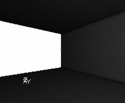

LightEffects can be used in combination with a LightType, for example LE\_Disco combined with LT\_TexturePaletteLoop makes a disco light that changes color, or LE\_SpotLight with LT\_Pulse makes a pulsing spotlight.

## LightPeriod

Use this to change the speed of the LightTypes LT\_Pulse and LT\_SubtlePulse, LT\_TexturePaletteLoop and for the LightEffect LE\_SearchLight. The lower the number, the faster the animation will run. For LE\_SearchLight, the animation is at its fastest when LightPeriod is 1. When it's 0, it will not move at all. For Pulse and SubtlePulse, 0 is the fastest.LightPeriod does not work for the other LightEffects and LightTypes, not even for LT\_Strobe.

## LightPhase

Use this to set the phase of the animation-cycle the light will start with. LightPhase only works for the LightEffects and LightTypes that also work with LightPeriod. For examle: if you have 2 Pulsing (LT\_Pulse) lights, and want the first one to fade in while the second one fades out you'll have to use this slider.On the screenshots are 2 lights with LightType LT\_Pulse, the first one has a LightPhase of 0 and the second one a LightPhase of 128. An animation-cycle takes 255 steps, so 128 is exactly the middle of the animation. This means that while the first light is in the start of the animation (= fading out), the second one is already in the middle of the animation (= fading in).

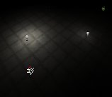

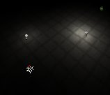

## LightRadius

With the LightRadius, you can change how far a light shines. Note though that the value in the properties does not directly correspond to the actual radius of the light, but instead is just a multiplier for the actual function that determines the actual light radius.A value of 0 means there is no light at all, and the bigger you set it the bigger the sphere of light will be. For example on the screenshots the first light has a LightRadius of 16 and the second one a LightRadius of 32.

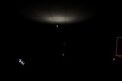

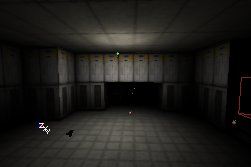

## LightType

The LightTypes change the brightness of the light over time, for example to make it flicker or strobe. To change the LightType, go to the Light Properties --> Lighting --> LightType. There you can select the LightType you want from the list.The LightTypes only work if the light is dynamic. You have to set bDynamicLight to True.

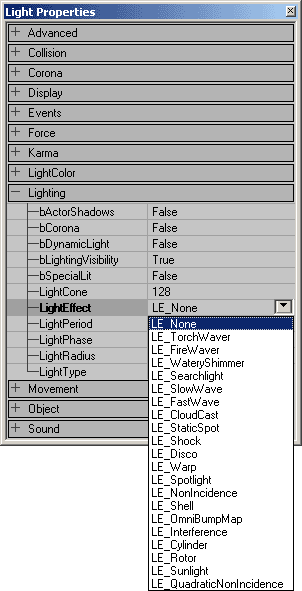

Because most LightTypes are animated, I used animated gifs.LT\_None: if you select this, the light will never give any light at all, it's just off.

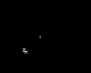

LT\_Steady: this is the default, and it makes the light to be always on.

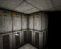

LT\_Pulse: this makes the light fade on, off, on, off, and so on. You can change the speed of this effect with "LightPeriod": if LightPeriod is 0 the effect goes at it's fastest, and if LightPeriod is 255 it goes at it's slowest.

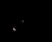

LT\_Blink: this makes the light to go randomly on and off, but it'll be more often on than off. Sometimes, it'll look just steady, but if you raise the LightPeriod slider the effect will work again. The LightPeriod slider doesn't have any other influence on the effect.

LT\_Flicker: this makes the light to go randomly on and off, but it'll be more often off than on.

LT\_Strobe: with this, the light goes on, off, on, off, and so on, but it does this as fast as possible. You can't control the speed of the effect, the LightPerios has no influence at all.

LT\_BackdropLight: looks exactly the same as LT\_None

LT\_SubtlePulse: this does the same as pulse, but more subtle

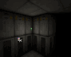

LT\_TexturePaletteLoop and LT\_TexturePaletteOnce: these can be used to make the light loop through different colors, more about this in the sections [TexturePaletteLoop](SpecialLightingFeatures.md#texturepaletteloop) and [TexturePaletteOnce](SpecialLightingFeatures.md#texturepaletteonce).  
LT\_FadeOut: looks exactly the same as LT\_None

## Unlit

Another setting that affects lighting of BSP yet is not in the Light Properties is hidden in the Surface Properties. Here you can set Unlit for a BSP surface. If a surface has Unlit enabled, it'll always be fully bright and ignore all lights and Ambient Lighting. Even if there is no lighting at all, the surface will still be fully bright. For example on the screenshot is a room with a dark red light, but one wall is set to Unlit:

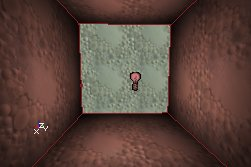

## Relevant Documents

For more about LightActors and general lighting in Unreal Ed, also see the following documents:[LightingBasics](../Content%20Creation/Lighting%20and%20Textures/LightingBasics.md) - A detailed table of contents to all of the Lighting documents[UsingLights](UsingLights.md) - A general guide to not only using lights but also how to use features associated with lights.[TypesOfLights](TypesOfLights.md) - A guide to the various types of LightActors and light sources.[LightingOnSurfaces](LightingOnSurfaces.md) - A guide showing how LightActors affect various types of geometry.[SpecialLightingFeatures](SpecialLightingFeatures.md) - A tutorial showing how to set up special lighting features.
