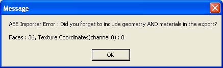
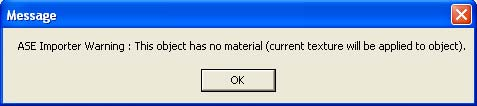
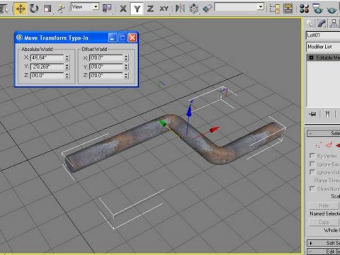
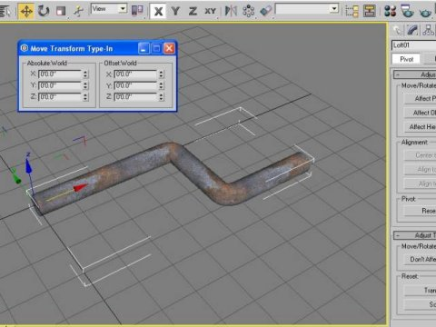
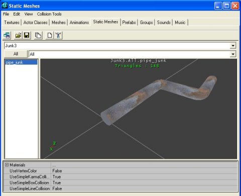
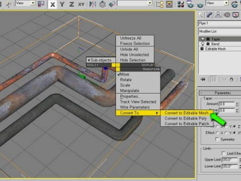
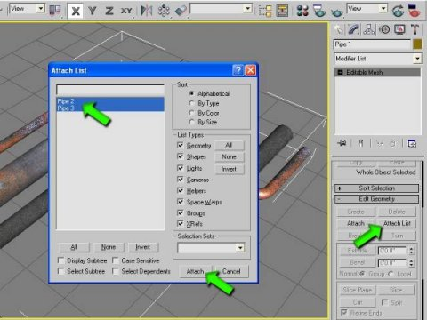
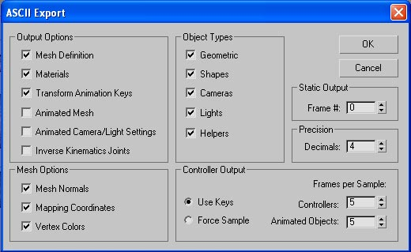

# MAXtoUnreal: Preparing Geometry in MAX

*Document Summary: An excellent guide for 3D Studio Max artists beginning to use the Unreal engine. Perfect for novices to the engine.**Document Changelog: Last updated by Tom Lin (DemiurgeStudios?), for document summary. Original author was Daniel Patton ([UdnStaff](https://udn.epicgames.com/Main/UdnStaff)).*

* [MAXtoUnreal: Preparing Geometry in MAX](MAXtoUnreal.md#maxtounreal-preparing-geometry-in-max)
  + [Overview](MAXtoUnreal.md#overview)
  + [Do's and Don'ts](MAXtoUnreal.md#dos-and-donts)
  + [Textures/Mapping](MAXtoUnreal.md#texturesmapping)
    - [Regarding Textures](MAXtoUnreal.md#regarding-textures)
  + [Pivot/Grid Location](MAXtoUnreal.md#pivotgrid-location)
  + [Collapsing/Attaching Geometry](MAXtoUnreal.md#collapsingattaching-geometry)
  + [Exporting to ASE](MAXtoUnreal.md#exporting-to-ase)

## Overview

This document covers preparing your geometry in 3D Studio MAX R4.26 or R5, for ImportingIntoUnrealEd?, which is the next and final step after this one.

## Do's and Don'ts

| Do | Don't |
| --- | --- |
| **Do** convert 2D lines to *Editable Mesh*, especially when using a *Thickness* variable, and make sure you have *Display Render Mesh* checked.    [editablemesh_small.jpg](rsrc/Two/MAXtoUnreal/editablemesh.jpg) | **Don't** export 2D lines/splines from MAX; this will likely crash UnrealEd during import of the ASE file. Either delete or extrude all 2D lines/splines. |
| **Do** clear *Smoothing Groups* when geometry does not need them, meaning geometry that is primarily made up of flat surfaces. This helps to reduce odd lighting behavior in Unreal.    [smoothinggroups_small.jpg](rsrc/Two/MAXtoUnreal/smoothinggroups.jpg) |  |
| **Do** control geometry texture mapping, such as its positioning and U, V and W tiling, using a *UVW Map* modifier.    [uvwmap_small.jpg](rsrc/Two/MAXtoUnreal/uvwmap.jpg) | **Don't** use Max's *Material Editor* to control a material's offset, texture repeating, etc. Uncheck *2-Sided*; it crashes UnrealEd. Only the *Diffuse Map* channel is supported; other channels like *Bump*, *Opacity*, etc. are ignored.    [materialeditor_small.jpg](rsrc/Two/MAXtoUnreal/materialeditor.jpg) |
| **Do** *Attach* multiple objects to a single object prior to exporting to ASE. This is necessary if you intend to export several models at one time. See [Collapsing/Attaching Geometry](MAXtoUnreal.md#collapsing_attaching_geometry). | **Don't** export a *Group* of geometry from MAX as an ASE file, this will crash UnrealEd during import; use *Attach* instead. |

## Textures/Mapping

Be sure that all of the geometry has some form of texture and UVW mapping coordinates, otherwise you'll receive an error in UnrealEd during the import process:

Simply apply a UVW map modifier to each item that you intend to import into Unreal.Also, if you forget to add a texture map in MAX you'll receive this error while importing into UnrealEd:

### Regarding Textures

While using the compressed DXT format directly in both MAX and Unreal is possible, it is recommended to use 32-bit Targa (TGA) files to preserve texture quality should changes need to be made. Both MAX and Unreal can handle the format natively, just be sure you're using 32-bit TGAs, not 24- or 16-bit ones.You can convert these textures to DXT at a later time, either in UnrealEd, or process them using a Photoshop plugin and re-importing them for best quality.If you prefer using JPGs, TIFs, etc. while working in MAX, you will need to convert those formats to one of the compatible formats prior to importing into UnrealEd. As long as the texture material name is the same in MAX as it is in Unreal, and a compatible texture is imported into Unreal, the format in MAX does not really matter.For more details on textures, check out the [UnrealTexturing](UnrealTexturing.md) doc.

## Pivot/Grid Location

The pivot that is used in MAX for the *Move*, *Rotation* and *Scale* functions is **not** referenced once inside of Unreal. Instead, Unreal uses MAX's 0,0,0 grid coordinate as the Unreal insertion/snap point, much like an AutoCAD block insertion point would be if a specific one were not specified. As a result, if you need need to align geometry to one another in UnrealEd (or you simply want to control the insertion point), it's a good idea to relocate the MAX geometry to the grid setting of 0,0,0 prior to exporting.In this example, the pivot point is located in the center of the pipe, not on the grid's 0,0,0 coordinate (note the *Move Transform Type-In* dialog box and its related *Absolute World* XYZ coordinates for reference).

We adjust the pivot point and re-center it on the pipe's left-hand side. It is not critical to move the pivot, but it makes the next step a little easier.

Then set the *Absolute World* XYZ to 0,0,0 in the *Move Transform Type-In* dialog box, to set the left-hand side of the pipe on MAX's grid at 0,0,0.

Once imported into UnrealEd you can see that the geometry's insertion point is in the same location as the MAX grid point 0,0,0. Note: this does not translate to UnrealEd's 0,0,0 world grid, only the insertion point used when placing the geometry in UnrealEd.

Remember, you do **not** have to relocate the MAX pivot as shown in the example (it just makes it easier), since UnrealEd ignores it anyway, but it **is** important to realign your geometry's insertion point to MAXs 0,0,0 grid location.

## Collapsing/Attaching Geometry

The final consideration is that UnrealEd does not handle importing multiple objects (like assemblies) in a single file import, unless the assembly is exported from MAX as a single object. This requires collapsing the modifier stack in MAX and attaching the individual components of the assembly to a single object. It's usually a good idea to *Save* the file prior to doing this last step. Once the geometry is exported, either *Undo* to gain the stack back, or simply close the project file and ignore any opportunities to save again. By working this way you keep the modifier stack complete, in case you need to go back, make a change and export out again.Start by right clicking on one of the items and choose *Convert To*, *Convert to Editable Mesh*.

Once you have an *Editable Mesh*, you will want to choose the *Attach List* button, select everything from the list and finish by hitting the *Attach* button.

If you are referencing several different materials for each of the items you are attaching, then you will be confronted with the following dialog box. Choose *Match Material IDs to Material* for the best results.

You now have a single item ready for export! Remember to align it to the grid at 0,0,0 as UnrealEd will reference that as the insertion point!

## Exporting to ASE

While the single item is selected in MAX, choose *File*, *Export Selected* from the pull down menu, change the file type from 3DS to ASE, give it a name and set your dialog box like the one below (these should be the default settings if you have never used the *ASCII Export* dialog box). It's a good idea to use the *Export Selected* option from the *File* pull down menu in case you have other non-usable 2D lines, etc., in your MAX scene. You can also export pieces of your geometry this way while managing a single, and possibly large MAX file.

The ASE file that is exported contains:

* Surface coordinates for the geometry polygons,
* Texture assignment for the surfaces using the named textures assigned in MAX, and
* Mapping coordinates for the textures using the related UVW coordinates assigned in MAX.

It's a good idea to export large assemblies in chunks if you intend to use the geometry's default collision detection in the Unreal engine. The recommended procedure is to use a separate collision model, however: this is a low-polygon, simple convex mesh shell around your geometry to speed up collision. Read the [CollisionTutorial](../Content Creation/Physics/CollisionTutorial.md) for more details.Exporting a large, complex assembly without using collision models risks confusing the engine with complex collision characteristics, and you may only realize it when actually testing the geometry in real time.Your geometry is ready for ImportingIntoUnrealEd? now.
