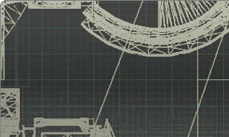

# Legacy Unreal Engine Documentation

---

This site provides the official documentation for the award-winning UE3 Unreal Development Kit (UDK), and its predecessor the Unreal Engine 2.UE3 was the leading engine of the previous generation, but has been improved upon by the [Unreal Engine 4 technology](https://www.unrealengine.com/what-is-unreal-engine-4). Teams who are already developing with UE3 are welcome to continue development and utilize the information provided here; however for new projects, we recommend UE4.International developers may experience better speeds by visiting our East Asian mirror sites for [China](http://udn.epicgames.com/Main/WebHomeCH.html), [Japan](http://udn.epicgamesjapan.com), and [Korea](http://udn.epicgameskorea.com).

Learn all the skills you need to master the previous generation of Unreal Engine technology to create engaging experiences, exciting gameplay and beautiful environments.

* [Home](WebHome.md)
* [Getting Started](../Three/GettingStartedOverview.md)
* [Technical](../Three/TechnicalHome.md)
* [Content Creation](../Three/ContentHome.md)
* [Level Creation](../Three/LevelEditingHome.md)

Learn the skills needed to use this powerful and flexible game engine and its toolset to create games that run on previous generation hardware configurations and platforms.

* [Home](WebHome.md)

Information to get started licensing Unreal Engine technology and other legal and business information.

* [Home](../Three/BusinessAndLegalHome.md)
* [Technology Roadmap](../Three/UnrealTechnologyRoadmap.md)

*By contributing information to Epic's Unreal Engine support outlets, including but not limited to **Unreal Developer Network** websites and mailing lists, you agree that any information you, your employees, assignees, sub-licensees, or representatives post shall become the sole property of Epic.*
