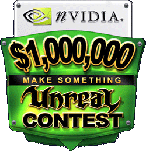

# Make Something Unreal

* [Make Something Unreal](MakeSomethingUnreal.md#make-something-unreal)
  + [Contest](MakeSomethingUnreal.md#contest)
  + [News](MakeSomethingUnreal.md#news)
  + [Overview](MakeSomethingUnreal.md#overview)
  + [Categories](MakeSomethingUnreal.md#categories)
  + [Legal](MakeSomethingUnreal.md#legal)
    - [Eligibility](MakeSomethingUnreal.md#eligibility)
    - [Contest Rules](MakeSomethingUnreal.md#contest-rules)
    - [Registration](MakeSomethingUnreal.md#registration)
    - [Judging](MakeSomethingUnreal.md#judging)
    - [General Rules](MakeSomethingUnreal.md#general-rules)
    - [Winner Notification](MakeSomethingUnreal.md#winner-notification)
  + [FAQ](MakeSomethingUnreal.md#faq)
  + [Phase I Winners](MakeSomethingUnreal.md#phase-i-winners)
  + [Phase II Winners](MakeSomethingUnreal.md#phase-ii-winners)
  + [Phase III Winners](MakeSomethingUnreal.md#phase-iii-winners)
  + [Phase IV Winners](MakeSomethingUnreal.md#phase-iv-winners)
  + [Grand Finals Winners](MakeSomethingUnreal.md#grand-finals-winners)

## Contest

$1,000,000 NVIDIA Make Something Unreal ContestWelcome to the $1,000,000 Make Something Unreal Contest, the ultimate modification competition brought to you by Nvidia in association with Epic Games and Atari Inc.We invite you to download and play the Phase 1, Phase 2 and Phase 3 winners. Next up is Grand Finals and it closes on November 15th, 2004!Educational Awards can run on UT2003 or UT2004, however Phase 3, Phase 4 and Grand Finals require your mod run on UT2004. For further details be sure to check out the Categories Listing, Legal, and Overview pages. When you are ready to submit for Grand Finals simply submit your mod!

## News

## Overview

The Make Something Unreal is created for you to have fun working with the engine while making something Unreal to share with the community! It is broken into four different phases each are not dependant upon each other. The idea behind having four phases is to encourage people to enter early and often, and to keep improving their mods over time. You can enter the same mod in all four phases of the contest but, in order to be judged, there must be noticeable improvements to the mod upon the second or third submission. We're anxious to tell the world about your mod, but we'll want your help to do so. If you have an official web site for your mod, then we'll happily post your URL, along with the download URL you provide for the mod itself, on our contest web site once it is fully operational. One thing we're anxious to do with this mod contest is to help mod makers get professional status. Nearly half of the people who work on Epic Games' development team were former mod makers! We want to help you can make it to the big-time too.You can enter any phase you wish, and do not need to be a winner of previous phases. If you win any phase you are free to enter the next phase once it opens (Except for Grand Finals which required you to be a finalist of Phase 4).Phase 1 which is already closed and judged focuses on early development mods for UT2003. Phase 2 which is already closed and judged is also for UT2003 and gives users a bit more time to work their mod. Phase 3 is currently already closed and judged requires your mod works on UT2004 and we suggest it installs using Umod. Phase 4 must be entered by already closed and judged and work on UT2004. If you are working on Unreal as part of a school project we invite you to enter Educational Awards by already closed.All phase prizes and details can be found on our Categories page. We invite you to download the already judged entries which you can find by using the navigation above.Never learned how to make something Unreal®, but want to get in on more than $1,000,000 in cash and prizes available in this contest? Want to be a big-time professional game developer? Never fear. There are over 120 hours of FREE downloadable Video Training Modules at www.masteringunreal.com. Check them out and feel free to let us know what else you'd like to see there.The real-time non-interactive movie (also know as Machinima - for more information see www.machinima.org ) category is for aspiring Hollywood types that want to make an amazing cinematic experience. You can use any subject as long as it is tasteful. You might also want to enter your creation in the Machinima Film Festival!Please read the End-User License Agreement that comes with either UT2003 or UT2004. It says exactly what you can and can't do with your mod. To be eligible for this contest, your mod must be in compliance. Particularly, you can't enter mods (or create mods for that matter) that are used to promote a product or service in any way.Teams that create mods should choose one person to represent the mod and file the entry for the contest. Cash and hardware prizes will be awarded to that person and it is his or her responsibility to distribute winnings to the remaining team members - so choose someone you trust!What does winning an Unreal Engine mean? It means that you have some pretty amazing options. With an engine license under your belt you could create a commercial version of your mod and then sell it yourself or find a publisher to do that for you. You could create a whole new game using the Unreal Engine development skills honed while creating your contest entry. When you talk to publishers, you can have the confidence of having a pre-paid Unreal Engine license worth $350,000! But the best news is that this Unreal Engine license applies to both the current generation of the technology and the next, third generation of Unreal Engine technology, so you'll be set for the future. Note: the engine license is for the Microsoft Windows PC platform only.The educational category is open to any student or faculty member of any accredited school. This can be a high school, university, community college, etc. You don't have to build the mod on behalf of any official school project or function. You simply have to be an enrolled student or faculty member and submit a mod for the contest and the name of your institution. In order to be eligible in each category, the school will be required to verify your status and indicate that they would accept the systems, use them for educational (not administrative) purposes, and allow us to use their name publicly when listing contest winners. We know there are LOTS of schools out there that could use high-end computers like these, so we want to make sure they're going to good use.In addition to the 50 computers being given away to educational institutions, we're also giving away 50 computers to contest winners! For some prizes, specifically those where we suspect it will take a team of people to win, we're giving away multiple computer systems. For example, if you win first or second place in the best FPS mod category in Phase 2, you would get two computers along with your cash prize! We expect the best mod teams in the contest to walk away with several computers by winning computer prizes within multiple categories in multiple phases. It will be up to the team leader (the person elected by the team to submit the mod entry) to let us know to whom each computer should be awarded. Sorry, but we can't settle disputes over prize distribution, so please choose someone you trust as team leader.

## Categories

## Legal

**NO PURCHASE NECESSARY**   
\*VOID WHERE PROHIBITED BY LAW. \*

### Eligibility

Entrants of all ages are eligible to participate. Contestants who are minors, however, must have a parent/legal guardian submit written authorization. Employees and agents of Epic Games, Scion Studios, Digital Extremes, Atari, Nvidia, AMD, Alias, Abit, Cooler Master, their respective agents, officers, parent companies, affiliates and subsidiaries (collectively "Contest Sponsors"), and members of their immediate families (parents, children, siblings, spouses) and/or persons living in the same households as such persons, whether related or not, are ineligible to enter the Contest and cannot win prizes. This contest is governed by the laws of the United States of America and of the State of North Carolina. This contest is void where prohibited. Contestants are responsible for compliance with applicable laws in jurisdictions where they reside.

### Contest Rules

The contest will be conducted in four consecutive phases. The closing date for submissions for Phase 1 is July 1st, 2003. The closing date for submissions for Phase 2 is October 20th, 2003. The closing dates for submissions for Phase 3 shall be June 6th, 2004 and the closing date for submissions for Phase 4 shall be September 10th, 2004. Winners will be announced on the official contest web site (<http://www.makesomethingunreal.com>).The judges shall choose entries from either the Best FPS game mod or the Best non-FPS game mod categories for Grand Finals consideration. Those nominees will have until November 15th, 2004 to submit their final version for Grand Prize judging. The Grand Prize will be announced at a future date to be determined. Entrants are welcome to submit their mods for judging in any category and they can submit their mods for all phases of the contest with the understanding that if a mod was entered in a previous phase that mod will only be considered for judging in subsequent phases, not counting grand prize judging, provided that noticeable improvements were made to the mod.Each submission must be the property of and an original work of the entrant. Submissions must be available for free public download and playable with the retail version of Unreal Tournament 2003 (patched to the 2225 update) for Phase 1 and Phase 2. For Phase 3 and Phase 4, and for Grand Finals consideration, mods must be playable in Unreal Tournament 2004.All submissions must be in compliance with the applicable Unreal Tournament End User License Agreement that comes with the game.

### Registration

An entry form will be provided at www.makesomethingunreal.com - you will be required to fill in a Submission Release that verifies you represent the creators of the mod and that you agree to comply with all the rules and all decisions of the judges. You will be required to provide your name, address, date of birth, email address, telephone number and URL where judges and the public can download your mod. All entries must be the original creations of the entrants, not contain any intellectual property not owned by the entrant and must never have been published or professionally developed unless written authorization from the intellectual property owner is provided at the time of entry submission.Entrants agree to indemnify and hold harmless sponsors from any copyright, trademark or other intellectual property infringement claim or liability with regard to their submissions.

### Judging

Judging will be by a panel comprised of representatives from Nvidia, Digital Extremes, Atari, AMD, Alias, and Epic Games Inc. The decisions of the Panel will be final and binding on all entrants.All prizes listed herein, unless otherwise specifically noted, are cash prizes in U.S. dollars. All costs, taxes, fees and expenses associated with entry into this Contest and any prizes received shall be the sole responsibility of the entrants and winners. To the extent required by law, sponsors reserve the right to withhold a portion of winnings for applicable taxes.Judges reserve the right to disqualify any entry which is, in any individual judge's sole discretion, inappropriate. Epic reserves the right, in its sole discretion, to disqualify winners and to chose alternate winners if information contained in the registration from cannot be verified to Epic's sole satisfaction, if the winner refuses to abide by the contest terms or if the selection of a particular entrant would, in Epic's sole discretion, harm Epic or any Sponsor's reputation.Grand Prize winners will be required to review, agree to and execute Epic's standard Unreal® Engine License prior to award of prize. At the judges' discretion contest submissions may be judged in more categories than the entrant designated. However, all entrants are asked to identify the categories for which each mod submission is being offered.

### General Rules

Entrants agree to accept and abide by the rules of this Contest and agree that any dispute with regard to the conduct of the contest, rule interpretation, or award of prizes, shall be submitted to Epic Games, whose decisions shall be binding and final. Entries not satisfying this Official Rules will be automatically disqualified.By participating, entrant agrees to release and hold harmless sponsors and their respective parent companies, affiliates, subsidiaries, service agencies, independent contractors, and the officers, directors, employees, investors, agents, and representatives of any of the above organizations from any injury, loss, or damage to person, including death or property, due in-whole or in-part, directly or indirectly, to the acceptance from or use/misuse of a prize or participation in any promotion-related activity.Sponsors are not responsible for any typographical or other error in the printing of this offer, in the administration of the contest, or in the announcement of prizes. In the event that sponsors are prevented from continuing with the promotion, or the integrity and/or feasibility of the promotion is severely undermined by any event beyond sponsors' control, including but not limited to fire; flood; epidemic; earthquake; explosion; labor dispute; strike; act of God; public enemy act; satellite or equipment failure; riot or civil disturbance; war (declared or undeclared); terrorist threat or activity; any federal, state, or local governmental law, order, or regulation; order of any court or jurisdiction; or other cause not reasonably within sponsors' control (each a "Force Majeure" event), sponsors will have the right, in their sole discretion, to abbreviate, modify, suspend, cancel, or terminate the promotion without further obligation.If sponsors, in their sole discretion, elect to abbreviate the promotion as a result of a Force Majeure event, sponsors reserve the right, but not the obligation, to award the prize from among all eligible entries received up to the date of such Force Majeure event. The administrator of the contest is Epic Games.An entrant's submission of entry constitutes permission for Epic and, in Epic's sole discretion, such other Contest Sponsors to use entrant's name, photograph, likeness and other material provided in the entry for any business purpose, including for promotional purposes in any media. Contest sponsors (including, but not limited to, Epic Games, Nvidia, Atari, Digital Extremes, AMD, Alias and others who may be added from time to time) have the following rights with respect to contest entries:

1. The right to place links to the Mod's download URL on their web sites and on the contest web site.
2. The right to host the Mod on their web site(s) and on the contest web site as well as provide copies of the entered Mods for use on magazine cover discs, Unreal fan sites, download sites, and other web sites of their choosing.

The overall Grand Prize winner will be required to review, agree to and execute Epic's standard Unreal® Engine License prior to receiving the right to use the license.Epic will not knowingly provide any personally identifying information, that is not already publicly available, of minors to any third party without the written consent of entrant's parent/legal guardian.This Contest shall be governed as to all matters, including validity, construction and performance of the Contest General Rules, by and under the Laws of the United States of America and the State of North Carolina and the sole venue for resolving all questions related the rights of the Entrants and winners in this Contest shall be the courts located in Wake County, North Carolina, United States of America.Entries must be easy to install. In order to be considered for the contest, the entry must be installable using one of the following methods:

1. Umod. This is the preferred method. The Phase 1 Tool winner Umod Wizard can simplify this process substantially.
2. A zip file that contains directory information. If extracted to the UT2004 folder, all entry assets must install into their proper locations without additional copying and pasting by the user.
3. A 3rd party installation program such as InstallShield?.

Epic reserves the following rights.

1. In the event any entry is deemed ineligible, Epic may award its prizes to alternate entries as it deems suitable.
2. In the event the grand prize winner is unable to fulfill its requirement to sign and Unreal Engine license, Epic reserves the right to award the Unreal Engine license to the alternative entrant of its choosing however this will not affect cash or hardware awards.
3. Hardware prizes will be delivered by Nvidia Corporation through it's offices in the USA and European Union. Winners may be required to pay customs, duty charges and/or taxes.
4. Within 60 calendar days of prize announcements, winners must provide Epic Games with required paperwork or they will forfeit the prizes. Prize announcement will be made on the Make Something Unreal website www.MakeSomethingUnreal.com

### Winner Notification

Winners will be notified through email and winning mods will be highlighted on the official contest web site.

## [FAQ](https://udn.epicgames.com/Two/FAQ)

## Phase I Winners

## Phase II Winners

## Phase III Winners

## Phase IV Winners

## Grand Finals Winners
