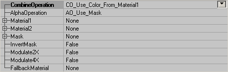
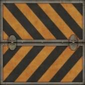
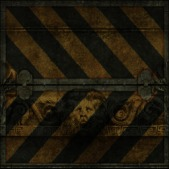
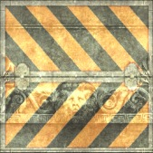
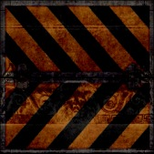
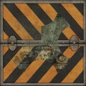
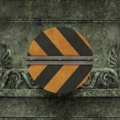
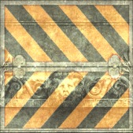
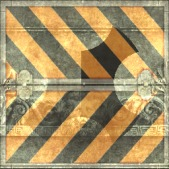

# Combiners

*Document Summary: A guide and reference to setting up Combiner Materials.**Document Changelog: Last updated by Jason Lentz (DemiurgeStudios?), for creation purposes. Original author was Jason Lentz (DemiurgeStudios?).*

* [Combiners](MaterialsCombiners.md#Combiners)
  + [Combiner Properties](MaterialsCombiners.md#Combiner Properties)
    - [CombineOperation](MaterialsCombiners.md#CombineOperation)
    - [AlphaOperation](MaterialsCombiners.md#AlphaOperation)
    - [Material1 & Material2](MaterialsCombiners.md#Material1  Material2)
    - [Mask](MaterialsCombiners.md#Mask)
    - [InvertMask](MaterialsCombiners.md#InvertMask)
    - [Modulate2X & Modulate4X](MaterialsCombiners.md#Modulate2X  Modulate4X)
    - [FallbackMaterial](MaterialsCombiners.md#FallbackMaterial)
  + [Example Map and Other Material Classes](MaterialsCombiners.md#Example Map and Other Material Classes)

## Combiner Properties

This Material combines two other Materials together. Below are descriptions of what each of the fields do and how to use the Combiner Material.

### CombineOperation

This determines field determines how the two materials will be blended together. The following demonstrates how two materials will look under the various blending conditions. Material1 and Material2 look like this:

CO\_Use\_Color\_From\_Material1 and CO\_Use\_Color\_From\_Material2 both only show one of the materials and completely hide the other one.CO\_Multiply multiplies the colors of both textures with each other:

CO\_Add adds the colors of both textures to each other:

CO\_Substract substracts the colors:

CO\_AlphaBlend\_With\_Mask: this operation uses the alphachannel of a third texture as a mask. You can set this texture in Mask. Material2 will be in front of Material1, or if you set InvertMask to True Material1 will be in front of Material2. The white parts of the mask make the upper material opaque so you can't see the other material behind it, but the more grey the alphachannel becomes, the more transparent the upper material becomes.

CO\_Add\_With\_Mask\_Modulation: this doesn't use the Mask, but instead uses the alphachannel of Material2, or if it hasn't got one modulates it on Material1.On the first screenshot, the platecaution texture is Material1 (this texture has an alphachannel) and the lion is Material2. On the second screenshot, the lion is Material1 and the platecaution Material2. Here the alphachannel becomes visible.

### AlphaOperation

This determines how the alpha information for the resultant Combiner is created.AO\_Use\_Mask: This uses the alpha channel of the texture assigned in the [Mask](MaterialsCombiners.md#MaskField) field.AO\_Multiply: This creates the alpha information from Multiplying the alpha channels of Material1 and Material2.AO\_Add: This creates the alpha information from Adding the alpha channels of Material1 and Material2.AO\_Use\_Alpha\_From\_Material1: This uses the alpha channel of the texture assigned in the Material1 field.AO\_Use\_Alpha\_From\_Material2: This uses the alpha channel of the texture assigned in the Material2 field.Note that when using any other setting other than AO\_Use\_Mask, that the [Mask](MaterialsCombiners.md#MaskField) field must be the same as either Material1 or Material2, or have no texture or Material assigned to it.

### Material1 & Material2

These are the two Materials you are combining. You can combine two textures, a texture with a Material, or two Materials. The order you assign the textures is only somewhat important as it will affect how they are combined, but you can easily switch them with the [InvertMask](MaterialsCombiners.md#InvertMaskToggle) toggle.

### Mask

In this field you can assign another Material or texture with an alpha channel. This field is only useful though if you you set the [AlphaOperation](MaterialsCombiners.md#AlphaOperationField) field to AO\_Use\_Mask, or use any of the [CombineOperation](MaterialsCombiners.md#CombineOperationField) settings that use the mask.

### InvertMask

This toggles what Material is "on top." For some of the CombineOperations, the order of the materials will affect the outcome of the resultant Combiner Material. If True, Material1 is on top, but if False Material2 is on top.

### Modulate2X & Modulate4X

These settings only work when the [CombineOperation](MaterialsCombiners.md#CombineOperationField) is set to CO\_Multiply and it applifies the multiplication of Material1 and Material2. Essentially it is used to make the resulting Combiner brighter. Also note that Modulate4X overrides Modulate2X

### FallbackMaterial

Here you can set a Texture that the Engine will default to if for whatever reason the end user machine cannot render the resultant Combiner you've created.

---

## Example Map and Other Material Classes

For an example map that shows many different complex Materials in action, take a look at this document:[ExampleMapsEPIC](ExampleMapsEPIC.md#Materials_Example_Map) *(The example map is at the bottom of the page)*To return back the main Materials page, click [here](../Content Creation/Lighting and Textures/MaterialTutorial.md) <--
