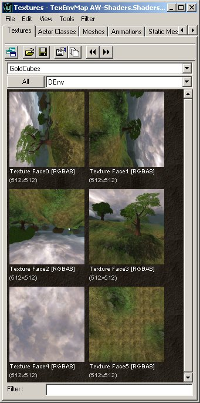
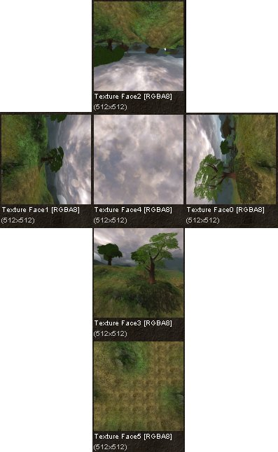
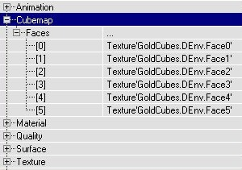
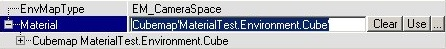
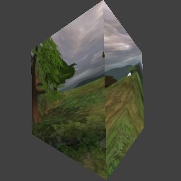

# Environment Maps

*Document Summary: A guide and reference to setting up Environment Map and Cube Map Materials.**Document Changelog: Last updated by Richard Nalezynski (VirtualHeroes?). Original author was Jason Lentz (DemiurgeStudios?).*

* [Environment Maps](MaterialsEnvironmentMaps.md#environment-maps)
  + [Introduction](MaterialsEnvironmentMaps.md#introduction)
  + [Cubemap](MaterialsEnvironmentMaps.md#cubemap)
  + [TexEnvMap](MaterialsEnvironmentMaps.md#texenvmap)
  + [Example Map and Other Material Classes](MaterialsEnvironmentMaps.md#example-map-and-other-material-classes)

## Introduction

To create an Environment Map you will need two different types of Materials: a Cubemap and a TexEnvMap. An Environment Map is a texture that will appear to reflect an environment based on the orientation and position of the Mesh that it is applied to. This document will walk you through the steps for creating an Environment Map.

## Cubemap

A Cubemap is needed for the TexEnvMap. Create the new Cubemap, then in Cubemap --> Faces you have to set the 6 textures used for the <nopEnvironmentMap. These textures are 6 directions in which you can look: north, east, south, west, up and down, or the 6 faces of a cube. To create them you can just create black textures with a large blurry white dot for a shiny effect, or you can take 6 screenshots in the 6 directions in your map. The easiest way to do this is to press Alt-Enter to go to windowed mode, enter "SETRES 256x256" in the console (or 512x512 if you want huge textures). In UnrealEd?, use the NumPad? keys 0 through 5 to change the camera rotation to match the 6 views needed for the cube map. So just go where you want the shots from, press 0, F9, 1, F9 etc. until you have all 6 shots. NumPad? 6 returns the view to normal.NOTE!
If you are using the [UnrealEngine2Runtime](UnrealEngine2Runtime.md), the Numpad keys 0 through 6 are set by default in User.ini. Otherwise, the keys will have to be manually entered into User.ini (search for NumPad0?, NumPad1?, NumPad2?, NumPad3?, NumPad5?, NumPad5?, NumPad6?). Replace each line with the following:

```

NumPad0=set playercontroller bZeroRoll False | set playercontroller rotation (pitch=0,yaw=0,roll=16384)
NumPad1=set playercontroller bZeroRoll False | set playercontroller rotation (pitch=0,yaw=32768,roll=-16384)
NumPad2=set playercontroller bZeroRoll False | set playercontroller rotation (pitch=0,yaw=16384,roll=32768)
NumPad3=set playercontroller bZeroRoll False | set playercontroller rotation (pitch=0,yaw=-16384,roll=0)
NumPad4=set playercontroller bZeroRoll False | set playercontroller rotation (pitch=16384,yaw=0,roll=16384)
NumPad5=set playercontroller bZeroRoll False | set playercontroller rotation (pitch=-16384,yaw=32768,roll=16384)
NumPad6=set playercontroller bZeroRoll False | set playercontroller rotation (pitch=0,yaw=0,roll=0)
```



If you took screenshots, make sure the textures are rotated correctly, and for a better overview give their names the same number as the numbers used in the Cubemap Properties. [0] to [3] are the 4 sides, [4] is the sky or ceiling and [5] is the ground or floor. This screenshot shows how to rotate and number the textures:





## TexEnvMap

A Cubemap isn't an EnvironmentMap yet, it's just a placeholder for 6 textures. The TexEnvMap uses the Cubemap for an EnvironmentMap. When you create a new TexEnvMap, select a Cubemap in the Texture Browser, and then click on Material and press the Use button. To preview the EnvironmentMap click the cube or sphere button of the preview window.



If the EnvMapType is EM\_CameraSpace, the ground will be in front of you, but if you set it to EM\_WorldSpace it'll be at the bottom:



You can use TexEnvMap materials on Static Meshes as well as on BSP Surfaces. A TexEnvMap looks very shiny because it only has the EnvironmentMap, with other materials, for example Shaders, you can blend the EnvironmentMap on a flat texture.

---

## Example Map and Other Material Classes


For an example map that shows many different complex Materials in action, take a look at this document:[ExampleMapsEPIC](ExampleMapsEPIC.md#materials_example_map) *(The example map is at the bottom of the page)*To return back the main Materials page, click [here](../Content Creation/Lighting and Textures/MaterialTutorial.md) <--
