# FinalBlends

*Document Summary: A guide and reference to setting up FinalBlend Materials.**Document Changelog: Last updated by Jason Lentz (DemiurgeStudios?), for creation purposes. Original author was Jason Lentz (DemiurgeStudios?).*

* [FinalBlends](MaterialsFinalBlend.md#finalblends)
  + [FinalBlend Properties](MaterialsFinalBlend.md#finalblend-properties)
    - [FrameBufferBlending](MaterialsFinalBlend.md#framebufferblending)
      * [FB\_Overwrite](MaterialsFinalBlend.md#fb_overwrite)
      * [FB\_Modulate](MaterialsFinalBlend.md#fb_modulate)
      * [FB\_AlphaBlend](MaterialsFinalBlend.md#fb_alphablend)
      * [FB\_AlphaModulate\_MightNotFogCorrectly](MaterialsFinalBlend.md#fb_alphamodulate_mightnotfogcorrectly)
      * [FB\_Translucent](MaterialsFinalBlend.md#fb_translucent)
      * [FB\_Darken](MaterialsFinalBlend.md#fb_darken)
      * [FB\_Brighten](MaterialsFinalBlend.md#fb_brighten)
      * [FB\_Invisible](MaterialsFinalBlend.md#fb_invisible)
    - [TwoSided](MaterialsFinalBlend.md#twosided)
    - [AlphaTest & AlphaRef](MaterialsFinalBlend.md#alphatest--_alpharef)
    - [FallbackMaterial](MaterialsFinalBlend.md#fallbackmaterial)
  + [Example Map and Other Material Classes](MaterialsFinalBlend.md#example-map-and-other-material-classes)

## FinalBlend Properties

This material adds a blending effect to another material or texture. Create a new material and choose FinalBlend from the list, then in the Texture Browser select the texture that you want to blend, and then in the FinalBlend Properties window click on the Material property and then press the Use button. The chosen texture will appear in the Material Tree as a sub item.

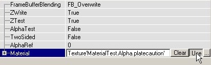

These properties are described in detail below:

### FrameBufferBlending

In FrameBufferBlending you can set how to blend the texture. Here's how the different effects look on two different textures. The first texture is a RGBA8 texture (left picture) with an alphachannel (center picture), and the second texture is a masked white texture with a hole in the center (both the alpha channel and the texture look like the right picture):

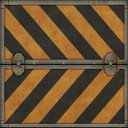

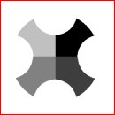

.

#### FB\_Overwrite

This displays the texture without any effects; even the masked texture becomes opaque.

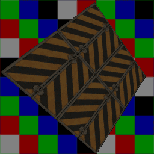

#### FB\_Modulate

If you modulate a texture, the values of the R, G and B channels smaller than 127 will darken the surface it is projected on, and the values larger than 127 will brighten it. The grey color with R=G=B=127 is 100% transparent.

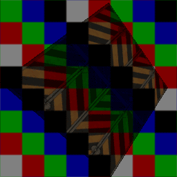

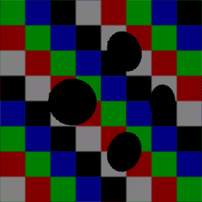

#### FB\_AlphaBlend

This blends the alpha channel of the texture for opacity, if it has one. The black parts of the alpha channel will become 100% transparent, the white parts 100% opaque and the grey parts semi-transparent. This setting also works for masked textures to make the masked parts transparent. You can get the same effect on any material or RGBA8 texture if you set in the Texture Properties --> Surface --> bAlphaTexture to True.

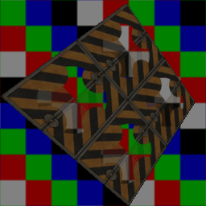

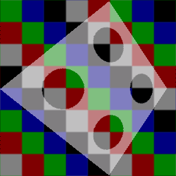

#### FB\_AlphaModulate\_MightNotFogCorrectly

Like FB\_AlphaBlend, this one blends the alpha channel for the texture opacity if it has one, but it also multiplies the texture with the alpha channel resulting in brighter reflections in the lighter portions of the texture. It is also a little smoother than FB\_AlphaBlend (note the black rings around the holes in the FB\_AlphaBlend diagram of Texture and that there aren't any rings in the below diagram of Texture2). Also, as the name suggests, this setting may have issues with Distance Fog.

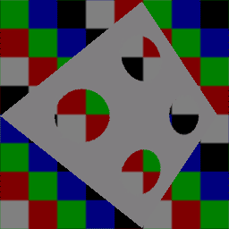

#### FB\_Translucent

This makes the black parts of the texture 100% transparent, the white parts 100% opaque, and the other colors semi-transparent

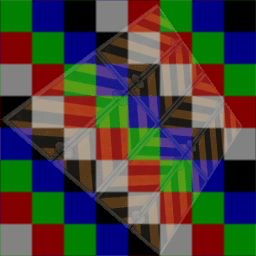

#### FB\_Darken

This darkens the texture on the background, so the colors of the texture look negative.

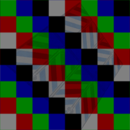

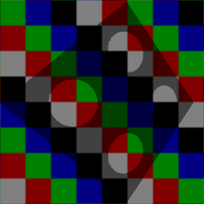

#### FB\_Brighten

This brightens the texture on the background.

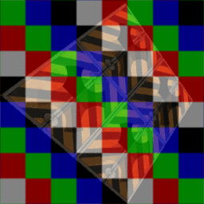

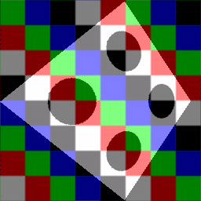

#### FB\_Invisible

This makes the texture completely invisible, useful for ZonePortals and stuff, though the original Invisible still works too.

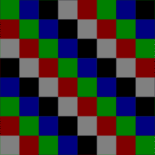

### TwoSided

With the setting TwoSided you can make the texture two sided, otherwise the surface will have one invisible side, for example the sides outside the map.

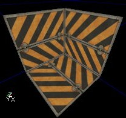

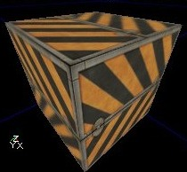

### AlphaTest & AlphaRef

If AlphaTest is True, you can make the alphachannel more transparent with AlphaRef: all values of the alphachannel lower than AlphaRef will become 0. For example if AlphaRef is 127, all the semi-transparent parts of the texture lower than 127 will become 100% transparent, but the semi-transparent parts higher than 127 will stay semi-transparent (if FrameBufferBlending is set to AlphaBlend at least). If you set AlphaRef to 255, the whole texture will become invisible.

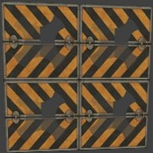

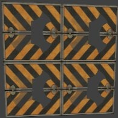

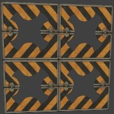

### FallbackMaterial

Here you can set a Texture that the Engine will default to if for whatever reason the end user machine cannot render the resultant Shader you've created.

---

## Example Map and Other Material Classes

For an example map that shows many different complex Materials in action, take a look at this document:[ExampleMapsEPIC](ExampleMapsEPIC.md#materials_example_map) *(The example map is at the bottom of the page)*To return back the main Materials page, click [here](../Content Creation/Lighting and Textures/MaterialTutorial.md) <--
