# Modifiers

*Document Summary: A guide and reference to setting up Modifier Materials.**Document Changelog: Last updated by Richard Nalezynski (VirtualHeroes?). Original author was Jason Lentz (DemiurgeStudios?).*

* [Modifiers](MaterialsModifiers.md#modifiers)
  + [Modifier Types](MaterialsModifiers.md#modifier-types)
    - [ColorModifier](MaterialsModifiers.md#colormodifier)
    - [ConstantColor](MaterialsModifiers.md#constantcolor)
    - [TexEnvMap](MaterialsModifiers.md#texenvmap)
    - [TexOscillator](MaterialsModifiers.md#texoscillator)
    - [TexPanner](MaterialsModifiers.md#texpanner)
    - [TexRotator](MaterialsModifiers.md#texrotator)
      * [TexRotator Example](MaterialsModifiers.md#texrotator-example)
    - [TexScaler](MaterialsModifiers.md#texscaler)
  + [Example Map and Other Material Classes](MaterialsModifiers.md#example-map-and-other-material-classes)

## Modifier Types

Modifiers are used to apply specific modifications to other materials or textures. There are a large number of Materials that fall under the Modifier class. This document describes each of these Modfier types (listed above). Click on the Modifier type links above to see how to use them, or just scroll down.

### ColorModifier

This material changes the color of another material. In Material, set the material to cast the effect on. Then choose a color in the Color property. You can type in the RGB value manually, or if you press the "..." button you can choose the color with the Windows Color Dialog Box. With the Pick button, you can pick the color in any of the editor views with a dropper.

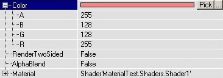

The white color leaves the original texture unchanged, and the darker the color the darker the texture becomes.

### ConstantColor

This is a quick and inexpensive way to create a Material that is one solid color. By itself it is not terribly useful, but it can be used with a [Combiner Material](MaterialsCombiners.md) to create such effects as tinting existing textures or specifying an Opacity to create translucent textures without wasting substantial texture memory.

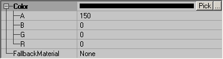

### TexEnvMap

The TexEnvMap is primarily used for creating Environment Maps, but it can be used for other things as well.

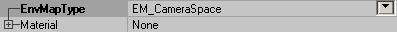

Its default **EnvMapType** value is set to *EM\_WorldSpace* which will cause the material to appear to reflect in relation to the world environment. This is the setting you want for creating Environment Maps. To see more about how to create an Environment Map, see the [MaterialsEnvironmentMaps](MaterialsEnvironmentMaps.md) doc.If set to *EM\_CameraSpace* it will only reflect relative to the camera position.This can be useful for creating such effects as Cel Shading (also known as Toon Shading). See the [Example of Cel Shading in UT2004](CelShadingExampleUT2004.md) document for more details.

### TexOscillator

This can make a texture to move from side to side, or shrink and grow all the time. Again, first set the material you want in the Material property.With UOscillationRate and VOscillationRate, you can set the number of oscillations per second, U is for the horizontal movement and V for the vertical movement. For example if you set UOscillationRate to 0.1, the texture will go from left to right and back to left in 10 seconds. You can also use negative numbers, this makes the movement start in the opposite direction. Combinations of a different U and V make the material to follow sinuous curves.UOscillationPhase and VOscillationPhase determinate where the animation starts. 0 represents the start of the animation, 0.5 is halfway, here the material is in the center again, and 1 is the end of it (and the start of a new cycle).UOscillationAmplitude and VOscillationAmplitude determinate how much the texture will move from left to right / up and down, or how much it'll shrink and grow.With UOscillationType and VOscillationType you can set what the material will do in the U or V direction: OT\_Pan makes it to move from side to side, and OT\_Stretch makes it to grow and shrink.

### TexPanner

This continiously pans the texture in one direction. Again set a material in Material. PanRate determinates the speed of the panning, for example 0.5 means the complete texture will be one tile further after two seconds. Use negative values to make it pan in the other direction.In PanDirection you can set the direction of the movement, but this is not working as expected yet (?). Try to set Yaw to 9999 to see some difference.

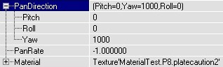

### TexRotator

This rotates a texture around one point. Set a material in Material, and then you can set the Pitch, Roll and Yaw values in Rotation. Only Yaw is really useful, because Pitch and Roll try to rotate the texture in a 3rd dimension that the texture doesn't have so it looks rather weird.

If ConstantRotation = False, the Rotation determinates the rotation of the texture, but the texture stays still. A Yaw of 65536 rotates the texture 360� so it's back at its original position. 16384 rotates the texture 90� counterclockwise and -16384 rotates it 90� clockwise.If ConstantRotation = True, the texture will rotate all the time, a Yaw of 65536 then means 1 rotation per second, and 16384 means one rotation every 4 seconds. A positive Yaw makes it rotate counterclockwise and a negative Yaw clockwise.

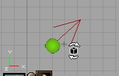

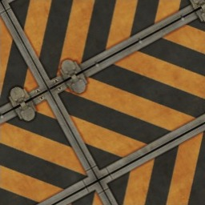In your map, the texture will rotate around one point (the upper left corner of one tile), and you can move this point together with the texture if you pan it with the Texture Pan button

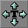

You can also make EnvironmentMaps rotate with the TexRotate, if you put a TexEnvMap in Material. Now also Pitch and Roll do something useful, so you can make the EnvironmentMap rotate around the 3 axes. You can now use the TexRotate in the Specular setting of Shaders.

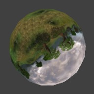

#### TexRotator Example

This is an example of a rotating fan. The rotating fan itself is a TexRotate material, and it's combined with a still texture so that only the round fan itself rotates and not the corners of the fan texture.The original fan texture looks like this:

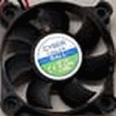

but because the texture will rotate around one of it's corners, the center of the fan is brought to the corners of the texture:

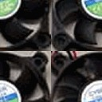

This texture is imported into the editor, and a new TexRotate is made with this fan texture as Material, ConstantRotation = True and a value in Yaw. But if you'd now use this texture in your map, the complete texture rotates instead of only the actual fan. With a [Combiner](MaterialsModifiers.md), another texture can be laid over the fan, with a mask that creates a round hole in the second texture. Because the center of the fan texture was brought to the corners, you need to do the same with the mask, so it looks like this:

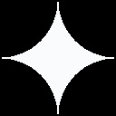

The black parts will become invisible, so only there the fan will show up.Then you can set up the combiner: Material1 is the fan, Material2 is another texture, Mask is the mask and CombineOperation is CO\_AlphaBlend\_With\_Mask.

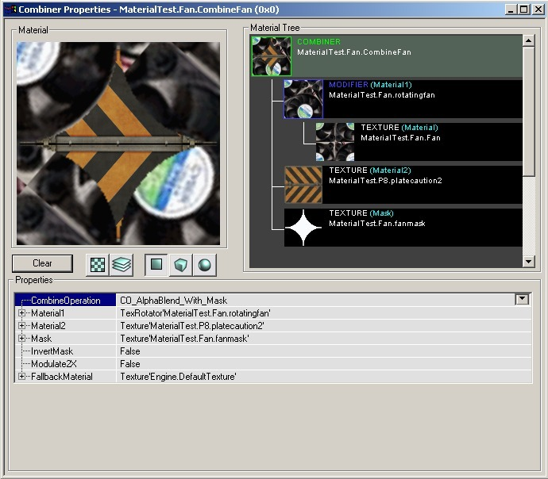

Now you can add this combiner in the map, and if you place the center of the fan in the center of a wall it should look fine. To center it exactly, you can open the Surface Properties --> Alignment and these choose Align to Wall.

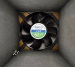

### TexScaler

The TexScaler can scale a material. Put a material in Material, and then you can scale it horizontally with UScale and vertically with VScale. For example if you set VScale to 3, the texture will be stretched vertically so it becomes three times higher.In UOffset and VOffset you can set the number of pixels to move the texture away from the center.

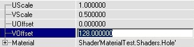

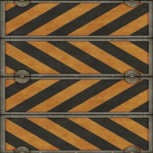

---

## Example Map and Other Material Classes

For an example map that shows many different complex Materials in action, take a look at this document:[ExampleMapsEPIC](ExampleMapsEPIC.md#materials-example-map) *(The example map is at the bottom of the page)*To return back the main Materials page, click [here](../Content%20Creation/Lighting%20and%20Textures/MaterialTutorial.md) <--
