# Shaders

*Document Summary: A guide and reference to setting up Shader Materials.**Document Changelog: Last updated by Jason Lentz (DemiurgeStudios?), for creation purposes. Original author was Jason Lentz (DemiurgeStudios?).*

* [Shaders](MaterialsShaders.md#shaders)
  + [Shader Properties](MaterialsShaders.md#shader-properties)
    - [Diffuse](MaterialsShaders.md#diffuse)
    - [Opacity](MaterialsShaders.md#opacity)
    - [Specular](MaterialsShaders.md#specular)
    - [SpecularityMask](MaterialsShaders.md#specularitymask)
    - [SelfIllumination](MaterialsShaders.md#selfillumination)
    - [SelfIlluminationMask](MaterialsShaders.md#selfilluminationmask)
    - [Detail](MaterialsShaders.md#detail)
    - [DetailScale](MaterialsShaders.md#detailscale)
    - [OutputBlending](MaterialsShaders.md#outputblending)
    - [TwoSided](MaterialsShaders.md#twosided)
    - [Wireframe](MaterialsShaders.md#wireframe)
    - [PerformLightingOnSpecularPass](MaterialsShaders.md#performlightingonspecularpass)
    - [FallbackMaterial](MaterialsShaders.md#fallbackmaterial)
  + [Example Map and Other Material Classes](MaterialsShaders.md#example-map-and-other-material-classes)

## Shader Properties

When you create a Shader it has several properties you can set. In the last and first seven fields, you can set Textures or other Materials. These fields as well as the other properties (shown below) are described in this document.

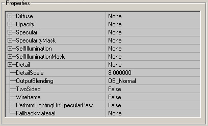

### Diffuse

Set the main texture for your Shader in the Diffuse field. If you don't set a diffuse texture, the effects of the Shader will be cast on a white texture instead. You can also use another Material that you've created in this slot, but you should have something in it.

### Opacity

In Opacity, you can set a texture that has an alpha channel or a masked texture. The alpha channel of that texture will act as an Opacity layer for the Shader (the texture itself is ignored; only its alphachannel is used). The white parts of the alphachannel become opaque, the grey parts semi-transparent and the black parts invisible. For example here the alphachannel of the "platecaution" texture is used on a FireTexture (the texture that was set in Diffuse).

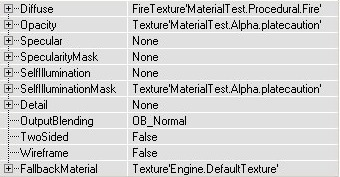

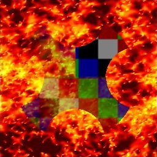

### Specular

With this, you can blend an EnvironmentMap on the Shader: set a TexEnvMap texture in Specular and the Shader will look shiny.You can also add a SpecularityMask, this is a texture with an alphachannel, or a masked texture, that tells how shiny the Shader has to be in each pixel. The black parts of the alphachannel leave it mat, and the white parts become the shiniest. Of course, the SpecularityMask doesn't do anything if you didn't set a TexEnvMap in Specular.This is a Shader with Specularity on it, and the SpecularityMask is a white alphachannel with a black circle in it:

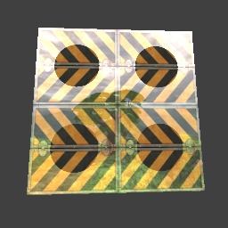

### SpecularityMask

This Material is used in conjunction with the texture assigned to the Specular field. The SpecularityMask uses the alpha channel of whatever texture or Material that is assigned to it and uses it as a mask for the Specular field.

### SelfIllumination

This adds a second texture on the Shader, and makes this texture unlit so you can see it in the dark. You can set this texture in SelfIllumination.You can also add a SelfIlluminationMask, again this is an alphatexture or a masked texture. The white parts of the alpha channel will become the brightest (completely unlit) and use the SelfIllumination texture. The black parts need an external light source before you can see it, and use the Diffuse texture.For example, this texture uses the same texture for Diffuse and SelfIllumination, and there's added a SelfIlluminationMask. There's a red light source in the center of the room, and the light is only visible on the grey or black parts of the SelfIlluminationMask:

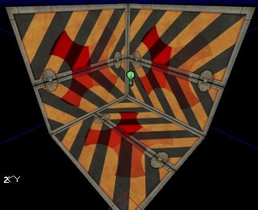

### SelfIlluminationMask

Like the SpecularityMask, this Material is used in conjunction with the texture assigned to the SelfIllumination field. The SelfIlluminationMask uses the alpha channel of whatever texture or Material that is assigned to it and uses it as a mask for the SelfIllumination field.

### Detail

Detail Textures do not seem to be functional at this time.

### DetailScale

Detail Textures do not seem to be functional at this time.

### OutputBlending

With this you can apply an OutputBlending effect on the whole Shader. Its effect is somewhat similar to the FrameBufferBlending option of the FinalBlend Material, but there are other options. If you need for example the Brighten option of the FinalBlend (an option that doesn't exist in OutputBlending), you can make a new FinalBlend with your Shader set in Material.OB\_Normal: this displays the Shader as you would expect it, with all the effects such as Opacity and Specularity.

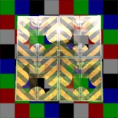

OB\_Masked: this makes the first color in the palette of a P8 texture invisible, or if the texture has an alpha channel makes the alpha values lower than 128 invisible.

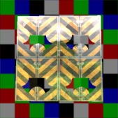

OB\_Modulate: this makes the R=G=B=127 grey parts of the texture invisible and the other parts semi-transparent.

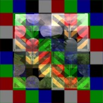

OB\_Translucent: this makes the darkest parts of the texture most transparent, and the brigher parts more opaque.

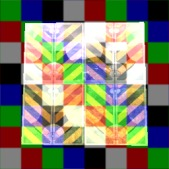

OB\_Invisible: this makes the complete Shader invisible, though the EnvironmentMap remains visible if the Opacity is used.

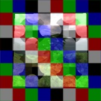

### TwoSided

TwoSided: with this you can make the Shader two-sided, the same as you can do with the FinalBlend.

### Wireframe

WireFrame: if this is True, the Shader will be displayed as a wireframe in the map.

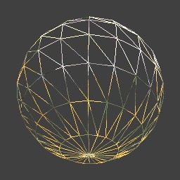

### PerformLightingOnSpecularPass

This setting can be ignored as it is never used.

### FallbackMaterial

Here you can set a Texture that the Engine will default to if for whatever reason the end user machine cannot render the resultant Shader you've created.

---

## Example Map and Other Material Classes

For an example map that shows many different complex Materials in action, take a look at this document:[ExampleMapsEPIC](ExampleMapsEPIC.md#materials_example_map) *(The example map is at the bottom of the page)*To return back the main Materials page, click [here](../Content Creation/Lighting and Textures/MaterialTutorial.md) <--
