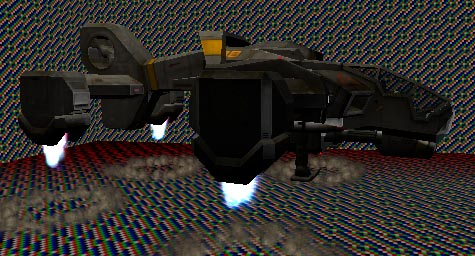
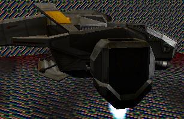
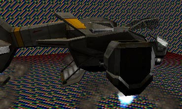

# Matinee Demo Tutorial (Drop Ship section)

*Document Summary: An additional Matinee example demonstrating how to make a more complex Matinee scene.**Document Changelog: Last updated by Hugh Macdonald ([UdnStaff](https://udn.epicgames.com/Main/UdnStaff)). Original author was Hugh Macdonald ([UdnStaff](https://udn.epicgames.com/Main/UdnStaff)).*

* [Matinee Demo Tutorial (Drop Ship section)](MatineeDemoDropship.md#Matinee Demo Tutorial (Drop Ship section))
  + [DropShip Landing](MatineeDemoDropship.md#DropShip Landing)
    - [DropShip Path](MatineeDemoDropship.md#DropShip Path)
    - [DropShip Camera](MatineeDemoDropship.md#DropShip Camera)
    - [DropShip Touch-Down](MatineeDemoDropship.md#DropShip Touch-Down)
      * [Timing](MatineeDemoDropship.md#Timing)

## DropShip Landing

After the opening shots, the first thing that the viewer sees is the DropShip flying in through the trees. As the DropShip comes in to land, it lowers its engines, and then the door opens, and it lands.

### DropShip Path

The first thing we need to create for the DropShip is the path it will take as it flies in. This is done with Interpolation Points, exactly the same way as you would create a camera path. Make sure the Interpolation Points are pointing the direction the ship should be pointing at that point, as we will be using them to set the DropShip's orientation.In the demo, the DropShip is done with an 11 second path - the first segment of 3 seconds being horizontal, then 3 seconds starting to move downwards, and then the last 5 seconds moving vertically. I will be referencing everything with respect to these times.Once you've set the path up, don't forget to change SceneManager->Affect to AFFECT\_Actor, and AffectedActor to the DropShip.

### DropShip Camera

For the DropShip landing sequence, we're going to use two camera shots. The first one will follow the ship across the sky, and as it starts landing. The second will be a closer shot as it actually touches down. I'll assume that, by this stage, you're quite happy setting up cameras, and setting the Orientation.If you preview these cameras from UnrealEd, the DropShip itself will not move, and the cameras will be pointing at where the ship is in the level. This is because actors are not triggered when you preview the scene - so the DropShip will not join it's path.

### DropShip Touch-Down

As the DropShip approaches the ground, we want it to lower it's landing gear, in preparation for landing. This is as simple as triggering the ship itself. You should really trigger the landing sequence when the DropShip is already moving vertically. This is because triggering it will both start the landing gear extending, and the engines pointing straight down. As the DropShip moves normally, the engines point in the appropriate direction, so triggering the landing sequence when the engines are not pointing down will cause a jump in the engine position. This trigger will also cause dust to be blown up at the point on the ground where the engines are pointing (the amount depending on how far from the ground the engines are).

To get the bay door to open, it's as simple as triggering the DropShip again. This opens the bay door, and then opens the cockpit canopy.

#### Timing

The landing gear takes about 2.5 seconds to lower. I find that triggering it 3 seconds before the DropShip is due to touch down is ideal. The bay door takes about half a second to open, and triggering it as soon as the DropShip has touched down works well.

---

The next tutorial? will cover using [ScriptedSequences](../Content Creation/Scripted Sequences/ScriptedSequenceTutorial.md) to control characters in the scene.
