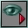
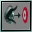

# Matinee Demo Tutorial (Opening section)

*Document Summary: An additional Matinee example demonstrating how to make a more complex Matinee scene.**Document Changelog: Last updated by Hugh Macdonald ([UdnStaff](https://udn.epicgames.com/Main/UdnStaff)). Original author was Hugh Macdonald ([UdnStaff](https://udn.epicgames.com/Main/UdnStaff)).*

* [Matinee Demo Tutorial (Opening section)](MatineeDemoOpening.md#matinee-demo-tutorial-opening-section))
  + [Overview](MatineeDemoOpening.md#overview)
  + [Concept](MatineeDemoOpening.md#concept)
  + [Creating the Scene](MatineeDemoOpening.md#creating-the-scene)
    - [Setting up the Map](MatineeDemoOpening.md#setting-up-the-map)
    - [Opening Shots](MatineeDemoOpening.md#opening-shots)
      * [Actions](MatineeDemoOpening.md#actions)
      * [Sub Actions](MatineeDemoOpening.md#sub-actions)
        + [Music](MatineeDemoOpening.md#music)
        + [Fade In](MatineeDemoOpening.md#fade-in)
        + [Motion Blur](MatineeDemoOpening.md#motion-blur)
        + [View Targets](MatineeDemoOpening.md#view-targets)
        + [Fade Out](MatineeDemoOpening.md#fade-out)

## Overview

This tutorial will show you how to make something similar to the Matinee demo that was included with 927. The demo included a lot of basic Matinee features, as well as Scripted Sequences for the characters in the scene.I'm going to split the tutorial into multiple parts, to keep the size of each section down. The parts will be as follows:

* [MatineeDemoOpening](MatineeDemoOpening.md) (this one) - The introduction to the scene, giving an overview of the level
* [MatineeDemoDropship](MatineeDemoDropship.md) - Bringing the DropShip into the level, and landing it
* MatineeDemoSoldiers? (coming soon) - Moving characters in the scene

I've stripped down the level, and taken all the static meshes out, so that it is easier to see what is going on. You can download this stripped down version, with no Matinee information, from the bottom of this page.

## Concept

The basic concept of this scene is following a craft landing amongst some trees. When the craft lands, four soldiers get out and, after looking around, make their way to a building hidden in the undergrowth.

## Creating the Scene

### Setting up the Map

The first thing to do is add the main scene - so go into Matinee mode, and create a new scene. Call this scene 'Cinematic'. The PlayerStart actor should be set to trigger 'Cinematic' as soon as a player appears in the level.

### Opening Shots

#### Actions

The first two shots of the scene are general opening shots, giving an overview of the level, and the kind of terrain. In the demo, this was done with two moving shots.Add your start and end Interpolation Points for the first move into the map. Your first action in the scene should be a 0 second move to the first Interpolation Point, and the second should be a 12 second bezier move to the second Interpolation Point. (These time values are what Epic used on the demo - if you're using different points to recreate this scene, you may want to choose a time that fits your move better)

#### Sub Actions

The first action in the scene will have a lot of sub-actions, as this is where you will want to set up everything that should run throughout the whole level.

##### Music

The first thing to do is to add a sub-action which will start the music. There is already a MusicTrigger actor in the level, which is set to play 'anticipation.ogg' when it is triggered. Its tag is 'OpenMusic'. Add a SubActionTrigger to the current action, and set its EventName to 'OpenMusic' (and make sure that the delay and duration are both 0)

##### Fade In

Next, we want to start with the screen black, before fading up. Add a SubActionFade. Set bFadeOut to false (to make it fade in) and set the RGBA values all to 0 We want it to start at the beginning of this action and last for, say, 1 second, so set the delay to 0, and the duration to 1.

##### Motion Blur

We also want to turn on a Motion Blur at the beginning. This is done with a SubActionCameraEffect. Add one of these, and expand CameraEffect. Select MotionBlur from the drop-down box, and click New. The BlurAlpha is how visible the blur is - a value of 255 gives a blur that is just as pronounced as the scene itself, while 0 will not give any motion blur at all. The Matinee demo used a value of 110, which works well.If you want, you can get the motion blur to fade in - this is done with the StartAlpha and EndAlpha - where 0 is transparent, and 1 is fully there. The Duration is how long it will take to appear (or disappear). If DisableAfterDuration is set to true, as soon as the duration time is up, the MotionBlur will turn itself off - so make sure that this is set to false for this.

##### View Targets

We've got the camera position, but we still need to work out where we want the camera pointing. With version 927, when you change the camera orientation, it will now move smoothly between points, avoiding any juddering. Add a couple of LookTargets into your level - one where you want the camera to start off looking, and one where you want it to end.Add a SubActionOrientation (still to the first Action) and change CamOrientation to CAMORIENT\_LookAtActor, and set LookAt to be the first LookTarget that you added. Set EaseInTime to something like 1 second, so if this SubAction is slightly delayed, you won't get a sudden jerk. As usual, Delay and Duration should both be set to 0.Now, go to the second Action in the scene, and move into the SubActions section again. Add another SubActionOrientation, and set it up exactly the same as the previous one, except this time, make it look at the second LookTarget that you added. Also, change the EaseInTime to something slightly longer (2 or 3 seconds) and increase the Delay to further into the camera move (this purely depends on where you have your Interpolation Points and LookTargets)

##### Fade Out

To fade out at the end of the move, we need to add another SubActionFade to the second Action. Use the same colour paramaters as before (RGBA all at 0) but with bFadeOut to true. We want the whole fade out and back in again to take 1 second, so set the Duration to 0.5 seconds, and the Delay to 0.5 seconds shorter than this action's Duration.If you want another camera move (as the demo has), you can add it in exactly the same way, except this time you don't need the SubActions like the music, and the motion blur.

---

That's it for the first tutorial - this has all been quite basic stuff - [the next tutorial](MatineeDemoDropship.md) will be covering bringing the DropShip in to land, and the third tutorial? will the the big one - moving the soldiers around.
