# Mesh Emitters

*Document Summary: A reference to properties-based emitter editing and creation. (non UDN build).**Document Changelog: Updated by Tom Lin for 2226 build and reorganization. Original Author: Lode Vandevenne.*

* [Mesh Emitters](MeshEmitter.md#Mesh Emitters)
  + [Introduction](MeshEmitter.md#Introduction)
  + [Acceleration](MeshEmitter.md#Acceleration)
  + [Collision](MeshEmitter.md#Collision)
  + [Color](MeshEmitter.md#Color)
  + [Fading](MeshEmitter.md#Fading)
  + [Force](MeshEmitter.md#Force)
  + [Mesh](MeshEmitter.md#Mesh)
    - [Use Mesh Blend Mode](MeshEmitter.md#Use Mesh Blend Mode)
    - [Render Two Sided](MeshEmitter.md#Render Two Sided)
    - [Use Particle Color](MeshEmitter.md#Use Particle Color)
  + [MeshSpawning](MeshEmitter.md#MeshSpawning)
  + [Revolution](MeshEmitter.md#Revolution)
  + [Rotation](MeshEmitter.md#Rotation)
  + [Size](MeshEmitter.md#Size)
  + [SkeletalMesh](MeshEmitter.md#SkeletalMesh)
  + [Spawning](MeshEmitter.md#Spawning)
  + [Texture](MeshEmitter.md#Texture)
  + [Tick](MeshEmitter.md#Tick)
  + [Time](MeshEmitter.md#Time)
  + [Trigger](MeshEmitter.md#Trigger)
  + [Velocity](MeshEmitter.md#Velocity)
  + [Warmup](MeshEmitter.md#Warmup)

## Introduction

This document will cover mesh emitters, one of four different possible emitters available in the 2226 build. For more information on general emitter properties, see [EmittersReference](../Content Creation/Effects/EmittersReference.md). For more information on the other three emitter types, see [SpriteEmitter](https://udn.epicgames.com/Two/SpriteEmitter), [SparkEmitter](SparkEmitter.md) and [BeamEmitter](BeamEmitter.md).Mesh emitters are somewhat expensive, compared to the other available types. In some cases however, there is simply no replacement for a good mesh emitter. In particular, explosions that kick up debris are helped a good deal if some meshes bounce about post-impact. Also, rotation of particles in more than one plane of motion is best handled with mesh emitters, so tumbling actions will practically always demand them.There are a large amount of variables that control the behaviors of a mesh emitter. Most of these are covered in depth in the [EmittersReference](../Content Creation/Effects/EmittersReference.md) document. Fields of special interest will be pointed out in this document. The fields will be addressed in the order they appear in the properties window. (see image below)

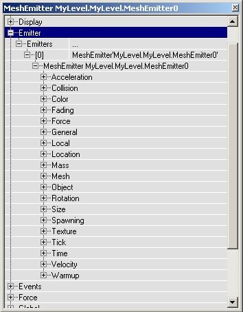

## Acceleration

You may want to use acceleration if you use a mesh emitter. Note that acceleration is just what it sounds like - the increase in particle speed over time. If you want your particles to move with a consistent speed, then you should be looking at the [Velocity](MeshEmitter.md#VelocitY) field.Also note that acceleration isn't given in a range of values, so all your particles will accelerate at the same rate. To get some noise into your particle motions, use varying [velocities](MeshEmitter.md#VelocitY).

## Collision

When using mesh emitters, you will usually want collision enabled. One of the big advantages of using mesh emitters is that upon colliding with the world, the illusion of three-dimensionality is preserved, whereas it is often broken when using collision with sprites and textures.

## Color

This field affects mesh emitters, somewhat surprisingly. Simply change the multiplier values to change the color of your spawned meshes. Note, however, that you must go to the [Mesh](MeshEmitter.md#MesH) field and toggle the variable *UseParticleColor* to `true' to see the effects of your changes in this field.

## Fading

It's a good idea to use a relatively long fade out time with a mesh emitter, to avoid ugly popping.

## Force

This doesn't often need to be set with mesh emitters.

## Mesh

This is one of two fields that specifically affects only the mesh emitter type. There are only a few options to consider, but they tie into other fields, so it's not as simple as it first appears.

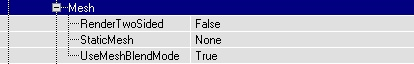

Here you can choose the StaticMesh that gets used for the particles, as long as you leave this empty the particles are invisible. To choose a StaticMesh first select it in the Static Mesh Browser, then click on StaticMesh in the Mesh properties and press the Use button.

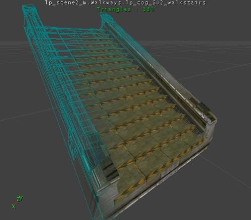

Now you won't see anything yet, not even if you give some Velocity, because the particles are displayed WAY too big: the StartSizeRange settings in Size are 100 by default, and for the [MeshEmitter](MeshEmitter.md#MeshEmitter) this means the StaticMesh is 100 times as big as it should be. Set all the X(Min), X(Max), Y(Min), Y(Max), Z(Min) and Z(Max) settings to something very low, for example 0.5, or for the huge Static Mesh that's used here: 0.03. More about the Size for [MeshEmitter](MeshEmitter.md#MeshEmitter)s is in the section Size][. If you now give also some velocity you might see something like the screenshot.

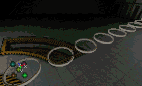

### Use Mesh Blend Mode

If this is true, the blend mode of the mesh is used. This means that the particles will look just like they do when you drop them in the level. If this is false, the particles will use the blend mode defined in the texture category.

### Render Two Sided

If this set, the mesh will render all triangles two sided. This is useful only if UseMeshBlendMode is false.

### Use Particle Color

If this is set, the mesh will use the settings in the [Color](MeshEmitter.md#ColoR) field. This is only useful if UseMeshBlendMode is true.

## MeshSpawning

MeshSpawning allows you to use a static mesh as a framework for spawning Emitters. The vertices in the static mesh are used to calculate emitter properties, such as velocity and color of the spawned particles. For more information, see the [Emitter Reference](../Content Creation/Effects/EmittersReference.md#MeshSpawning) doc.

## Revolution

You may want to add revolutions to your mesh emitter. For a more in-depth review of revolution, see the [EmittersReference](../Content Creation/Effects/EmittersReference.md#Revolution) document.

## Rotation

You may want to add rotations to your mesh emitter. This works in almost the same way as in the sprite rotation, only you can now set 3 independent Spins in X, Y and Z direction: each have their own SpinsPerSecondRange and SpinCCWorCW.These screenshots show respectively Rotation in X, Y and Z direction. (the last two are animated)

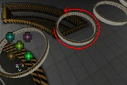

For a more in-depth review of rotation, see the [EmittersReference](../Content Creation/Effects/EmittersReference.md#Rotation) document.

## Size

The Size settings for the [MeshEmitter](MeshEmitter.md#MeshEmitter) are exactly the same as the Size setting of the ParticleEmitter (explained in the section Size), only now you can change the X, Y and Z Size of the StaticMesh particles independently. X and Y resize the width and breadth of the particles, Z resizes the height of it. Again, you can set a different Min and Max value for a random Size. On the first screenshot, the X Size is larger than Y and Z. On the second screen, the Y Size is larger than X and Z.

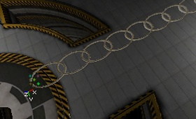

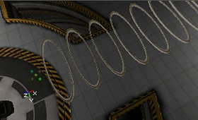You can give the particles a random X, Y and Z Size. On the first screenshot, X and Y are the same, but Z(Min) = 0.03 and Z(Max) = 0.3 so the height is random. Where the resize happens (what part gets stretched) depends on the StaticMesh, here the bottom of the StaticMeshes is stretched but the top keeps the same height. On the second screenshot, all the X, Y and Z values have a Min of 0.03 and a Max of 0.2 so they're all random. If UniformSize = False, the proportions of the particles will not be kept, but if you set UniformSize to True, the proportions are kept and only the total Size is random. Only the X values are used then, Y and Z are ignored.

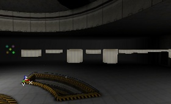

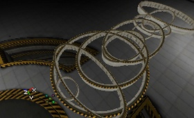The SizeScale works exactly the same as the one for the [SpriteEmitter](MeshEmitter.md#SpriteEmitter) and is explained in the section Size. This time, X, Y and Z are locked to each other: the RelativeSize value resizes them all at the same time.

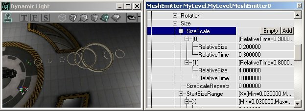

For a more on Size, see the [EmittersReference](../Content Creation/Effects/EmittersReference.md#Size) document.

## SkeletalMesh

Skeletal Mesh emitters allows you to attach particles to the bones of a skeletal mesh. The mesh is used to determine the spawn location of the particles and can also be used to determine the movement the particles. For a more in-depth review of Skeletal Mesh emitters, see the [Particle Systems](../Content Creation/Effects/ParticleSystems.md#Skeletal_Mesh) document.

## Spawning

Make sure to set appropriate values in the Spawning fields. These figures will affect how quickly particles are created, over the lifetime of your emitter. For a more in-depth review of Spawning, see the [Particle Systems](../Content Creation/Effects/EmittersReference.md#Spawning) document.

## Texture

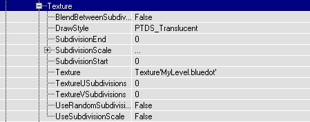

If in Mesh you set UseMeshBlendMode to False, the DrawStyle in Texture will be used. This does the same on the mesh as it does on sprites, for more go to the section Texture. If in Mesh RenderTwoSided is True as well, the textures on the other side of the mesh will be visible as well. The first screenshot shows the DrawStyle PTDS\_Brighten, the second screen shows the same DrawStyle but this time with RenderTwoSided to True.

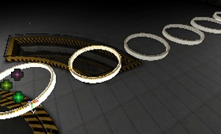

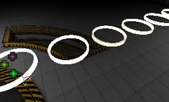If the StaticMesh is opaque and UseMeshBlendMode is True, the StaticMeshes will of course look opaque (first screenshot). If you now set UseMeshBlendMode to False, and set DrawStyle to PTDS\_Regular, they will be opaque as well, but something weird will be going on: you can see the other particles through the opaque walls of the particles (second screenshot).

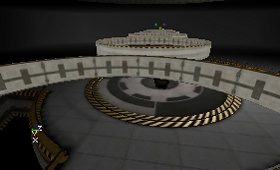

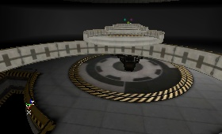The Subdivision settings are useless on MeshParticles, because they use a StaticMesh and not a texture.For more information on the texture field, see the [Emitters Tutorial](../Content Creation/Effects/EmittersReference.md#Texture_).

## Tick

This functions normally. See the [Emitters Tutorial](../Content Creation/Effects/EmittersReference.md#Tick) for more information.

## Time

This functions normally. See the [Emitters Tutorial](../Content Creation/Effects/EmittersReference.md#Time) for more information.

## Trigger

This functions normally. See the [Emitters Tutorial](../Content Creation/Effects/EmittersReference.md#Trigger) for more information.

## Velocity

This is the initial velocity of your particles. Since this is given in a range, the value chosen for the particle velocities will be random. It's a good idea to give a fairly wide range for a mesh emitter, to avoid uniformity when the mesh pieces are spawned.See the [Emitters Tutorial](../Content Creation/Effects/EmittersReference.md#Velocity) for more information.

## Warmup

This functions normally. See the [Emitters Tutorial](../Content Creation/Effects/EmittersReference.md#Warmup) for more information.
