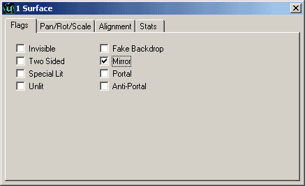
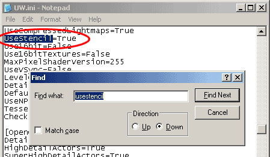
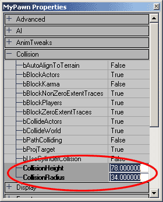
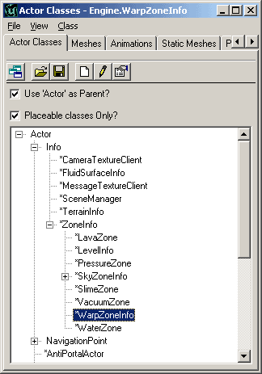
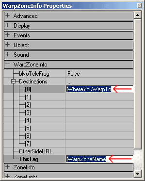
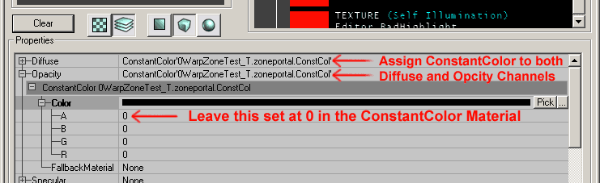

# Mirrors and WarpZones

*Document Summary: A guide to setting up WarpZones and Mirrors.**Document Changelog: Last updated by Jason Lentz (DemiurgeStudios?), to include ConstantColor/Shader trick for WarpZone Portals. Original author was Jason Lentz (DemiurgeStudios?).*

* [Mirrors and WarpZones](MirrorsAndWarpZones.md#mirrors-and-warpzones)
  + [Introduction](MirrorsAndWarpZones.md#introduction)
  + [Mirrors](MirrorsAndWarpZones.md#mirrors)
    - [Mirror Limitations](MirrorsAndWarpZones.md#mirror-limitations)
  + [WarpZones](MirrorsAndWarpZones.md#warpzones)
    - [Setting up WarpZoneInfos](MirrorsAndWarpZones.md#setting-up-warpzoneinfos)
    - [Correcting WarpZone Portals](MirrorsAndWarpZones.md#correcting-warpzone-portals)
    - [WarpZone Limitations](MirrorsAndWarpZones.md#warpzone-limitations)
    - [One Way WarpZones](MirrorsAndWarpZones.md#one-way-warpzones)

## Introduction

In this document you will see how to create various effects with BSP geometry using Mirrors, Portals, and WarpZones. This document assumes that you are familiar with the Unreal Ed interface and that you know the basics of using BSP geometry.

## Mirrors

You can turn any BSP surface into a mirror. To do so simply select the surface and then bring up the Surface Properties window (Hotkey: F5), and then check the "Mirror" box.

Now that surface will act as a mirror, duplicating everything that is facing it, but with Unreal Ed's default settings, this effect will only take place in the editor. To have it take place in game you must open up your .ini file and set the "UseStencil" setting to *True*.

**NOTE:** Changing this setting may cause your game to not work on some graphics cards (such as a Geforce 1).

### Mirror Limitations

As mentioned above, using mirrors in your game will limit the graphics cards that your game will run on, but there are also other limitations in using mirrors. One other big limitation is that you cannot have mirrors directly facing each other. If the mirrors behaved like true mirrors, this would cause an infinite amount of geometry to be drawn by the renderer and bring any game to a crashing halt. Unreal minimizes this problem by only rendering three relections deep and for the mirrored surface it displays the texture assigned to it. Another issue with looking into reflected reflections is that you will be able to see non-culled meshes that are on the other side of the mirror. Obviously, while facing mirrors will still technically work in game, neither of these side effects is exactly desirable so it is best to avoid having mirrors face each other.

## WarpZones

A WarpZone are small zones that appear to look into other Zones and allow Pawns to travel from their current Zone to the one they see in the WarpZone simply by passing through the portal into the WarpZone. To create a WarpZone you will need the following elements:

* 2 (or more) small Zones (herein referred to as *"WarpZones"* ) that open up into the spaces to which you wish to teleport
* A WarpZoneInfo in each of the aforementioned small Zones

These WarpZones must be of a certain size to function while avoiding unwanted rendering artifacts. The right size is determined by the Pawn's CollisionCylinder. The Warpzone must be slightly larger than the largest Pawn's CollisionRadius or else any Pawn that cannot get its center into the WarpZone will not be teleported. To access a Pawn's Collision settings, place one in the level from the Actors Browser and then open up its properties window expanding the collision rollout. You may want to double check with your programmers though to make sure that the Pawn's collision properties are not being changed in code.

It is also a good idea to not make the WarpZone too large. If the WarpZone is too large, players may be able to "peak" inside and witness a HOM (Hall of Mirrors) effect or just view a dark empty box causing the entire illusion to break down.**NOTE:** If you are placing vertical WarpZones in the floor or the ceiling, instead of using the largest Pawn's Collision *Radius* you will want to make the depth/height slightly larger than 1/2 the tallest Pawn's Collision *Height*.

### Setting up WarpZoneInfos

Once you've created your Zone for the WarpZone, you will need to place a WarpZoneInfo from the Actors Browser.

Next, open up the WarpZoneInfo's properties, and you will want to set the *ThisTag* and the 0th *Destination* to the name of this WarpZone and where it sends the pawns respectively.

WarpZones seem to have lost some of their functionality as you can no longer set multiple *Destinations* nor can you use the "\_OtherSideURL\_" (the OtherSideURL was for teleporting players between different .unr files).

### Correcting WarpZone Portals

Now you should have a functioning WarpZone that will transport you from one zone to the next, but your WarpZone ZonePortal may not be acting properly and instead of showing the next Zone, the texture shows up as whatever texture you assigned to it in the editor. To fix this you will need to create a special Shader.To create this Shader you will need to make two new Materials, a **Shader** and a **ConstantColor.** For the ConstantColor Material the only important setting is that its Alpha value must be 0. Then Open up the properties for the Shader and assign this ConstantColor Material to the Diffuse and Opacity channels.

The ZonePortal will not show up properly in the editor, but it will show the next Zone in game.

### WarpZone Limitations

Just as with [mirrored surfaces](MirrorsAndWarpZones.md#mirror-limitations), you should avoid having WarpZones look onto each other. The renderer will only display WarpZones three reflections deep and then render the texture assigned to the portal of that WarpZone.WarpZones are only used for teleporting Pawns. Below is a list of restrictions on WarpZones:

* You cannot see other players through them
* Mirrors do not work correctly with WarpZones; avoid having mirrors face WarpZones
* You cannot shoot through them
* You cannot send other objects (e.g. KarmaActors) through them
* Only the first Destination is used (Destination 0)
* The OtherSideURL is no longer supported

Also note that WarpZones can be a bit touchy. If your WarpZone is not functioning properly, just try deleting it and rebuilding it.

### One Way WarpZones

One way to take advantage of one of the size restriction of a WarpZone is to intentionally make it too small to enter. Just make sure that the depth is less than the smallest Pawn's CollisionRadius or CollisionHeight (depending on whether the portal is in a vertical or horizontal surface) and no Pawns will be able to enter the WarpZone causing them to teleport.
