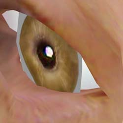
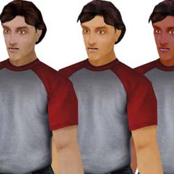
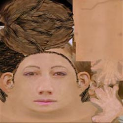
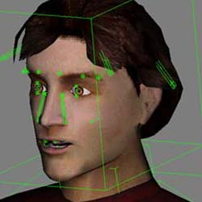
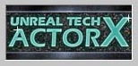

# Modeling/Art Table of Contents

*Document Summary: A table of contents for tutorials on creating skeletal mesh art assets for Unreal Ed.**Document Changelog: Original author was Tom Lin (DemiurgeStudios?).*

* [Modeling/Art Table of Contents](ModelingTableOfContents.md#modelingart-table-of-contents)
  + [Start Here.](ModelingTableOfContents.md#start-here)
  + [Modeling](ModelingTableOfContents.md#modeling)
  + [Example Models](ModelingTableOfContents.md#example-models)
  + [Texturing](ModelingTableOfContents.md#texturing)
  + [Rigging/Animation](ModelingTableOfContents.md#rigginganimation)
  + [Exporting with ActorX](ModelingTableOfContents.md#exporting-with-actorx)
    - [ActorX Max](ModelingTableOfContents.md#actorx-max)
    - [ActorX Maya](ModelingTableOfContents.md#actorx-maya)

## Start Here.

This document is a guide to all the docs related to getting artwork into the Unreal Engine, from static meshes to textures to animations. Note that this document does **not** cover level creation. The guides are arranged beginning with modeling and ending with exporting to a file format that Unreal can import. To Jump to a section, click on the following links:[Modeling](ModelingTableOfContents.md#modeling)
  
[Texturing](ModelingTableOfContents.md#texturing)   
[Rigging and Animation](ModelingTableOfContents.md#rigging_animation)   
[Exporting](ModelingTableOfContents.md#exporting-with-actorx)
  

---

## Modeling

This section includes information on how to efficiently model for the Unreal engine. It also contains useful information about Unreal-specific quirks, such as smoothing, refpose, etc.[UnrealModeling](UnrealModeling.md)
  

* Smooth Skinned Models
* Articulation
  + Eyes
  + Eyelids
  + Tongue
* Refpose
* Smoothing Groups
* In-Game Perspective
* Unreal-Engine Specific Tips
  + Clipping
  + Single Sided Polys
  + Holes
* Comparing Detail Levels

---

## Example Models

This document contains information about two mid poly models created for the Unreal Engine. The document details the creation of these models, explains why design decisions were made, and links to .zip files that contain all of the models, textures, animations, .PSK/.PSA files, etc.[UnrealDemoModels](UnrealDemoModels.md)
  

* Modeling
  + Eye
  + Hands
  + Feet
* Mapping/Texturing
  + Crossing Alpha Triangles
  + Texture Size/Number
  + Swapping Skins
* Bones/Enveloping
* Reusing Models/Skeletons
  + Using the UDN Model
  + Using the UDN Skeleton

---

## Texturing

This doc includes information on the range of texture formats that Unreal will accept, as well as when how best to use them. Links to tools that can be used to create certain formats are also included.[UnrealTexturing](UnrealTexturing.md)
  

* Powers of 2
* Texture Formats
  + 32 bit RGBA (TGA)
  + DirectX Texture Compression
* 8 Bit Palettized
* 8 Bit Palettized with Alpha
* DXTC Tools
  + Nvidia DXT Compression Tools
  + Microsoft DXTex Tool
* Bright
* Alpha Channels
* Appropriate Texture Sizes
* Clothing/Skin Swapping
  + 2K3 Team Colors

---

## Rigging/Animation

This document contains general information about setting up a skeleton in your finished models, with specific information dealing with correct initialization and Unreal capabilities.[SkeletalSetup](../Content%20Creation/Animation/SkeletalSetup.md)
  

* Designing a Skeleton
  + Wasted Bones
  + Shoulders/Elbows
  + Neck
  + Highly Articulated Face
* Optimizing Your Mesh
* Initializing Physique
* Misc Info
  + Skeletons without Biped
  + Adding Bones to Biped
  + Rigid Mesh Linking
  + Unlinking Meshes from Physique
  + Null Vertex Weight
  + Blending Animations
  + Bone Attachments
  + Animation Notifications
* UDN Skeltons vs UT2K3 Skeletons

This doc contains a technical explanation of the vertex animation process.  
[UnrealVertexAnimation](UnrealVertexAnimation.md)
  
You may want to consider using *Impersonator* for lip synch on your models. To get started, take a look at these documents.[ImpersonatorHeadRigging](ImpersonatorHeadRigging.md)
  
[ImpersonatorTutorial](https://udn.epicgames.com/Two/ImpersonatorTutorial)
  
[ImpersonatorUserGuide](ImpersonatorUserGuide.md)
  
Karma Physics (Ragdoll) is also an option in the Unreal Engine. For a thorough description and explanation, see these docs.[KarmaReference](../Content%20Creation/Physics/KarmaReference.md)
  
[ImportingKarmaActors](ImportingKarmaActors.md)
  
[UsingKarmaActors](UsingKarmaActors.md)
  
[KarmaAuthoringTool](KarmaAuthoringTool.md)
  
[RagdollsInUT2003](RagdollsInUT2003.md)
  
[KarmaExampleUT2003](KarmaExampleUT2003.md)
  
[ExampleMapsKarmaColosseum](ExampleMapsKarmaColosseum.md)

---

## Exporting with ActorX

[ActorX](../Content%20Creation/Tools/ActorX.md) is the plugin that sends model and animation data from your 3D modeling package into a format that Unreal can understand. These documents will walk you through the exporting process, as well as explain the tool windows in depth.

This document will simply point you to current versions of the [ActorX](../Content%20Creation/Tools/ActorX.md) plugin for Max and Maya.[ActorX](../Content%20Creation/Tools/ActorX.md)

### ActorX Max

This doc covers [ActorX](../Content%20Creation/Tools/ActorX.md) for 3D Studio Max.[ActorXMaxTutorial](ActorXMaxTutorial.md)

### ActorX Maya

This doc covers [ActorX](../Content%20Creation/Tools/ActorX.md) for Maya.[ActorXMayaTutorial](ActorXMayaTutorial.md)

---
