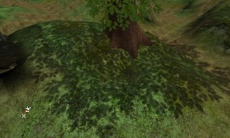
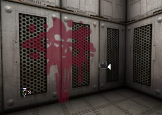

# Projectors Table of Contents

*Document Summary: A comprehensive reference and guide the documents on setting up Projectors.**Document Changelog: Last updated by Jason Lentz (DemiurgeStudios?) for splitting up the Projectors documents into smaller more manageable docs. Original authors were Lode Vandevenne ([UdnStaff](https://udn.epicgames.com/Main/UdnStaff)) and Jason Lentz (DemiurgeStudios?).*Projector documents linked to in this document:

* [MainProjectorProperties](MainProjectorProperties.md)
* [ProjectorTextures](ProjectorTextures.md)
* [ProjectorsTutorial](ProjectorsTutorial.md)

* [Projectors Table of Contents](ProjectorsTableOfContents.md#projectors-table-of-contents)
  + [Introduction](ProjectorsTableOfContents.md#introduction)
  + [Projector Documents](ProjectorsTableOfContents.md#projector-documents)
  + [Known Projector Issues](ProjectorsTableOfContents.md#known-projector-issues)

## Introduction

With Projective Textures you can project a texture on anything (walls, floors, actors, Static Meshes, Particle Systems, etc...) to create effects such as shadows, light effects or decals.For example, the shadow of this tree is made with a Projective Texture, it's an artist created shadow texture; it wasn't raytraced by the editor. This creates a much sharper shadow. You can see every leave of the tree in there. Also, the Projective Texture will look the same on BSP, Terrain, Static Meshes or anything else, so the player can't see an unrealistic difference anymore.

Another example is light shining through a stained glass window: because the raytracer doesn't support multicolored light through a translucent surface, you can create the effect yourself with a colored Projective Texture:

Projective Textures can also be used for decals, for example bloodsplatters or bulletholes:

## Projector Documents

* [MainProjectorProperties](MainProjectorProperties.md) - This doc contains the more general properties that shape the broadest aspects of the projector. Many of these values can be left at their default settings, but the properties in the first section (the "The Projector" section) will almost always require attention to get the effect you want. Below are the headings of each of the sections within this doc.
  + Intorduction
  + The Projector
    - DrawScale
    - Rotation
    - FOV
    - MaxTraceDistance
    - bGradient
  + Clipping
    - bClipBSP
    - bClipStaticMesh
    - bPrjoectActor
    - bProjectBSP
    - bProjectOnAlpha & bProjectOnParallelBSP
    - bProjectOnBackFaces
    - bProjectOnUnlit
    - bProjectParticles
    - bProjectStaticMesh
    - bProjectTerrain
* Miscellaneous Settings
  + ProjectTag
  + bDynamicAttach
  + bLevelStatic

* [ProjectorTextures](ProjectorTextures.md) - A thorough reference to the Projector settings relevant to the ProjectiveTexture. This includes a comparison of the different blend modes as well as the property settings for the ProjTextures themselves. Below are the headings of each of the sections within this doc.
  + Introduction
  + ProjTexture
  + ClampMode
  + FrameBufferBlendingOp & MaterialBlendingOp
  + Guidelines for Creating ProjTextures

* [ProjectorsTutorial](ProjectorsTutorial.md) - A tutorial to showing off a few effects using Projectors. These effects include detailed shadows, light from a stained glass window, spawned decals, and rotating Projectors. Below are the headings of each of the sections within this doc.
  + Introduction
  + Shadow
  + Light
  + Spawned Decals
  + Rotating Projections

* [ProjectorTricks](ProjectorTricks.md) - A set of examples for working with dynamic projectors. This is geared toward programmers.

## Known Projector Issues

* Projectors do not rebuild well within the editor (in actual game play, the projectors should work normally). There are several known problems that occur with projectors when the level is rebuilt. The following is a small list of some of the known problems. To correct them, simply re-open your level.
  + If you try to switch the ProjTexture it won't overwrite the old texture you had. Instead just add the old texture with your new one.
  + After you rebuild geometry, the projections may disappear. If you change the properties of the projector a bit, the projection will be back.
  + With each rebuild, projectors with AlphaChannels may become higher in contrast (the dark sections will turn more black, and the light sections will turn more white).
* Projectors work with animated or procedural textures. This means you can create a texture for a caustics lighting effect.
* Projectors may darken Static Meshes. This should be fixed later.
