# Projectors Tutorial

*Document Summary: A tutorial to showing how to set up certain Projector Effects.**Document Changelog: Last updated by Jason Lentz (DemiurgeStudios?) for splitting up the Projectors documents into smaller more manageable docs. Original authors were Lode Vandevenne ([UdnStaff](https://udn.epicgames.com/Main/UdnStaff)) and Jason Lentz (DemiurgeStudios?).*

* [Projectors Tutorial](ProjectorsTutorial.md#projectors-tutorial)
  + [Introduction](ProjectorsTutorial.md#introduction)
  + [Shadow](ProjectorsTutorial.md#shadow)
  + [Light](ProjectorsTutorial.md#light)
  + [Spawned Decals](ProjectorsTutorial.md#spawned-decals)
  + [Rotating Projections](ProjectorsTutorial.md#rotating-projections)

## Introduction

Here you will see brief explanations of how you can set up Projectors to achieve various types of effects including complex shadows, light casting through a stained glass window, spawned decals (such as bullet holes), and rotating projections. This is a somewhat cursory explanation of these effects. For more detailed descriptions, see the [ExampleMaps](../Content%20Creation/Techniques/ExampleMaps.md) page for specific examples.

## Shadow

You can use the Projective Textures for decals, most of the examples above were decals, but you can also use them for shadow and light effects. If you want to make a shadow, you need a grayscale texture that darkens the surface, and has the same shape as the object where the shadow comes from.For example, you could give this tree a shadow with a Projective Texture: it'll look 100 times better compared to what the raytracer can do on terrain.

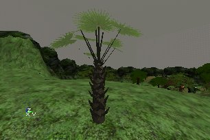

First you need to make the shadow texture. To do this, an easy way is to take a screenshot of the tree when it's inside a black room, and then it's easy to select the tree in PSP or PhotoShop with a Magic Wand tool. Take this screenshot from the same angle as where the light is coming from.

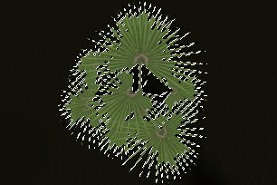

For shadows, it's best to make the texture modulated (the Projector does this by default): then all the grey values darker than 127 will darken the surface where it's projected on. So you need to make everything inside the selection dark grey: the darker you make it, the darker the shadow will be. Then, the background should get the grey value 127, this is the RGB color with R=G=B=127: when you make the texture modulated in the editor, this grey is going to become invisible. Finally, you have to resize the texture to a square, with the sizes a power of 2, for example you can make it 256\*256.

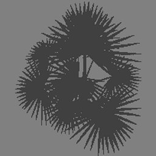

Import it into the editor, and in the Texture Properties --> Surface set bModulated to True. Also set the U and VClampMode to TC\_Clamp, otherwise the texture will be partially repeating on the terrain. Then give the texture to the projector, place the projector above the tree, and give it the same angle as the light. Give it the correct DrawScale, and make the FOV=1 if the shadow is caused by the sun, so it has parallel rays, or make the FOV bigger if it isn't sunlight. Also make sure bLevelStatic=False, so the players will get the shadow on them when they walk under the tree.
Now the tree should have an incredibly detailed shadow:

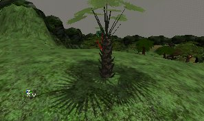

## Light

You can make lighting exactly the same way as the shadow explained above, only this time use a color brighter than the 127-grey for the parts of the Projective Textures that have to brighten the surface. But for the change, it's done with the AlphaChannel of a RGBA8 texture in this example. Also, this example uses multicolored lighting: light shining through a stained glass window. This is something you can't do with Rebuild Lighting, only with Projective Textures.This is the actual stained glass window in the wall. The objective is to cast the light coming through this window on the floor.

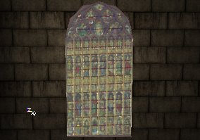

The texture used for this stained glass window can't be used for the Projector, because the window texture hasn't got the correct alpha-channel. You can use the same RGB part for the Projective Texture, only make sure it's a square (add borders if it isn't). Then, in the alpha-channel of the texture, make everything black, except the parts where the light will shine through. For example, where all the little glass windows are, it should be grey, because the light goes partially through these. The brighter the grey, the brighter the light will be there. Where the little stone columns and arches are, the alpha-channel should be black: light doesn't go through stone. Also, if you had to added borders to the texture to make it square, the alpha-channel should be black there too. You can also make the alpha-channel a little blurry, because the lighting of stained glass isn't very sharp in reality. The first screenshot shows the RGB part of the texture, and the second screenshot shows the alpha-channel.

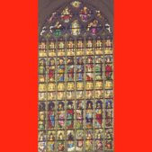

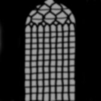Save this texture as a 32 bit RGBA file and import it into the editor. In the Texture Properties set bAlphaTexture=True. Give it to a Projector, give the projector the correct DrawScale and angle, and it should work:

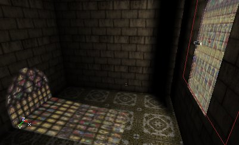

Note that the texture for the window itself (so not the one used for the Projector) is also a RGBA8 texture, and that the alpha-channel of this texture is the inverse of the alpha-channel for the Projector: for this one, the stone columns and arches should not be invisible, but opaque instead, so the alpha-channel is white there.

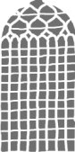

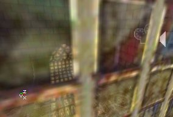

## Spawned Decals

You can spawn Projectors during game play with a script, for example for the holes in the wall caused by bullets, or blood splatters when a player dies.

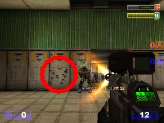

If the Projector Actor is spawned in the game, the Projector Actor itself can be destroyed immediately after it was spawned. The projection on the surface will stay then. This is the same as what happens when you set bLevelStatic=True: also then the Projector Actor gets destroyed, but it's projection stays. There are decals like this in the Actor Class Browser --> Projector --> Scorch.

## Rotating Projections

You can make the Projector Actor to rotate, then the projected texture will rotate, but the frustrum of the Projector will not! In other words, the projected texture will always be projected on the same surfaces, no matter how the Projector rotates. This means, only roll is really useful: this makes rotate the projected texture around it's center, so it can be used for the shadow of a spinning fan.First of all, make sure the U and VClampMode of the texture you want to use are set to TC\_Clamp. Otherwise, the texture will be repeating inside the frustum, even if bClipBSP=True.Then, once you have a Projector with the texture, open the Projector Properties, and expand Movement. There set bFixedRotationDir = True, Physics = PHYS\_Rotating, and inside RotationRate set the Roll you want. The higher the Roll, the faster the texture will rotate.

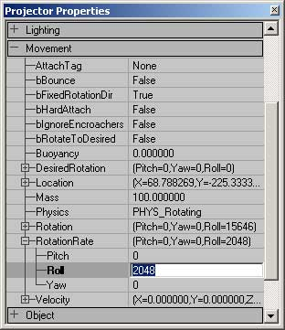

When you set Physics to PHYS\_Rotating, you'll see the blue and yellow boxes become bigger, this is because it has to contain the corners of the texture when it's rotating. Note that you also can use Pitch and Yaw, but the yellow and blue boxes will remain fixed, so you see the texture rotating while it's still projected on the same wall.If you set the U and VClampMode of the Projective Texture to TC\_Wrap, and bClipBSP=False, the texture is repeating on the wall, and the whole thing will rotate then. This can for example be used for rotating water, you can determinate the center where the water spins around with the location of the Projector then.
