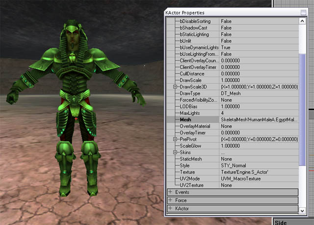
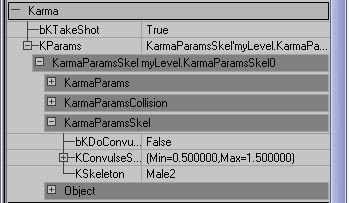

# Ragdolls In UT2003

*Document Summary: A reference showing how ragdolls were set up in UT2003.**Document Changelog: Added links to other docs for creating level ragdolls - Chris Linder (DemiurgeStudios?).*

* [Ragdolls In UT2003](RagdollsInUT2003.md#ragdolls-in-ut2003)
  + [Related Documents](RagdollsInUT2003.md#related-documents)
  + [Introduction](RagdollsInUT2003.md#introduction)
  + [Creating Your Ragdoll](RagdollsInUT2003.md#creating-your-ragdoll)
  + [Using Your Ragdoll In The Game](RagdollsInUT2003.md#using-your-ragdoll-in-the-game)
  + [Level Ragdoll](RagdollsInUT2003.md#level-ragdoll)
  + [Profiling Ragdolls](RagdollsInUT2003.md#profiling-ragdolls)

## Related Documents

[KarmaAuthoringTool](KarmaAuthoringTool.md), [KarmaAuthoringToolTutorial](https://udn.epicgames.com/Two/KarmaAuthoringToolTutorial), [KarmaReference](../Content%20Creation/Physics/KarmaReference.md)

## Introduction

This document goes over how to use ragdolls in UT2003. Much of this information is useful for builds other than UT2003.

## Creating Your Ragdoll

See the [KarmaAuthoringTool document](KarmaAuthoringTool.md) for information on creating ragdolls using the KAT tool.

## Using Your Ragdoll In The Game

In the release version of UT2003 (version 2107) you had to create your own species in a new .u file to use a custom ragdoll. This was a little fiddly, but more importantly was caught by the cheat protection code. This approach is still suitable for mod development though, where you are creating a new species anyway to add new animations etc.In the forthcoming patch there is an alternative way to use your own ragdoll. Remember that a ragdoll asset is identified by its asset name *not* the name of the .ka file, so make sure the asset name is unique.

1. Place the new .ka file in the /KarmaData directory.
2. Create a new .upl file in the /System directory for your new character.
3. At the end of the Player=(... line, inside the brackets, add:

Ragdoll=AssetNameObviously replacing 'AssetName' with the name of the ragdoll asset to use for that character.Thats it! If no Ragdoll is supplied, it will simply use the one specified by the character's species.

## Level Ragdoll

The section above talks about adding ragdolls for use when a character dies. However, you can also place ragdolls in your level for 'decoration'.Probably the easiest way to do this is just to create a new class using a .uc file with the correct default properties. See the[KarmaAuthoringTool document](KarmaAuthoringTool.md#step_6_making_a_class_for_your_r) for more info on how to create a class for a level ragdoll. However, if you dont want to do that, here is an alternative (but more complicated) method:

1. In the static mesh browser pick any static mesh which has a '\*' next to its name. That indicates it has physics properties and can be placed as a KActor.
2. Right click in your level and choose 'Add Karma Actor'. You should see your static mesh appear where you clicked.
3. Select the new KActor and double click or press F4 to bring up Properties window.
4. Choose the skeletal mesh that you want to add as a ragdoll in the Animation browser.
5. In the KActor Properties window, open up the Display section, choose Mesh and hit Use. That should insert the name of your selected skeletal mesh.
6. Also inside Draw, change DrawType to DT\_Mesh, you should see your KActor change to look like your desired skeletal mesh in the reference pose. Also set the StaticMesh field of the KActor to None (empty), as we are not using it.

7. Inside the Movement section, change Physics from PHYS\_Karma to PHYS\_KarmaRagDoll
8. Now open up the Karma section of the Actor, and hit Clear button next to the KParams section to remove the old KarmaParams structure.
9. Now drop down the KParams slot, choose KarmaParamsSkel and hit new to create a new one.
10. Now open that up, open up the KarmaParamsSkel sub-section, and in the KSkeleton slot enter the name of the physics asset that you want to use for this ragdoll. This is the same as the name you would use in the species or .upl file to specify your ragdoll asset from a .ka file.

11. Inside the KarmaParams sub-section, change KStartEnabled from False to True. This means the ragdoll will start to simulate the moment the level begins.

That should get your guy basically working. See the [KarmaReference](../Content%20Creation/Physics/KarmaReference.md) page for more details on what the different properties inside KarmaParams do. You can do standard things like making the ragdoll heavier or non-standard things like make ragdolls float by settings the gravity to negative.Once you have your guy in the level, you can do other things, like joint it to the world! See the [ExampleMapsKarmaColosseum](ExampleMapsKarmaColosseum.md) document or the [UsingKarmaActors](UsingKarmaActors.md) document for info on using joints.

## Profiling Ragdolls

The most useful tool for profiling how fast your ragdoll is running in-game is the 'stat game' console command. You should get a screen full of numbers that looks like this:

Here is an outline of what those stats in the 'Karma' section mean:

|  |  |
| --- | --- |
| *Collision* | This is the total time spent generating contacts for the simulation. |
| *ContactGen* | Thats part of the Collision total, spent doing the actual contact generation routines. |
| *TrilistGen* | Also part of the Collision total, time spent finding nearby triangles for all non-ragdoll Karma stuff. |
| *RagdollTrilist* | Time taken finding triangles near ragdolls for contact generation. |
| *Dynamics* | The actual simulation of all Karma physics in the level. This includes updating the graphics from the physics etc. |
| *physKarma* | Misc. other non-ragdoll Karma-related stuff |
| *physKarma Constraint* | Karma constraint (eg. car wheel joints)update. |
| *physKarmaRagdoll* | Misc. other ragdoll Karma-related stuff. |

If you are seeing large 'Dynamics' times, that probably means there are too many physical bones in your ragdoll, or you are generating too many contact with the world. Using spheres and sphyls produces less contacts than using boxes, for example.
