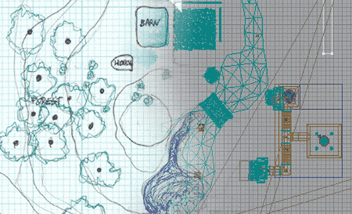
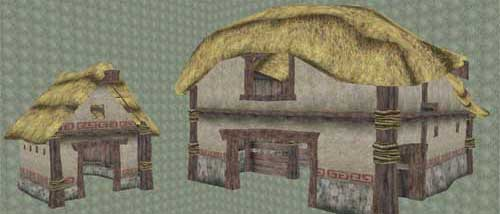

# Runtime Map Process

* [Runtime Map Process](RuntimeMapPreproduction.md#runtime-map-process)
  + [Introduction](RuntimeMapPreproduction.md#introduction)
  + [Know Your Audience](RuntimeMapPreproduction.md#know-your-audience)
  + [Determine Goals](RuntimeMapPreproduction.md#determine-goals)
  + [Laying it Out on Paper](RuntimeMapPreproduction.md#laying-it-out-on-paper)
  + [Determining Necessary Art Assets](RuntimeMapPreproduction.md#determining-necessary-art-assets)
  + [Signing Off on the Design](RuntimeMapPreproduction.md#signing-off-on-the-design)

## Introduction

No matter what a map is for, be it a game, simulation, or interactive art piece, it should be well thought out to save you from unnecessary headaches down the line. This document talks about what preproduction steps you should take before you start a map using the EM\_RunTime map as a reference. To download the Runtime build and map click on the following link:[http://udn.epicgames.com/pub/Powered/UnrealEngine2Runtime/](rsrc/Powered/UnrealEngine2Runtime/)

## Know Your Audience

Who your audience is will dramatically affect the look and design of your map. If you're making a map for the typical gamer, then you will want to make sure that your level has flash and pizzazz and plenty of intricate detail, but it can also have random elements such as floating coins that restore life. For contrast, if your intended audience is comprised of architects, then your level should focus more on realism and how everything would actually fit together in reality.The intended audience for the EM\_RunTime map includes people who are looking at the Unreal Engine or just any game engine for the first time. The EM\_RunTime map is also intended to be useful for people looking to see how all the different elements of unreal can work together. While the map isn't specifically intended for the typical gamer, it may still be useful for looking at the level to see how the effects demonstrated in the level are put together.

## Determine Goals

Once the audience is known and you have a general idea of the purpose of your level, you can start laying out a set of goals. Having good solid goals goes a long way to helping you design your level. The goals for the EM\_RunTime map were the following:

* Show off what can be done with the Unreal Engine
* Make a pretty scene that's not too fantastic
* Keep the total download size relatively low (around 5 MB)
* Include a little bit of everything

## Laying it Out on Paper

Now you're ready to start designing. Diving straight into the editor without a laid out plan can often end up taking more time than it saves. It's well worth your time to spend a few minutes laying out where you want everything to go and drawing it roughly to scale. Graph paper divided in powers of 2 blocks is highly recommended for helping figure out how big your level will need to be. Below is the initial sketch with notes for the EM\_RunTime map

This sketch was useful in maintaining a consistent scale. Also note that it is somewhat rough and not designed down to the detail. It's important to find the right balance of detail so that you have enough to lay out the level, but not so detailed that designing the map takes as long as building it. A good plan minimizes the amount of stuff you will have to redesign, but know that there will probably be some minor details that will require redesigning along the way.

## Determining Necessary Art Assets

After your sketch is finished, you can very easily see what art assets you will need. Directly from the map you've drawn you can make a list of the assets you'll need, and then the level designer and the artist can start working in tandem. Here is the list of art assets that were needed at the start of the EM\_RunTime map:

* Trees
* Farm Buildings
* Stonewall
* Wheat Field
* Bushes
* Fire and Torches
* Waterfall
* Terrain Textures
* Lake and Water Textures
* Entrance Meshes for Underground BSP Space

Later a few more models were added to the list:

* Arches for the BSP Area
* Gate Mover
* Light Well with Light Beam

Once the artists have a list of meshes, he or she can start gathering visual research. Good visual research can not only keep the art consistent, it can also prove to be useful source art when creating the textures. Here are some good sites for gathering reference art and source art:

* [http://www.google.com](http://www.google.com/imghp?hl=en&tab=wi&ie=UTF-8&oe=UTF-8&q=) using the image search
* <http://corbis.com/> a standard for any visual artist
* <http://ebay.com/> good for straight on shots taken from many angles

Most of the art assets for the EM\_Runtime map were donated by [Demiurge Studios](http://www.demiurgestudios.com/) from models they had already made.

## Signing Off on the Design

Assuming your map is going to be used in the "real world," you are probably going to have to have someone sign off on the design. All of this planning and designing should go a long ways to helping you get your level approved. With a solid preproduction process, you should be able to clearly define your project, put together a schedule, and ultimately get approval.Through this process, the EM\_RunTime map was cleared. There was of course some back and forth, but all in all the final design held fairly true to the original designs. For more about the process of actually creating the EM\_RunTime doc, see the [RuntimeMapProcess](RuntimeMapProcess.md) doc.
