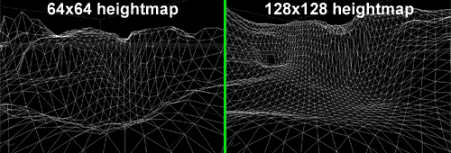
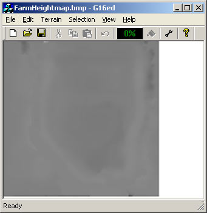
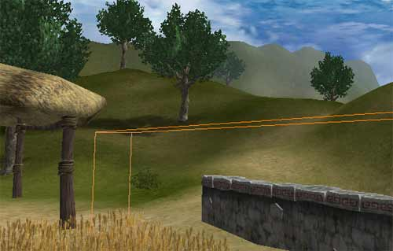
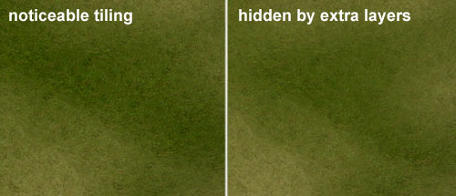
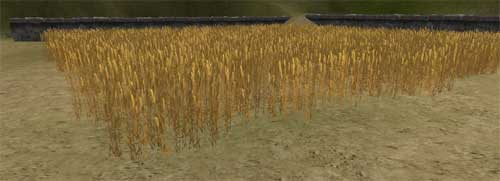
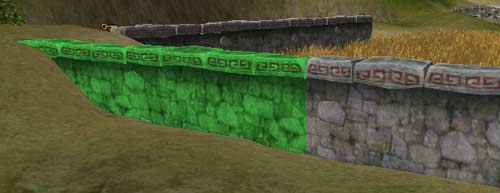
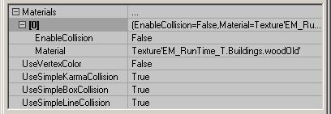
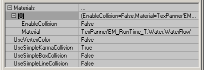

# Runtime Map Process

*Document Summary: Here you will see a detailed look at the process for creating some of the features of the EM\_RunTime map.**Document Changelog: Last updated by Jason Lentz (DemiurgeStudios?), for creation purposes. Original author was Jason Lentz (DemiurgeStudios?).*

* [Runtime Map Process](RuntimeMapProcess.md#runtime-map-process)
  + [Introduction](RuntimeMapProcess.md#introduction)
  + [Purpose of the EM\_RunTime Map](RuntimeMapProcess.md#purpose-of-the-em_runtime-map)
  + [The Terrain](RuntimeMapProcess.md#the-terrain)
    - [Changing Resolution](RuntimeMapProcess.md#changing-resolution)
    - [Restricting Vistas with Terrain](RuntimeMapProcess.md#restricting-vistas-with-terrain)
    - [Hiding Texture Tiling](RuntimeMapProcess.md#hiding-texture-tiling)
  + [StaticMesh Guidelines](RuntimeMapProcess.md#staticmesh-guidelines)
    - [Size Matters](RuntimeMapProcess.md#size-matters)
    - [Modular Design](RuntimeMapProcess.md#modular-design)
    - [Collision](RuntimeMapProcess.md#collision)
  + [Setting up the Water](RuntimeMapProcess.md#setting-up-the-water)
    - [Advantages of the StaticMesh water surface](RuntimeMapProcess.md#advantages-of-the-_staticmesh-water-surface)
    - [Advantages of the FluidSurface water surface](RuntimeMapProcess.md#advantages-of-the-_fluidsurface-water-surface)
    - [Final Decision](RuntimeMapProcess.md#final-decision)

## Introduction

The purpose of this doc is to explain the process of how the EM\_RunTime map was created and reasoning behind the choices that were made in the map. Specifically, this doc takes a close look at the StaticMeshes, creation of various bodies of water, and setting up the Terrain. If you are new to the Unreal Engine or you are just curious to see someone else's thought process, then this doc should prove to be very enlightening.To download the Runtime build and map click on the following link:[http://udn.epicgames.com/pub/Powered/UnrealEngine2Runtime/](rsrc/Powered/UnrealEngine2Runtime/)

## Purpose of the EM\_RunTime Map

First of all, you should know the purpose of the EM\_RunTime map is to demonstrate what can be done with the Unreal Engine (specifically using the Runtime build) to people who may not be familiar with games and/or are curious to see what kind of magic can be done with the engine.In the EM\_RunTime map are a variety of effects and elements that can be used in different ways. To see more about how the different elements can be used together, take a look at the [BreakAwayExample](BreakAwayExample.md) doc.

## The Terrain

### Changing Resolution

Setting up the Terrain was one of the first things done for the EM\_RunTime map. At first a lower resolution terrain was used (64x64) since it was expected that the majority of the Terrain would be able to be seen from most view points. Later it was decided that a 64x64 Terrain was too polygonal, and a new higher resolution terrain was necessary. Below you can see the difference between the old terrain and the new.

Since much of the Terrain was already roughly laid out, it was not worth it to start over. Instead, the "UnrealEd3 G16 file editor" (created by [Martin Bell](http://homepage.ntlworld.com/martingbell/) was used to double the resolution of the Terrain Height Map and then it was re-imported, scaled in the TerrainInfo, and then smoothed over using the Terrain editor in Unreal Ed.

You can download this tool from Martin Bell's site: <http://homepage.ntlworld.com/martingbell/ut2003/>

### Restricting Vistas with Terrain

As mentioned above, the Terrain resolution was increased which means that more triangles were used per section of the Terrain. This change meant that it was not longer acceptable to be able to see as much of the Terrain as we could before since the triangle count had essentially quadrupled. So to reduce the amount of visible Terrain, a berm was raised in the Terrain to separate the farm portion of the Terrain from the wide open landscape. Then beneath the berm, an Antiportal was added to make sure that all the Terrain Sectors that were behind the berm would be properly occluded and not drawn by the renderer.

Above you can seen the Antiportal as the orange wirefame box beneath the Terrain that will hide anything that is entirely occluded by that box.

### Hiding Texture Tiling

To minimize download size, the textures for the terrain were also kept to a smaller size than is usually used in a typical game. No matter what resolution image you choose though, there will always be some balance between scaling the image across the terrain and noticeable tiling across the terrain. This balance was achieved in the EM\_RunTime map by first setting the terrain textures to an appropriate scale so they looked good at the viewer's feet, and then additional Terrain layers were added to blend away the tiling.

Two techniques were used to reduce the noticeable tiling.

* layering entirely different textures at different opacities
* layering the same texture, but rotated and scaled at different opacities

In total there were 5 Layers used in the Terrain, 2 using the grass texture, 2 using the dirt texture, and one texture for the River bed.Note that because you have great control of what textures are applied where on the Terrain, you can use the Painting Tool in the Terrain editor to create paths where there otherwise isn't one to help guide the viewers where you would like them to go.

## StaticMesh Guidelines

There are several things to consider when creating a mesh such as how many materials will be used, how much texture memory can be devoted to the mesh, how many triangles it will be, what sort of collision it has, as well as how it will work with the rest of the level. Here you will find a couple of guidelines for creating StaticMeshes for your own levels.For more information on StaticMeshes, see the [StaticMeshesTutorial](../Content Creation/Primitives/StaticMeshesTutorial.md)

### Size Matters

When creating StaticMeshes, there are many things to consider for performance reasons, and often these considerations are influence by the end platform you intend on running on (X Box, Playstation, PC). The EM\_RunTime map is intended to run on a PC platform. Most of the considerations taken into account on the EM\_RunTime map can be applied to most any platform though.First of all, the size of the meshes was a consideration, not in dimensions, but rather in number of triangles. Smaller is almost always better since the fewer triangles per mesh, the faster it will be to render, but sometimes it is better to have one larger mesh rather than several small ones. The wheat field is a good example of this.

The wheat field could have been made up of several smaller copied StaticMeshes placed next to each other, but it would actually have rendered more slowly than if it was one entire mesh. This is because that there is some overhead for rending an individual mesh. So even though the scenes may have looked identical, the wheat field composed of one large mesh will render much faster than a wheat field composed of dozens and dozens of smaller meshes.In general, StaticMeshes that are around 1,000 - 2,000 triangles are the ideal size, but this is merely a rule of thumb and to really find the optimal size for your meshes, you will want to work with your programmers in profiling the scene to find out what is best for your situation.

### Modular Design

In the EM\_RunTime map there wasn't a wide variety of StaticMeshes used and most of the meshes were custom meshes for only one use, so there wasn't a strong need for modular design. An example of it can be seen in the stonewall mesh.

Each section of the wall is only 512 units long and is designed to laid down in seamless rows. Working in large powers of 2 (such as 128, 256, and 512) can greatly simplify a level designers task of laying down world geometry as it allows for StaticMeshes to snap perfectly to the grid allowing them to line up with other meshes built with modular design in mind.This type of modular design was also used in the [BSP section](BreakAwayExample.md#bsp_editing_tools_and_techniques) of the EM\_RunTime map. To read more about the principles of modular level design, take a look at the [WorkflowAndModularity](WorkflowAndModularity.md) doc.

### Collision

While StaticMeshes render quicker than any other geometry type, the do have their disadvantages -namely, they can be somewhat processor intensive when calculating for collisions. There are of course ways simplify StaticMesh collision. In the EM\_RunTime map, all of the StaticMeshes were given simplified collision hulls (described in further detail in the [ImportingKarmaActors](ImportingKarmaActors.md) doc). Then upon importing the ASEs make sure all of the collision properties are set as follows:

This will cause actors to collide not with the geometry of the StaticMesh which is often quite complicated, but instead with the much simpler collision hull that you've created in the third party modeling program. Another advantage of this is that not only will the collision calculations be simplified, it will also make the file size of the StaticMesh package smaller since some data about collision is stored within the meshes.Another way to simplify collision is just to turn off all collision in the actor if you never want to collide with it. The mesh used for the surface of the lake for instance, is set up to have all of its collision turned off in this manner.

Also StaticMeshes used in DecoLayers, such as the bushes in the EM\_RunTime map, will have no collision.

## Setting up the Water

There was a fair bit of experimentation and back and forth with creating a good effect for the water surface. There were two main methods that were explored:

* A StaticMesh with tweaked texture coordinates
* A FluidSurface

### Advantages of the StaticMesh water surface

With the StaticMesh water surface, the UV coordinates for the mesh can be tweaked so that when a texture is applied to it (specifically a TexPanner Material), it appears as if the water is flowing along the shape of the body of water instead of just statically flowing in one straight direction. Also by using a specially designed StaticMesh, it will render more quickly as it will most likely have less triangles than a FluidSurface as well as having those triangles just naturally rendering faster as it is a StaticMesh

### Advantages of the FluidSurface water surface

A FluidSurface has the advantage of being interactive with the player creating for a more dynamic environment. This method of water surface also allows for adding ambient ripples coming from the source of the waterfall. For more examples of FluidSurfaces in actions take a look at some of the Unreal Tournament 2003 maps listed below:

* DM\_Antalus.ut2 (out to the left exit from the central underground portion)
* CTF\_December.ut2 (beneath the boat)

Or these maps that will run on the UDN Off Build 2226

* Rising Water maps ([ExampleMapsRisingWater](ExampleMapsRisingWater.md))

Also you can learn more about FluidSurfaces from the [FluidSurfaceTutorial](../Content Creation/Primitives/FluidSurfaceTutorial.md) doc.

### Final Decision

Ultimately it was decided that both types of water surfaces should be included so the advantages and disadvantages of both could seen for yourself. The lake uses a StaticMesh for the surface of the lake, and behind the wheat field a small FluidSurface pond is placed so that players can run through it and watch the waves.
