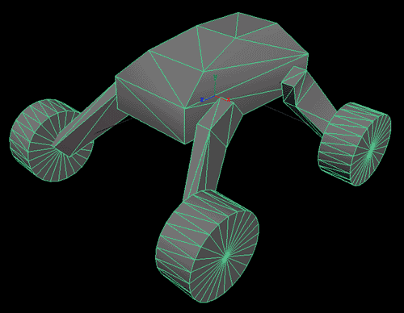
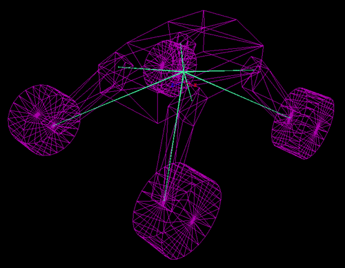
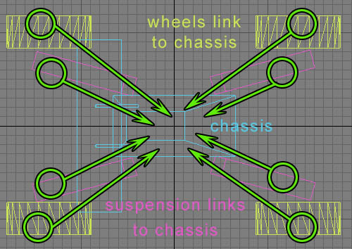
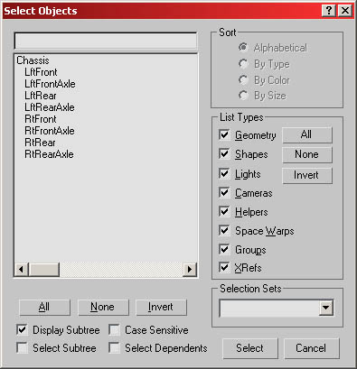
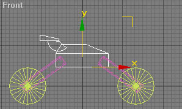
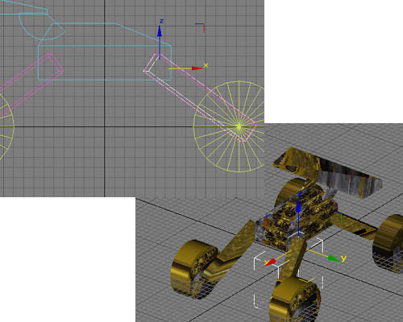
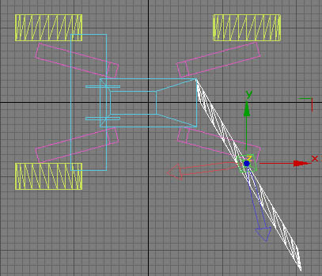

# SVehicle Creation

Document Summary: This document goes over how to create SVehicles (also known as skeletal vehicles) in 2226 builds or later using either Maya or 3DS MAX.Document Changelog: Last updated by Michiel Hendriks, small v3323 update. Created on 8/11/03 by Chris Linder, Tom Lin, Chris Sturgill (DemiurgeStudios?) for build 2226.

* [SVehicle Creation](SVehicleCreation.md#SVehicle Creation)
  + [Related Documents](SVehicleCreation.md#Related Documents)
  + [Do First (pre-v3323)](SVehicleCreation.md#Do First (pre-v3323))
  + [Intro](SVehicleCreation.md#Intro)
  + [Creation Overview](SVehicleCreation.md#Creation Overview)
  + [Rendering Speed Concerns](SVehicleCreation.md#Rendering Speed Concerns)
  + [Center of Mass and Inertia](SVehicleCreation.md#Center of Mass and Inertia)
  + [Creating SVehicles in Maya](SVehicleCreation.md#Creating SVehicles in Maya)
    - [Making the Car](SVehicleCreation.md#Making the Car)
      * [Bone Orientation](SVehicleCreation.md#Bone Orientation)
    - [Importing the Car in UnrealEd](SVehicleCreation.md#Importing the Car in _UnrealEd)
  + [Creating SVehicles in 3D Studio MAX](SVehicleCreation.md#Creating SVehicles in 3D Studio MAX)
    - [Making the Car](SVehicleCreation.md#Making the Car)
      * [Construction](SVehicleCreation.md#Construction)
      * [Linking](SVehicleCreation.md#Linking)
      * [Naming](SVehicleCreation.md#Naming)
      * [Orientation](SVehicleCreation.md#Orientation)
      * [Pivot Points](SVehicleCreation.md#Pivot Points)
      * [Mirroring](SVehicleCreation.md#Mirroring)
      * [Reset Pivots](SVehicleCreation.md#Reset Pivots)
      * [Exporting](SVehicleCreation.md#Exporting)
      * [MAX Model](SVehicleCreation.md#MAX Model)
    - [Importing the Car in UnrealEd](SVehicleCreation.md#Importing the Car in _UnrealEd)
  + [Setting Up SVehicles in UnrealEd](SVehicleCreation.md#Setting Up SVehicles in _UnrealEd)
    - [Set up Collision Volumes](SVehicleCreation.md#Set up Collision Volumes)
    - [Rigidize](SVehicleCreation.md#Rigidize)
    - [Setting up Wheel Axes](SVehicleCreation.md#Setting up Wheel Axes)
    - [Setting up Suspension Axes](SVehicleCreation.md#Setting up Suspension Axes)
    - [Save the Animation Package](SVehicleCreation.md#Save the Animation Package)
  + [Rockin' Your Model In-Game](SVehicleCreation.md#Rockin' Your Model In-Game)
  + [Download](SVehicleCreation.md#Download)

## Related Documents

[SVehicleReference](SVehicleReference.md) [SVehicleMayaMAXFix](https://udn.epicgames.com/Two/SVehicleMayaMAXFix) [AnimBrowserReference](../Content Creation/Animation/AnimBrowserReference.md) [KarmaReference](../Content Creation/Physics/KarmaReference.md) [KarmaCarCreation](KarmaCarCreation.md) [KarmaCars](KarmaCars.md) [HotRod](HotRod.md)

## Do First (pre-v3323)

*Not relevant for v3323 or newer, SVehicles is already present in the v3323 codebase.*This document assumes that you have merged a patch for SVehicles into your codebase. The code change does two things; first it allows you to pick the axis about which wheels rotate, and second it changes it so that wheels and suspension rotate about local bone axes, not world axes.If you do not have this code change, you can still make SVehicles in Maya and this document will be mostly correct. If you are using MAX, you will not be able to get vehicles working without applying this code change.Get the code change here: [SVehicleMayaMAXFix](https://udn.epicgames.com/Two/SVehicleMayaMAXFix)

## Intro

This document will go over what you need to know to create your own SVehicle. It will cover from modeling the vehicle to putting it in the engine. Included in this document are example vehicles in both Maya and 3D Studio MAX. This document also includes a .UKX animation package and map with these vehicles in the game.This document does not go over how to tune vehicles or how to create completely new types of SVehicles. See the [SVehicleReference](SVehicleReference.md) for information in that vain.

## Creation Overview

SVehicles are a different type of Karma vehicle than KVehicles. The main difference between SVehicles and KVehicles is that SVehicles are made of skeletal meshes as opposed to static meshes. You access SVehicles from the "Animations" browser and you export SVehicles from the modeling program with [ActorX](../Content Creation/Tools/ActorX.md). Because the meshes have skeletons, SVehicles can include things like tires and moving gun turrets in the single mesh for the vehicle. Previously, with KVehicles, any moving part has to be a separate mesh and a separate object.SVehicles can be made in both Maya and 3D Studio MAX though the creation process is very different for each. Maya uses bones to control the different parts of the mesh. This is very similar to the normal animated skeletal mesh creation for Unreal. MAX on the other hand does not use any bones, despite the fact that this is a skeletal mesh. Object hierarchy in MAX can be used to generate a skeleton in Unreal. The different parts of the mesh are actually different objects in MAX all "linked" to the root object.Once created, unlike all other skeletal meshes for Unreal, SVehicles are not animated. The only thing that is important is the mesh/refpose; this is the only thing you should export from the modeling program and the only thing you should import into UnrealEd. Once in Unrealed, SVehicles are not linked to any existing animation.

## Rendering Speed Concerns

Traditionally, rendering speed is a concern for skeletal meshes in Unreal. This however is not the case for SVehicles, because they can take advantage of [Rigidize](SVehicleCreation.md#Rigidize) which will speed up the rendering of the parts of skeletal meshes that have only one influence. Given that SVehicles generally do not have vertices that are influence by 2 or more bones, [Rigidize](SVehicleCreation.md#Rigidize) makes SVehicles render about as fast static meshes.

## Center of Mass and Inertia

SVehicles are simulated with Karma and so the familiar concepts of center of mass and rotational inertia apply. When modeling an SVehicle, one can affect the center of mass but not the rotational inertia. These topics are covered here:[Center of Mass](SVehicleReference.md#Center_of_Mass)[Rotational Inertia](SVehicleReference.md#Rotational_Inertia)

## Creating SVehicles in Maya

This example will go over how to make a car in Maya and then import it in Unreal and use it as the body for a jeep.

### Making the Car

When making a car in Maya, first start by orienting the car in the forward Z direction (so that the front is pointed toward positive Z and the rear toward negative Z). Note: It is not necessary to change the default coordinate system of Maya. (Maya defaults to a coordinate system in which "Y" is up.) If the vehicle is oriented as described above, this difference in coordinate systems is not an issue.
Next, model the various components of the car (chassis, wheels, suspension struts, etc). These components can be part of a single mesh but they do not have to be; your SVehicle can be made of several different objects as long as they are all bound to the one skeleton. Then go the joint tool, and create a skeleton, placing the joints at the point you want the respective components to rotate. For example, the joint for a tire should be in the center of the tire, so that it rotates correctly. Non-intuitively, tires are not children of suspension bones. They are both children of the chassis. For example, a car's front right tire would not be a child of the front right strut. They would both be a child of the chassis.
Once the skeleton is created and the joints are correctly placed, bind the geometry to the skeleton using Smooth Bind. Then, in the Component Editor, set the influence of each vehicle part to it's respective joint. It's a very good idea to bind all the verts of a given vehicle part to a single bone, to keep things rigid. For example, all the verts of a tire should be influenced only by the Right Tire joint.
Finally, export the geometry using the Actor X skeletal exporter to a .PSK file.The following images show the vehicle in Maya:

You can download the [MayaCar.mb](rsrc/Two/SVehicleCreation/MayaCar.mb) file to see the car described in this example.

#### Bone Orientation

By default, when creating bones in Maya, each bone will be oriented with world coordinates (X is left, Y is up, Z is forward). The orientation of bones is important because it is along the axis of bone's coordinate system that wheels and suspension rotate. By changing the orientation of a bone's coordinate system, you can get the wheels and suspension to rotate around axes other than world axes.This is done in one of the Maya example cars. The wheels of this car are flared out and do not rotate on an orthogonal axis. You can download the [MayaCarTilted.mb](rsrc/Two/SVehicleCreation/MayaCarTilted.mb) file to see this car.

### Importing the Car in UnrealEd

Once you have the .PSK file, you are ready to import the car into UnrealEd. Open the "Animations" browser in UnrealEd and select "Mesh import" from the File menu. Find the .PSK file you want and then in the "Import Mesh/Animation" make sure you check "Assume Maya coordinates" box and then click "OK". At this point, models from Maya and MAX are basically the same except that the coordinate systems are most likely different. Now you are ready for the [Setting Up SVehicles in UnrealEd](SVehicleCreation.md#Setting_Up_SVehicles_in_UnrealEd) section.

## Creating SVehicles in 3D Studio MAX

This example will go over how to make a car in MAX and then import it in Unreal and use it as the body for a jeep.

### Making the Car

Making an SVehicle car from 3D Studio Max is actually pretty easy, once you know all the little tricks and requirements that you have to fulfill. There are a few steps to it; I'll address them in creation order.

#### Construction

Making a vehicle in max is pretty easy. No bones/weighting/etc is necessary at all; all you have to do is create a collection of objects linked up correctly. The most important concept to remember is that the linking process will be interpreted in Unreal as the bone hierarchy, so doing that correctly is very important.

#### Linking

There are no hard limits on the number of suspension struts or how many tires you can have on a vehicle. In general you want to link each individual piece to the main body of the vehicle. You could link to an intermediary bone that links back to the main body, but at least when making a car, this serves no purpose. Make sure you don't link the tires to the suspension struts.

Your hierarchy should look like this if you've done the linking correctly.

#### Naming

This will change depending on your vehicle, and your programmers. If there is already a standard in place, simply ask your friendly neighborhood programmer to give you the desired names for the individual pieces. Otherwise, just make sure the names of the pieces are all different. If they are logical, that's even better.

#### Orientation

To make sure that the import process goes smoothly, make sure your model is oriented facing in the positive X direction.

#### Pivot Points

When you set up your car, you will need to change the pivot points for some of the components. The struts shown on the mockup car (see image, below) demonstrate where the pivots should be placed; the logical connection between the struts and the chassis of the car.

The orientation of the pivots is also important because it affects which way the tires and suspension rotate. You can see the alignment of the pivots by going to hierarchy and clicking "Affect Pivot Only". You should be able to freely rotate the pivots with this selected. If for some reason you can not rotate the pivot without affecting the object, you need to [Reset Pivots](SVehicleCreation.md#Reset_Pivots).In the example car all the pivots are oriented with the world coordinate system. This means that X (red) is forward, Y (green) is left, and Z (blue) is up. In most cases, this is what you want. You can set all the pivots by selecting all the objects, making sure "Affect Pivot Only" is selected and then typing 0.0 in all the "Absolute:World" rotation dialog. (You can set the car to a Maya coordinate system by typing 90 in X and 90 in Z.)Now that we have the pivots set to world orientation, we can easily see
we want the wheels to rotate around the Y axis.

The suspension can rotate about either the Y axis or the X axis depending on what you want (they look different but both look good).

If you want the suspension or the wheels to rotate around a non-world axis, you can simply rotate the pivot till it is oriented with one of the axes pointed along the axis about which you want to rotate.

#### Mirroring

A word of caution: mirroring pieces of your car will also result in mirroring of your pivot point coordinate systems. If you mirror pieces, make sure to correct your pivots (see below) before importing the vehicle.

#### Reset Pivots

If you find that your coordinate system is broken in some way, you may need to reset your pivot points. If you are rotating your pivot points and you see something like this happening, you'll want to fix them.

To fix this, I've found an ugly set of steps that works. If you find a better system, please let me know.

* Create a new primitive, and make sure it has the correct pivot alignment.
* Attach all the objects in your model to this new primitive. It should be one noncontinuous mesh when you are finished.
* Detach all the pieces from the primitive.
* You should see that the individual components have inherited the correct pivot from the primitive.
* Delete the primitive.
* Re-center all of the pivot points for your various components.
* Rename all of your component pieces.
* Link pieces to chassis and export.

#### Exporting

Exporting is fairly simple. In actorX, make sure the `all textured' checkbox is checked. Uncheck all the other boxes. Export your .PSK, and voila. You're done. Make sure, of course, that your model is textured and that there is nothing in the scene that you don't want exported.

#### MAX Model

You can download the [MAXCar.max](rsrc/Two/SVehicleCreation/MAXCar.max) file to see the car described in this example.

### Importing the Car in UnrealEd

Once you have the .PSK file, you are ready to import the car into UnrealEd. Open the "Animations" browser in UnrealEd and select "Mesh import" from the File menu. Find the .PSK file you want and then in the "Import Mesh/Animation" set up the package, group, and name, then click "OK". At this point, models from MAX and Maya are basically the same except that the coordinate systems are most likely different. Now you are ready for the [Setting Up SVehicles in UnrealEd](SVehicleCreation.md#Setting_Up_SVehicles_in_UnrealEd) section.

## Setting Up SVehicles in UnrealEd

Once you have the vehicles you made in UnrealEd, you will need to do a few things before you can use it.

### Set up Collision Volumes

Meshes need at least one collision volume defined before they will work. Adding collision volumes is described in the [SVehicle Reference](SVehicleReference.md#Collision_Volumes).

### Rigidize

As mentioned in [Rendering Speed Concerns](SVehicleCreation.md#Rendering_Speed_Concerns) Rigidize speeds up the rendering of SVehicles. See the [Animation Browser Reference](../Content Creation/Animation/AnimBrowserReference.md#Rigidize) for more details on Rigidize.Rigidize is part of the LOD settings of the mesh in the Animations browser. By default, meshes will have 4 levels of detail. You only want one. Delete all but the first LOD in *LODLevels*. In the one remaining LOD, go to *Rigidize* and set *MeshSectionMethod* to "MSM\_Mixed". Once this is done, pull down "Mesh" in the main menu bar and select "Redigest Lod". Now click the wireframe button (it is the button with the yellow wireframe) on the tool bar. Your model should now be all red. If any part is yellow, that means it has more than one influence and it will not be rigidized.

### Setting up Wheel Axes

Now you need to pick which axis the wheels should rotate about. The axis you are choosing is an axis of the wheel's local bone coordinate system defined in the modeling program. This is defined per wheel in the *Wheels* array of the SVehicle. Refer to the [BoneRollAxis](SVehicleReference.md#BoneRollAxis)  and [BoneSteerAxis](SVehicleReference.md#BoneSteerAxis)  variables in the [SVehicleReference](SVehicleReference.md) doc.If you created your model in Maya, you probably don't need to change anything because by default, wheels rotate about the X axis of the wheel bone coordinate system. In Maya the default orientation of bone coordinate systems points the X axis to the left, which makes it the correct axis to rotate about.If you are using MAX the axis about which you want to rotate depends how you oriented the pivots of the wheel objects (see [Pivot Points](SVehicleCreation.md#Pivot_Points) for more details). If you aligned the pivots with the world coordinates, you should rotate the wheels about the Y axis.

### Setting up Suspension Axes

You need to choose which axis about which the suspension should rotate. The axis you are choosing is an axis of the suspension support's local bone coordinate system defined in the modeling program. This is defined per wheel in the *Wheels* array of the SVehicle. Refer to the [SupportBoneAxis](SVehicleReference.md#SupportBoneAxis) variable in the [SVehicleReference](SVehicleReference.md) doc.If you are using Maya and did not change the orientation of the bones, you will probably want to pick the X axis or the Z axis. The [SupportBoneAxis](SVehicleReference.md#SupportBoneAxis) description talks more about this choice. In the [example map](../assets/svehicleexample.zip), both Maya cars use the X axis but they work ok with the Z axis if you set them to that.If you are using MAX the axis about which you want to rotate depends how you oriented the pivots of the suspension objects (see [Pivot Points](SVehicleCreation.md#Pivot_Points) for more details). If you aligned the pivots with the world coordinates, you probably want to rotate about the X or Y axes. The X axis MAX is the same as the [Z axis](SVehicleReference.md#SupportBoneAxis) in Maya, while the Y axis in MAX is the same as the [X axis](SVehicleReference.md#SupportBoneAxis) in Maya. In the [example map](../assets/svehicleexample.zip), the MAX car uses the Y axis but it will work ok with the X axis if you set it to that.

### Save the Animation Package

Make sure you save. Now you are done with the prep from the model and can start using it.

## Rockin' Your Model In-Game

Now that you have your model set up and saved in an animation package, you can put your model on an SVehicle. The example models were both made to use the same bone names as the *Lynx* which is the jeep in CodeDrop2226. Both of these models can replace the jeep model though the MAX model will require some changes to the wheel and suspension axes.Create a level you want to drive around in. Next place a *Lynx* (Actor->Pawn->SVehicle->SCar->Lynx) in the level. Go to *Display* and set the mesh to be one of the example models. (If UnrealEd crashes while setting the mesh, try setting the mesh to something very simple, like the "WaspMesh" in "AmbientCreatures", then setting it to the example model.) Now play the map and you should have able to drive the vehicles around and have lots of fun!Or you can download the SVehicles [example](../assets/svehicleexample.zip) and unzip it into your build. This includes a map with all the example cars and terrain to drive on. This zip also includes the .UKX for all the cars. This example is not meant to be a release quality work; it is just an example but it works and you can drive around and see how the vehicles behave.The example map is for 2226 only. Because the 3323 codedrop doesn't have the assets used by the example (the Lynx) you can use it directly.

## Download
