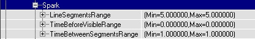
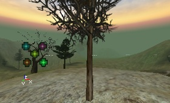
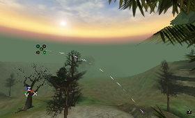
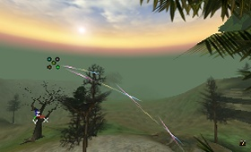
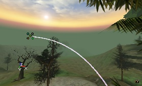
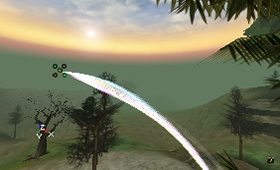
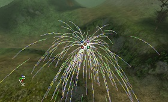
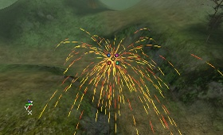

# Spark Emitters

*Document Summary: A reference to properties-based spark emitter editing and creation. (non UDN build).**Document Changelog: Updated by Tom Lin for 2226 build and reorganization. Original Author: Lode Vandevenne.*

* [Spark Emitters](SparkEmitter.md#Spark Emitters)
  + [Introduction](SparkEmitter.md#Introduction)
  + [Acceleration](SparkEmitter.md#Acceleration)
  + [Collision](SparkEmitter.md#Collision)
  + [Color](SparkEmitter.md#Color)
  + [Fading](SparkEmitter.md#Fading)
  + [Force](SparkEmitter.md#Force)
  + [General](SparkEmitter.md#General)
  + [Local](SparkEmitter.md#Local)
  + [Location](SparkEmitter.md#Location)
  + [MeshSpawning](SparkEmitter.md#MeshSpawning)
  + [Rendering](SparkEmitter.md#Rendering)
  + [Revolution](SparkEmitter.md#Revolution)
  + [Rotation](SparkEmitter.md#Rotation)
    - [RotationOffset, RotationNormal, UseRotationFrom](SparkEmitter.md#RotationOffset, _RotationNormal, _UseRotationFrom)
  + [Size](SparkEmitter.md#Size)
  + [SkeletalMesh](SparkEmitter.md#SkeletalMesh)
  + [Spark](SparkEmitter.md#Spark)
    - [LineSegmentsRange](SparkEmitter.md#LineSegmentsRange)
    - [TimeBeforeVisibleRange](SparkEmitter.md#TimeBeforeVisibleRange)
    - [TimeBeforeSegmentsRange](SparkEmitter.md#TimeBeforeSegmentsRange)
  + [Spawning](SparkEmitter.md#Spawning)
  + [Texture](SparkEmitter.md#Texture)
  + [Tick](SparkEmitter.md#Tick)
  + [Time](SparkEmitter.md#Time)
    - [InitialTimeRange](SparkEmitter.md#InitialTimeRange)
  + [Trigger](SparkEmitter.md#Trigger)
  + [Velocity](SparkEmitter.md#Velocity)
  + [Warmup](SparkEmitter.md#Warmup)

## Introduction

This document will cover spark emitters, one of four different possible emitters available in the 2226 build. For more information on general emitter properties, see [EmittersReference](../Content Creation/Effects/EmittersReference.md). For more information on the other three emitter types, see [SpriteEmitter](https://udn.epicgames.com/Two/SpriteEmitter), [MeshEmitter](MeshEmitter.md) and [BeamEmitter](BeamEmitter.md).Spark Emitters are perhaps the least-used of the four emitter types. They're not nearly as flexible as sprite emitters or mesh emitters, and not as flashy as the beam emitter. The effect is similar to the kind of sparks you might see during welding. This emitter turns its source texture into one thin line with the colors of the texture. Settings such as Acceleration and Velocity still work on it, but many (Collision, Spin, SizeScale, etc.) don't work on it because the particles are limited to be lines.Perhaps because they are so limited in use, spark emitters don't have many class-specific fields to worry about.

## Acceleration

You will almost certainly want to use acceleration with a spark emitter. Without it, your particles will remain perfectly straight, thin lines. Since this emitter is good at simulating a real world phenomenon, it's useful to have a negative Z value in this field, to approximate gravity.If you want your particles to move with a consistent speed, then you should be looking at the Velocity field.Also note that acceleration isn't given in a range of values, so all your particles will accelerate at the same rate. To get some noise into your particle motions, use varying velocities.

## Collision

This does not function at all with SparkEmitters. Ignore this field.

## Color

This functions almost normally. Since changing the color of the sparks emitted is one of the few options available, you may be tempted to spend lots of time in this section. However, the ColorScale operates on particles on a per-segment basis, so the end effect may not be exactly what you are looking for. See the [Emitters Tutorial](../Content Creation/Effects/EmittersReference.md#Trigger) for more information.

## Fading

The fading fields may especially be of use in this type of system, since they are otherwise very discretely `on' or `off.' Unfortunately, these also work on a per-segment basis, like the ColorScale. See the [Emitters Tutorial](../Content Creation/Effects/EmittersReference.md#Trigger) for more information.

## Force

This doesn't often need to be set with spark emitters.

## General

Of note in this field is the MaxParticles field. Spark emitters in particular seem to benefit from a higher number of particles. This is because each segment of a single `spark' that is cast of of an emitter is actually counted as an individual particle. So, if you have a MaxParticles number of 20, it is possible to have only 4 sparks, each with 5 segments (which are really particles). Don't be afraid to crank this number up a little high, to take this into account.

## Local

These fields operate normally. See the [Emitters Tutorial](../Content Creation/Effects/EmittersReference.md#Trigger) for more information.

## Location

These fields operate normally. See the [Emitters Tutorial](../Content Creation/Effects/EmittersReference.md#Trigger) for more information.

## MeshSpawning

These fields operate normally. See the [Emitters Tutorial](../Content Creation/Effects/EmittersReference.md#Trigger) for more information.

## Rendering

These fields operate normally. See the [Emitters Tutorial](../Content Creation/Effects/EmittersReference.md#Trigger) for more information.

## Revolution

Revolution will not affect spark emitters. Ignore this section.

## Rotation

Rotation is possible, but only in a very limited format. Spark particles do not rotate once they are spawned. The rotation that can be changed is only the initial spawning direction of the particle system, and will not affect the post-spawn lifetime.

### RotationOffset, RotationNormal, UseRotationFrom

These fields can be used to set the initial spawning direction of the particles. See the [Emitters Tutorial](../Content Creation/Effects/EmittersReference.md#Trigger) for more information. All other fields can be ignored.

## Size

This does not affect the size of SparkEmitter particles. Their length depends on values in the Spark section. Ignore all fields in this section.

## SkeletalMesh

These fields operate normally. See the [Emitters Tutorial](../Content Creation/Effects/EmittersReference.md#Trigger) for more information.

## Spark

This section is of course central to the spark emitter. There aren't many fields in here to change, but they have a big effect on how your system will look.

### LineSegmentsRange

This will control how long your spark segments will be. Take care not to make them too large, otherwise it'll be easy to see the individual, straight segments. You can also make the length random if you enter a different Min and Max value. If you make this setting too high or too low (depending on other settings), the SparkEmitter will not work. The first screenshot has Min = Max = 5, the second screen has Min = Max = 3.

### TimeBeforeVisibleRange

This field doesn't seem to work, bringing the amount of useful spark emitter fields in this section to two. Ignore it.

### TimeBeforeSegmentsRange

The effect of this setting is most visible if the path your particles take is curved, when you use some acceleration. The value in this range determines in how many segments the line should be divided into. If TimeBetweenSegmentsRange is low, for example 0.1, the line will be divided into a lot of segments so the curve looks smooth (first screenshot). If it's high (for example 0.5), you'll see the line broken into segments. (second screenshot). A higher TimeBetweenSegmentsRange means less particles and thus better performance, but it doesn't look as good.

For low TimeBetweenSegmentsRange settings, there will have to be created more particles (every segment of the line is a particle), so you might have to set MaxParticles (In General) and InitialParticlesPerSecond (In Spawning) to something higher before it looks good. A very high MaxParticles and InitialParticlesPerSecond might create something like this (again with low and high TimeBetweenSegmentsRange)

## Spawning

Make sure to set appropriate values in the Spawning fields. These figures will affect how quickly particles are created, over the lifetime of your emitter. For a more in-depth review of Spawning, see the [Particle Systems](../Content Creation/Effects/EmittersReference.md#Spawning) document.

## Texture

Texture is a funny topic with spark emitters. It's already been mentioned that the spark color is drawn from which texture is chosen, but it's worth mentioning again that your texture will be used only as a 1-pixel wide line for each spark particle. As you might imagine, most of the texture fields are ignored when dealing with spark emitters (or might as well be).Having said that, your choice of texture **will** have an impact on your particle system.
The picture on the left is using the standard `five colored balls' icon that is used to represent particle systems, and on the right a fiery texture is used.

## Tick

This functions normally. See the [Emitters Tutorial](../Content Creation/Effects/EmittersReference.md#Tick) for more information.

## Time

### InitialTimeRange

Trying to set an initial time seems to crash Unreal reliably, when used with spark emitters. Don't do it.The other two fields work as expected. See the [Emitters Tutorial](../Content Creation/Effects/EmittersReference.md#Time) for more information.

## Trigger

This functions normally. See the [Emitters Tutorial](../Content Creation/Effects/EmittersReference.md#Trigger) for more information.

## Velocity

Your velocity settings of your particle system will have a huge impact on how the spark emitter finally turns out - it's one of the primary determinants of the final system appearance, since variables like rotation and size don't affect sparks. Having said that, the variables function as normal. See the [Emitters Tutorial](../Content Creation/Effects/EmittersReference.md#Velocity) for more information.

## Warmup

This functions normally. See the [Emitters Tutorial](../Content Creation/Effects/EmittersReference.md#Warmup) for more information.
