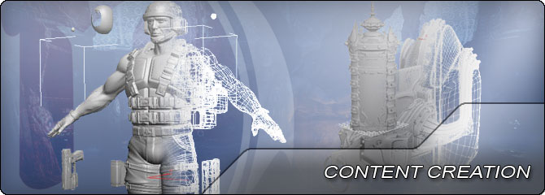
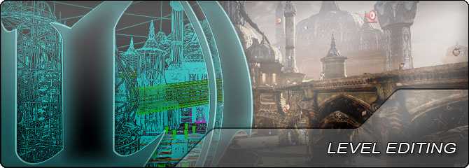

UDN | WebHome 

|* [Main](WebHome.md)
|* [UnrealEngine2](WebHome.md)
|* [UnrealEngine3](WebHome.md)
|* [UnrealEngine4](https://docs.unrealengine.com)
|* [Business & Legal](../Main/BusinessAndLegal.md)
|

UDN

Search public documentation:

WebHome

[日本語訳](WebHomeJP.md)  
[中国翻译](WebHomeCH.md)  
[한국어](WebHomeKR.md)  

---

Interested in the Unreal Engine?   
Visit the [Unreal Technology](http://www.unrealtechnology.com) site.  
  
Looking for jobs and company info?   
Check out the [Epic games](http://www.epicgames.com) site.  
  
Questions about support via UDN?   
Contact the [UDN Staff](../Main/ContactUDNStaff.md)

UE3 Home

---

Welcome to the UE3 section of this documentation, with all the details you need to become an expert with the award-winning [Unreal Technology](http://www.unrealtechnology.com) including Unreal Engine 3 and [Unreal Development Kit (UDK)](http://udk.com).UE3 was the leading engine of the previous generation, but has been improved upon by the [Unreal Engine 4 technology](https://www.unrealengine.com/what-is-unreal-engine-4). Teams who are already developing with UE3 are welcome to continue development and utilize the information provided here; however for new projects, we recommend UE4.Content on this site is not maintained, and may be outdated.

*

[Unreal Engine 3 Basics](UE3Basics.md)

  General Information about developing games with Unreal Engine 3. Minimum Specs - Recommended Hardware and Software - Workflow - Frequently Asked Questions - Console Commands - Commandline Arguments - Confirguration Files - Blogs
*

[Getting Started](GettingStartedOverview.md)

  Information for developers new to Unreal Engine 3 and Unreal Development Kit (UDK). Covers all aspects of the development process: Production Planning - Programming - Content Creation - Level Creation - Profiling & Optimization - Packaging & Distribution
*

[Technical & Programming Home](TechnicalHome.md)

  Information over setting up the engine, extending the Unreal Editor and creating new tools, and general programming with native code and UnrealScript in Unreal Engine 3.
*

[Content Creation Home](ContentHome.md)

  Information involving the creation of art assets and other content such as static meshes, skeletal meshes, materials, etc. in Unreal Engine 3.
*

[Level Editing Home](LevelEditingHome.md)

  Information about the creation of levels and environments including adding scripted gameplay and dynamic interactive and animated events in Unreal Engine 3.
*

[Resource Depot](ResourceDepot.md)

  Links to various tutorials, example code, downloads, and other resources. UDK Gems - Community Links - Video Tutorials - Mod Info - Example Code Crops - Conferences & Events - Mailing Lists.

Development Roles

**Production**

* [Business & Legal](BusinessAndLegalHome.md) - Administrative info for UE3 developers.

**Technical & Programming**

* [Gameplay Programming](GameplayProgrammingHome.md) - Creating new items and elements for use in-game.

**Content Creation**

* [Animator](AnimatorHome.md) - Information for animating skeletal meshes in Unreal Engine 3.
* [Character Artist](CharacterArtistHome.md) - Creating skeletal meshes for characters in UE3.
* [Environment Artist](EnvironmentArtistHome.md) - Creating static meshes to populate environments.
* [FX Artist](FXArtistHome.md) - Information over creating special effects using particles.
* [Technical Artist](TechnicalArtistHome.md) - Tool creation, materials, profiling & optimization, polish.
* [Texture Artist](TextureArtistHome.md) - Guidelines for creating textures to be used in UE3.

**Level Editing**

* [LevelDesigner](LevelDesignerHome.md) - Information for level designers building game worlds.
* [Cinematic Artist](CinematicArtistHome.md) - Information for artists and directors creating cinematic sequences.
* [Lighting Artist](LightingArtistHome.md) - Information for artists lighting game worlds.

Development Topics

* [AI & Navigation](AIAndNavigationHome.md) - Information regarding using navigation systems to create AI.
* [Animation](AnimationHome.md) - Using animations, morph targets, and controllers to deform skeletal meshes.
* [APEX Framework](APEXOverview.md) - Creating cloth and destruction effects using APEX.
* [Audio Home](AudioHome.md) - Overview of the audio system and using sounds in UE3.

* [Commandlets](CommandletHome.md) - References for using and creating commandlets in Unreal Engine 3.
* [FaceFX](FaceFX.md) - Creating facial animations for skeletal meshes in UE3.
* [Foliage](Foliage.md) - Tool for painting instanced foliage and decoration meshes in levels.
* [Gameplay Elements](GameplayHome.md) - Adding new gameplay elements through UnrealScript.
* [Input / Output](InputOutputHome.md) - Methods of inputting and outputting data with Unreal Engine 3.
* [Kismet](KismetHome.md) - Creating dynamic, interactive gameplay events in levels.
* [Landscape](Landscape.md) - System for creating large outdoor terrains.
* [Level Streaming](LevelStreamingHome.md) - Dynamically loading levels to create seamless worlds.
* [Lighting & Shadows](LightingAndShadowsHome.md) - Working with lighting and shadows in Unreal Engine 3.
* [Materials & Textures](MaterialsAndTexturesHome.md) - Creating and using materials in Unreal Engine 3.
* [Matinee & Cinematics](MatineeAndCinematicsHome.md) - Creating in-game cinematics and animated gameplay events.

* [Networking & Replication](ReplicationHome.md) - Overview of the networking system and replication in UE3.
* [Particles & Effects](ParticlesAndEffectsHome.md) - Creating effects in UE3 with particles, decals, fog, and more.
* [Performance, Profiling, & Optimization](PerformanceHome.md) - Techniques for profiling games in Unreal Engine 3.
* [Physics](PhysicsHome.md) - Using PhysX and physical simulations in Unreal Engine 3.
* [Post Process Effects](PostProcessEffectsHome.md) - Applying whole scene effects in Unreal Engine 3.
* [Rendering Subsystem](RenderingHome.md) - Overview of the rendering pipeline in Unreal Engine 3.
* [ScaleForm GFx](Scaleform.md) - Overview of the Scaleform GFx integration in UE3.
* [Skeletal meshes](SkeletalMeshHome.md) - Creating and using animated skeletal meshes in UE3.
* [Static Meshes](StaticMeshHome.md) - Creating and using static meshes in UE3.
* [Unreal Editor and Tools](EditorAndToolsHome.md) - Guides to using level and content creation tools.
* [UnrealScript Home](UnrealScriptHome.md) - Detailed information over the UnrealScript programming language.
* [User Interface & HUD](UIAndHUDHome.md) - Creating user interfaces such as menus and HUDs.

Platforms

* [Mobile](MobileHome.md) - Developing games for mobile platforms using Unreal Engine 3.
* [Mac OS](MacPlatformHome.md) - Publishing and distributing UE3 games for Mac OS.

DirectX 11

* [DirectX 11 Features](DirectX11Rendering.md) - DirectX 11 rendering features in Unreal Engine 3.

Important!

You are viewing documentation for the **Unreal Development Kit (UDK)**.

If you are looking for the Unreal Engine 4 documentation, please visit the [Unreal Engine 4 Documentation](https://docs.unrealengine.com) site.

Don't show me this again
