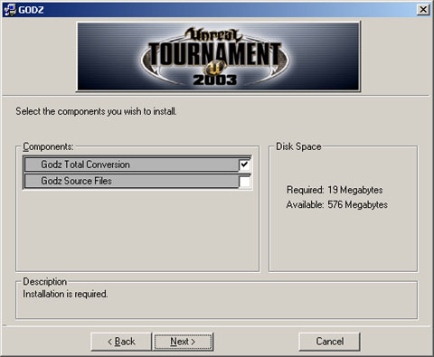

# Creating UMODs

*Last updated by Richard 'vajuras' Osborne ([UdnStaff](https://udn.epicgames.com/Main/UdnStaff)) to apply code corrections. Original author was Richard 'vajuras' Osborne ([UdnStaff](https://udn.epicgames.com/Main/UdnStaff)).*

* [Creating UMODs](UmodInstaller.md#creating-umods)
  + [UMods](UmodInstaller.md#umods)
  + [The Composition](UmodInstaller.md#the-composition)
  + [Building the INI File](UmodInstaller.md#building-the-ini-file)
    - [The Setup Group](UmodInstaller.md#the-setup-group)
    - [Requirement Section](UmodInstaller.md#requirement-section)
    - [Group Section](UmodInstaller.md#group-section)
    - [Shortcut Section](UmodInstaller.md#shortcut-section)
  + [Building the INT File](UmodInstaller.md#building-the-int-file)
    - [Requirement Section](UmodInstaller.md#requirement-section)
    - [Shortcut Section](UmodInstaller.md#shortcut-section)
    - [Group Section](UmodInstaller.md#group-section)
  + [Multiple Language Support](UmodInstaller.md#multiple-language-support)
  + [Creating a Total Conversion Umod](UmodInstaller.md#creating-a-total-conversion-umod)
  + [Wrapping it all up](UmodInstaller.md#wrapping-it-all-up)
  + [Umod Generation Tools](UmodInstaller.md#umod-generation-tools)

## UMods

Umods (Unreal MOD) are platform independant archives that allow mod authors to ship their game content to unreal engine gamers. Umods possess the ability to install files, generate shortcuts, display license agreements, and many other nice capabilities. Users can easily download a umod and the files will be installed to the specified directories (like you would expect from an installer).There are many advantages of delivering a product within a umod:

* **Automatic Uninstall** - Umods can easily be uninstalled by double clicking on setup.exe.
* **Advanced Capabilities** - Umods can basically do almost anything that any other commercial quality installer can do. Umods can generate shortcuts, display license agreements, import files from different source locations so that they can be 'dropped' with a different filename, and many other nice features.
* **Platform Independence** - Umods aren't bound to a specific Operating System.
* **MultiLanguage Support** - The same umod can be used to support multiple localizations. You can include license agreements and readme files for each different type of language.

## The Composition

You only need three components to generate a umod:

* **UCC** (System\UCC.exe) - this executable is used to run 'Commandlets'. UCC Master (MasterCommandlet) is a commandlet that can be executed from the command line. Running this command will generate the umod file.
* **Mod.ini** - defines the files that will be installed, groups, and many other tasks that the umod may perform.
* **Mod.int** - Provides additional product data such as Developer name, URL, Product URL, Version numbers, and shortcut captions.

## Building the INI File

The UCC Master Commandlet uses the mod.ini file to define the overall structure of the umod archive. Umods can be really simple to build if you only specify files to copy or they become really complex once you start defining shortcuts and other nice advanced capabilities.

### The Setup Group

Let's start off by taking a look at the [Setup] group. This default group defines the *Product* that is being installed, attributes such as *Language*, *Requirements*, and *Groups*.Definitions:

* **Product** - name of the product that is being installed. Insert the name of your mod for this entry.
* **Language** - type of language the mod.ini file is defining the settings for. As mentioned earlier, the same umod can be used for multiple languages.
* **Version** - version number of the product you are installing.
* **Archive** - defines the type of archive UCC Master will generate. For example,

  ```
  Archive=GODZ.ut2mod
  ```

  will generate a ut2mod. However, if you alter the extension to umod, then the archive will support Unreal Tournament.
* **Tree** - defines a tree structure. This boolean argument tells UCC Master that this ini file defines selectable groups.
* **SrcPath** - instructs UCC Master where the *source* files will be imported from. Used for the *Src* option for File/Copy commands.
* **MasterPath** - used for the *Master* option for File/Copy commands.
* **Requires** - defines a **requirement**. It's very important that you define the *master product* that your product relies upon. Otherwise, the umod cannot load the default folder that it will be installed to. This makes things harder for your consumer to figure out.
* **Patch** - tells the MasterCommandlet that this product is a Patch.
* **Visible** - is applied to the *Tree* setting mentioned above. Set this attribute to True if you want your selectable groups to be visible.
* **Group** - defines the logical unit that references all the files that will be installed.
* **License** - defines the filename of the license agreement. The english language version should end with the .int file extension. For our example product, Godz, the recommended filename will be

  ```
  GodzLicense.int
  ```

Below is an example INI entry for Setup.

```

[Setup]
Product=GODZ
Language=int
Version=100
Archive=GODZExtreme.ut2mod
Tree=True
SrcPath=.
MasterPath=..
MasterPathUnrealGameContent=..
Requires=UT2003Requirement
Visible=true
Group=SetupGroup
Group=GameGroup
Group=HelpGroup
License=GodzLicense.int
```

### Requirement Section

A requirement section defines the products **your** product that you are installing to the client machine depends upon. For a UT2003 modification, this requirement is **UT2003**. Whenever the client double clicks on the umod, the Setup.exe application loads and it unpackages the umod. Setup checks the local manifest.ini for the game engine and ensures the version number and product matches the requirements. As a word of caution, **never** overwrite the client's manifest.ini file.Note, you can define mutliple requirements.

* **Product** - defines the product that the client must possess on their machine in order to install your modification.
* **Version** - defines the version number that this product requirements. The client can possess a version number higher than what you require but not less. Leave this argument blank if all versions of the game engine is acceptable.

This is an example UT2003 Requirement:

```

[UT2003Requirement]
Product=UT2003
Version=2166
```

### Group Section

A group section defines which files will be installed to the target location. You can do a lot of things with groups such as define shortcuts, how the group will be displayed, wildcards, etc.Note, you can define multiple groups.

* **Optional** - If you defined the *Tree* atrribute in the global Setup section, this option is used to determine whether this group is required or not. If it's required, clients can't deselect this group option.



* **Selected** - defines the default state of the group (checkbox). If it's set to True, the group is automatically selected.
* **Selectable** - defines whether the group can be selected/changed.
* **Visible** - defines the visibility of this option.
* **Copy** - copies the selection into the umod. Using the Flags=3 option applies a special flag that actually *updates* the destination file. In the case of a umod, this flag causes the umod to update the client's manifest.ini file with installation data that later allows Setup.exe to uninstall your product. In most cases, *Copy* works similar to the *File* directive. You can define multiple Copy directives.
* **File** - copies the selection into the umod. You can define multiple File directives.
* **Src** - is an *attribute* of File/Copy directives. It defines the file that will be copied into the umod. The *SrcPath* is used by UCC Master to find the argument.
* **Master** - is an *attribute* of the File/Copy directives. When used in conjunction with the *Src* attribute, it defines the *source* file. UCC Master then proceeds to use the *Src* attribute to indicate the target filename. Useful for importing the Default.ini and exporting it as your modifications ini file (like Godz.ini).

```

File=(Src=System\GodzUT2003.ini,          Master=Test.ini)
```

* **Compress** - is an *attribute* of the File/Copy directives. Currently compression is not supported for umods.
* **MasterRecurse** - is an *attribute* of the File/Copy directives. When used in conjunction with a wildcard, this flag will cause UCC Master to recurse into child directories, importing all files that conform to the filter.
* **Shortcut** - directive defines a shortcut that is related to this group. The value of this directive should indicate the shortcut section that will be created on the client.
* **WinRegistry** - updates the windows registry with a new key/value. This option will only work on the Windows Operating System.
* **Ini** - modifies a key in the INI file.

Format for the Ini command:

```

Ini=<Ini File>,<Section>,<key>=<new value>
```

* **AddIni** - adds a key to the specified INI file. If the section does not exist, it will be created. If the specified INI file does not exist, an empty INI file will be created by the installer.

Format for the **AddIni** command:

```

AddIni=<Ini File>,<Section>,<key>=<new value>
```

Below is an example of the SetupGroup and another Group section:

```

[SetupGroup]
Copy=(Src=System\Manifest.*,Flags=3)
Copy=(Src=System\GodzLicense.*)

[GameGroup]
Optional=False
Visible=True
Selected=True
File=(Src="Maps\DM-[Godz]*.ut2")
WinRegistry=HKEY_LOCAL_MACHINE\TestMod\%Product%\DisplayName=%LocalProduct%
Ini=System\Test.ini,ALAudio.ALAudioSubsystem.UseEAX=True
AddIni=Test.ini,New.Hello=2

[HelpGroup]
Optional=False
Visible=False
File=(Src=Godz_GameData\Help\GODZ.htm,Lang=int)
File=(Src=Godz_GameData\Help\*.gif,MasterRecurse=True)
File=(Src=Godz_GameData\Help\*.jpg,MasterRecurse=True)
File=(Src=Godz_GameData\Help\*.ico,MasterRecurse=True)
```

### Shortcut Section

Umods can install shortcuts on the client machine. Note, at this time, only Windows Operating Systems machines support this feature.

* **Template** - indicates the actual shortcut. You shouldn't have to change this line.
* **WorkingDirectory** - indicates the directory the shortcut will operate within (think of a Shell Execute command). You shouldn't have to change this.
* **Command** - indicates the application you wish to execute.
* **Parameters** - is the argument list you wish to pass to the application.
* **Icon** - is the path on the client machine to the icon you wish to use for this shortcut.

```

[PlayShortcut]
Template=%CommonProgramsPath%\%LocalProduct%\%Caption%.lnk
WorkingDirectory=%DestPath%\System
Command=%DestPath%\System\UT2003.exe
Parameters=-MainMenu=GodzMenu.GodzMainMenu -UserINI=GodzUser.ini
Icon=%DestPath%\Help\Unreal.ico

[DocumentationShortcut]
Template=%CommonProgramsPath%\%LocalProduct%\%Caption%.lnk
WorkingDirectory=%DestPath%
Command=%DestPath%\ReadMe.%Language%.txt
Parameters=
Icon=

[UninstallShortcut]
Template=%CommonProgramsPath%\%LocalProduct%\%Caption%.lnk
WorkingDirectory=%DestPath%\System
Command=%DestPath%\System\Setup.exe
Parameters=uninstall "%Product%"
Icon=%DestPath%\System\Setup.exe,0
```

Notice for the **PlayShortcut** section, the *Parameters* directive passes additional arguments to the unreal engine. Also, notice that the **DocumentationShortcut** section defines a localization dependant readme file for the *Command* directive.

## Building the INT File

The int file extension represents English/International. The int file is localization dependant, allowing you to specify different settings for each localization w/o having to change your ini file.

* **LocalProduct** - product name (name of the product being installed)
* **ReadMe** - defines the readme file that will be used for this localization. This file is automatically imported.
* **SetupWindowTitle** - is the title displayed at the top of the umod installer for this localization.
* **ProductURL** - website dedicated to the product itself
* **VersionURL** - website dedicated towards this version
* **Developer** - developer website
* **DeveloperURL** - URL of the developer of the umod
* **License** - (optional) license agreement file for this localization.

Below is an example of the Setup section:

```

[Setup]
LocalProduct=GODZ
ReadMe=Godz_GameData\Help\GODZ.int.htm
SetupWindowTitle=GODZ
AutoplayWindowTitle=GODZ Extreme Options
ProductURL=http:\\www.planetunreal.com\godz
VersionURL=http:\\www.planetunreal.com\godz
Developer=GodLike Development
DeveloperURL=http:\\www.planetunreal.com\godz
License=GodzLicense.int
```

### Requirement Section

This section defines the attributes for the requirement.

* **LocalProduct** - name of the product required by the umod.
* **ProductURL** - website dedicated to the product
* **VersionURL** - website dedicated towards this version
* **Developer** - developer website
* **DeveloperURL** - URL of the developer of the umod

```

[UT2003Requirement]
LocalProduct=UT2003
ProductURL=http://www.unrealtournament2003.com/
VersionURL=http://unreal.epicgames.com/
DeveloperURL=http://www.epicgames.com/
```

### Shortcut Section

Defines the captions for the shortcut for this localization.

* **Caption** - name of the shortcut link

### Group Section

Defines the captions for the groups that are displayed to the user.

* **Caption** - name of the Group
* **Description** - group description

## Multiple Language Support

For each language your umod supports, you can define a different int file. So for the spanish version, your mod.int needs to be renamed to mod.est. Within the spanish est file, you can define the spanish version of your license agreement and spanish equivalents for captions, etc. The readme argument in the *Setup* section should change to indicate the spanish version like:

```

ReadMe=Help\ReadMe.est.txt
```

Int file extensions:

|  |  |
| --- | --- |
| int | English/International |
| est | Spanish |
| det | Deutsch |
| frt | French |
| itt | Italiano |

## Creating a Total Conversion Umod

The exciting thing about the unreal engine is that the engine can be totally reconfigured using ini files. However, I've found that many mod authors make the assumption that the ini files are the exact same for all operating systems. Nothing could be farther from the truth- the ini files differ for each client version of the unreal engine. This is because the RenderDevice differs for each Operating System.This is an example taken from UT2003.ini:

```

[Engine.Engine]
RenderDevice=D3DDrv.D3DRenderDevice
;RenderDevice=Engine.NullRenderDevice
;RenderDevice=OpenGLDrv.OpenGLRenderDevice
```

The Windows version uses Direct 3D. However, the Linux client uses Open GL by default. Additionally, the user.ini files differ for each OS depending on the keyboard.There is a platform independant solution however. When starting the unreal engine (like UT2003), specify the ini/user ini files you wish to use via command line using a shortcut, batch file, or shell script.The following sample is the syntax used to invoke UT2003 on a Windows machine:

```

UT2003 -ini=godz.ini -userini=godzuser.ini
```

If the engine detects these ini files do not exist, then they will be generated on-the-fly based on the client's *baseline* files (default.ini and defuser.ini). Default.ini and DefUser.ini are the default files included with every unreal engine distribution. They specify the default settings that the game will start with.Anyway, the advantage of this method is that the vast majority of the settings in the ini files can be configured from just plain old unrealscript code. Some of you skeptics might think this feat is impossible but it's not when you realize that most of these objects, even though they are native C++ UObject subclasses, are still visible to unrealscript. Actually, the correct term would be that their **String** variables are accessible from unrealscript via SetPropertyText and GetPropertyText calls.Below is some settings that gets configured by a **main menu** when it detects that the ini needs to be initialized (just been created by the engine). For this code sample to work, you'd need to start the engine using a shortcut/batch script using these arguments (Windows sample):

```

UT2003 -MainMenu=<Package>.GodzMainMenu -ini=godz.ini -userini=GodzUser.ini
```

This is the code sample used for my modification:

```

class GodzMainMenu extends GUIPage
   config(GodzUser);

var const int KeyConfigVersion;
var config int GodzVersion;         //Godz User.ini version
var array<string> GodzPackages;                 //Package List

function InitComponent(GUIController MyController, GUIComponent MyOwner)
{
   local GameEngine gEngine;
   local int index, i, j;
   local string args;
   local array<string> missingPackages;      //new packages that will be written to Godz.ini
   local bool bFound;

   Super.InitComponent(MyController, MyOwner);

   //Install GODZ soundtrack...
   PlayerOwner().GetEntryLevel().Song="GODZ";

   if (GodzVersion != KeyConfigVersion)
   {
      //Setup INI Files on first INI creation....
      log("Initalizing Godz INI settings...");

      //Add the new GODZ ServerPackages...
      foreach AllObjects(class'Engine.GameEngine', gEngine)
      {
         index = gEngine.ServerPackages.Length;
         for (i = 0; i < GodzPackages.Length; i++)
         {
            bFound=false;
            for (j = 0; j < gEngine.ServerPackages.Length; j++)
            {
               //Evaluate if the ServerPackage already exists...
               if (gEngine.ServerPackages[j] == GodzPackages[i])
               {
                  bFound=true;
                  break;
               }
            }

            if (!bFound)
            {
               //Add the package to the list of missing packages
               index = missingPackages.Length;
               missingPackages.Length = index + 1;
               missingPackages[index] = GodzPackages[i];
               log("Adding missing package "$GodzPackages[i]);
            }
         }

         if (missingPackages.Length > 0)
         {
            //Add the Missing Packages to the ini file.
            index=gEngine.ServerPackages.Length;
            log("Missing Packages:"$missingPackages.Length);

            gEngine.ServerPackages.Length = index + missingPackages.Length;

            for (i = 0; i < missingPackages.Length; i++)
            {
              //Find the empty server packages slot
              //Append the ServerPackages to the ini file.
              gEngine.ServerPackages[index]=missingPackages[i];
              log("Adding missing package to ini "$missingPackages[i]);
              index++;
            }

            //Save the Settings....
            gEngine.saveConfig();
         } // if
      } // update ini


      //Update the Paths
      args="(\"../System/*.u\",\"../Maps/*.ut2
\",\"../Textures/*.utx\",\"../Sounds/*.uax\",\"../Music/*.umx\",\"../StaticMeshes/*.usx\",
\"../Animations/*.ukx\",\"../Godz_GameData/Animations/*.ukx\",
\"../Godz_GameData/Saves/*.uvx\",\"../Saves/*.uvx\"";

      PlayerOwner().ConsoleCommand("Set System Paths "$args);

      //update key config version
      GodzVersion=KeyConfigVersion;
      SaveConfig();

      //Update the SavePath for SaveGames (Save.usa)
      PlayerOwner().ConsoleCommand("Set System SavePath ../Godz_GameData/Save");

      //setup default character
      PlayerOwner().UpdateURL("Character","Ryotian",true);
      PlayerOwner().UpdateURL("Name","NewBorn",true);

      //install default key settings
      PlayerOwner().ConsoleCommand("Set Input Q ChargeQI | OnRelease EndRecharging");
      PlayerOwner().ConsoleCommand("Set Input Shift SpeedBoost | OnRelease EndSpeedBoost");
      PlayerOwner().ConsoleCommand("Set Input P SwitchViewpoint");
      PlayerOwner().ConsoleCommand("Set Input F Flight");
   }
}

defaultproperties
{
   KeyConfigVersion = 100
   GodzPackages(0)="GodzEffects"
   GodzPackages(1)="Godz"
   GodzPackages(2)="GodzAttacks"
   GodzPackages(3)="GodzMagus"
}
```

The code above detects that the ini is new or needs to be updated by searching for an indicator (using the GodzVersion config variable). Next, it begins to configure the default player, keyboard settings, Server Packages List, and many other niffty settings on-the-fly. The code is also very dynamic and compensates for patches. So if you later release an update to your mod, simply increment KeyConfigVersion to a higher value and their settings will be repopulated (certain keyboard settings would be erased by this code sample however).

## Wrapping it all up

Before you run UCC Master I want to mention something very important. **UCC Master overwrites your manifest.ini file**. So make sure you backup your manifest.ini before running the UCC Master command. Additionally, make sure you remove manifest.int after you generate your umod.This is an example of a batch file you can use the execute UCC Master:

```

@echo off
copy manifest.ini manifest_backup.ini
ucc master MyMod
del manifest.int
copy manifest_backup.ini manifest.ini
del manifest_backup.ini

pause
```

Example INI File:

```

[Setup]
Product=GODZTestUT
Language=int
Version=100
Archive=GODZTest.ut2mod
SrcPath=.
MasterPath=..
MasterPathUnrealGameContent=..
Group=SetupGroup
Group=rats

[SetupGroup]
Copy=(Src=System\Manifest.*,Flags=3)
Copy=(Src=System\GodzLicense.int)
Shortcut=PlayShortcut
Shortcut=UninstallShortcut
Ini=System\Test.ini,ALAudio.ALAudioSubsystem.UseEAX=True
AddIni=Test.ini,New.Hello=2

[rats]
File=(Src=TestFile.txt)
File=(Src=System\GodzUT2003.ini,          Master=Default.ini)

[PlayShortcut]
Template=%CommonProgramsPath%\%LocalProduct%\%Caption%.lnk
WorkingDirectory=%DestPath%\System
Command=%DestPath%\System\UT2003.exe
Parameters=-MainMenu=hello
Icon=%DestPath%\Help\Unreal.ico

[UninstallShortcut]
Template=%CommonProgramsPath%\%LocalProduct%\%Caption%.lnk
WorkingDirectory=%DestPath%\System
Command=%DestPath%\System\Setup.exe
Parameters=uninstall "%Product%"
Icon=%DestPath%\System\Setup.exe,0
```

Example INT file:

```

[Setup]
LocalProduct=GODZTestUT
ReadMe=readme.txt
SetupWindowTitle=Test MOD
AutoplayWindowTitle=Test MOD
ProductURL=www.product.com
VersionURL=www.version.com
Developer=godz
DeveloperURL=www.godz.com

[PlayShortcut]
Caption="hello"

[UninstallShortcut]
Caption="UnInstall GODZTestUT"
```

## Umod Generation Tools

You can use the [UmodWizard](../Content Creation/Tools/UmodWizard.md) Tool to automate the umod generation process or use it to create the initial ini/int files.
