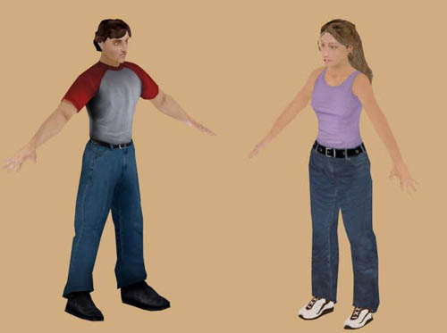
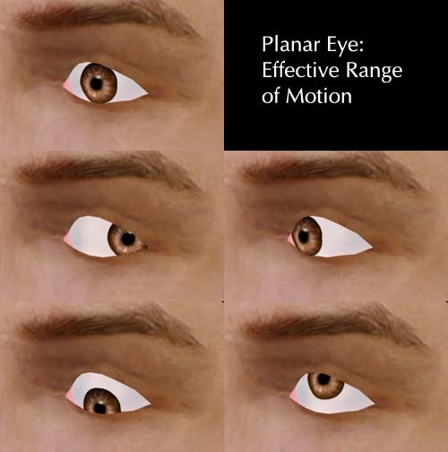
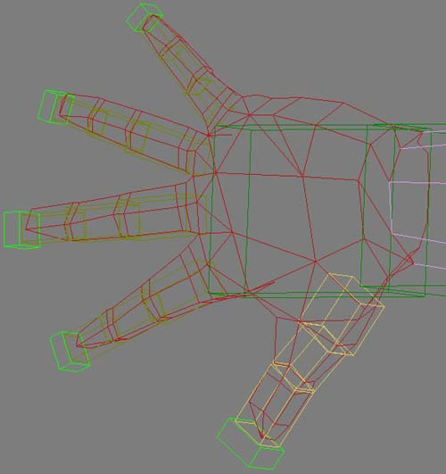
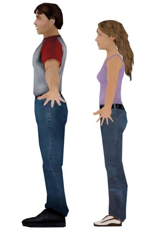
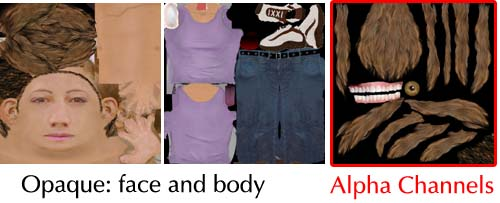
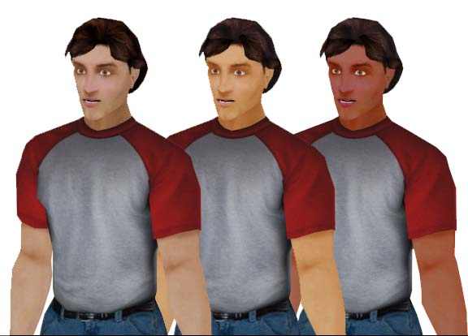
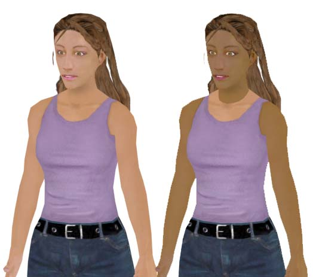
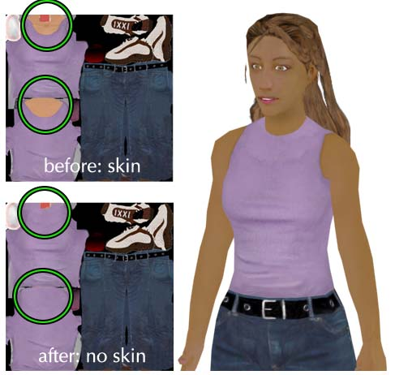
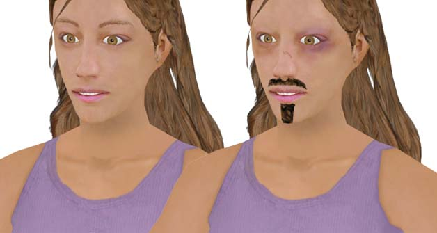

# Example Models for the Unreal Engine

*Document Summary: Explains design choices and pitfalls of character design and creation for UDN male and female models. Suitable for beginner and intermediate skill levels.**Document Changelog: Last updated by Tom Lin (DemiurgeStudios?), for document summary. Original author was Tom Lin (DemiurgeStudios?).*

* [Example Models for the Unreal Engine](UnrealDemoModels.md#example-models-for-the-unreal-engine) 
  + [Goals](UnrealDemoModels.md#goals)
  + [Modeling](UnrealDemoModels.md#modeling)
    - [The Eye](UnrealDemoModels.md#the-eye)
    - [Hands](UnrealDemoModels.md#hands)
    - [Feet](UnrealDemoModels.md#feet)
  + [Mapping/Texturing](UnrealDemoModels.md#mappingtexturing)
    - [Crossing Alpha Textured Triangles](UnrealDemoModels.md#crossing-alpha-textured-triangles)
    - [Texture Size and Number](UnrealDemoModels.md#texture-size-and-number)
    - [Swappable Clothing and Skin](UnrealDemoModels.md#swappable-clothing-and-skin)
  + [Bones/Enveloping](UnrealDemoModels.md#bonesenveloping)
  + [Swapping Models and Skeletons](UnrealDemoModels.md#swapping-models-and-skeletons)
    - [Using the UDN Model](UnrealDemoModels.md#using-the-udn-model)
    - [Using the UDN Rigging](UnrealDemoModels.md#using-the-udn-rigging)
  + [Attached Files](UnrealDemoModels.md#attached-files)

This is a document that will explain design choices and pitfalls involved in creating two character models for the Unreal engine.

## Goals

The goals for these models were as follows:

* The models will be the central figures in the game.
* Models must be realistically proportioned.
* The models will require full lip-synching ability.
* Fully articulated hands (sign-language capable).
* The models must be usable with in-game environments on modern PC and console hardware.
* The models will have a fairly high polycount, to remain relevant for the next generation of hardware as well as the current.

## Modeling

Before I began the modeling process, I asked myself a few design questions.

* How many polygons do I have to work with?
* What style is my model to be in?
* Is my model going to be replicated in a scene, or will it appear only once?
* What parts of the model will receive the most attention?

For the models I made, most of the answers are cut and dry. I had a budget of 4000-4500 polys per model. A realistic style was specified - this means no superhuman biceps, hyperinflated bustlines, etc. They were to be central characters, so I didn't have to worry about having large numbers of them in a scene. I decided to give the face and hands the bulk of the polygons, especially since a wide range of motions were specified in my goals. Chances are they would be the focus of the models more often than not. Also, since these models might be used in a variety of gametypes, I wanted them to be as flexible as possible.

### The Eye

I used a planar sheet of polygons for the eyes in my models. This method is a polygon efficient way to create eyes that will require eye tracking. For a more thorough explanation, see the [UnrealModeling](UnrealModeling.md#movable-eyes)
doc.

This image shows the range of motion possible with the sheet method. The biggest difficulty with this method is finding the best placement for the bone that will control the iris. Placing the base of the bone correctly is very, very important, as the curve of the iris must match the curve of the eye white for the entire travel range of motion. This will likely require a large amount of minute tweaks, both in the rigging and in the model itself.

### Hands

Since the hands demanded a large amount of motion (sign-language capable), they took up a fairly large portion of the total polygons. Each hand has approximately 420 polys, out of a model that has a total count of about 4400. This is about 20% of the complete model, a fairly large portion.

You can see in the picture above that each finger joint has two segments around each joint, which is important in keeping the deformation to a minimum when they are bent. If I was to make the models again, I might budget even more resources to the hands; the knuckles are not clearly defined when the hand is closed and the thumb could use more geometry where it joins with the hand.

### Feet

I experimented a little bit when making the feet. As explained in the [UnrealModeling](UnrealModeling.md#in-game-perspective)
doc, perspective in games often makes 'normal' human proportions seem wrong. This is especially the case with feet, where the camera point of view is often looking down at your models from a position above and behind your character. To compensate for this effect, I made the feet on the male model much larger than is normal. I made the girl's feet normal sized, so that evaluating the appropriateness of both sizes is possible.

## Mapping/Texturing

Texturing the models is a fairly straightforward task. There are some alpha and layout issues to keep in mind, though.

### Crossing Alpha Textured Triangles

A major concern while texturing for UnrealEd is the "no crossing alpha textured triangles" rule. For a more detailed explanation, see the [UnrealTexturing](UnrealTexturing.md#alpha-channels)
doc. In a nutshell, when two triangles cross that both have textures with alpha channels on them, Unreal gets confused. This results in ugly draw order issues, where one triangle will 'pop' over the next, and back again. Try to avoid this situation if at all possible.

### Texture Size and Number

I created the three textures for each model. Two are at the same size that Unreal Tournament 2003 uses by defualt: 1024x1024. The third texture map I reserved for the parts of the model that require transparency in an alpha channel. This division allows you to save the oapque textures out at 24 bit, which will save a litle memory, and also makes life a bit easier for the person who has to mess with the alpha settings in UnrealEd. This third texture was larger for the girl model than the guy model; her hair required more texture resolution.

In the above image you can see that on the alpha texture map there is hair, teeth, and eyes. The other texture map contains solid parts of the model, such as the face and arms, as well as the base layer of hair.

### Swappable Clothing and Skin

This topic is pretty straightforward, though there are some subtleties. The general rule to keep in mind is that if you want to have total flexibiity to switch between different textures, make sure that every triangle that has skin tone on it is restricted to one texture, and that every cloth triangle is on another. The male model is an example of this technique, which lets us swap out all the skin at once.

However, if we wanted to do something similar for the girl's current texture, we quickly run into problems.

If we wanted to make the cloth texture interchangeable, we would have to go back to the clothing texture, and make the girl's shirt extend up to her neck.

In the picture above the girl's clothing texture has been altered so that it can be made completely interchangable with different skins.If you don't mind working with this division of triangles across textures, then this solution will work fine. However, many models are flexible enough to receive a variety of textures well. For example, this girl model will look fine with a high collar, but will also look good with the original lower cut neckline. What do you do if you want to be able to swap textures (and save texture memory), but you want to put some skin on the cloth? If you are willing to keep the skin tones that run across one texture to the next uniform, then you are free to create as many swappable skins as you want. Below is an example of this; the heads use two entirely different texture maps, but since the skin tones remain the same, there isn't the jarring visual break in the neck, as was seen previously.

## Bones/Enveloping

For the UDN models we chose to use character studio for animation purposes, with our own additional bones attached to that ready-made structure. All of the extra bones were added in the facial/head region. You can see a more thorough listing of the facial bones in the
[SkeletalSetup](UnrealModeling.md#highly_articulated_facial_skelet)
doc.We chose not to share animation data between the models for several reasons. First of all, the male and female models are substantially different sizes. Secondly, the models don't share the exact bone hierarchy in the head. Finally, because we were doing very delicate and precise animation frames (adjusting the faces for lip synch capacity), it was deemed unwise to try to adapt them to each other. This means that each model needs its own .PSA file, which could be wasteful, depending on your animation load.

## Swapping Models and Skeletons

The UDN models are provided in this doc, should you wish to use them in your game demos, etc. They are provided with rigging, but you may wish to change them or adapt the model to an existing bone structure.

### Using the UDN Model

If you wish to use a new rig in the UDN model, it's pretty straightforward. Depending on how complex your skeleton is, you can simply ignore features in the models such as the tongue, irises, etc. You may even wish to alter the model in some ways to better fit your needs. For example, if you have only one bone allocated to control the hands, you would want to rearrange the fingers to be in a more flexible and natural shape, instead of splayed out. Keep in mind, as you alter your skeleton to fit the UDN model, large changes will likely cause the model to animate strangely/poorly.Of course, you will still have to do all of the envelopes, vertex weights, and assorted rigging goodness.

### Using the UDN Rigging

If you want to use the UDN rigging with a new model, so you can take advantage of the existing set of animations, you're in for a much tougher road. The good news is that if you want only some of the rigging effects (for example, the eye animations but not the mouth/tongue phonemes), your new rig/bones don't have to include all the bones included in the UDN models. This means that you can delete, or simply not create entire branches of bones, and Unreal will still import your models without any problems. Having said this, you have a few options regarding how to deal with using the UDN rigging.

* You can make a model that is very close to the UDN models in size, posture and anatomy. Then hook up the new model's corresponding parts in roughly the same way.
* You can make an entirely new biped, and create bone structures that have the same names as the bones in the UDN model. Remember that you don't have to replicate the structure in the UDN rig, but if you want to preserve the animations, your bone names must correspond to the bones that exist in the UDN rig.
* You can try to alter the UDN model itself, while holding onto the existing rigging. Instead of creating anything from scratch, you would be reworking the model, treating the old model as 'clay' that you push into a new form.

## Attached Files

There are a lot of zips at the end of this document. Included are all the source files used to create the UDN models, as well as .PSK and .PSA files that you can use to import them directly into UnrealEd?. Here is the content breakdown:

* [udnmale.zip](../assets/udnmale.zip)): Contains the rigged .max model, the .PSA and .PSK, and the three textures you'll need to view it in 3DS Max.
* [udnfemale.zip](../assets/udnfemale.zip)): Contains the rigged .max model, the .PSA and .PSK, and the three textures you'll need to view it in 3DS Max.
* [udnmalesourceanims.zip](../assets/udnmalesourceanims.zip)): All the source .max files that comprise the animation/viseme sets. Caution: file size is large.
* [udnfemalesourceanims.zip](../assets/udnfemalesourceanims.zip)): All the source .max files that comprise the animation/viseme sets. Caution: file size is large.
* UDNMapping.zip: The layout for the texture maps that are provided in [udnmale.zip](../assets/udnmale.zip) and [udnfemale.zip](../assets/udnfemale.zip)
