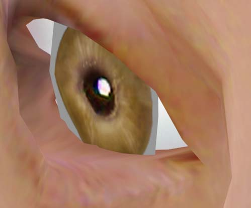
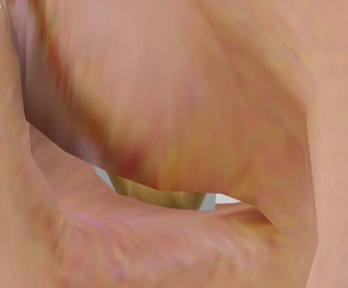
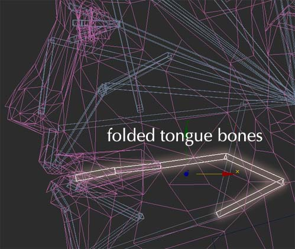
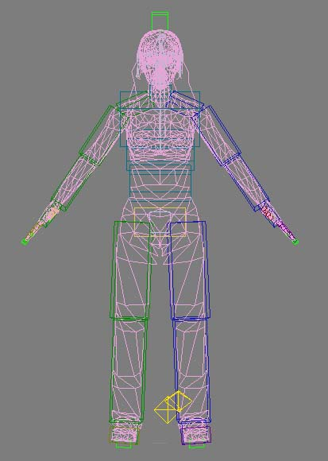
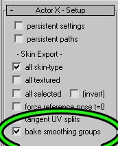
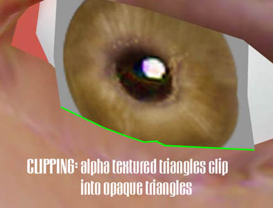
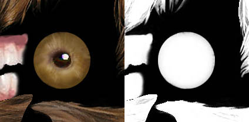
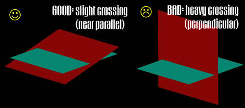
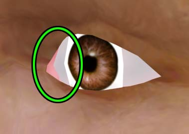
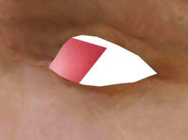

# Unreal Modeling Guide

*Document Summary: This document suggests some design choices that are appropriate for modeling for Unreal. Also, a suggested polycount for levels and characters is supplied. Suitable for any modeler new to modeling for the Unreal Engine.**Document Changelog: Last updated by Michiel Hendriks, few minor changes. Previously updated by Tom Lin (DemiurgeStudios?), for document summary. Original author was Tom Lin (DemiurgeStudios?).*

* [Unreal Modeling Guide](UnrealModeling.md#unreal-modeling-guide)
  + [Making Models for the Unreal Engine](UnrealModeling.md#making-models-for-the-unreal-engine)
  + [Planning the Model](UnrealModeling.md#planning-the-model)
  + [Smooth Meshes](UnrealModeling.md#smooth-meshes)
  + [Extra Articulation](UnrealModeling.md#extra-articulation)
    - [Movable Eyes](UnrealModeling.md#movable-eyes)
    - [Eyelids](UnrealModeling.md#eyelids)
    - [Tongue](UnrealModeling.md#tongue)
  + [The Refpose](UnrealModeling.md#the-refpose)
  + [Smoothing Groups](UnrealModeling.md#smoothing-groups)
  + [In-Game Perspective](UnrealModeling.md#in-game-perspective)
  + [Unreal Engine tips](UnrealModeling.md#unreal-engine-tips)
    - [Clipping Polygons](UnrealModeling.md#clipping-polygons)
    - [Single-sided polygons](UnrealModeling.md#single-sided-polygons)
    - [Holes](UnrealModeling.md#holes)
  + [Comparative Detail Levels](UnrealModeling.md#comparative-detail-levels)
    - [Unreal II](UnrealModeling.md#unreal-ii)
    - [UT2003](UnrealModeling.md#ut2003)
    - [Unreal Tournament](UnrealModeling.md#unreal-tournament)

## Making Models for the Unreal Engine

Making a model for Unreal Engine specific titles is largely similar to modeling in general. This doc will cover concerns that are unique to he engine, and touch upon other minor game-related modeling issues. The focus will be on animated player models.

## Planning the Model

This is the most elementary aspect of modeling, but I feel that it can't be stressed enough. The absolute first step is to decide on what your model will need to do, and build around those actions. For example, if your model will be climbing/lifting/throwing things a lot, you may want to spend more polygons in the shoulders of your model, to ensure that it deforms properly. If your camera will be situated behind the character a lot (3rd person camera), then make sure the back has a fair amount of polys, as opposed to spending them all in the face area. In a similar vein, consider what people will be looking at the most in your models. In a FPS, much of the time the action will be fast-paced and at relatively long distances. In this case, don't bother spending large percentages of your poly budget on the face, since it'll rarely be seen up close, or standing still. Rather, spread the polygons more evenly.For a non-character model the same guidelines apply, of course. In the case of a car model, will the doors open? Will you be able to see in the windows? Will the car ever flip over? Will the tires ever fall off? Think about what you'll be looking at, and apply the polygons intelligently.

## Smooth Meshes

In the Unreal engine, character models should generally be smooth-skinned meshes. This means that a model isn't made of discrete pieces, the surface is a continuous whole. This allows deformation of the model itself on the bone structure, as opposed to a stiff collection of parts. This seamless look is particularly desireable for joints such as elbows, knees and fingers, which often don't have cues in a texture to 'cover up' for a seam in a non-smooth-skinned model. The shadows on a model will flow much more logically on a smoothly-skinned model, as well.In some cases, it may actually make sense to make a model that is not completely smooth-skinned. Cyborgs, robots, Canadians, etc. may have rigid joints that don't require smooth deformation. Consider a S.W.A.T. team member wearing a bulletproof vest - the shoulder joints have a logical point at which they could be detached from the smooth-skin, which would help alleviate shoulder pinching in animation.In most cases though, smooth skinning is the best option.

## Extra Articulation

We're at the point in videogames where just running and jumping isn't enough for all projects. Blinking, eye tracking, moving tongues and hand motions/gestures are all common enough to at least consider before beginning a new model. While these actions can add a great deal of life to your model, they're not without cost. Alpha-channeled textures, higher polycounts, complex riggings and more animation are some of the pitfalls that come with these additions.A few tips may help in the creation of these features.

### Movable Eyes

*This method requires that you use alpha channels on your animated mesh.*For eyes in a model, one might think that a sphere in a socket, textured to look like an eyeball is the best/only solution. If you choose to use alpha channels/masks on a texture, however, a much more efficient method is possible. instead of creating a complete eyeball, think of the eye as being divided into two parts: the white and the iris. If the white is created to be part of the smooth-skinned face (it will never move) and the iris is floating above it on a sheet of polygons, it is possible to make only the iris move along the surface of the 'eyeball.' This is a serviceable simulation of an eyeball, and is used in UT2003 and UT2004.

### Eyelids

*This requires a facial bone structure that character studio does not supply by default.*Eyelids can be 'faked' to some degree with smooth skinning. An easy way to make them is to bind a single bone to a row of vertices that simply rotates up and down, and drags the skin immediately above the eye down in a stretched sheet of polygons. For the modeling side of things, just make sure there is a row of vertices that can be safely stretched without altering too much facial geometry.

### Tongue

*This requires a facial bone structure that character studio does not supply by default.*A tongue seems fairly self explanatory, and depending on how much movement you'll require, it could be. If you'd like to have major tongue extension outside of the mouth, however - sticking out the tongue at someone, or licking lips - you'll need a slightly unorthodox bone structure. Unreal **CAN NOT** deal with bones that stretch over time - it can only understand orientation and position of bones. I found that having the bones fold on themselves worked best for the tongue. Since it's not possible to stretch the existing bones, we unfold them, like an accordion.

For the modeling side of things, it's enough to make a standard looking tongue; just make sure that it is set fairly far back in the mouth so that when it stretches out, most of the stretching will be confined to the mouth interior.

## The Refpose

One of the first concepts to wrap your head around when modeling for the Unreal engine is the division between the refpose ("reference pose") and the animations. The reference pose, which will go into the .PSK, has only the model and bone information, none of the animation information. This is where you set the influence of the bones that will affect the assorted vertices in your model, whether by envelopes or locked verts. Conversely, the animations to be stored in .PSA files hold only information relating to the movement of the bone structure, and none of the weighting information.This is pertinent now, since the refpose is essentially what you will be modeling, the character in a stance that is appropriate and easy to rig.[ActorX](../Content%20Creation/Tools/ActorX.md) is the plugin that generates these filetypes, see the [ActorXMaxTutorial](ActorXMaxTutorial.md) or [ActorXMayaTutorial](ActorXMayaTutorial.md) doc for a more thorough explanation.Many artists model with the standard refpose, character standing with legs splayed, arms out at the side as far as possible. Recently, I've started to model characters with the arms at more of a 45 degree angle. Since the arms will be down at least half of the time, it's important for the model to look good with the arms at rest, as well as straight out (a much more unnatural pose to take). This makes rigging a shade harder, perhaps, but it may be worth it to have less deformed shoulders.

## Smoothing Groups

Smoothing static meshes using smoothing groups works without any problems. Smooth away.Smoothing is not *truly* supported for skeletal (character) models with the [ActorX](../Content%20Creation/Tools/ActorX.md) tool, but if you import your models, subdivided into smoothing groups, you may find that it appears the smoothing groups are working. What's happening? It turns out that [ActorX](../Content%20Creation/Tools/ActorX.md) is faking the smoothing by splitting the vertices along the smoothed edges, and then smoothing each separate 'piece' of the model individually. This will mimic smoothing, but it also doubles the amount of vertices in your model along the smoothed edges. Each split vertex adds to the memory and rendering overhead, so splitting skeletal models into groups is discouraged.If you decide you do want to use the smoothing anyways, make sure the "bake smoothing groups" box is checked on the [ActorX](../Content%20Creation/Tools/ActorX.md) panel.

## In-Game Perspective

Modeling for games is unique in that the camera has a wide range of motion. This leads to difficulty for artists, though - since the camera can be directed at a model from a variety of distances and perspectives, it can distort an otherwise good model into a misshapen mess. Looking straight down at a model's feet sometimes has the effect of making them look too small, the legs tapering down to the floor. Contrast this with looking at the same model from 50 yards away, where they might look appropriate. Some artists like to compensate for this effect by subtly widening the legs as they approach the feet, which are similarly oversized. See the [UnrealDemoModels](UnrealDemoModels.md#feet) document for examples.There is no hard and fast rule for these situations. Evaluate how you will be displaying the models, and see what fits.Another item to keep in mind is the size that your model will be seen at. In many cases, the character on the screen will be smaller in total pixels than the texture maps you use on him. If you will be making several models, strive to distinguish them enough so that they will be recognizable at a distance.Obviously, this is more important in a multiplayer/team based game, such as UT2003.

## Unreal Engine tips

A few last pointers that will make your life easier and your models better.

### Clipping Polygons

Polygons that clip directly into each other are generally ugly, on a smooth-skinned model. If you are adding details that will hide the junction to the smooth areas however, clipping the polygons is a good way to save triangles and time. Clipping polygons works extremely well when combined with the above tips for making eyes (irises) on sheets. Clipping polys now works perfectly in UnrealEd.

On looking at the eye, one can see that the iris portion of the eye is on a roughly square sheet of polys. I have transparency information in the texture's alpha channel that will make the iris appear circular when viewed in Unreal.

The only time clipping triangles are problematic is if the material assigned to both triangles uses the alpha channel of the texture. This is not a small detail problem, it's very apparent that something is broken.The eye works fine, because only the iris has alpha information. That which it clips into (the surrounding eye socket) uses no alpha channel, so there is no fighting for draw order. Therefore, early on in the planning phase for your model, identify where you will be using alpha on your model and make sure that two alpha triangles do not cross. If there is chance of crossing (hair, for example), then try to minimize the angle at which the triangles meet - perpendicular is the worst, with the severity dropping as the faces get closer to parallel.

### Single-sided polygons

If you enable double sided textures in UnrealEd, single-sided polys are another great time-saver. There is no added work on the modeling side - just make your model with the backfaces open. Good for things like flags, etc.Again, the eye is a good example of this. The floating iris is a single-sided sheet of polys.

### Holes

Making a smooth-skinned mesh doesn't mean that the surface has to be completely closed. If you'd like, you can just leave the mesh incomplete in areas to save on polygons. Of course, you should make sure that the gap won't be put directly in front of the camera for some reason. You could also leave a hole in a surface, then 'fill' the hole by placing polygons that block the view through the back of the model.

Once again, the eye is a great example of this technique. The pink area is actually a large triangle, set far back in the head. This prevents you from seeing straight through the model, which has gaps in the face for the white to be set in.

## Comparative Detail Levels

When talking about levels of detail, it's useful to see what the pros are doing. In this section we'll compare polycounts in UT2003, Unreal II and the original Unreal Tournament. Before reading any further, please keep in mind that the raw number of polygons may not be indicative of how fast a level acutally runs - the effects that are being applied to triangles has a huge impact as well.

### Unreal II

Unreal II was released in Feb/2003. The polycounts are in general, very high. In the opening level, polycounts ranged from 20K (thousand) polys to 85K at parts. The outdoor sections had more polys on average, about 45-60K. Indoors, in the training area, the average was 35-38K. There were no enemies in these levels, which allows for more level detail.The ship that serves as your main base of operations has slightly more detail. Since the space is smaller, it's possible to cram more polys into each area. The count ranged from 40-100K, averaging about 60K.In the first level with enemies and core gameplay, the count ranged from 15-75K. While in combat, the average was about 25-30K polygons, including enemies. Obviously, when designing heavy combat areas, your level of geometry density will have to fall. In the third level, portions of the level (exterior, beginning) reached as high as 150-160K polys drawn onscreen at once. For most of the core gameplay, however, the count was between 50-80K polygons.The poly counts of the enemy and friendly player models spans a fairly wide range. The Skaarj model is about 2500 polys. The Heavy Skaary is about 3450. On the low end of the scale, the Araknid model is 870, while the heavy version is 2500. The marines who fight alongside you range from 2000 - 2600 polys. On the very high end, your crewmate Aida clocks in at 4900. Keep in mind that Aida is confined to the main ship, and since the environment is much more constricted, the model can be more complicated to make up for it.In cutscenes, you can probably get away with setting up higher overall levels of detail. In the opening cutscene, the number ranged from 15-50K polys. In a later cutscene, it reached 140-150K.

### UT2003

Unreal Tournament 2003 was released about four months before Unreal II, in late september of 2002. Perhaps not surprisingly, the poly counts are comparable between the two games. There is actually quite a bit of variance in detail between levels, which can probably be explained by their respective sizes and recommended player loads.Player models in UT2003 have poly counts of 2100-3300, though most of them fall at about 2600. Keep in mind that these numbers haven't yet been added to the numbers in the levels themselves.*Antalus* is recommended for 4-6 players. The polycount ranges from 25-75K, though the average is about 35K.*Plunge* recommends 3-12 players. This is a fairly wide range, which may explain the polycount; ranging from 10-100K onscreen at once. Plunge seems to have no terrain triangles, which may allow for this higher number of polys. Because the design of the level is such that one tends to be looking at either a low number of polys or a large amount, with very little middle ground, it is hard to say that there is a true 'average' number.*Inferno* (for 2-6 players), has a similarly wide spread in polycount as *Plunge*. The count ranges from 10-100K, though this may be alleviated by the fact that the map is intended for half as many players as *Plunge*. The level averages 40-60K polygons at once.*Tokara Forest* (for 8-16 players) has a fairly wide range in player load. The level has from 10-80K polygons at once, and averages from 30-40K.

### Unreal Tournament

Released in November of 1999, this game is a technological dinosaur. Surprisingly, it's aged very well, which proves that you can make a compelling and great looking environment with just a relative handful of polygons.Player characters in UT are from 300-400 polygons*Orion's Barricade* (for 6-12 players) ranges from 300-800 polys per scene. It averages 400-500.*Curse II* (for 4-12 players) ranges from 220-450 polygons in a scene. It averages 400.*Oblivion* (2-3 players) has a slightly higher range, going from 200-900 polygons. It averages 400 in the combat areas, however.*Gothic* (6-16) ranges from 200-700. It also averages about 400.
