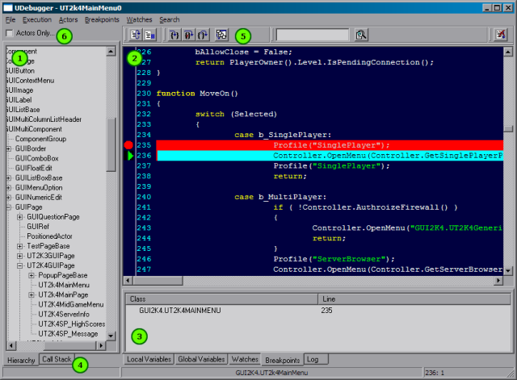
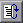
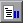
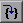
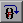
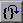
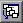
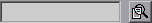

# UnrealScript Debugger Users Manual

*Last updated by Michiel Hendriks, completed more of the documentation. Previous update by Vito Miliano ([UdnStaff](https://udn.epicgames.com/Main/UdnStaff)), for tweaks and corrections. Original author was Albert Reed (DemiurgeStudios?).*

* [UnrealScript Debugger Users Manual](UnrealScriptDebugger.md#unrealscript-debugger-users-manual)
  + [Getting Started](UnrealScriptDebugger.md#getting-started)
  + [Basic Debugging](UnrealScriptDebugger.md#basic-debugging)
  + [UDebugger Window](UnrealScriptDebugger.md#udebugger-window)
    - [Menu](UnrealScriptDebugger.md#menu)
  + [Information Tabs](UnrealScriptDebugger.md#information-tabs)
    - [Local Variables](UnrealScriptDebugger.md#local-variables)
    - [Global Variables](UnrealScriptDebugger.md#global-variables)
    - [Watches](UnrealScriptDebugger.md#watches)
    - [Breakpoints](UnrealScriptDebugger.md#breakpoints)
    - [Log](UnrealScriptDebugger.md#log)
  + [Breakpoint Points](UnrealScriptDebugger.md#breakpoint-points)
  + [Call Stack](UnrealScriptDebugger.md#call-stack)
  + [Break On Access None](UnrealScriptDebugger.md#break-on-access-none)
  + [Pausing](UnrealScriptDebugger.md#pausing)
  + [Toolbar Buttons](UnrealScriptDebugger.md#toolbar-buttons)
  + [Not Yet Documented](UnrealScriptDebugger.md#not-yet-documented)

## Getting Started

Before firing up the debugger for the first time, you need to create a debug build of your UnrealScript packages. To do this, delete all the `.u` files in your `/system` directory and run the UnrealScript compiler with the `-debug` switch. To do this, type `ucc make -debug` at the command line.With the debug `.u` files compiled, run `UDebugger.exe` in your `system` directory to begin debugging your game or application. It is highly recommended you configure your game to run in windowed mode by setting `StartupFullscreen=False` in your `<MyGame>.ini` file.

## Basic Debugging

The fundamentals of the UnrealScript debugger closely resemble those of Developer Studio. In order to begin debugging a block of code, find the class you would like to edit from the class Hierarchy in the left pane and double-click on it. This will open the source in the main window of the debugger. Locate the block of code you would like to debug and click in the gutter to the left of the line numbers (or press F9 on the selected line). A red Stop-Sign will appear and the next time that code executes the debugger will pause execution of your program and bring the debugger to the foreground.Once paused a green arrow will appear in the left gutter to mark where the debugger has currently paused execution. From here you can walk through your code by using the items in the "Execution" menu at the top of the debugger. Alternatively you can use the hotkeys (same as dev-studio) or the buttons on the top toolbar (F5 = continue; F10 = jump over; F11 = trace into; Shift+F11 = jump out of).

## UDebugger Window

1. Class tree; by default it only shows the actors, uncheck (6) to use Object as root
2. Source code; shows the source code of the class currently being debugged. Break points and the current execution line are highlighted (in red and aqua respectively).
3. [Information Tabs](UnrealScriptDebugger.md#information-tabs) shows various details about the current debug process.
4. [Call stack](UnrealScriptDebugger.md#call-stack)
5. [Toolbar buttons](UnrealScriptDebugger.md#toolbar-buttons)
6. Set\unset the root of the class tree to actor.

### Menu

1. File
   1. Stop debugging; stop the application
2. Execution
   1. Continue (F5)
   2. Trace in to ... (F11)
   3. Jump over... (F10)
   4. Jump out of... (Shift+F11)
3. Actor
   1. Show actor list; doesn't do anything
4. Breakpoints
   1. Break; pause the current program execution
   2. Toggle breakpoint (F9); toggle a breakpoint on the current source line
   3. Clear all breakpoints; removes all breakpoints
   4. Break on Access None (Ctrl+Alt+N); automatically break when accessing a `none` variable
5. Watches
   1. Add Watch...; add a watch contidion
   2. Remove Watch...; remove the currently selected watch
   3. Clear all watches; removes all watches
6. Search
   1. Find (Ctrl+F); search text in the currently opened file
   2. Find Next (F3); find the next occurance of the search string.

## Information Tabs

The bottom of the debugger has five tabs which give you information about the current state of execution.

### Local Variables

This tab lists all of the variables that are declared within the current function and their value. For pointers and structs a the plus icon next to the variable name will expand that variable into it's members.

### Global Variables

This tab lists all the variables that are defined in the class the debugger is currently paused in. It lists them in the same format as described above in Local Variables.

### Watches

Watches make it possible for you to provide specific variables that are either class-wide or function-wide in scope. It is most useful for narrowing down the huge list of global variables. To add a variable to this list pull down the "watches" menu at the top of the debugger and select "add watch". Type in the name of the variable you would like to watch and press okay. In order for this window to refresh you will need to step forward in the code.

### Breakpoints

From this tab you edit and view the current breakpoints. Double-clicking on a breakpoint will take you to that line in the code. Right-clicking on the breakpoint listing in this tab will bring up a menu to remove the breakpoint.

### Log

This tab is the same as the `.log` file and the display typing  at the console gives. It provides messages, warnings and errors that have occurred during execution.

## Breakpoint Points

* Setting breakpoints on lines of code that do not execute will not cause the debugger to break. This means that setting a breakpoint on blank lines, comments and variable declarations will not cause the debugger to pause there under any circumstances.
* Breakpoints may be configured outside of the debugger by editing the `UDebugger.ini` file in your `/system` directory.

## Call Stack

This pane lists what functions have been called in order to reach the current point in execution. Ofcourse only UnrealScript functions are listed and not the native function that initially called function.

## Break On Access None

When this option is enabled (`Breakpoints->Break on access none` or Ctrl+Alt+N) the debugger will break when the engine tried to read from a variable that has been set to `none` .

## Pausing

You can pause the execution at any time by pressing the *break* button. The current script that was running will then be opened and set to the current line that is being executed. From here on you can continue normal debugging.

## Toolbar Buttons

Continue execution. (F5)

Pause the execution

Trace into the current function. (F11)

Jump over (F10)

Exit the current debug level to the calling function. (Shift+F11)

Shows a broken call stack window. Use the call stack next to the class tree.

Search field (Ctrl+F) and search next (F3). This will search in the currently opened file.

Jump to the current line of execution.

## Not Yet Documented

* Merging
* Performance Issues
* Coming in Debugger 3.0
