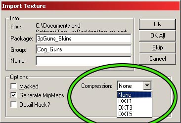
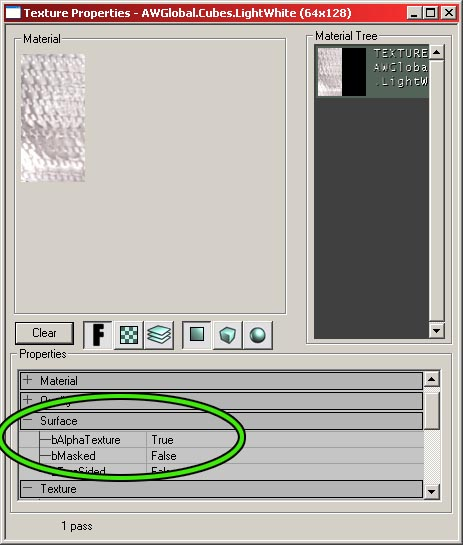
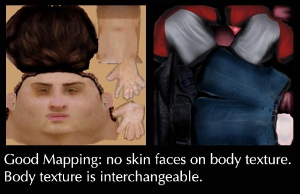
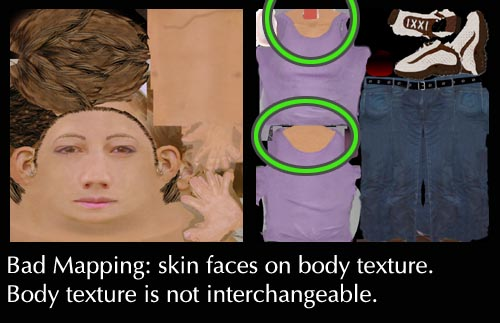
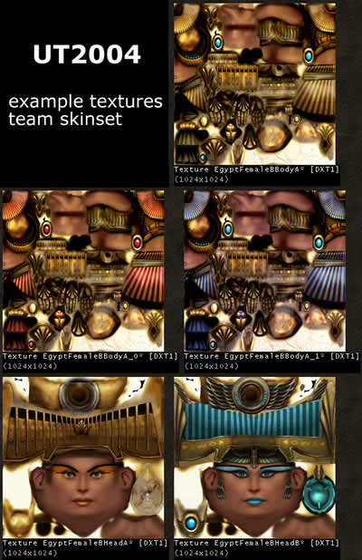

# Unreal Texturing Guide

*Document Summary: A guide to the type of texture compressions available, as well as a general overview of texturing concerns in the Unreal engine. Suitable for all new texture artists.**Document Changelog: Last updated by Michiel Hendriks, linked to attachments. Previous update by Tom Lin (DemiurgeStudios?), for document summary. Original author was Vito Miliano ([UdnStaff](https://udn.epicgames.com/Main/UdnStaff)).*

* [Unreal Texturing Guide](UnrealTexturing.md#unreal-texturing-guide)
  + [Making Textures for the Unreal Engine](UnrealTexturing.md#making-textures-for-the-unreal-engine)
  + [Powers of 2](UnrealTexturing.md#powers-of-2)
  + [Texture Formats](UnrealTexturing.md#texture-formats)
    - [32-bit RGBA (Targa)](UnrealTexturing.md#32-bit-rgba-targa))
    - [DirectX Texture Compression](UnrealTexturing.md#directx-texture-compression)
      * [DXT1](UnrealTexturing.md#dxt1)
      * [DXT3](UnrealTexturing.md#dxt3)
      * [DXT5](UnrealTexturing.md#dxt5)
    - [Eight-bit Palettized](UnrealTexturing.md#eight-bit-palettized)
    - [Eight-bit Palettized with Alpha](UnrealTexturing.md#eight-bit-palettized-with-alpha)
    - [Recommendation](UnrealTexturing.md#recommendation)
  + [Creating Textures](UnrealTexturing.md#creating-textures)
    - [DXTC](UnrealTexturing.md#dxtc)
      * [NVIDIA DXT Compression Tools](UnrealTexturing.md#nvidia-dxt-compression-tools)
      * [Microsoft DXTex Tool](UnrealTexturing.md#microsoft-dxtex-tool)
    - [Creating P8 Textures](UnrealTexturing.md#creating-p8-textures)
  + [Alpha Channels](UnrealTexturing.md#alpha-channels)
  + [Appropriate Texture Sizes and Numbers](UnrealTexturing.md#appropriate-texture-sizes-and-numbers)
  + [Clothing/Skin Swapping](UnrealTexturing.md#clothingskin-swapping)
    - [Team Colors in UT2004](UnrealTexturing.md#team-colors-in-ut2004)

## Making Textures for the Unreal Engine

Making a texture for Unreal Engine specific titles is pretty straightforward. This doc will cover concerns that are unique to the engine. Some player character unwrapping/layout issues will also be addressed.

## Powers of 2

Powers of 2 are a must, first of all. You can make your textures in any combination of powers of 2: 256x256, 512x256, 1024x4 etc. In fact, a 1x1 texture will work, as this is 2? (2 to the power of zero).

* Non-square textures possible
* Texture dimensions in powers of 2

## Texture Formats

Unreal uses a variety of texture formats. Unreal supports five texture formats: DirectX Texture Compression (DXTC), 8-bit palettized (P8), and 24/32-bit RGBA textures; and 8-bit and 16-bit greyscale heightmaps. For more information on heightmaps, see the [TerrainTutorial](../Content%20Creation/Primitives/TerrainTutorial.md) docs.

### 32-bit RGBA (Targa)

32-bit RGBA is the obese godfather of textures. While extremely powerful, it's also terribly overweight. It features full 24-bit color, plus an 8-bit alpha channel, but takes up four bytes for every pixel; a 256x256 texture will require 256k of memory.If you're just getting started on texturing in Unreal, just remember that you want to be making 24-bit and 32-bit Targa files (.TGA). Targas can be converted into smaller, more streamlined versions when you import them into Unreal.Support for the 24-bit Targas is fairly recent; note that if you don't need an alpha channel, the 24-bit Targas will import perfectly. If you do need alpha, you still need 32-bit. When textures are imported into the Unreal Engine, you have the option of setting the level of DirectX Texture Compression. More on that below.

* 24 bit Targas now import into Unreal
* 32 bit Targas required for alpha channels

### DirectX Texture Compression

DXTC is the native, compressed texture format used in DirectX 8. Support for this compression is built right into Unreal. In many cases, DXTC reduces texture memory usage by 50% or more over palettized, 8-bit textures, allowing for twice the textures at the same resolution, or the same number of textures at twice the resolution. Three DXTC formats are available. If you import a Targa, you'll be prompted to choose what compression level you'll be using.

#### DXT1

This is a four-bit compressed color format that allows for opaque, and one-bit alpha textures; that is, textures with no transparency at all, and textures with a single transparent color (masking). The most compression will be put on textures.Caution: a hardware bug in some nVidia chipsets, including the NV20 (GeForce3/Xbox), potentially makes certain DXT1 textures exhibit banding/ quantization artifacts. Specifically, decompression is performed in 16-bit color mode internally, making the resulting texture potentially unacceptable for use, especially when combined with other operations. This problem has been corrected in the NV25 chipset and all other DXTC formats on nVidia hardware are okay, as textures are decompressed in 32-bit color internally.

#### DXT3

This adds support for a four-bit explicit alpha channel, on top of DXT1's color compression. Four-bit explicit alpha allows for sixteen distinct alpha values, making it good for textures with sharply contrasting translucent/opaque areas.

#### DXT5

DXT5 supports a four-bit interpolated alpha channel. Three bits are used to determine explicit alpha values, and two eight-bit values are used to interpolate gradually between them. This makes the format especially suited for soft gradients and other textures where the alpha areas vary less wildly. The least compressed option.The [TextureComparison](../Content%20Creation/Lighting%20and%20Textures/TextureComparison.md) doc has lots of examples of bitmaps that have been put through the wringer - check it out to see nice visuals of what the compressions do.In case you're wondering, DXT2 and DXT4 assume colors are premultiplied by the alpha channel, and are not supported.

### Eight-bit Palettized

P8 textures, as they are denoted in the editor, are the same 8-bit palettized (256 color) textures used in the build 436 engine and earlier ("Unreal" and "Unreal Tournament" timeframe). Even though they are uploaded to the video card as a full 32-bit RGBA texture, when properly quantized a P8 can look identical to the original 24-bit source art, while still offering a 75% savings in disk and system memory.P8 textures offer 1-bit alpha in the form of a mask color. If a texture is imported as masked, color index 0 is set as transparent. Once you palettize your texture, you'll need to edit your 256-color image and apply color zero to the transparent portions of the texture.

### Eight-bit Palettized with Alpha

A special variation on P8 is the alpha-palettized format where each one of the 256, 32-bit palette entries holds an RGBA value instead of RGB. This is mostly relevant only for the PSX2 builds of the engine; given the PSX2 architecture, it's the most efficient form of storing a variable-alpha texture. The catch is that having to put variable alpha in a palette diminishes the already limited color variety available; but in many cases this isn't significant, and several font-and user interface textures have been created this way. See also the included text file in the attached [AlphaPal.zip](../assets/alphapal.zip), which contains AlphaPal.exe, a special alpha-aware version of the Bright utility, which generates BMP 8-bit alpha-palettized textures.The posted alphapal source 193-Zono contains the following fixes from Mike Arkin over at Zono:

* 24bit TGAs now 'SAFE', old code was very, very wrong, and crash prone
* Non-alpha TGAs now turn alpha color buckets down before scanning (from 7 bits to 1 bit)
* Other small fixes related to uninitialized alpha values in 24bit palettes, 16bit color TGAs, etc.

### Recommendation

Use DXT1 textures as much as is possible. While artists need to examine DXT1 versions of their textures due to the penetration of nVidia hardware with the decompression bug, the greatest space savings can be had with them.If watching for rendering artifacts is not an option, DXT5 supports the most flexible alpha channels, while not increasing memory usage beyond that of a normal 8-bit palettized texture.Also, if you need full color resolution for a texture, without an alpha channel, use an 8-bit palettized texture. While requiring the same amount of video memory, disk and system memory usage is a mere 25% of full RGBA, and the differences are undetectable in most cases. Use full RGBA only when DXT3/5 do not suffice in the both the color and alpha quality department, in highly visible expanses, such as skies.

## Creating Textures

### DXTC

Once you've produced a 24-bit color texture to use in-game, you'll need to convert it to the DXTC DDS format (DirectDrawSurface, the native DirectX texture format) for importing into UnrealEd. To do this, you'll need one of these two utilities.

#### NVIDIA DXT Compression Tools

This Adobe-compatible plugin, produced by nVidia, allows you to open and save DDS files. Saving to DXT1, DXT3 and DXT5 formats is support, with or without autogenerated mipmaps. Support for saving uncompressed 16-bit and 32-bit images is also provided.The current version sports a preview mode for seeing what the texture will look like when rendered by the hardware, including emulation of the Xbox DXT1 hack fix. As a result, it requires DirectX 8 and a compatible video card, preferably one with a GeForce-series chipset.Standalone command-line utilities are also provided to batch compress images, extract mipmaps, and merge mipmaps, as well as a library to integrate these functions into your own application.The [DXT\_Tools.zip](../assets/dxt_tools.zip) provided below contains all of these files, taken directly from the FTP site directory of the same name.

#### Microsoft DXTex Tool

This is a standalone compression utility, provided as part of the MS DirectX 8.1b SDK. It can open multiple BMP (Windows Bitmap) and DDS files. Bitmaps cannot have alpha channels, so it also supports opening separate BMP files as alpha channels, either explicitly or implicitly, using a \_a.bmp naming convention. Textures can be converted to all five DXTC formats. The utility can also be run from the command-line if desired. The current version of the DX8.1b SDK, released **8/12/2001**, is a 167mb installer, available here:<http://download.microsoft.com/download/DirectX/Patch/8.1b/W982KMeXP/EN-US/DX81b_SDK.exe>

### Creating P8 Textures

Steadfastly outperforming every other 8-bit color quantizer or palettization tool on the market is "Bright", by Epic's own Erik de Neve. In fact, it's so good, we don't even bother telling you about anything else, and we have the comparisons to prove it.Bright is available in both Photoshop plugin and standalone commandline utility form. The commandline version is more robust, allowing you to specify multiple files that you would like to share a palette, specify the color to use as a mask, as well as to tweak the color quantization options themselves. The plugin simply exports an 8-bit Windows BMP file.The current version of the standalone command-line utility, version **1.81**, released **January 13, 1999**. The current version of the Adobe-compatible plugin was released **February 26, 2001**. Both are provided in the [bright181.zip](../assets/bright181.zip) below.

## Alpha Channels

Alpha channels can go a long way in adding life and visual appeal to your models. Adding an alpha channel is easy enough, just make a new channel in Photoshop (or your texture mapping program of choice) and start painting. Black is completely transparent, white is opaque. You'll have to make sure that you enable the alpha information once within UnrealEd to get the alpha channel to appear.To enable alpha/masking, right click on a texture in the texture browser and open its properties. From there, open the 'Surface' section and set the appropriate values for bAlphaTexture and bMasked.

There is a problem with alpha channels, however. If triangles with alpha information on them cross, Unreal will have a hard time figuring out which to draw on top of the other, resulting in ugly popping as each triangle `fights' for draw order. Before texturing, plan out where you will have alpha-textured triangles, and try to work around having any in a situation where they could cross. If you absolutely must have them cross, try to minimize the angle at which they intersect.If you are using alpha channels on static meshes, you may run into this problem as well. For many static meshes, you will want to restrict yourself to using one texture per mesh, for memory savings. In this case, when you use alpha channels, this means that every triangle in the mesh could receive texture data that has alpha information. This means you should be very careful to not have clipping triangles, since any of them may have an alpha channel. If your model does have clipping faces, you can still avoid problems by making sure that parts of your static mesh that are clipping are completely white in the alpha channel. If triangles are anything other than 100% opaque, then they are vulnerable to popping if there is triangle clipping.You shouldn't have any alpha channeling problems with skyboxes, since the construction of a skybox makes clipping planes unnecessary. This is a very good thing, as alpha channels are very powerful tools in making skyboxes seamless.

## Appropriate Texture Sizes and Numbers

When texturing a character, it's debatable how large to make the texture. Lee Perry of Epic writes: *I personally wouldn't bother doing a skin less than 1024x1024 unless you just feel uncomfortable working that large. The UT2004 skins are actually 2 1024x1024 textures.* Note that this is in regards to character skins. Static mesh textures should generally be much smaller, especially if the physical models are smaller. On the other hand, you may decide that some geometry demands higher resolution texture. This is a judgement that you'll have to make depending on the model size, the model importance, proximity to the camera, etc. For example, you may decide that the skybox of your world needs to be very high resolution, if the sky is important in giving ambience to your level.It is recommended that you use DXT1 compression on character textures (if you are using 1024x1024), to avoid eating too much of the available texture memory. This of course limits you, in that you can't use full alpha channels on the model. The generally smaller static mesh textures can come in at DXT3 or DXT5.In addition, due to how the engine handles state changes, it is more efficient to have one larger texture than several smaller ones. If you have 3 256x256 textures, it will work out in your favor to condense them into a single 1024x1024 and get a little bit more resolution, as well.For most static meshes, restricting the number of textures used to one is generally a good idea. However, if your models can share textures effectively, then it may make sense to use a tileable texture that can be used more flexibly. For example, if you were to make two swords, a generic texture for the blade could be used over both models, which would result in an overall texture savings. In this case, each sword would have at least 2 textures per model, one for the pommel (different) and one for the blade (shared). This concept can also be applied to character models. See the next section for an in-depth explanation.

## Clothing/Skin Swapping

Clothing and Skin swapping is a great way to increase the mileage you get out of your models, as well as save on texture memory usage. If you have one clothing texture and two face textures, you are basically getting a clothing texture for free - you can have 2 different models. If you have three clothing textures and three faces, you have 9 different models.This is all well and good, as long as you keep your cloth and skin regions **completely** separate, on different texture maps. If you don't then you'll be forced into keeping a 1-to-1 correlation between skin and clothing textures, unless you maintain a uniform skin tone on all of your skin maps. This is obviously not the right approach to take, so keep the skin away from the cloth.

In some cases, you may have a model that is flexible enough that you would want to have areas be textured with either skin **or** cloth. If you find yourself painting skin on the `Cloth' texture, or vice versa, so be it. Just be aware that you will lose the flexibility to use the maps interchangeably with other maps.

### Team Colors in UT2004

Team skins are a special example of skin swapping. In UT2004, for example, the engine looks for a team texture when you are playing a team game. The team texture must correspond to SKIN00 (the body texture), and you'll need a total of three textures for the body; normal, red team, and blue team. So, a list of your textures for a single model built for a team game might look like this:

* EgyptFemaleBBodyA (normal skin)
* EgyptFemaleBBodyA\_0 (red team)
* EgyptFemaleBBodyA\_1 (blue team)
* EgyptFemaleBHeadA (interchangeable head, both teams)
* EgyptFemaleBHeadB (interchangeable head, optional, both teams)

A final note about the above textures. Notice that there is skin on the body texture as well as the face texture, which was just previously noted as a Bad Thing to do. This actually doesn't lead to any problems, *as long as your interchangeable facial textures all share similar skin tones.* If you are willing to live with that restriction, then feel free to mix and match to your heart's content.This skin/cloth swapping is also covered in the [UnrealDemoModels](UnrealDemoModels.md#swappable-clothing-and-skin)
document.
