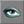

# Exporting and Importing Vertex Animations

The vertex animation pipeline requires a bit of simple programming to get meshes into the engine. The animations do not show up in the animation browser, as with skeletal animations. For this reason, this tutorial will be targeted at programmers, not artists.

## When to use Vertex Animations?

Vertex meshes are significantly different than static meshes and skeletal meshes. To recap, we'll quickly go over the three.

* *Static Meshes:* The most simple of the three, both in creation and implementation. These meshes can not deform in any way.
* *Skeletal Meshes:* These meshes are hooked up to an underlying, invisible support structure of bones. As the bones move, the weighted vertices are moved as well. Multiple animations can be blended on the same mesh to facilitate subtle transitions and new animations.
* *Vertex Meshes:* The most flexible vertex-wise, allowing for heavy mesh deformation or subtle control, by manipulating the position of individual vertices over time. Blending animations is not possible, only one sequence is ever active.

Unfortunately, vertex animation on a skeletal mesh isn't possible, so a choice should be made in the design process as to which type of mesh a model will be. Keep in mind that vertex animation can be very time consuming, so this should be factored into your decision making processes as well. Characters should always be skeletal meshes, most environments will be made up of static meshes. Vertex meshes can be used for fluid or clothlike surfaces, such as flags flapping in the wind, that demand fine control over the mesh which would be expensive when using skeletal animation. They could also be used for models that require heavy deformation - imagine organic, pulsing walls.Gameplay-animation wise, vertex animation does not allow blending several sequences together, and the storage space increases with the number of frames and vertices. For for skeletal characters, it scales with the number of bones and frames, and can be further compressed with lossy methods in the editor. Also, some skeletal characters like machines and vehicles can can use "rigid-parts" optimization which essentially turns them into a collection of efficiently rendered static meshes. For these reasons, as well as the more cumbersome export and import paths, use of vertex animation is strongly discouraged for anything except looping animations on relatively low-polygon undulating objects like flags and banners.

## Exporting

To export a vertex animation and mesh, open up ActorX in Maya or 3DS Max. Set the following options according to your needs. The remainder of the options do not do anything for vertex animation.

#### Output Folder

For output folder, you will want to specify a subdirectory of the code-package you want the model to reside in called "Models" or something like that. For example, if you wanted to use this model in a "Guns" package, you might store it in .../< YourGame >/Guns/Models.

#### Animation File Name

Fill in this field with the name of the animation. This will also end up being the name of the mesh file name, though you can change that later.

#### Frame Range

In this field put the range of frames you would like to export. For example "0-10" would export frames 0 through 10. Note that the similar field that is not in the Vertex Animation section of ActorX, "animation range" is ignored and should not be used for vertex animations.

#### Append to Existing

If you want to export multiple animations for a single model, first export one animation, then for each additional animation, leave this box checked. The animation data will be appended to the end of the previous animation. When we setup the script file, we'll separate the full animation file into separate animationsOnce you have the options set, click the "Export" button in the Vertex Animation section of ActorX. Clicking this button will create two files in the folder specified by the "Output Folder" field called <AnimationName>\_a.3d and <AnimationName>\_d.3d. The \_d file is actually the mesh, and the \_a file contains animation information.

#### Maya specific notes

The Maya ActorX interface for exporting is a little more primitive than the 3DS Max one. It is called up with the 'axvertex' command. You'll need to specify the output path as well as the animation file name using the main exporter window ('axmain'.) Also, the exporter expects there to be at least a single Maya joint in the scene linked to the animating mesh, to establish a rudimentary hierarchy.

## Importing

### #exec's

To import vertex-animation meshes you will need to put a series of "#exec" commands in a script file. This will cause the animation data to become imported into the .u file when the package containing the script is compiled.

#### MESH IMPORT

Create a script file and use the following #exec command to import your model
#exec MESH IMPORT MESH=<SomeNameForYourMesh> ANIVFILE=..\<PackageName>\Models\<\_A.3d Model File> DATAFILE=..\<PackageName>\Models\<\_D.3d Model File> X=<OffsetX> Y=<OffsetY> Z=<OffsetZ>

#### MESH ORIGIN

Next, you will want to specify a default origin and rotation for your mesh using this #exec command:
#exec MESH ORIGIN MESH=<SomeMeshName> X=<OriginX> Y=<OriginY> Z=<OriginZ> ROLL=<RollOffset> PITCH=<PitchOffset> YAW=<YawOffset>The ROLL, PITCH and YAW parameters are specified in the range of -256 - 256. -64, for example will rotate counter-clockwise 90 degrees. X,Y, and Z are in Unreal units.

#### MESH SEQUENCE

For each animation you import you will need to specify which frames in the animation file correspond to animations you will later be able to play. It is possible to have multiple animations that use the same frame, if desired. Generally, it is useful to define one animation to be every frame in the file. Here is how you would create that animation:
#exec MESH SEQUENCE MESH=<SomeNameForYourMesh> SEQ=All STARTFRAME=0 NUMFRAMES=XXXMake sure the value in the MESH parameter is the same as the one in the importing exec above. SEQ is the name for the animation. For each animation you will want to create one of these lines. If you're not sure of the number of frames, or the start frame for an animation, just import them all, fire up UnrealEd and look at the "All" animation. More on how to view meshes in the next section.

#### TEXTURE IMPORT

Next you will need to import the textures into the .u file so they can be assigned to the mesh. The following exec command handles that part for you:
#exec TEXTURE IMPORT NAME=<TextureName> FILE==..\<PackageName>\Models\<TextureFileName> GROUP=<SomeGroup>This command will put the texture into the .u file where it can be viewed and used from the texture browser in UnrealEd or in other #exec commands, or in script itself. You will need to call this multiple times if your mesh has multiple textures assigned to it.

#### MESHMAP SETTEXTURE

Finally, you will need to assign each texture to the mesh. This exce command accomplishes that:
#exec MESHMAP SETTEXTURE MESHMAP=<SomeNameForYourMesh> NUM=<MaterialID> TEXTURE=<TextureName>You will need one of these lines for each material id used by the mesh.

### DefaultProperties

In the default properties of the script file, you will want to assign the mesh you've imported to the actor described by the script file. Do so, by putting the following line in the defaultproperties section of script file.<verbatim>
Mesh=Mesh'ThisPackage.MeshName'
</verbatim>

### Create .u file

Save your script file and compile the package as you normally would. You will see the compiler importing the mesh.

### Viewing in Unrealed

To view the imported mesh in UnrealEd open the Mesh browser by clicking on the Mesh Browser button:

.
