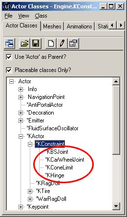
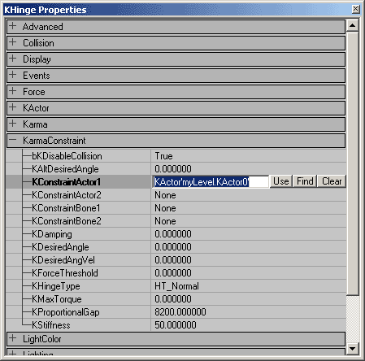
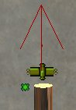
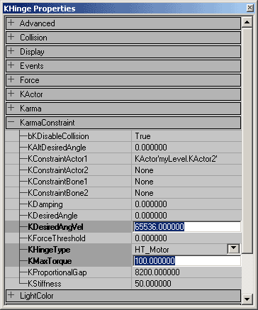

# Using Karma Actors

*Document Summary: A guide to setting up KActors with KConstraints.**Document Changelog: Last updated by Jason Lentz (DemiurgeStudios?) to correct .ASE and .MAX files, update for the 2226 build, and for re-organizational purposes. Original author was James Golding. ( [jamesg@epicgames.com](mailto:jamesg@epicgames.com) )*

* [Using Karma Actors](UsingKarmaActors.md#using-karma-actors)
  + [Overview](UsingKarmaActors.md#overview)
  + [Getting Started](UsingKarmaActors.md#getting-started)
  + [Adding To a Level](UsingKarmaActors.md#adding-to-a-level)
  + [Adding a Hinge Constraint](UsingKarmaActors.md#adding-a-hinge-constraint)
  + [Motorizing The Hinge](UsingKarmaActors.md#motorizing-the-hinge)

## Overview

In this example we'll again create and import a Karma Actor (see [ImportingKarmaActors](ImportingKarmaActors.md)).

* We'll show you how to add a hinge joint.

* We'll show you how to motorize a hinge joint

## Getting Started

From Unreal Editor create a simple room, with a start position.Create a suitable KActor, this will be hinged to the world so that it may only rotate about 1-axis. So we want something that rotates in this manner.(See [ImportingKarmaActors](ImportingKarmaActors.md) for creating/importing physic models)

## Adding To a Level

Import the .ASE file, by opening the static mesh browser >File>Import.You should get a message:
"Karma Collision Data Found. Do you want to add to Static Mesh?"Answer YES, and Unreal Editor will convert the collision geometry parts into the simple shapes they represent.
Karma Physics will automatically calculate a default center-of-mass position and inertia tensor (represents how the mass is distributed) for this static mesh.Note you must resave the .USX package in order to use this Static Mesh.Select the required KActor physics mesh in the static mesh browser. (It will have a \* to indicate it has physics properties such as mass etc.)Now right click on one off your viewing areas and select "Add Karma Actor Here"Rebuild the level and play it. The KActor should appear in your level, and react in a physically realistic way.Note that by default KActors are disabled until they collide with something. This saves computation time, so you should set up your physics bodies in stable looking positions and leave the default to disabled.
You can set change the default:
KActor properties > KParams > KarmaParams > KStartEnabled, but this isn't advised unless you want something to fall on a players head as soon as s/he starts.

## Adding a Hinge Constraint

Constraints restrict the motion of physics bodies. There are three major KConstraints available to level designers, the KBSJoint (Ball and Socket Joint), the KConeLimit, and the KHinge. The KCarWheelJoint can also be placed in the level by level designers, but is primarily used in code for setting up [Karma Vehicles.](HotRod.md)

The hinge joint restricts bodies so that they may only rotate about a single axis. For example doors are hinged to walls so that the door may only rotate about one axis. We're going to attach a fan to the world using a hinge joint and then we're going to shoot it up real good.From the Actor Browser, browse down the hierarchy to select the KHinge constraint.
Actor>KActor>KConstraint>Khinge.Once the KHinge is selected you can add one into the world by right clicking on a viewport and selecting "Add KHinge here"You should see a small billboard icon representing the hinge.But Wait! This hinge will do nothing yet, as there is nothing attached for it to constraint.We could hinge up to two KActors together, but we only want to fix our fan to the world, so we only need to attach it to the fan KActor.Double Click the KHinge icon to view the KHinge properties.

Under the Karmaconstraint properties you see KConstraintActor1 and KConstraintActor2. These are the two bodies that can be constrained by the KHinge.Type in the fan objects name in the Karma Constraint Actor1 (an objects name can be found by double clicking it to bring up its properties and selecting Object > Name), or click the "Find" button and then select the KActor in the level.Although the KHinge can join two Actors, if you only fill in one, that object will be hinged to the world at the position of the Hinge.Rebuild your level. If you shoot the fan, it should only rotate about a single axis.The hinge axis is represented by a red line that appears when you select the hinge icon. You can rotate and move this axis in Unreal Editor.

## Motorizing The Hinge

We can motorize the hinge joint to drive the fan around.Double click the KHinge icon and Open its Karma Constraint Properties.To motorize the hinge we need to change the following 3 properties:1. *KHingeType* : This should be set to HT\_Motor.2. *KDesiredAngVel* : This is the angular velocity the motor is trying to reach. (Don't confuse this with *KDesired angle*, which is used when you want control bodies rotation to a predefined angle.). You will need a very large value to see dramatic results in this setting; try 65536.3. *KMaxTorque* : Nothing is going to spin without torque, this is the max torque applied to reach the desired angular velocity. This value does not need to be as large as the *KDesiredAngVel,* but the larger the value the closer it will be to reaching its *KDesiredAngVel.* Try setting a value of 100.

That's it. Rebuild your level and your fan should be spinning around as if by magic. If its not shoot it, this should enable the fan, which means that it will be physically simulated.
