# Using Lights

*Document Summary: A general guide to not only using lights but also how to use features associated with lights.**Document Changelog: Last updated by Jason Lentz (DemiurgeStudios?) to separate into more manageable docs. Original author - Lode Vandevenne ([UdnStaff](https://udn.epicgames.com/Main/UdnStaff))*

* [Using Lights](UsingLights.md#using-lights)
  + [Introduction](UsingLights.md#introduction)
  + [Adding a Light](UsingLights.md#adding-a-light)
  + [Radii View](UsingLights.md#radii-view)
  + [3D View Modes](UsingLights.md#3d-view-modes)
  + [Game Settings](UsingLights.md#game-settings)
  + [Rebuilding](UsingLights.md#rebuilding)
  + [Scale Lights](UsingLights.md#scale-lights)
  + [Relevant Documents](UsingLights.md#relevant-documents)

## Introduction

Here you will find the basics of lighting. This document shows how to place lights and describes the various features that allow you more easily and accurately asses the lighting within your level.

## Adding a Light

First you need a room to add the lights, so create one that's big enough. Once you have a room, right click somewhere in any view, and in the menu that appears choose "Add Light Here". Now you see somewhere near the place you clicked, a small lightbulb picture appear. That's a light source!

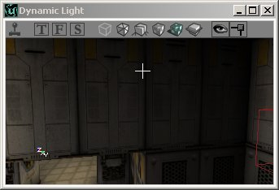

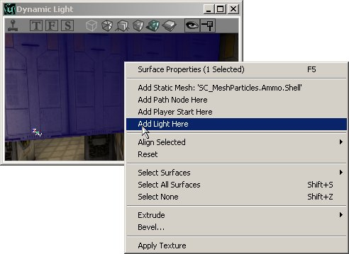

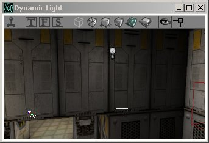

There's also a shortcut key for adding a light: just hold down the L key and press with the left mouse button somewhere in any view and the light will be added.If your light isn't at the location you wanted, you can of course move it to where you want it as you can move any other actor.

## Radii View

You can turn on this option if you right click on the toolbar of a viewport --> Actor --> Radii View. This shows a red circle around the light that represents the radius of it. This works in the 3D view too. Normally, the light sphere looks smaller than circle because it becomes darker at the edges, only if the LightEffect is NonIncidence it's the same.

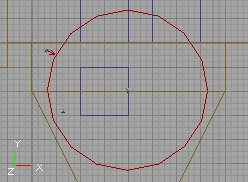

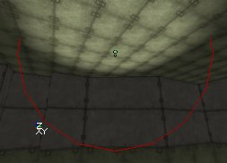

## 3D View Modes

If you have the 3D View in Dynamic Lighting mode, you should also see that the walls around the light you just added become brighter.
The 3D view has different modes, some of them are important when working with lights. To select one, use the buttons on top of the 3D View. The buttons that are tinted green on the screenshots below are the ones you must press to activate the described mode. You can see the name of the button in a yellow if you hold the mouse cursor a few seconds above it.**Textured:** this will show all the walls of your map fullbright, and ignore all the lighting. This is not the way the walls will look in the game. You can use this mode if you haven't added any lights in your map yet because you want to do geometry first, or if you want to check the original texture of a wall that is too dark or colored by the lights.

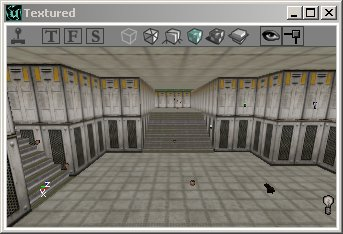

**Dynamic Light:** this will show your map with all the lighting. If you rebuild lights and you haven't added any lights yet, you'll see only black. This mode shows the lighting almost like it will look in the game, so always use this one when working with the lighting of your map.

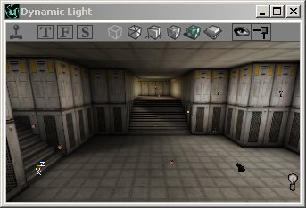

**Realtime Preview:** you can switch this on and off in any viewport: click the button that looks like a little joystick on top of the view, or select a view and press the P key. Do not press the joystick on the main toolbar of the editor, that one starts the game to test the map. If a view is in Realtime Preview, it is always updated in realtime, so if you change something in one view, you'll see that change also in the other view if it's in that mode. But this slows down the editor a bit. Another important thing about this mode, is that you can see animations like flickering lights or animated textures. If Realtime Preview is off, you can't see how the dynamic lighting effects animate in the 3D View. This mode also makes the ZonePortals and other invisible polygons really invisible.

**Lighting Only:** this makes all the walls white and shows the lighting effects on this.

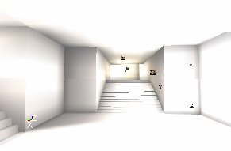

## Game Settings

With the F10, F11 and F12 keys, you can change respectively the Gamma, Brightness and Contrast of your screen. This works in the editor and in the game. You can also change these settings in the Advanced Options --> Display. To get the Advanced Options open the menu View and select Advanced Options.You have to keep in mind that players can have anything set here, so a map that looks dark for you might look very bright for the player. Only the differences between brightness and darkness in your map will never change.

## Rebuilding

If you added some lightbulbs, you may see some light already but you'll need to rebuild geometry and lighting for the final result. You have to rebuild geometry first, otherwise rebuild lighting will not work correctly. To rebuild geometry, you have to press this button in the upper toolbar of UnrealEd:

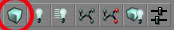

After you rebuild geometry, all the walls become fullbright. To get the lighting back, you have to rebuild lighting: press this button on the upper toolbar of UnrealEd:To rebuild lighting, press this button on the upper toolbar of UnrealEd:

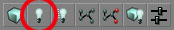

This ray-traces the light from each light source to create lighting and shadows on walls and objects. This can take several minutes in a large map. If you're working solely with the architecture or geometry of your map only, don't rebuild lighting or don't use the Build All button to save time. However if you're working with the lighting in your map, this is important.To rebuild only the changed lights, use the Rebuild Changed Lights Button. This goes much faster because it doesn't rebuild lights that have been rebuilt already. However, if you add a new light, you'll still have to rebuild Geometry first before it works.

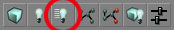

## Scale Lights

In the Tools menu, there's a tool called Scale Lights. You can use it to scale the brightness value for several or all of the lights at once.

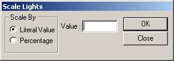

Select one light and open it's Light Properties, expand LightColor (you don't have to do this, but do it now so you can see the value changing). Now open Scale Lights in the menu Tools. Enter a Literal Value of 100. Make sure you can see the LightBrightness in the light properties. Press OK in the scale lights window and look at the LightBrightness changing. Every time you press Ok, it changes: it becomes 100 brighter.If you enter a Percentage of 100, the LightBrightness is multiplied by 2 every time you press OK. If it's 50, it will be multiplied by 1.5, if it's 20, by 1.2, etc...You can also enter negative values, to make the lights darker.The advantage of this tool is that, if you select 2 or more lights, and use the tool, their LightBrightness are calculated independent for each light. So if one of the lights had a brightness of 50 and the other one of 80, and you entered a literal value of 20, the first light will become 70 and the second one 100.This tool might be useful if you have a room with lights with different LightBrightness and you want to make them all a little bit brighter. Just select them all and use the tool.

## Relevant Documents

For more about LightActors and general lighting in Unreal Ed, also see the following documents:[LightingBasics](../Content%20Creation/Lighting%20and%20Textures/LightingBasics.md) - A detailed table of contents to all of the Lighting documents[TypesOfLights](TypesOfLights.md) - A guide to the various types of LightActors and light sources.[LightingReference](LightingReference.md) - A comprehensive reference for the LightColor and Lighting properties.[LightingOnSurfaces](LightingOnSurfaces.md) - A guide showing how LightActors affect various types of geometry.[SpecialLightingFeatures](SpecialLightingFeatures.md) - A tutorial showing how to set up special lighting features.
