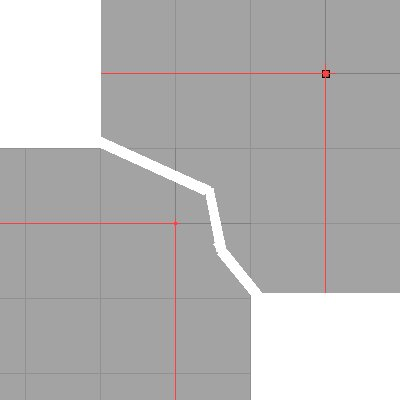
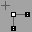
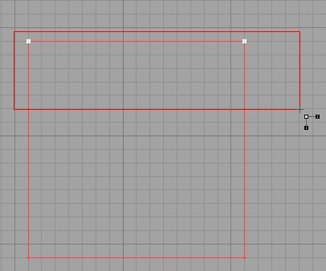
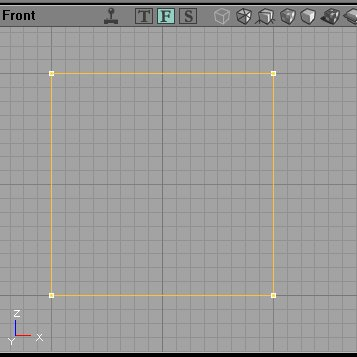
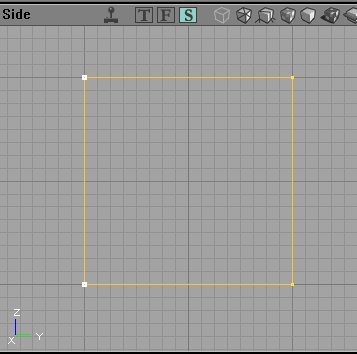

# Vertex Editing

*Document Summary: A reference for how to use the Vertex Editing mode.**Document Changelog: Last updated by Tony Garcia ([UdnStaff](https://udn.epicgames.com/Main/UdnStaff)), for version 829. Original author was Tony Garcia ([UdnStaff](https://udn.epicgames.com/Main/UdnStaff)).*

* [Vertex Editing](VertexEditing.md#vertex-editing)
  + [Introduction](VertexEditing.md#introduction)
  + [Vertex Editing Mode](VertexEditing.md#vertex-editing-mode)

## Introduction

Level Designers always seem to need to reshape a brush and one of the handiest ways to do that is by moving the vertex (vertices) to whip that brush into shape. There are two ways to start moving those vertices:1) You can simply click a brush to highlight it, then click a vertex and hold ALT while moving it.2) You can select vertex editing mode from the tool bar

With the first method, the active vertex will have a cross shape on it like this (image shows both in large vertex and normal view):

## Vertex Editing Mode

Once in Vertex Editing Mode you will get a new cursor.

Click the brush you wish to move vertices on to highlight it. Now you can use the CTL-ALT-LMB keys to drag a box and select multiple vertices. The selected vertices will now be white (even on the builder brush) so you can easily tell which vertices you have highlighted. To move them, hold CTL+LMB and you will move the selected vertices all at once.

When using this method to select vertices bear in mind that all the vertices on an infinite plane within the selection box are selected. That is, if you are using the top view, and you use the drag box to select multiple vertices, you will select the top (or visible vertex) as well as any underneath it that you can't see. These images illustrate that. The two uppper vertices were selected using the drag box in the *top* view.You can see the vertices selected in the other views.

That's pretty much all there is to is. Try not to make invalid shapes, or set two vertices on the same spot. The editor like to crash when you do that. When vertex editing you will sometimes get a brush that will disappear from view when you zoom in on it. Right-Click it and set Transform/Transform Permanently to fix that.
