# Using Workflow Techniques and Modularity

*Document Summary: A guide to setting up your art to level design pipeline and designing modularly.**Document Changelog: Original authors - Lin, Lentz, Sturgill, Reed (DemiurgeStudios?). Thanks to Lee Perry for the Game Developer article that helped in the making of this doc.*

* [Using Workflow Techniques and Modularity](WorkflowAndModularity.md#using-workflow-techniques-and-modularity)
  + [Introduction](WorkflowAndModularity.md#introduction)
  + [Modular Level Design](WorkflowAndModularity.md#modular-level-design)
    - [Scale](WorkflowAndModularity.md#scale)
      * [World Scale](WorkflowAndModularity.md#world-scale)
      * [Player Scale](WorkflowAndModularity.md#player-scale)
    - [The Grid](WorkflowAndModularity.md#the-grid)
      * [Stay on the Grid](WorkflowAndModularity.md#stay-on-the-grid)
        + [How Do I Stay On Grid In...](WorkflowAndModularity.md#how-do-i-stay-on-grid-in)
          - [Max?](WorkflowAndModularity.md#max)
          - [Maya?](WorkflowAndModularity.md#maya)
          - [Unreal?](WorkflowAndModularity.md#unreal)
        + [Grid levels](WorkflowAndModularity.md#grid-levels)
        + [`On Top Of...' Idea](WorkflowAndModularity.md#on-top-of-idea)
        + [`Right Next To..."](WorkflowAndModularity.md#right-next-to)
    - [Reusing Set Pieces](WorkflowAndModularity.md#reusing-set-pieces)
      * [Mirroring](WorkflowAndModularity.md#mirroring)
      * [Vertical and Horizontal mirrors](WorkflowAndModularity.md#vertical-and-horizontal-mirrors)
      * [Text](WorkflowAndModularity.md#text)
      * [Variations on a Theme](WorkflowAndModularity.md#variations-on-a-theme)
      * [Flexibility of Set Pieces](WorkflowAndModularity.md#flexibility-of-set-pieces)
    - [The Origin](WorkflowAndModularity.md#the-origin)
    - [Misc Issues](WorkflowAndModularity.md#misc-issues)
      * [Transitions between areas](WorkflowAndModularity.md#transitions-between-areas)
      * [Cylinders](WorkflowAndModularity.md#cylinders)
      * [Back Facing Polys](WorkflowAndModularity.md#back-facing-polys)
      * [T junctions](WorkflowAndModularity.md#t-junctions)
      * [Breaking up Modularity](WorkflowAndModularity.md#breaking-up-modularity)
  + [Character Workflow](WorkflowAndModularity.md#character-workflow)
    - [Design](WorkflowAndModularity.md#design)
    - [Modeling](WorkflowAndModularity.md#modeling)
    - [Textures](WorkflowAndModularity.md#textures)
    - [Animation](WorkflowAndModularity.md#animation)
  + [General Rules of Optimization](WorkflowAndModularity.md#general-rules-of-optimization)
    - [Batched-Rendering Specific Optimizations](WorkflowAndModularity.md#batched-rendering--specific-optimizations)
    - [UnBatched-Rendering Specific Optimizations](WorkflowAndModularity.md#unbatched-rendering-specific-optimizations)

## Introduction

This is a doc primarily concerned with streamlining the process of asset development, creation, and implementation. The passage of art ideas and assets from person to person, artist to level designer to programmer, can often be disjointed or confusing. Working within the constraints of the Unreal Engine, these tips will help your team work in a more efficient, focused manner.

## Modular Level Design

What is modular level design, first of all, and why would you want to use it? Put at its simplest, modular design is concerned with making lots of high-quality chunks of levels and reusing those chunks intelligently, as opposed to attempting to make an entire level out of unique assets that won't be reused. This approach requires level designers and artists to work more closely together, and it can lead to a few new headaches that might not come up with the old, slapdash methods. In the end however, the technique is very powerful.Modularity has many advantages. If you are just making one room, then a non-modular room may be much faster to create than making separate pieces. Once that number grows to 100 rooms, however, you'll understand the time savings that can result when you adopt these practices. This process also allows level designers to focus on what they do best, which is lay out play areas and geometry, without having to try to create yet another doorway, and getting those textures to line up just right... again. Meanwhile, artists can focus on making each individual piece look just right - and if you polish a piece to look better, then all the instances of it will also receive the improvements. This allows a level to have an overall higher level of detail than before, simply because these high-detail bits can be replicated and recombined.It's important to keep in mind that there are drawbacks, however. Because the work is now solidly split between artists and level designers, there may be additional layers of communication that need to be established. If a LD wants a specific setpiece, there may be a delay as an artist has to be brought back onto the task to create that particular chunk. If there is a flaw in a setpiece, then all the instances of the piece will also have it; similarly, if a piece is `fixed' it may introduce problems or strange interactions with other pieces around it, if the LD is using the pieces in multiple locations. It may be difficult to maintain a consistent style throughout all the pieces, since each setpiece is created individually, and the artists will have to test them out to see how each part works with the others. Finally, the last complaint is that increased modularity may benefit the workflow, but it initially seems restrictive for artists. There are many more guidelines and pitfalls to keep in mind, and there is always the worry that your world will end up looking prefabbed and boring.While these are all valid points, in the final analysis, the debits that are associated with modularity are fairly easy to sidestep, and lead to pronounced advantages. We'll address these concerns and how to avoid problems.

### Scale

#### World Scale

The first step in making your art - level design path smooth is deciding on a scale for your world. To what degree to you want to take the concept of modularity? You could make your modular chunks in the sizes of houses, for example - or, you could make walls, doors, windows and roofs so that you could build a number of different houses out of the same pieces. To some degree, this choice will be made for you, depending on the style of game you are creating. If your player will be rushing past the pieces (as in a racing game), then you can afford to make larger, less detailed chunks. If you'll be spending a lot of time in an environment, then a smaller scale of modularity with more complicated pieces is called for. For comparison, imagine a town that one would fly over in a helicopter, as opposed to the interior of a spaceship that you wander about it. In both of these cases, the use of modular meshes can speed up the development of a game considerably.In the early stages of this process, it's vitally important that level designers and artists communicate what the focus should be. Artists should try to work on materials that LDs can use immediately, such as wall sections, buildings, roadwork, etc. The framework of the level is the first priority - it's all well and good to make that doorway look *perfect*, but there's plenty of time for small tweaks after the groundwork has been laid. Having said that, if your team is feeling especially confident, you can smooth out the workflow considerably by starting your levels with placeholder or unfinished art. If basic shapes are used that are relatively close to what the final product will be, then the LDs can begin placing the pieces together in the world, while the artists refine them. When they are done, they can simply upload the final pieces in place of the temporary blocks.

#### Player Scale

Once you determine what the general scale of your levels and static mesh pieces, it's time to start getting into the nitty gritty details. How tall/wide will your doors be? What will the maximum step height be? What about jump heights? Lengths? All of this has to be tested, to some degree - so it can't just be planned out on paper. At the same time, artists, animators and level designers all depend on these numbers - everything that you build hinges around them working nicely with each other. Therefore, it behooves you to get these values decided soon - once again, testing with prototype meshes is recommended.Take care to keep in mind that objects and environments in the game environment get distorted proportionally, as opposed to `real life.' Meaning, things look different in games - for example, ceilings should generally be higher in games, to avoid feeling cramped. Again, prototype, prototype, prototype. Use your player point of view, too - don't depend on the preview window in UnrealEd to give you an accurate sense of the in-game scale.

### The Grid

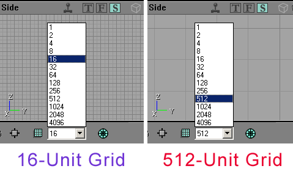

Ah, the grid. The grid, from a level designer's point of view, is fundamentally important. An artist, on the other hand, might not even know what it is. What it all boils down to is this: if objects don't sit perfectly on the grid, problems upon problems start squirming out of the woodwork. Making two set pieces line up becomes incredibly tedious, and you may start to see obvious artifacting because of gaps in between models (such as walls). It's analogous to the difference between building a house out of legos, versus building one out of cards. Artists, take note: give your level designers legos. If your work snaps together nicely, they will thank you for it. If they require tiny, tiny adjustments in 3 axes of movement every time they need to be moved, your level designers will hate you. No joking.

#### Stay on the Grid

So, now that we know that the grid is vitally important, how do we work effectively with it? Depending on what you're working in, the answer is a bit different.

##### How Do I Stay On Grid In...

###### Max?

Max doesn't make staying on the grid very easy or intuitive. It's certainly possible, but it's still very easy to accidentally pull your model off of your makeshift grid. I'll outline the very bare essentials for keeping objects on the grid in Max, but for a more complete picture, take a look through the help documents that come with Max.First of all, familiarize yourself with this button:

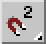

You'll need to have this button activated to make anything snap at all. To get it to the 2D snap, hold down on the button until the 3 options flyout, like so:

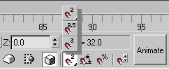

You're halfway there. Now, right-click on those magnet buttons, and the *Grid and Snap Settings* window will pop up. Open the *Home Grid* tab, and set the *Grid Spacing* field to an appropriate value. Now, when you put your cursor in one of the viewports, you'll see that your icon is surrounded by a blue box that looks like this:

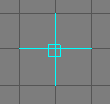

Now, when you move your mesh, if you begin to move from within that blue box, it will try to snap to the grid intersections. Caution: if you try to move your mesh while not in the blue square, it will still snap, but now it will snap your mesh right off of the grid.

###### Maya?

Staying on the grid in Maya is a fairly simple process. First you should make sure your grid is set to the right scale. To change the grid scale, click the Grid options box under the Display menu.

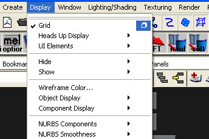

Once the grid is correct, you can begin snapping. The simplest is probably to toggle on the Grid Snap button, which is located in the tool bar at the top of the screen. It looks something like this.

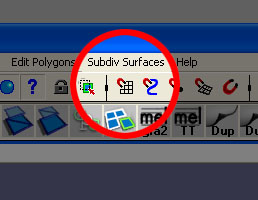

However, this will make everything snap to the grid...good for placing meshes, but bad for subltly tweaking verts. Grid snapping is also enabled whenever you hold down the "X" key. Using this method you can easily toggle snapping on and off as you go.

###### Unreal?

To use the grid in Unreal, you need only select the grid button at the bottom of the Unreal Ed interface:

Note that there are two types of grids, and for just about all cases, you should NEVER TURN THE CARTESIAN GRID OFF. When geometry falls off the grid, it can become nearly impossible to realign the grid without manually typing in new location coordinates in the Movement tab of the geometry's properties.Turning off the grid can be exceptionally dangerous when dealing with BSP geometry as one of the major causes of BSP holes even if BSP is off the grid by a mere fraction of an unreal unit.The *Rotation Grid* is not as dangerous, and can sometimes be useful to turn off when arranging more organic things (such as trees). For modular design though, it can be helpful to not only turn on the *Rotation Grid* but to also increase its *gird size.* To set this, open up the Advanced Options menu (under view) and expand the following tabs:
**Editor** --> **Rotation Grid** --> **RotGridSize**

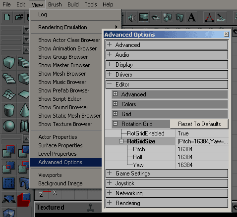

The values for the *Pitch, Roll,* and *Yaw* are given in Urus (Unreal Units), so to set the Rotation Grid at 90� you will need to enter a value of 16384. Using a 90� Rotation Grid will make lining up orthogonal pieces at right angels very easy. And if you want a set of pieces on a 45� angle, you can manually adjust the Yaw in the Movement properties by 8192 Urus (16384 / 2) and then use the Rotation Grid to rotate it in a viewport.

##### Grid levels

When creating set pieces for the grid, you should keep in mind that the grid can be subdivided into lower and lower levels. If you choose to work with a base grid level of 256 units, then even divisions of 256 will also fit nicely on that 256 grid. The grid settings are broken into powers of two, so in theory making items that fit only on a 1x1 grid (for example, something 29 units large) is fine. If it can be avoided, however, making objects that only fit on the lower grid levels should be avoided, since they will cause your LDs major headaches. The 29 unit object should be increased to 32 units large, since a scale change on that order probably won't make a large difference to the artist, but will make level design much easier.Of course, some objects will simply have to sit on a smaller grid level. A house may sit on a 256 grid, but a candlestick on a table in a room of that house will probably sit on a 2 grid. Just keep in mind, the smaller the grid, the more laborious the placement of objects for level designers.

##### `On Top Of...' Idea

One good rule of thumb when creating items that will lie on the grid is to imagine whether any other objects will ever be placed on top of it. If so, then you know that you should keep the top of the object on the grid, as well. Pretty easy, right? Let's look at three examples of how this can apply to objects in a game.

* Candelabra: The base of this should lie on the grid, obviously. If you want the extra credit points, though, you should consider making the points at which the candles will attach also lie on the grid. This gives you the option of making candles that will snap right to the correct spots on the candelabra.
* Bookcase: Bookcases can have other objects resting on top of them, so remember to make the top of it on the grid. Don't forget the shelves though - since items can be placed on them as well, try to make every shelf be aligned with the grid as well.
* Cinder Blocks: blocks or bricks of any type require a little bit more thought, since they are stackable. If you create a brick, it should of course be stackable - the top should fall on the grid, as well as the bottom. But what if you turned it on its end? If the brick also fell on the grid that way as well, then it would be much more flexible and useful.

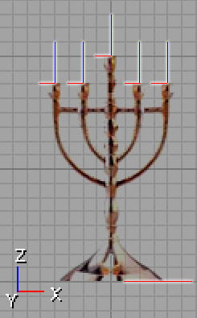

In the above picture, all the red and blue lines indicate areas that should be made to fall on the grid, vertically and horizontally.

##### `Right Next To..."

This is something of a corollary to the `On Top Of..' rule. It's not as important, but worth keeping in mind. If you have set pieces which could be pressed flush against other objects, it's worth keeping those on the grid as well. For example, If I made a building, I would try to keep all sides of the building on the grid. If I make any additions to the building later (awnings, ledges, window frames, etc) then they can snap in place against the side of the building, instead of requiring tedious adjustments in Unreal.

### Reusing Set Pieces

So here is the crux of modularity. With the ability to reuse set pieces, you gain several large advantages, both practical and technical.

* Re-using pieces doesn't take up any more space in memory, so more RAM can be devoted to higher quality meshes/textures, or costs such as AI.
* Using the same pieces throughout a level or an area can help to unify the look and feel of your game. If used correctly, it can be a great help in tying locations together in space or in function.
* Because you can use the pieces many dozens of times over, you can allocate your time to making higher quality meshes that will see heavy use, instead of many lower quality meshes that will get used and then thrown away.
* Fewer total pieces are needed, because you can reuse them. This results in time and cost savings.

There are a few things to keep in mind when reusing your set pieces.

#### Mirroring

Even with judicious use of your modular pieces, you will start to see patterns and repetition in your levels. One way to alleviate this is to mirror your meshes when you place them, this alone can help to break up similarities. If you are working with a piece that is heavily patterned (such as a wall section), then consider mirroring the pieces that are side by side.

In the picture above, you can already begin to see the repetition of the static meshes in the picture on the left. If these were used without mirroring, one would be able to see obvious patterning. On the right, the mesh has been mirrored and rotated, breaking up the mirroring.

#### Vertical and Horizontal mirrors

Mirroring works across all axes, remember. If you are already mirroring sideways, consider trying to plan your meshes so that mirroring vertically is also an option. This hinges on both the model and texture, of course, so if there are multiple artists involved in the creation of assets, make sure they all are keeping this in mind.

#### Text

This is pretty obvious, once you think about it. If you're building something to be mirrored, then text is a no-no. Unless your script in an incomprehensible alien language, stay away from adding text to your textures. Otherwise you'll get an obvious mirroring giveaway.

#### Variations on a Theme

When making modular parts, a nice trick to help speed up the workflow process is to make subtle variations on designs, whether they are in the model or the texture. Since they are already in the creation pipeline, it's often faster to make several variants of a single mesh/texture than to try to create three separate meshes at different times. With these slightly different pieces, a much more visually interesting level can be built. In this way, efficiency levels for artists and level designers can rise concurrently.This can also help with flesh out the design of a level, since you can build a major theme and support it with your next two or three variants.If the artists' variant Meshes and/or Textures line up with each other, the level design can easily swap in and out different art assets using the Skins array and StaticMesh field found under the Display menu of a mesh's properties.

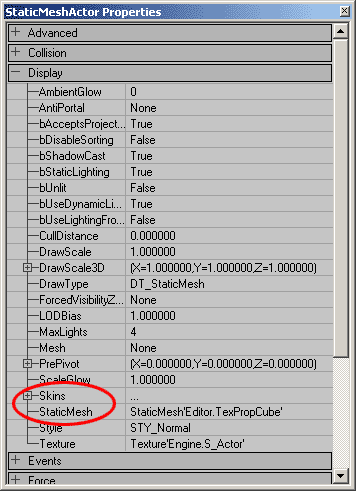

A StaticMesh can easily be swapped out with this StaticMesh field. If you just want to swap textures, the process is mildly more complicated. First you must add as many array fields as you have textures in the mesh up to the texture you wish to change. For example, say the StaticMesh you are using has five textures and you only want to change the third one, you will have to add three texture fields. Then select your new texture in the Texture Browser and hit the "Use" button in field of the Skins array to change that texture.

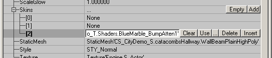

The rest of the textures, including the ones label as "None" in the Skins array will be left at their default textures as set in the Materials array in the StaticMesh Browser.

#### Flexibility of Set Pieces

This is one of those `common-sense' tips, but it bears mentioning. If you give level designers enough building blocks, sections of pieces and raw materials, they can recombine those pieces in very interesting ways - in combinations they weren't intended for, in many cases. Using walls as floor sections (perhaps at different scales?), potted plants as trees in the distance, pipes as banisters.. using your existing pieces imaginatively allows you to get more mileage out of your artset, as well as your system resources at runtime.

### The Origin

If you haven't already begun to manage your origin location, now is the time to begin. Getting objects to line up on the grid depends on this to such a degree, it's hard to overstress its importance. Note: in Max and Maya the pivot point will not translate to the pivot point in UnrealEd. The pivot in UnrealEd will always be set relative to the exported mesh, directly at the origin (0,0,0) in your modeling package. This means that if you want your pivot point offset, you will have to move your mesh away from the origin, as opposed to moving your pivot point (within your package) away.

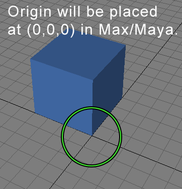

For many meshes, origin placement should be in one of the lower corners of the mesh, as opposed to in the center of the model (which is what modeling packages tend to give you). When the origin is placed in the corner, this allows for more flexible rotation and stretching, since one corner will always stay on the grid. If the origin is in the center of a mesh, rotating it will pull both corners off of the grid, which will require re-alignment of both corners at once.

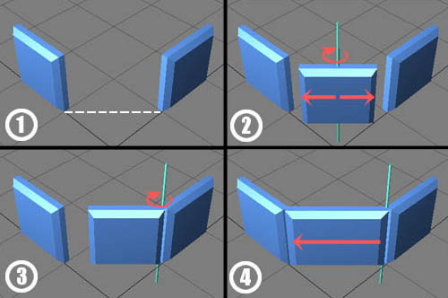

1. We would like to fill this angled gap.
2. If the origin is in the center, we'll have to move the object off of the grid, rotate it, stretch it in 2 directions, and guess at correct placement. This is time consuming and messy.
3. If the mesh origin is in the corner, rotation keeps the mesh on the grid.
4. Stretching in only one direction, it's easy to see how much is enough.

### Misc Issues

#### Transitions between areas

When creating levels, it's a good idea to think about the artsets of two successive areas, and how a transition can be built to bridge them. With proper planning, a level designer may be able to stretch the art assets to create an intermediate transition area, using bits from both artsets. This will have the dual advantage of maintaining the overall feel of both levels to some degree (without a break in the style), as well as allowing the existing art assets to get a bit more mileage. Of course, specific parts can and should be built for these areas as well, but again the concept of reworking and recombining material will help speed up the creation process.

#### Cylinders

This is pretty straightforward. If you are creating cylindrical (upright) forms, a handy trick is to make their total sides divisible by four. This will help immensely if they ever need to be rotated, as they will line up on the grid without seaming problems.

#### Back Facing Polys

If you'll be making pieces that never will be visible to the player (such as wall sections for the interior of a room), then there's no reason to waste polygons on the backs of these meshes.But are you sure that your LD won't be able to find some use for it somewhere? Think carefully about possible secondary uses for your meshes before you commit to an open back/bottom/etc.

#### T junctions

T-junctions are visual glitches that appear when two modular setpieces are put next to each other with vertices that are stuck alongside an edge, as opposed to next to another vertex. It's a bit difficult to explain, see the following picture for an illustration.

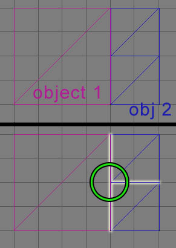

The presence of T-junctions can sometimes be blamed on an artist - if your meshes that are destined to sit alongside each other simply don't have vertices that match up in appropriate ways. This is a pretty annoying problem to have to deal with, so listen up, artists: plan ahead thoroughly before you make your modular sections. Walls and floors are prime offenders here.Level designers can just as easily cause T-junctions, even with perfectly good meshes. For example, if an artset has a 512x512 floor section to fit with a 512x512 section of wall, there won't be any glitches. However, if the LD decides to cut the size of the floor tile in half, and use twice as many tiles, the end result will be t-junctions in the middle of the wall.

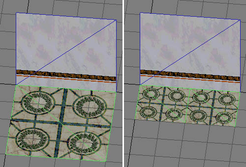

If you end up with these in your level, don't panic. They're ugly, but they won't cause any fatal errors in your map. Also, you have a few options available to you. First of all, you could try fixing your meshes. An ugly solution is to tessellate a face of one of your meshes, so that the vertices will match.

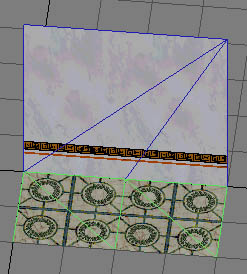

Another option is to use other static meshes to hide your seams. Doorways, columns, pillars etc. can all be used to obscure these visual artifacts. Finally, your last remaining option is to change the background color of the world space behind your meshes (and T-junctions). Since you are really looking through a gap in between your meshes when you see a T-junction, if you set the background to something innocuous the gap will be much more difficult to spot.

#### Breaking up Modularity

A major concern with making modular pieces is the fear that the player will be able to see the re-use of the chunks. This is a bad situation, not only because it looks sloppy, but because the player may get lost in an area that looks just like every other. Try to make a special effort to differentiate areas visually if they share similar pieces. You can do this in a number of ways. Try using the pieces in different combinations, using lighting in different ways (colored lights, projectors), creating custom geometry to set apart a location, or substituting textures on your modular geometry, to give it a very different look.It is undeniably true that modular construction is somewhat restrictive and is vulnerable to tiling issues. Equally true is that the creation of primarily one-use, custom geometry is simply beyond the reach of most teams, and modularity is an efficient way to fill a world with high-quality meshes and a relatively small art team. With some planning and hands-on experience, you should find modularity to speed your workflow greatly, and be an asset in both long and short term development in your maps.

## Character Workflow

Making skeletal character meshes for Unreal isn't too much different than the norm - workflow is pretty straightforward in regards to these models.

### Design

This is a fairly important step with respect to workflow. Since your artist-created characters must inhabit a level designer-created environment, there is the chance that they won't fit together nicely. Making sure the characters are scaled correctly, and are appropriate for the size of your setpieces is an important first step. Getting it right first will save a good deal of time in the future. This is a good time to decide on how scale translates from real-world values to Unreal. What does one foot turn into in Unreal units? Should those values be massaged to make up for any distortions from the in-game perspective?

### Modeling

Once the initial design boundaries are set, the modeler can go ahead and begin work. This step is one of the big roadblocks it's hard to get around - if you have people without work to do (texture artists, animators), there's not much to do but wait until the model is done. If possible, it's recommended that their time be spent creating assets that don't depend on the character; creating wall or floor textures for example, or alternate textures for existing meshes.

### Textures

Once the modeling is done, the second phase of development can take place. Unwrapping the model is the next logical step, which is nice since this process can reveal errors or badly turned faces in the model. Once the unwrapping is all finished, the UVW mapping can be handed off to a texture artist. Note that UVW unwrapping and texturing can take place at any time in the development cycle, after the model has been completed. This means that it can happen before, after, or at the same time as the animation. Even after it's been brought into Unreal, it's not too hard to keep making tweaks, and then re-export a .PSK with your changes. Of course, changing a texture in a texture pack is trivial as well.

### Animation

The rigging of the model can take place concurrently with the texture. Not only that, it's possible to keep tweaking the rigging as animation progresses, since all that needs to get re-exported is the .PSK file. To speed workflow, it's possible to do a quick `dirty' rigging and/or animation for your models, so that your level designers have something to place into the level and prototype with. While they are working, animators can take the time to refine the rigging and redo animations. When those are finished to satisfaction, all that needs to happen is a simple re-import of the changed .PSA and .PSK into the .UKX file.One important note to help avoid having to retouch animations later in development cycles is the establishment of standards for different objects and actions in the world. What height will doorknobs be at? Tabletops? Chair seats? How high are stairs? If you decide these numbers early and stick to them, the amount of reworking old animations will be much reduced.

## General Rules of Optimization

This section will provide an overview of how to make your modular meshes render faster. Be sure to go through the [LevelOptimization](../Content Creation/Techniques/LevelOptimization.md) doc to speed things up as well. A few simple rules can give you much higher triangle counts at the same framerate. These rules are generalizations and will not always prove to come true in practice. For detailed a detailed explanation of making your meshes render fast, see the [MeshOptimization](MeshOptimization.md) doc. Take a look at "stat render" then use these

* Use as few materials as possible in each mesh.
* Make sure your meshes do not have any redundant materials in them. In the static mesh browser, take a look at the materials list for each mesh, and insure that the same material does not appear twice.
* Avoid having lots of low-poly meshes when creating grass, for example. Instead combine those meshes into single larger meshes. Don't take this concept too far, however, remember the engine cannot cull only sections of a mesh, it has to cull the whole thing.
* If possible, use bMaskedTexture instead of bAlphaTexture for your static mesh textures. Alpha'd textures require sorting. \* Try and keep static meshes as large as possible without disrupting modularity. The ideal size of a "Section" in terms of milliseconds per triangle rendering time is between 1000 and 2000 triangles. A section is the collection of materials

In general, there are two types of rendering that take place, **Batched** and **Un-Batched**. There are tradeoffs for each. Ask a programmer which you are using since it affects what you should worry about for optimization. In general, folks developing for consoles are using un-batched rendering and batched rendering on the PC.

### Batched-Rendering Specific Optimizations

* Keep the number of batches as low as possible. Do this by keeping the number of materials on screen as low as possible.

### UnBatched-Rendering Specific Optimizations

* Combine small meshes into single, larger meshes if they're in an isolated location. Remember meshes get culled altogether. For example, reducing 100 individual grass meshes into a single mesh will be a big performance win
